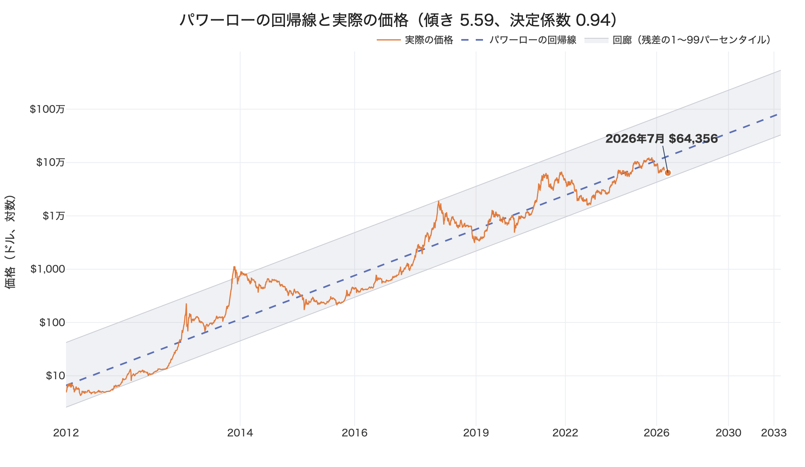
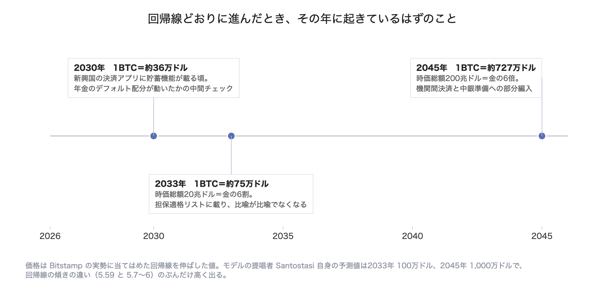

# パワーローから予測するビットコインの未来の姿

ビットコインの価格には、15年間ほとんど破られていない一本の線があります。
価格をジェネシスブロックからの経過日数のべき乗で表す、パワーローモデルと呼ばれる線です。
そしていま、その線が初めて本気で試されています。

## モデルの骨子と、いまの局面

**パワーローモデル**（Power Law Model）は、物理学者 Giovanni Santostasi が提唱した、価格はジェネシスブロックからの経過日数のべき乗に従うというモデルです。
式にすると log（価格）= a + b·log（経過日数）で、傾き b はおよそ5.7から6。
15年分のデータへの当てはまりは、価格のばらつきの95〜96%を説明する水準です。
[2026年6月にElsevier系の査読誌へ掲載された](https://finance.yahoo.com/markets/crypto/articles/bitcoin-power-law-goes-peer-230000092.html)ことで、「チャート芸」から一応の学術的検討対象へ格上げされました。

そのモデルが、いま最も厳しいテストを受けています。
[2026年7月末の価格は約63,000ドル](https://fortune.com/article/price-of-bitcoin-07-28-2026/)で、1年前から約55,000ドル下げました。
Santostasi 自身は「2026年1月に約21万ドルでピーク、その後6万ドル近辺まで調整」と予測していましたが、[ピークの21万ドルは外れ、一方で「底6万ドル」には現在値が薄気味悪いほど一致しています](https://editorialge.com/bitcoin-power-law-theory/)。
価格はいま、パワーロー回廊の下限支持線の近傍にいます。
ここで下限を明確かつ持続的に割れば、モデルは史上初めて棄却されます。
持ちこたえれば、信頼度はむしろ上がります。
2026年後半は、このモデルにとって存亡の分水嶺です。

図の破線が、パワーローモデルの言う価格の線です。
Bitstamp の実データからパワーローモデルの係数を算出し、計算で描いたものです。
出てきた傾きは5.59、決定係数は0.94で、Santostasi の値（傾き5.7から6、決定係数95〜96%）とおおむね揃います。
そして直近の約64,000ドル（Bitstamp、7月29日時点）は、回帰線が示す約13万ドルの半分以下、回廊の下から8%の位置にあります。
価格がこれより下にいた日は、この14年半で629日、全体の12%しかありません。
まとまった期間としては2012年、2015年から2016年、2022年末から2023年初めの3回で、あとは2020年3月のコロナショックの数日だけです。

私の見立ては、パワーローは法則ではなく、積み重なったS字カーブの包絡線だというものです。
個々の採用者層（初期の技術者、個人投機家、ファンド、RIA、機関、国家）は、それぞれロジスティック曲線を描いて飽和します。
パワーローが今後も続くかどうかは数学の必然ではなく、次のS字が前のS字の飽和前に、より大きな資本プールを連れて到着し続けるかにかかっています。
これがこの後の議論の軸です。

## 予測価格を実現するのに必要な参加者増加イベント

モデルの含意を数字にすると、[2033年に100万ドル、2045年に1,000万ドル](https://decrypt.co/215484/bitcoin-power-law-predicts-1-million-btc-price-2033-heres-how-it-works)。
現在価格からは7年で約16倍、時価総額で言えば[現在の約1.33兆ドル](https://fortune.com/article/price-of-bitcoin-07-28-2026/)から約20兆ドルへの拡大です。
上の図で引き直した回帰線では2033年は約75万ドルと、Santostasi の予測値100万ドルよりやや低く出ますが、桁は同じなので以下は100万ドルで話を進めます。

Santostasi の理論構成では価格はユーザー数の2乗に比例する（メトカーフ的関係）ので、価格16倍にはユーザー数約4倍が必要になります。
仮に実効保有者を世界で3〜4億人とすれば、12〜16億人、成人人口の2〜3割が何らかの形でビットコインに触れる状態です。
これを個人の口座開設だけで積むのは不可能で、「1人が直接持つ」から「1人の年金や保険や給与システムが間接に持つ」への転換が本体になります。
必要なイベントを、資本プールの大きさ順に並べます。

### 1. Retirement assets（退職資産）への標準組み入れ

年金基金や個人退職口座に積み上がっている老後のための資産、英語で言う retirement assets です。
その規模は世界で約60兆ドルあります。
1〜2%のデフォルト配分が確立すれば6,000億から1.2兆ドルの実需フローで、資金流入1ドルが時価総額を数倍動かす乗数を考えれば、これだけで20兆ドル圏の骨格ができます。
具体的な引き金は、米国の401(k)のデフォルトファンド（ターゲットデートファンド）への組み入れと、それに続く各国の年金運用指針の改訂です。
すでに[ビットコインを保有する機関投資家は2,000を超え、RIA（投資助言業者）が最大セグメントに育っており](https://www.cryptopolitan.com/2000-institutions-hold-bitcoin-spot-etfs/)、[ETFは2026年Q1だけで187億ドルの流入](https://intellectia.ai/blog/bitcoin-etf-institutional-adoption-q1-2026)を記録しています。
導管はすでに敷設済みで、あとは「助言で買う」から「デフォルトで入っている」への一段が必要です。

### 2. 国家と中央銀行の準備資産化

世界の外貨準備約13兆ドルの1%で1,300億ドル。
ただし金額よりも効くのはシグナル効果で、1つの主要国の中銀が公式にビットコインを準備資産へ計上した瞬間、他国に「持たないリスク」が発生し、ゲーム理論的な追随が始まります。
2033年の100万ドルには少なくとも数カ国の顕名の参入が要り、2045年の1,000万ドル（時価総額約200兆ドル、世界の広義マネーに匹敵）には、金と並ぶ準備資産としての一般化がほぼ必須です。
逆に言えば、国家採用が2020年代のうちに一度も起きなければ、後段のカーブは維持できないと見ます。

### 3. 信用市場への組み込み

保有者数の増加と同じくらい効くのが、既存保有の資本効率化です。
銀行カストディの一般化、バーゼル規制上の取り扱いの緩和、ビットコインを担保にしたローンや住宅ローンやレポ取引。
資産が担保として機能し始めると、売らずに流動性を得られるため売り圧力が構造的に減り、同時に金融機関が在庫として持つ理由が生まれます。
これは参加者の増加というより参加の深化ですが、価格がユーザー数の2乗に比例するという指数を支えるのは、むしろこちらだと考えています。

### 4. 新興国リテールの、ステーブルコイン経由の採用

頭数の4倍を実際に埋めるのはここです。
インフレ国（アルゼンチン、トルコ、ナイジェリア等）の数億人がまずドル建てステーブルコインで暗号レールに乗り、その一部が貯蓄層としてビットコインに滑ります。
[米国ですでに5,500万人、5人に1人が保有](https://b2broker.com/news/institutional-adoption-of-crypto/)という水準を人口10倍の新興国圏で再現するイベント、具体的には大手決済アプリ（送金や給与）へのビットコイン貯蓄機能の標準搭載が、2030年前後に必要です。

### 5. 世代交代という受動的イベント

今後20年で約80兆ドル規模の資産が、暗号資産への抵抗が薄い世代へ相続されます。
これは何のニュースにもならないまま進行する、最も確実な参加者増加イベントです。

---

パワーローの継続に、派手な特異点は要りません。
必要なのは、1サイクルごとに前の層より一桁大きい資本プールが1つずつ着火するという、スケジュールの厳守です。
2010年代は個人、2020年代前半はETF経由の運用資産。
次は年金のデフォルトと国家です。
どこかの層が遅刻すれば、価格は回廊の下限を割り、モデルは静かに死にます。

## 予測が当たった世界は、どう見えるか

では、このモデルが当たったとしましょう。
そのとき世の中がビットコインをどう受け入れているかは、かなり細かいところまで筋道を立てて言えます。

第一に、退屈になることが成功条件です。
パワーローは年率リターンの逓減を内包しています（初期の年率100%超から現在30%前後、2030年代には10%台へ）。
ボラティリティも同様にべき乗で減衰します。
つまりこの予測が当たる世界とは、ビットコインが「人生を変える資産」から「ポートフォリオの1行」へ退化する世界です。
皮肉ですが、この退屈化こそが年金や保険の参入条件であり、モデルの自己実現メカニズムでもあります。
10倍を夢見る個人投機家の市場のままでは、20兆ドルは支えられません。

第二に、2033年の100万ドル、時価総額20兆ドルの意味は、金の代替物として通用する規模に届くということです。
[金の時価総額は2026年初で約33兆ドル](https://thegoldpedia.com/gold-market-cap)。
地上に残る金の総量の見積もりに幅があるため、22兆から34兆ドルの開きを持つ推計値ですが、桁は動きません。
ビットコインの現在の時価総額1.33兆ドルは、その25分の1にすぎません。
20兆ドルなら6割まで迫り、少なくとも同じ土俵の上に乗ります。
そこでは、金ETFと並んでビットコインETFが載るのが異常でなくなり、企業が財務諸表にビットコインを計上し、金融機関の担保適格リストに入っています。
「デジタルゴールド」という比喩が比喩でなくなる段階です。
社会的には、価格報道が経済面の定常記事になり、「ビットコインは死んだ」という記事がもう書かれなくなります。

第三に、2045年の1,000万ドル、時価総額200兆ドルの意味は、部分的な貨幣化です。
この規模は金の6倍で、世界の広義マネーや債券市場と同じ土俵に乗ります。
ここまで来ると資産としての受容では説明がつかず、機関間の決済レイヤー、中銀準備、一部文脈での価値尺度としての使用、すなわち通貨システムへの部分編入を意味します。
同時に注意すべきは、モデルが名目ドル建てであることです。
1,000万ドルの相当部分は、ビットコインの実質価値上昇ではなくドル側の希釈で達成される可能性が高い。
つまりこの予測が当たる世界は法定通貨の減価が続いた世界でもあり、受容の一部は選好ではなく避難として起きます。

## 予言ではなく、定規として

パワーローの弱点は、log-logの15年が実質的には4〜5個の独立なサイクルしか含まないこと、そして記述モデルであって因果を持たないことです。
「経過日数」は何も買いません。
買うのは、上に挙げた採用者層です。

だからこのモデルは予言としてではなく、採用のS字が予定通り積み重なっているかを測る定規として使うのが正しい態度だと考えます。
その定規で測るなら、現在の63,000ドルはモデル棄却の一歩手前であると同時に、過去3回のサイクルで最も買い場だった位置でもあります。
2026年後半にどちらへ転ぶかが、査読誌への掲載よりずっと重い実地審査になります。

## 出典

- [Fortune — Current price of Bitcoin, July 28, 2026](https://fortune.com/article/price-of-bitcoin-07-28-2026/)
- [Yahoo Finance — Bitcoin Power Law Goes Peer-Reviewed](https://finance.yahoo.com/markets/crypto/articles/bitcoin-power-law-goes-peer-230000092.html)
- [Editorialge — Bitcoin Power Law 2026: Is the Model Still Holding Up?](https://editorialge.com/bitcoin-power-law-theory/)
- [Decrypt — Bitcoin 'Power Law' Predicts $1 Million BTC Price by 2033](https://decrypt.co/215484/bitcoin-power-law-predicts-1-million-btc-price-2033-heres-how-it-works)
- [Bitcoin.com News — $1 Million per BTC by 2033](https://news.bitcoin.com/1-million-per-btc-by-2033-predicting-bitcoins-price-trajectory-using-the-power-law-model/)
- [Cryptopolitan — Bitcoin ETF adoption pushes institutional holders past 2,000](https://www.cryptopolitan.com/2000-institutions-hold-bitcoin-spot-etfs/)
- [Intellectia — Bitcoin ETF Institutional Adoption Q1 2026](https://intellectia.ai/blog/bitcoin-etf-institutional-adoption-q1-2026)
- [B2Broker — Institutional Adoption of Crypto: 2026 Trends](https://b2broker.com/news/institutional-adoption-of-crypto/)
- [The Goldpedia — Gold Market Capitalization in 2026](https://thegoldpedia.com/gold-market-cap)
- 図のデータ: [Bitstamp の BTC/USD 日足](https://www.bitstamp.net/)（2012年1月1日から2026年7月29日まで、終値5,324本）。回帰線は両対数での最小二乗法による
