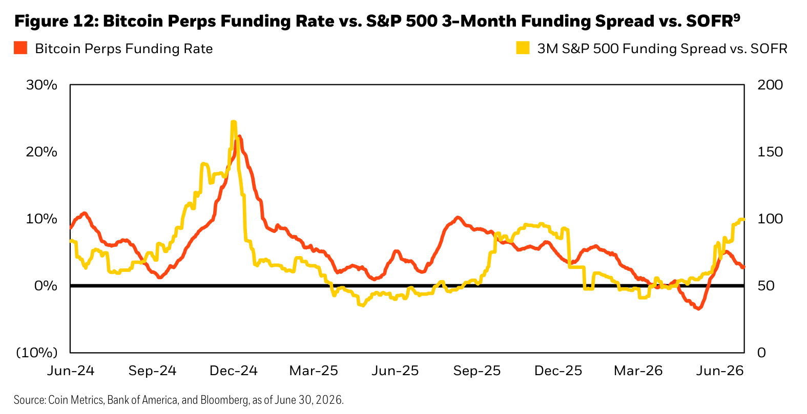
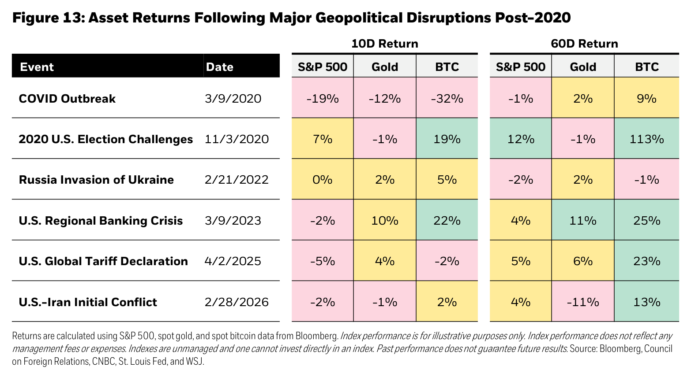
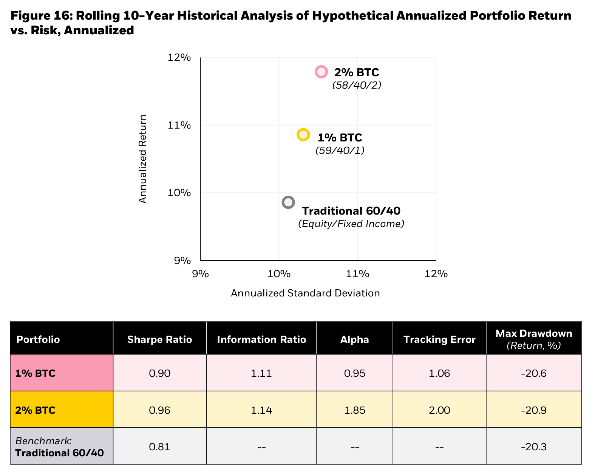

# BlackRockが再提示するビットコインの投資テーゼ

BlackRock のデジタルアセット・リサーチ（Will Su、Robert Mitchnick）が2026年8月に出したホワイトペーパー「**Re-Underwriting Bitcoin: Still a Portfolio Diversifier After the Pullback?**」（全14ページ）を読みました。タイトルの re-underwriting（再査定）が趣旨をよく表していて、2025年10月の高値から50%超下げた今、投資テーゼを引き直しても結論は変わらない、という擁護論です。

https://www.blackrock.com/us/financial-professionals/insights/re-underwriting-bitcoin

## 主張の骨子

10月高値の $124,606 から2026年6月安値の $58,642 までの約53%の下落を、**構造的な投資テーゼの崩壊ではなく、ポジショニング起因の巡航的な調整**だと位置づけています。結論は従来どおりで、60/40 ポートフォリオに1〜2%のビットコインを equity-funded で（株式部分を削って）入れるとリスク調整後リターンが改善する、というものです。

## 下落をどう説明しているか

前半では、下落のメカニズムを3層に分解しています。

1. **パーペチュアル先物のレバレッジ清算**：これが主因だとしています。10月ピーク時の先物 OI は $90B 超で、うち8割が CME 以外のパーペチュアル先物（最大50〜125倍のレバレッジ）でした。10月10日の対中関税ヘッドラインをきっかけに OI が1日で $20B 消失し、これは史上最大の規模です。その後2026年2月と6月にも清算の波が来て、安値を付けました。
2. **機関フローの逆転**：現物 ETP には2024年1月から2025年9月までに +$60B が入りましたが、その後は −$5B の流出に転じました。同じ期間に AI テーマ型 ETF へ +$46B が入っており、AI株への資金ローテーションがビットコインの配分を食った、という整理です。正常化すれば構造的な流入に戻る、と楽観的に締めています。
3. **DAT（デジタルアセット・トレジャリー）への懐疑**：Strategy が保有の0.004%にあたる32 BTC のテスト売却を開示しただけでビットコインが約20%下落し、2024年以来はじめて $60,000 を割った、というエピソードが目を引きます。ほかにも Satoshi 時代の古参ホルダーによるオンチェーンの移動、MARA の $1.1B の売却（AI コンピュートへの転換資金）、IBIT の $1.3B のブロック RFQ 売却といった「クジラ売り」を列挙しています。

## 引き直されたテーゼ

後半は、下落を踏まえてもテーゼは生きているという再確認です。柱は5つあります。

### 法定通貨の減価ヘッジ

1900年時点の主要国通貨はすべて対金で99%以上減価した、という100年チャートを提示し、金と並ぶ「発行体の裁量外の供給制約資産」としてビットコインを位置づけます。グローバル M2 との連動も示していますが、10月以降は M2 が拡大しているにもかかわらず連動が切れていると自分で認めているのは、正直な部分です。

### 正の歪度と低相関

月次リターンの skew が主要資産で唯一プラスです。S&P 500 との10年相関は 0.18 で、金の 0.06、新興国株の 0.57 と並べて示されます。2022年の利上げ局面や2025年の関税局面で相関がスパイクした点は、エピソード的であって構造的ではないと主張し、その根拠としてパーペチュアル先物の資金調達率（funding rate）が2026年第2四半期に一時マイナス化した、つまり投機ポジションがリセットされた点を挙げています。ここが本ペーパーで一番分析らしい部分です。

### 地政学ヘッジ

2026年2月の米国とイランの衝突後、10日と60日のリターンでビットコインが株式と金をアウトパフォームした表を出しています。

### ボラティリティの構造的低下

10年前の100%超から直近は40%前後まで下がりました。デリバティブと ETP の整備によって裁定とヘッジのフローが双方向の流動性を厚くした、という市場構造の議論です。ただし、パーペチュアル先物の拡大（Kalshi の BTCPERP など米国オンショアへの進出を含む）がこの低下を部分的に相殺している、と留保を付けています。

### 60/40 ポートフォリオでの検証

2016年5月から2026年5月までの10年で、1%のビットコインを入れると Sharpe Ratio が 0.81 から 0.90 へ、2%なら 0.96 へ改善します。最大ドローダウンは 20.3% から 20.9% とほぼ変わりません。

## 読むうえでの留意点

これは IBIT を運用する BlackRock が financial professionals 向けに出した販促文書なので、ポジショントークの構造は割り引いて読む必要があります。気になる点は2つです。

- 10年の Sharpe Ratio の分析は、ビットコインが +690% のラリーを含む期間を後方視的に計算したものです。2%配分の改善幅は、開始時点をどこに取るかへの依存が大きくなります。
- ETP の流出 −$5B を巡航的だと断じる根拠は、AI ローテーションが戻れば、という仮定だけです。

一方で、下落の解剖（パーペチュアル先物の OI の構成、資金調達率のリセット、クジラ売りの分類）は一次データの引用が具体的です。世界最大の運用会社が下落後も1〜2%配分の推奨を維持した、という事実自体が、この文書の一番のニュースだと思います。
