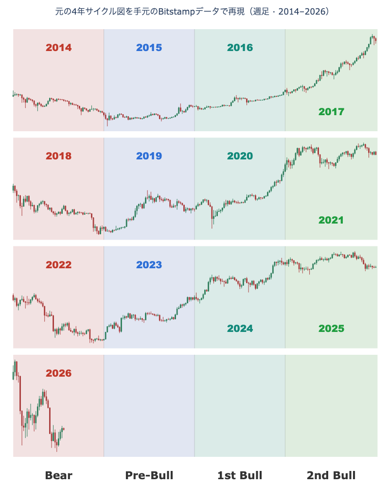
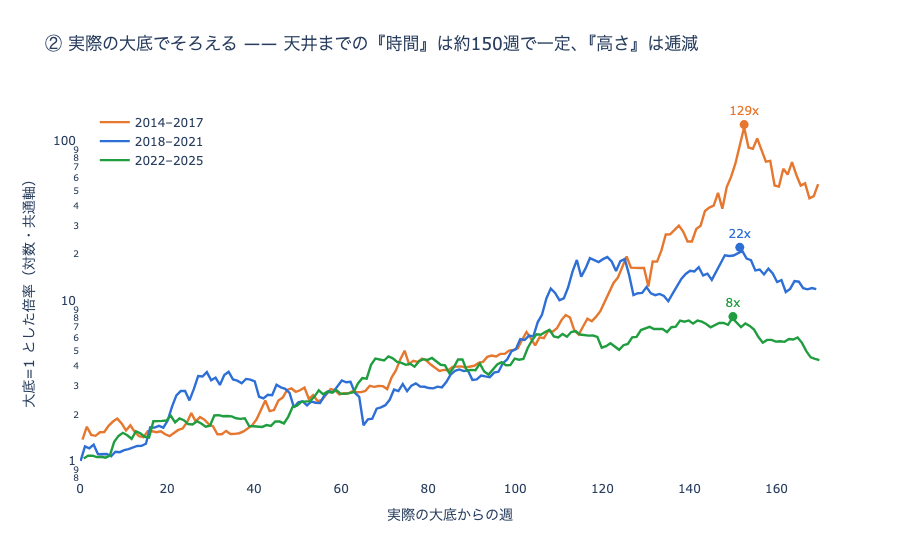
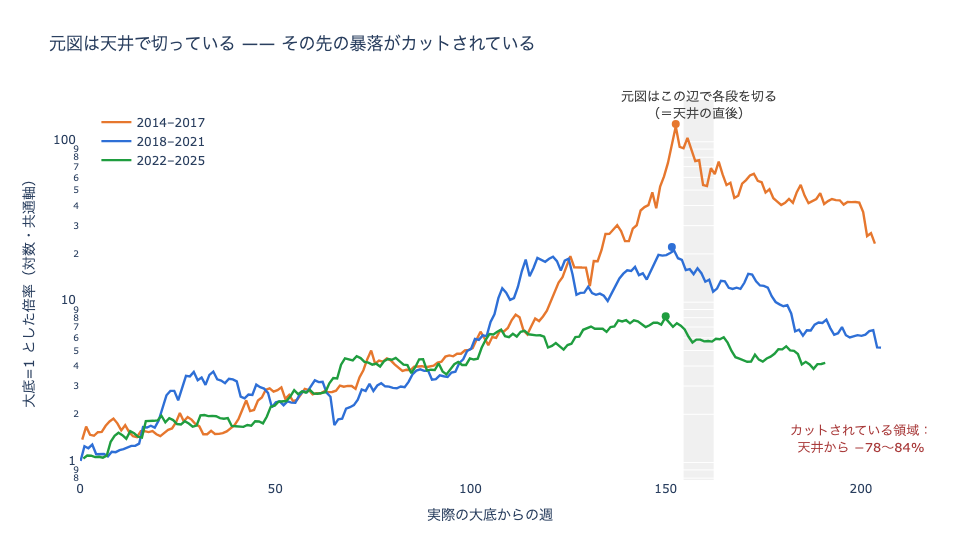

最近、Xでこんなチャートをよく見かける。
ビットコインの価格を4年ずつ4段に積み重ね、それぞれを「Bear（弱気）」「Pre-Bull（仕込み）」「1st Bull」「2nd Bull（天井）」の4局面に色分けしたものだ。
2014年も、2018年も、2022年も、弱気で始まって、やがて天井へと駆け上がる。
どの段も同じ形に見える。

https://x.com/nobrainflip/status/2074958454540599469

この絵を信じると、今はちょうど弱気の局面にあたる。
2026年はBear、2027年から仕込みが始まり、本当の上昇は2028年から2029年。
つまり、もう少し耐えれば強気に転換し、その後は例年どおり急騰する、という筋書きになる。
待っていれば、また大きく上がる。
悪くない話だ。

ただ、そのうまい話には裏を取りたくなった。
形が「似ている」ことと、次も「同じだけ上がる」ことは、別の主張である。
本当にそれだけ単純なのか、自分のデータで確かめてみた。

## 繰り返しているのは、何か

やったことは単純だ。
元のチャートと同じBitstampの価格を、2012年から日次で引いてきて、週足に直す。
それを4年ごとの周期に切り分け、暦の区切りではなく、値動きそのものが作った大底を起点にそろえる。
あとは、各周期が大底から天井まで何週間かけ、何倍になったかを測るだけである。

{: width="480" }

まず、サイクルそのものは確かにあった。
大底から天井までの時間が、3回とも驚くほど揃っている。
2015年1月の底から2017年12月の天井まで153週。
2018年12月の底から2021年11月の天井まで152週。
2022年11月の底から2025年10月の天井まで150週。
どれもおよそ150週、3年弱だ。
半減期を起点に測っても、天井は毎回その75週から78週後に来ている。
弱気で底を打ち、仕込みを経て上がる、という順番も3回とも崩れていない。
ここまでは、投稿の言うとおりに見える。

## サイクルごとの上げ幅

崩れていたのは、上がり幅のほうだった。
同じ「大底から天井まで」を、今度は時間ではなく倍率で見る。
2015年からの周期は、底から天井まで129倍になった。
次の周期は22倍。
直近の2022年からの周期は、8倍でしかない。
周期を追うごとに、上げ幅は数分の一に縮んでいく。

元のチャートでこの痩せが見えないのは、絵の描き方のせいだ。
4段はそれぞれ別の縦軸で描かれている。
129倍の相場も8倍の相場も、同じ高さの箱に押し込めば、同じ大きさの山に見える。
「毎回同じ形」という印象は、ここから来ている。

直近の2025年も、10月に12万6千ドルの最高値はつけた。
天井そのものは、ちゃんと来ている。
ただ、そこまでの吹き上がりは、2017年や2021年の比ではない。
サイクルは時計としては正確でも、値幅としては年々割に合わなくなっている。

## 元図が省いているもの

縦軸の取り方だけではない。
元図には、相場を実際よりきれいに見せる仕掛けが、ほかにもある。

一番効いているのは、各段を切る位置だ。
どの段も、右端は「2nd Bull」の年の暮れで終わっている。
それは天井のすぐあとにあたる。
その先に何が起きたかは、描かれない。
2017年12月の天井のあと、価格は次の底まで84%落ちた。
2021年11月の天井からは78%。
毎回、天井から8割方が消えている。
その暴落は、次の段の頭で「Bear」として描き直される。
一つの周期のなかで、上げて、天井をつけて、崩れるまでを見せる段は、どこにもない。
崩れは、いつも次の周期のはじまりに付け替えられている。

滑らかな色の帯も、同じ働きをする。
「1st Bull」「2nd Bull」の緑の区間は、まっすぐ上がっているように見える。
実際には、その途中で何度も大きく崩れている。
2021年は、天井をつける前の5月に、半値まで落ちた年だ。
帯の色は、その一撃を塗りつぶしてしまう。

こうして元図は、弱気相場も、途中の暴落も、周期の切れ目や色の下に隠す。
残るのは、4回きれいに上がっていく絵だけになる。

## なぜ小さくなるのか

上げ幅が縮む理由は、おそらく一つではない。
考えられるものを、確度の高い順に5つ挙げる。
どれも、上げを鈍らせる方向に働く。

1. **相場が大きくなりすぎた**：時価総額が大きいほど、同じ倍率を出すのに桁違いの資金がいる。底値150ドルを129倍にするのと、1万5千ドルを同じ129倍にするのとでは、要る金額がまるで違う。成長した資産の宿命に近く、これが一番効いている。
2. **半減期の供給ショックが薄まる**：削減される新規発行の量が回ごとに小さくなり（50→25 は 6.25→3.125 よりずっと大きい）、その削減を測る母数の既存供給は逆に膨らむ。震源だったはずの効きが、二重に弱まっている。
3. **買い手の構造が変わった**：2024年の現物ETFで機関の資金が入り、機械的な押し目買いが値動きを均す。個人の熱狂が一気に天井を吹き上げる構図は起きにくい。ただし機関の資金は流出もするので、これは両刃でもある。
4. **サイクルが周知され、先回りされる**：「4年で一巡する」が有名になるほど、参加者が転換を先回りする。タイミングは当たりやすくなる一方、天井の吹き上げはならされていく。
5. **マクロ次第の資産になった**：世界の金融緩和や金利という、より大きな流れに値動きが引きずられるようになった。半減期という固有の周期が、マクロの周期に上書きされつつある。

## 「それだけ単純」なのは、どこまでか

4年サイクルは、時計としては本物だった。
弱気で底を打ち、半減期のおよそ1年半後に天井をつけるリズムは、3回続けてほとんどずれていない。
その意味で、今が弱気の途中で、いずれ強気に転換する、という見立てはあり得る。

サイクル通りなら、弱気が底を打って上げに転じるのは、天井から52週から54週後にあたる。
天井は2025年10月だったから、この記事の時点（2026年7月24日）から数えて、あと10週間から12週間（約3ヶ月）、2026年の秋ごろになる。

だが、次も同じだけ上がる、という部分は当てにできない。
上げ幅は周期ごとに数分の一に縮み、直近ではもう8倍だ。
「それだけ単純」なのは、方向とタイミングまでの話で、値幅の話ではない。

サイクルを地図として使うのはいい。
ただ、その地図に描かれた山の高さは、行くたびに低くなっている。
待っていればまた大きく上がる、と読むのなら、そこだけは分けて考えたほうがいい。
