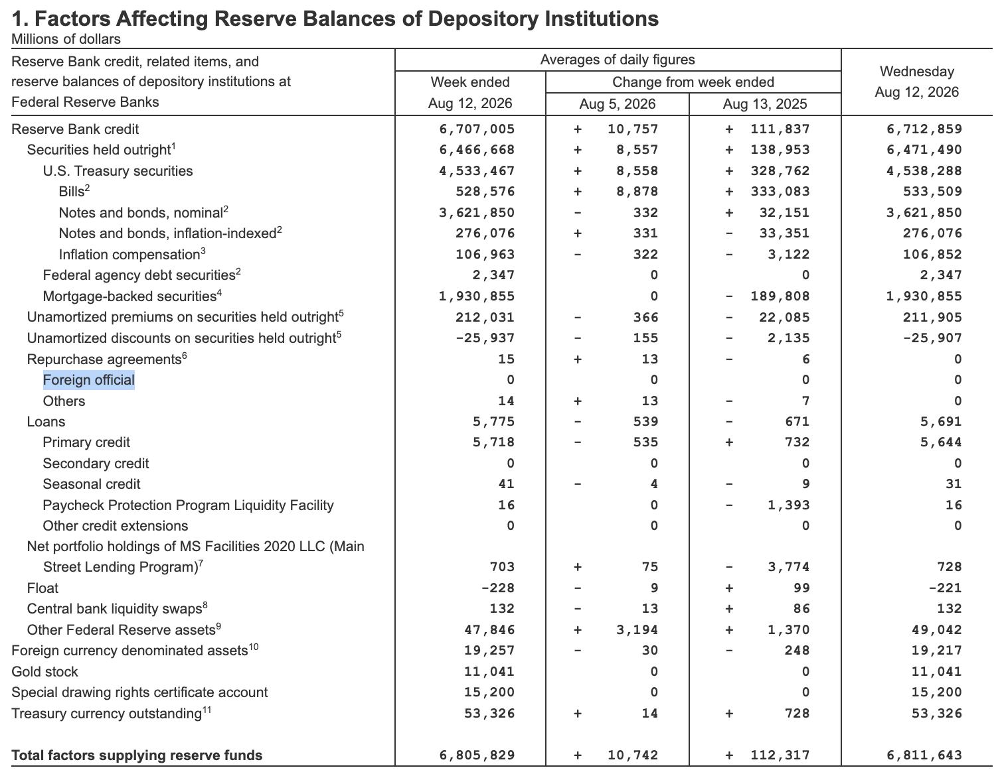

# FIMAレポの「money printing」はビットコインに効くのか

2026年8月11日、BitMEX創業者のアーサー・ヘイズ（Arthur Hayes）氏が「Yen Quake」と題した記事を公開しました。
円買い介入の裏でFRBの通貨創造が始まり、ビットコインを押し上げる、という主張です。
折しも8月上旬には日米の協調円買い介入が実施され、このシナリオの入口は現実に開きました。
本稿では、ヘイズ氏の論理を整理したうえで、その強気の結論をどこまで割り引くべきかを検討します。

https://cryptohayes.substack.com/p/yen-quake

## ヘイズ氏が描く経路

主張の中核にあるのは **FIMA（Foreign and International Monetary Authorities）レポ・ファシリティ**です。
海外の通貨当局がニューヨーク連銀に預けている米国債を担保に、売却せずにドルを借りられる仕組みで、現在は1カウンターパーティあたり600億ドルの上限があります。
ヘイズ氏が描く経路は3段階です。

1. 日本の財務省が保有する米国債をFIMAレポに差し入れ、FRBからドルを借りる
2. そのドルを売って円を買う（円買い介入）
3. 買った円は国内の日本国債や株式に還流する

この経路で貸し出されるドルは、FRBの通貨創造（money printing）で賄われます。
「FIMAレポの残高と歩調を合わせてFRBのバランスシートが膨らむ」とヘイズ氏は書き、不胎化されない純粋なバランスシート拡大だと強調します。
日本政府の米国債1.143兆ドルにGPIFの2,300億ドルを足した約1.373兆ドルが、理論上の担保プールです。
コロナ期にはFRBのバランスシートが約4兆ドル拡大してビットコインを押し上げた前例があり、そこから「刷れば刷るほどビットコインは上がる」と結論づけます。
米国債を市場で売れば日米同盟の政治問題になるところを、レポなら「介入」という体裁で同じ金融効果を得られる。
ここがFIMAを使う政治的な妙味だという指摘です。

## 8月の協調介入とFIMA

これは机上の話ではなくなっています。
8月上旬に日米は協調円買い介入（2営業日で約14兆円）を実施し、財務省は今後FIMAを使う方針を表明しました。
さらに、ベッセント財務長官がウォーシュ議長率いるFRBに上限拡大を働きかけていると報じられています。
ヘイズ氏のシナリオの入口が現実に開いた点は、まず認める必要があります。
そのうえで、ビットコインへの含意には3つの割引が必要だと考えます。

## 割り引くべき3つの点

### レポとQEの持続性

FIMAレポは担保付きの短期貸付で、満期が来れば巻き戻り、借り手は金利を払い続けます。
一方、コロナ期の約4兆ドルは国債の「買い切り」で、バランスシートに滞留した資金です。
FIMA経由の拡大はロールされ続ける限りでのみ持続する、いわば「返済義務つきの印刷」です。
同じ1ドルでも、資産価格への浸透力は買い切りQEより弱くなります。
コロナ期の前例をそのまま外挿するのは過大評価です。

### 担保の天井と実際の使用額

約1.373兆ドルという数字は担保の天井であって、使用額の予測ではありません。
ゴールドマン・サックスの試算では、日本の外貨準備約1兆ドルのうち現金性資産が約2,000億ドルあり、FIMAに頼る前の弾がまだ残っています。
今回の介入の実績は約880億ドル規模です。
上限が撤廃されても、実際のFIMA残高は当面数百億ドルから、多くても数千億ドルのオーダーにとどまるでしょう。
「兆ドル級の流動性の蛇口」という絵は、規模感として数倍から十数倍の誇張を含みます。

### 円高という一次効果

この作戦の一次効果は円高であり、ヘイズ氏はこの点をほぼ素通りしています。
円高はキャリートレードの巻き戻しを誘発します。
2024年8月に見た通り、短期的にはビットコインを含むリスク資産の投げ売りを引き起こす側の力です。
つまり、FIMAによる流動性の効果（中期・強気）と円高によるポジション解消（短期・弱気）は逆向きに働き、ヘイズ氏は前者だけを取り出しています。
ただし公平に言えば、FRBの後ろ盾つきの管理された円高は、無秩序な巻き戻しよりボラティリティを抑える方向にも働きえます。
2024年型の急落の再現が既定路線というわけでもありません。

## 何がビットコインに効くのか

FIMA拡大がビットコインに効くとすれば、注入されるドルの量よりも、FRBのバランスシートが為替政策の道具として再武装されたというシグナルとしてです。
中央銀行の通貨発行が、金融政策ではなく政治的な必要（同盟国の通貨防衛、米国債市場の保護）に従属していく。
この構図は、ビットコインが「法定通貨の希薄化ヘッジ」として買われる際の物語そのものです。
ヘイズ氏の強気の結論には方向として同意できます。
ただしその根拠は、「4兆ドル級の印刷が来るから」ではなく「印刷をためらわない体制が確認されたから」に置くべきです。
数ヶ月で5〜10倍というレバレッジ込みの期待値は、上の3つの割引を踏まえると煽りの領域に入ります。

煽りかどうかとは別に、このシナリオが生きているかどうかは、次の3つで確認できます。

- FRBが毎週公表するH.4.1のFIMAレポ残高
- カウンターパーティ上限の変更の公表
- ドル円の水準（8月中旬時点で158円台、7月のピークは164円近辺）

残高が実際に積み上がり、かつロールされ続けるかどうかが分かれ目です。

[2026年8月13日公表のH.4.1（8月12日終了週）](https://www.federalreserve.gov/releases/h41/20260813/)では、FIMAレポに当たる「Foreign official」のレポ残高はゼロでした。
週平均でもゼロ、前週からの変化もゼロです。
つまり、8月上旬の協調介入は、FIMAレポを使わずに実行されたことになります。

ゴールドマン・サックスの言う現金性資産の範囲で賄われたと見るのが自然で、FIMAに頼る前の弾がまだ残っている、という上の見立てとも整合します。
ヘイズ氏の描く「印刷」は、少なくとも8月中旬の時点では始まっていません。
この残高が立ち上がる週が来れば、それがシナリオの起点になります。

## 出典

- [Arthur Hayes — Yen Quake](https://cryptohayes.substack.com/p/yen-quake)
- [NY Fed — Standing FIMA Repo Facility operating policy](https://www.newyorkfed.org/markets/opolicy/operating_policy_210728)
- [Federal Reserve — Standing FIMA Repurchase Agreement Resolution](https://www.federalreserve.gov/monetarypolicy/files/FOMC_StandingFIMARepoResolution.pdf)
- [Federal Reserve — H.4.1 Factors Affecting Reserve Balances（2026-08-13公表）](https://www.federalreserve.gov/releases/h41/20260813/)
- [CNBC — How Bessent is pushing Warsh's Fed to expand backstop for Japan's yen defense](https://www.cnbc.com/2026/08/03/bessent-fed-japan-yen-fima-repo-facility.html)
- [CNBC — Goldman: Japan's $1 trillion of reserves leaves 'plenty of capacity'](https://www.cnbc.com/2026/08/13/us-japan-dollar-yen-intervention-goldman.html)
- [OMFIF — Japan's yen intervention and unusual US support](https://www.omfif.org/2026/08/japans-yen-intervention-and-the-us-unusual-support/)
- [財務省 — 片山財務大臣声明（2026-08-03）](https://www.mof.go.jp/english/public_relations/statement/others/20260803073000.html)
