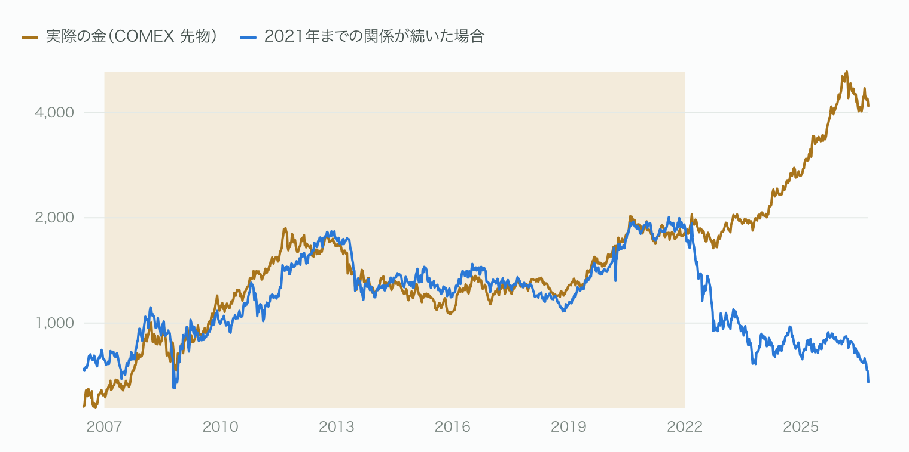
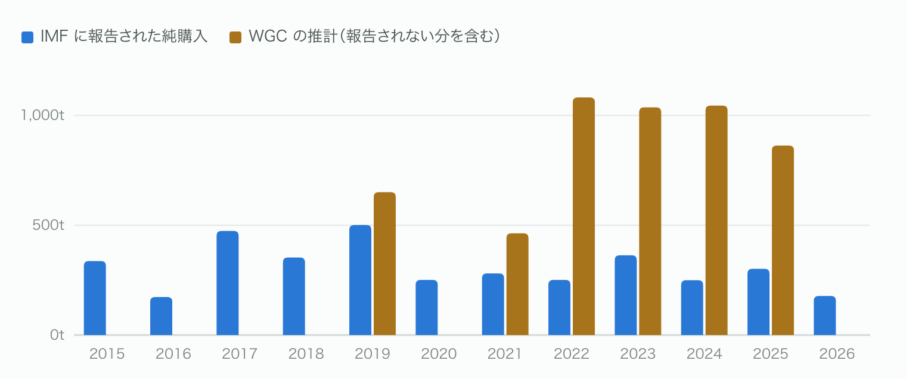

# 実質金利からデカップリングしたゴールド価格

今回はビットコインを離れ、金を扱う番外編です。
以前の記事「[ディベースメント取引とは何か](https://bitcoin-economics.org/articles/debasement-trade-two-readings.html)」では、金利が上がるなかで金が最高値を更新した謎に、二つの読み方があることを紹介しました。
一つは、ドルの価値が薄められるかもしれないという「価値への疑い」から金が買われた、という読み方です。
もう一つは、ドルの準備が凍結されるかもしれないという「置き場としての疑い」から、中央銀行など金利を見ない買い手に入れ替わっただけ、という読み方です。
ビットコインが同じ疑いの受け皿になりうるかを考えるうえでも、本家の金でいま何が起きているかは押さえておきたいところです。
そこで今回は、金の価格と買い手のデータを自分で引き直し、どちらの読み方がいつ当てはまっていたのかを追いました。

2021年までの十数年、金の値段はひとつの数字でかなりの程度まで説明できました。
米国の実質金利です。
その関係をいまの実質金利に当てはめると、金は1オンス678ドル前後になるはずです。
実際の金は4,180ドルで、6倍を超えています。[^asof]

市場ではこれを、金と実質金利のデカップリング（連動が外れること）と呼んでいます。
金はもう金利を見ていない、というわけです。
ところが週ごとの値動きを調べると、金はいまも金利に、以前と大きくは変わらない強さで反応していました。
変わったのは金利への反応ではありません。
金利と関係なく金を押し上げる力が、大きくなったのです。
その力を誰が生んだのかをたどると、二つの読み方のどちらが当てはまるかは、年によって違っていました。

## 金利で説明できた金は、いまなら678ドルのはずだった

国債を買ったとき、物価の上昇を差し引いても実際にどれだけお金が増えるか。
これを表すのが実質金利で、金利からインフレ率を引いて求めます。
ここでは、物価に合わせて元本が増える米国の10年物国債（インフレ連動債）の利回りを使います。
以下、単に「金利」と書くときは実質金利を指します。

金は持っていても利息を生みません。
実質金利が高いときに金を持つと、国債で確実に得られたはずの利回りを諦めることになります。
実質金利が低い、あるいはマイナスのときは、その損がほとんど消えます。
そのため、金利が上がれば金は売られ、下がれば買われるという関係が生まれます。

2007年から2021年までの週次データでこの関係を計算すると、金の値動きのおよそ85%を、実質金利ひとつで説明できました（統計でいう決定係数0.85）。[^fit]
**実質金利が1ポイント上がると、金は約23%下がる**という関係です。
期間を2007〜2013年と2014〜2021年に分けて計算し直しても、下がる幅は25%と22%で、ほとんど変わりません。
15年のあいだ、この関係は大きく見れば安定していました。

この関係に毎週の実質金利を入れて出した値を、以下「金利の線」と呼びます。
2021年末、金利の線は1,913ドル、実際の金は1,811ドルで、差は5%でした。
当時−1.01%だった実質金利は、いまは2.91%まで上がったので、金利の線は678ドルまで下がります。
ただしこれは金の適正価格ではありません。
「関係が変わっていなければ」という仮の値です。

## 2022年4月、二本の線が分かれた

実際の金が金利の線から大きく上に外れ、そのまま戻らなくなったのは、2022年4月12日の週からです。[^break]
そこから4年半、一度も線に戻っていません。

過去にも外れたことはありました。
2011年8月に金が1,888ドルを付けた前後には、線より最大30%ほど上に出ています。
ただしその状態は1年あまりで終わり、2012年半ばには線に戻りました。
2013年に金が1,200ドル前後まで下がったのは、実質金利の上昇に沿った、線どおりの下げです。
今回は違います。
外れている長さも大きさも、2011年とは比べものになりません。

2022年は米国の利上げで実質金利が1年で2.6ポイント上がった年で、この関係どおりなら金は大きく下がるはずでした。
実際、関係どおりに動く投資家もいました。
株のように売買でき、裏付けに金を持つ投資信託（ETF）のうち、米国最大のGLDでは、投資家の売りで保有する金がこの年58トン減っています。
それでも金は下がりませんでした。
年初と年末で、値段はほぼ同じです。

線を外れ始める少し前、2022年2月末に、ロシアの中央銀行が持つドルやユーロの外貨準備（国が非常時に備えて持つ外貨）が凍結されました。
預け先の国の判断で外貨準備が使えなくなることを、世界中の中央銀行が目の当たりにしました。
自国の金庫に置いた金は、誰の負債でもないので、誰にも凍結できません。
世界の中央銀行の金購入は、金の業界団体ワールド・ゴールド・カウンシル（WGC）の推計で、2021年の463トンから2022年の1,082トンへ、2倍以上になりました。[^wgc]
前回の記事の言葉で言えば、これは「置き場としての疑い」です。

## 毎週の値動きは、いまも金利に反応している

では、金と金利の関係は壊れたのでしょうか。
週ごとに見ると、壊れてはいません。

金の毎週の値動きを、その週の実質金利の変化とドル相場の変化で説明する式をつくり、2021年までと2022年以降で別々に計算しました。[^weekly]
実質金利が0.1ポイント上がるごとに、金は2021年までは平均0.64%、2022年以降は平均0.54%下がっていました。
金利への反応は、大きくは変わっていません。

違いは、金利でもドルでも説明できない上昇の大きさに出ました。
金利もドルも動かなかった週にも残る、平均的な上昇分のことです。
これが年6%ほどから年23%ほどへ、3倍半に増えています。

上りのエスカレーターを歩く人にたとえてみます。
実質金利は歩く向きです。
金利が上がれば一歩下がり、下がれば一歩上がる。
エスカレーターの上りは、金利と関係なく金を押し上げる力にあたります。
足の動きは、2022年の前も後も同じです。
変わったのはエスカレーターの速さで、2021年までゆっくりだった上りが、2022年から速くなりました。
一歩下がる動きは平均すると毎週起きていますが、エスカレーターの上りに埋もれて、年単位では見えなくなっています。

年単位で見ると、2021年末からいままでに開いた差のうち、55%は金利が上がって金利の線のほうが下がった分、45%は金そのものが上がった分です。
「下がるはずが下がらなかった」と「そのうえ上がった」が、ほぼ半分ずつです。

## そもそも金利との関係は、ある時代のものだった

この関係は、金にとって昔からの決まりごとではありませんでした。

計算に使っていない2003〜2006年を見ると、金は年末時点で金利の線より21〜53%も下にいました。
3年分のデータで関係を計算し、その期間を少しずつ後ろへずらしていくと、金利が上がると金が下がる関係が出るのは、2008年末までの3年から2021年末までの3年です。
2004〜2007年の3年では、むしろ金利と金が一緒に上がっていました。

2008年の金融危機のあと、米国は長くゼロ金利と量的緩和（中央銀行が国債などを大量に買い、市場にお金を流す政策）を続けました。
その間、金の値段を左右していたのは、利回りを比べて金を持つかどうかを決める欧米の投資家だったと考えられます。
「金利が低いから金を持つ」が、この時代の主な買い理由でした。
金利の線は、この投資家たちの損得勘定を写していたことになります。

## 線を押し上げた買い手は、年によって入れ替わった

では2022年から、欧米の投資家に代わってエスカレーターを動かしたのは誰か。
手元のデータで追うと、主役は途中で入れ替わっています。

2022年から2024年までは、中央銀行です。
WGCの推計で、中央銀行の購入は3年続けて1,000トンを超えました。
2022年の1,082トンのうち、各国がIMFに報告した分は251トンで、残りの8割近くはIMFへの報告では確認できない買いです。[^imf]
報告された分のなかでは、ポーランドが目立ちます。
ポーランドは2023年から毎年90〜130トンを買っています。
総裁は、NATOの東の端にある国として、外国の誰にも手を出せない資産を持つためだと説明しています。[^poland]
中国の中央銀行も2023年に225トンを報告しました。

この3年間、欧米の投資家はまだ戻っていません。
GLDの保有量は2023年に39トン、2024年に7トン減っています。
上海の金価格は、ドルに換算するとニューヨークより0.6〜0.9%高い状態が続きましたが、これは2016〜2019年並みの水準です。[^shanghai]
中国の民間の買いが特に強かったとまでは、この数字からは言えません。

2025年は欧米の投資家が戻ってきた年です。
GLDの保有量は198トン増え、上海の価格差はマイナスに転じました。
金は1年で64%上がっています。
この年は、米国で三つのことが重なりました。
関税の大幅な引き上げ、GDP比6%前後の財政赤字が続く見通し、そして米国の中央銀行である連邦準備制度理事会（FRB）の独立性をめぐる議論です。
ドルの価値が政治的に薄められることへの備えとして金が買われた、と報じられています。[^debase]
金利も下がりドルも安くなったので、その分は金利の関係でも説明できます。
それでも説明できない上昇が、この年は最も大きくなりました。
報道の説明に沿って読めば、欧米の投資家は金利が低いからではなく、ドルと、それを動かす米国の政府やFRBを信用しきれずに買ったことになります。
こちらは「価値への疑い」です。

逆に、ドルの仕組みの中心にいる国は買っていません。
米国は2000年から金の保有量を8,134トンのまま変えておらず、日本も実質的に買っていません。
金を増やしているのは、外国に預けた準備や、ドルを中心にした仕組みに頼るリスクを減らしたい側です。

## 2026年、上乗せの伸びが止まった

2026年1月30日、金は1日で10.8%下がりました。
トランプ大統領が次のFRB議長に、利下げに慎重とみられるケビン・ウォーシュ氏を指名すると発表し、これが引き金になったと報じられています。[^crash]
この日、実質金利は動かず、ドルの上昇は0.7%でした。
週ごとの関係で換算しても、ドルの上昇で説明できる下げは1%に届きません。
動いたのは、金融政策がこの先どうなるかという見通しのほうです。
2025年に「FRBの独立性への不安」で積み上がった分の一部が、その不安が和らいで剥がれた、という読み方ができます。

9月までの累計では、実質金利が約1ポイント上がり、金は4%下がりました。
今年は、金利で説明できない上昇がほぼ止まり、週ごとの関係どおりの動きに近づいています。
ただし金利の線そのものが下がったので、二本の線の差は過去最大まで開いています。

## 差の正体は、ドルの仕組みへの二つの疑い

いまの金の値段4,180ドルのうち、金利の線で説明できるのは678ドル、2割弱にすぎません。
残りの8割強、約3,500ドルは、2021年までの「利回りを比べる投資家」の物差しでは説明できない部分です。
以前の記事が挙げた二つの読み方に当てはめると、2022年から2024年は「置き場としての疑い」から中央銀行が買った時期、2025年は「価値への疑い」から欧米の投資家が戻った年でした。
中央銀行など金利を見ない買い手に入れ替わっただけ、という読み方が通るのは2024年までで、2025年からはもう一つの読み方が上に重なっています。
今年1月に剥がれたのは、この後から重なった分の一部です。

金は実質金利から、すっかりデカップリングしたわけではありません。
毎週の値動きは、平均すると、いまも金利の上げ下げに反応しています。
金利と関係なく動いているのは、足元のエスカレーター、つまり金利では説明できない上昇のほうです。
そのエスカレーターを2022年から速く動かしてきたのが、ドルの仕組みを疑う買い手たちです。

ビットコインが同じ受け皿になるかを考えるときも、問いは二つに分かれます。
凍結されない置き場として選ばれるのか、薄められない価値として選ばれるのか、です。

---

### この記事の限界

- 二本の線の当てはまりのよさ（決定係数0.85）は、同じ時期にどちらも一方向へ動き続けていたため、見かけ上強く出ています。週ごとの変化で測ると、説明できるのは3割ほどです。金利の線は大まかな目安として読むのが妥当です。
- 金利の線を作った材料は実質金利ひとつだけです。ドル、インフレ期待、地政学などは入っていません。
- 中央銀行の購入の大半は報告されず、WGCの推計に頼っています。2025年は中央銀行の購入が863トンに減ったのに差は最も広がっており、中央銀行だけでは説明しきれません。
- 買い手の動機は測っていません。データで確かめたのは、線が分かれた時期と、どの買い手が動いたかです。関税・財政・FRBの独立性については、報道の説明をそこに重ねています。

[^asof]: 金はCOMEX金先物の終値、実質金利は米10年物インフレ連動債（TIPS）利回り（FRED: DFII10）。いずれも2026年9月29日時点。
[^fit]: log(金価格) = 7.289 − 0.265 × 実質金利（%）。2007〜2021年の週次データ（783週）で最小二乗法により推定。
[^break]: 2021年までの残差の標準偏差（約±11%）の2倍を、13週続けて上回り始めた週。この基準は区切りの目安で、差は3月末の時点ですでに16%ほど開いていた。
[^weekly]: 週次の金のリターン（%）を、実質金利の変化（ベーシスポイント）とドル指数の変化（%）で回帰した。2007〜2021年は783週、2022〜2026年は248週。「金利でもドルでも説明できない上昇」は回帰の切片を年率にしたもので、推定の幅は大きい（95%の範囲で、2021年までが年6%±7%、2022年以降が年23%±15%）。週ごとの反応（1ポイントあたりに直すと約6%）が水準の関係（約23%）より小さいのは、測っている時間の長さが違うためで、両者は一致しない。
[^wgc]: World Gold Council「Gold Demand Trends」各年版の本文による。2022年は初出1,136トン、翌年版で1,082トンに改定。2023年は1,037トン、2024年は1,045トン、2025年は863トン。
[^imf]: IMFの国際準備統計（IRFCL）で各国が報告した金保有量の月次の増減を合計した値。約90か国、売り越した国を含む純額。次のものは除いた。単位の誤りが確認されたブラジル（2026年3月以降）とアンゴラ。政府内の付け替えだった日本の2021年3月の増加（約80トン）。1か月300トンを超える変化（カザフスタンの2026年3・4月の往復）。
[^poland]: ポーランド国立銀行のグワピンスキ総裁の発言として報じられたもの。保有量を700トンまで増やし、外貨準備に占める金の比率を最大30%にする目標を掲げている。
[^shanghai]: 上海黄金交易所の基準価格（午後）をドル/オンスに換算し、前日のCOMEX終値と比べた差の年ごとの中央値（10営業日の中央値で均したもの）。2023年は+0.85%、2024年は+0.59%で、2017年は+0.87%、2019年は+0.95%。先物を基準にしているため、水準はやや低めに出る。
[^debase]: 2025年の上昇の背景は、J.P. Morgan、Bullion Trading Center などの解説による。
[^crash]: Babypips、Finance Magnates などの報道による。急騰後の利益確定と、商品指数の年1回の配分調整による売りも重なったとされる。
