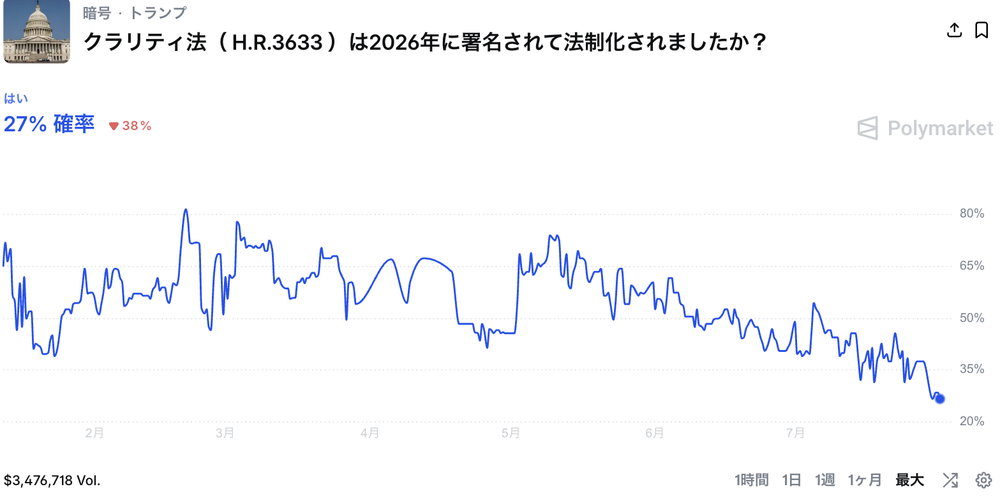

# CLARITY法案はなぜ止まっているのか

米国の暗号資産市場構造法案、通称CLARITY法案が上院で止まっています。下院は2025年7月に294対134という大差で可決したのに、上院は2026年7月末、ロシア制裁と人事承認を優先して本法案を棚上げし、8月7日には休会に入ります。予測市場Polymarketの年内成立確率は、2月20日に付けた82%から27%まで下がりました（7月31日時点）。鍵を握るのは民主党です。共和党は52議席しかなく、フィリバスターを越える60票には民主党から最低7人の賛成が要ります。では民主党はなぜ乗らないのか。そして、この足踏みは米国の国益を損なっているのか。順に考えます。

## イデオロギーではなく「拒否権の有無」で読む

民主党の振る舞いを一番きれいに説明できるのは、暗号資産への賛否という思想の軸ではありません。同じ党のほぼ同じ法案に対して、下院では78人が賛成し、上院では委員会で賛成した2人までもが最新版に反対を表明した。この非対称を生んだのは法案の中身ではなく、民主党の手に拒否権があるかどうかです。**下院では単純多数決**なので止められず、実利派は業界の歓心を取りにいきました。**上院では60票ルール**があるので人質を取れる。取れる場所では取る。これが党としての行動原理で、思想は後から付いてくる説明だと私は見ています。

もちろん実質論としての反対理由も存在します。SECの管轄を狭めて「トークン化」による証券法の迂回路を開きかねないという構造批判、消費者保護と不正資金対策の弱さ、ステーブルコインの利回り提供が地方銀行の預金基盤を吸い上げるという銀行界の懸念。上院銀行委員会筆頭のウォーレン、下院金融委員会筆頭のウォーターズを中心とする構造的反対派の年来の主張で、嘘ではありません。

しかし本丸は別にあります。トランプ大統領個人の暗号資産収入、2025年だけで約14億ドルです。World Liberty Financialとミームコインで現職大統領が空前の私益を上げている状況で、その市場を合法化する法案に本人の署名で成立させる。**民主党にとってこれは「大統領の汚職に立法でお墨付きを与える」構図になり、中間選挙前に賛成票を説明できません**。7月14日には上院民主党の一部が法案を端的に「corrupt」と呼びました。

## 倫理条項という膠着の芯

決定打は7月22日に公開された上院の新テキストです。共和党は譲歩として、大統領を含む連邦公職者とその配偶者によるデジタル資産の発行・スポンサーの禁止を盛り込みました。ところがこの条項には四つの穴があります。第一に2029年1月20日で失効する時限措置であること。第二に対象が配偶者までで、World Liberty Financialを実際に動かしている息子たちに届かないこと。第三に既存の保有や利益に遡及しないこと。第四に執行主体がトランプ配下の司法省であること。つまり「トランプに一切効かない形のトランプ対策」であり、委員会で唯一賛成していたオルソブルックス、ギャレゴの両議員までが「弱すぎる」と離脱しました。

党内は三層に分かれています。構造的反対派は少数ですが委員会の要職を握り、党のメッセージを規定します。ギャレゴ、ブッカー、ワーナーらの実利派は、業界のスーパーPAC「Fairshake」が中間選挙に向けて約1.9億ドルの現金を積んでいる以上、業界を敵に回したくない。残る大多数が中間層です。興味深いのは、実利派までもが7人連名で「不十分」の側に立っていることです。彼らは反対に転じたのではなく、賛成するための口実、すなわち**「トランプに実際に効く倫理条項を勝ち取った」という物語を必要としており、その物語をトランプ本人が拒否している**のです。ここに本件最大の皮肉があります。業界の悲願にとって最大の障害は、業界の最大の受益者であるトランプ自身なのです。

## 先延ばしは国益を損なうか

ここで当然の反論があります。オンチェーン金融で米国が地位を確立するにはこの法案が必要であり、**先延ばしは国益を損なうのではないか**、と。

半分は同意します。規制の中身をSECの執行訴訟で事後的に知るしかない状態は規制ではなく「規制の抽選」であり、トークン発行やDeFi開発の法人格をケイマンやUAEへ追いやってきました。EUはMiCAで先に枠組みを持ち、ステーブルコインについては米国自身がGENIUS法で決着させ、ドル覇権の延長として取りにいった。市場構造法はその残り半分で、「もう遅れている」という業界の主張は方向として正しい。

しかし三つの点で前提を崩したい。第一に、「明確な枠組みが必要」と「このCLARITYが必要」は別の命題です。米国資本市場の真の堀は技術でも税制でもなく、世界で最も信頼される投資家保護と法の支配です。トークン化すれば証券法の外に出られる迂回路を残したまま成立させれば、短期の企業誘致と引き換えにこの堀を削ることになる。金融規制は平時には書き直せず、危機の後にしか直りません。悪い枠組みの固定化は、良い枠組みの一年の遅延よりコストが大きいのです。

第二に、遅延の原因を民主党に置くのは因果の読み違いです。7票は「本人の任期中に実効する倫理条項」一つで買える公算が高く、遅延コストを最も安く解消できる手段はホワイトハウスの一譲歩です。そして現職大統領が私益を上げた市場を本人の署名で合法化する前例は、外国資本が米国市場に払っているガバナンスへの信頼それ自体を毀損します。覇権のための法案が覇権の基盤を削るのでは本末転倒です。

第三に、遅延の限界コストは言われるほど大きくありません。出ていくものの多くはすでに出た後で、枠組みが立てば戻れる可逆的なものです。最重要ピースのステーブルコインは確保済みです。そして**事業者が本当に欲しい「政権交代を跨いで生き残る10年の予見可能性」**は、係争的にぎりぎり通った法律ではなく、超党派の正統性を持つ法律からしか得られません。

## 予想される結末

8月休会前の成立はほぼないと見ます。倫理条項は「トランプに効けば本人が署名せず、効かなければ民主党7人が乗らない」という構造的に解きにくい対立だからです。現実的なシナリオは、中間選挙後のレームダック会期で時限撤廃と対象拡大を呑んだ妥協が成立するか(確率は半分弱)、この議会では流れて選挙結果を見た業界が再交渉するかの二つでしょう。

民主党にとって不成立は必ずしも敗北ではありません。「トランプの14億ドル」は中間選挙で使える数少ない分かりやすい腐敗の物語であり、法案を人質に取ったまま選挙に持ち込めば争点として生きます。どちらに転んでも取り分がある位置に党は立っており、だから急いで妥協する誘因が薄い。国益の最大化点は「今のまま急いで通す」でも「潰す」でもなく、「実効的な倫理条項と迂回路の閉塞を呑ませた上で通す」ことにあり、そこへの最短経路を塞いでいるのは民主党ではなくトランプ本人である。これが本稿の結論です。
