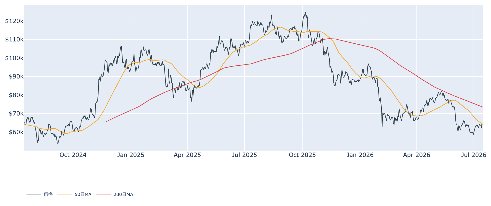
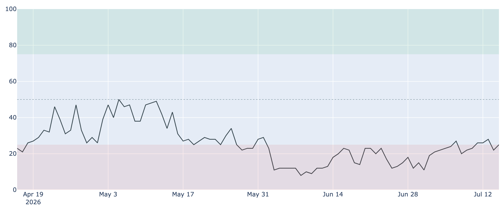
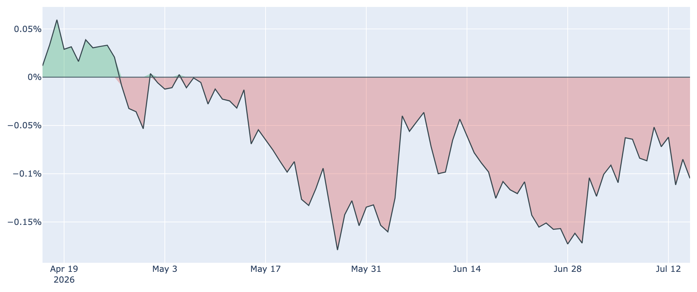
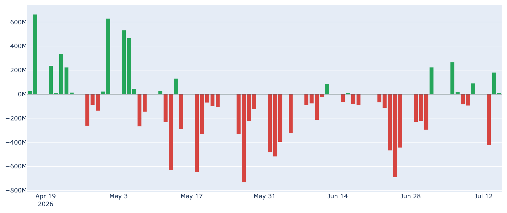
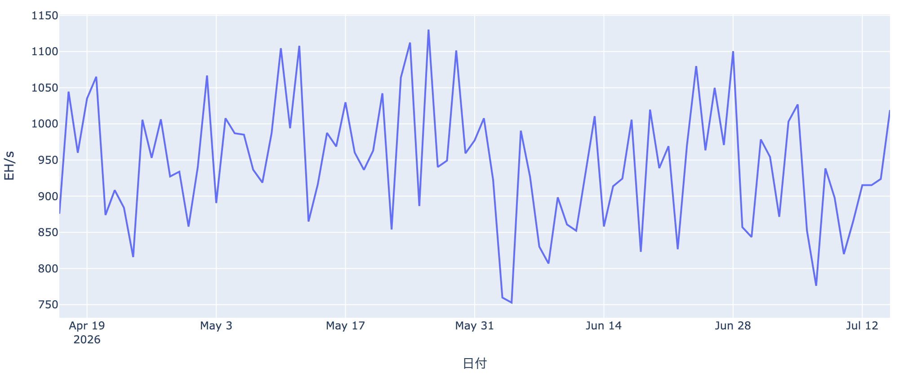

# ビットコイン、$65,000を試す ― 週間で反発、長期勢の「静かな備蓄」は減速

**2026年7月16日**

ビットコインは週の後半に$65,000近辺まで戻し、1か月ぶりの高値圏を試しています。市場心理はまだ「極度の恐怖」に張り付いたままですが、底値圏での反発が見え始めました。この状況を、キャッシュ済みのデータとマクロ環境からできるだけ分かりやすく整理します。

（このレポートは 2026-07-16 07:30 JST 時点でキャッシュに取得したデータを使っています。オンチェーン指標は7/14、価格・センチメント・ETF・Coinbase Premium は7/15時点の値です。）

## 1. 現在の市場の全体像：底値圏での反発

価格はこの1週間で約+4%戻し、足元は約$64,900です。6月末に一時$58,000台まで沈んだところから見ると、明確な戻りが入ってきました。背景には、直近の米インフレ指標が想定より軟らかく出て、7月のFRB利上げ観測がほぼ消えたことがあります。

* **移動平均で見た位置**: 現在値（約$64,900）は50日移動平均（約$64,100）をわずかに回復しましたが、200日移動平均（約$73,500）はまだ大きく下回っています。中期のトレンドとしては引き続き「デッドクロス圏（弱い地合い）」で、本格的な上昇軌道に戻ったとは言えません。
* **割安感は継続**: バリュエーション指標（MVRV Z-Scoreなど）は過去4年でかなり割安な圏内（下位2割弱）に沈んだままで、「歴史的に見て安い水準」という構図は変わっていません。

## 2. データの解説：注目すべき4つのポイント

### ① 市場心理はまだ「極度の恐怖」、ただし底は打った気配

* **Fear & Greed指数**: 最新値は25で「極度の恐怖（Extreme Fear）」の圏内です。ただし6月上旬に一桁台（8〜12）まで沈んだどん底からは持ち直し、1週間前（20）からも小幅に改善しています。
* **逆張りの目安**: この指数が極端な恐怖に振れる局面は、経験則として「悲観が出尽くした買い場」とされることが多く、価格の反発と整合的です。とはいえ「強欲」に戻るにはまだ距離があり、市場は疑心暗鬼のままです。

### ② 短期勢はまだ含み損、ただし損益分岐点が下がってきた

* **コストベース（平均取得単価）**: 短期保有者（保有155日未満）の平均取得単価は約$68,200です。現在価格（約$64,900）はこれを下回っており、直近で買った人たちは平均して約5%の含み損を抱えています。
* **原価の低下**: ただしこの取得単価は着実に下がっています（1週間前は約$69,100、30日前は約$73,000）。高値づかみ勢の投げ売りで平均コストが切り下がっており、価格が原価に近づくほど「上値の売り圧力」は和らいでいく段階です。

### ③ 長期勢の「静かな備蓄」が減速している

* **ネットポジションの変化**: 長期保有層（155日以上保有）の過去30日の保有量変化は+約21万BTCと、まだプラス圏（買い越し）ですが、その勢いは明確に鈍っています（1週間前は+約31万BTC、30日前は+約36万BTC）。
* **底堅さの担い手が一服**: これまで下値を支えてきた長期勢の「静かな積み増し」がここにきて減速しており、下支えの力がやや弱まりつつあります。悲観の裏で黙々と拾う動きが続くかどうか、蓄積のペースは今後の注目点です。

### ④ 米国需要はなお弱く、ETFは週間では流出超

* **Coinbase Premium**: 米国勢の買い意欲を映すこの指標は約-0.10%と、71日連続でマイナス（米国需要が相対的に弱い）が続いています。しかも足元はむしろ小幅に沈んでおり（1週間前は約-0.08%）、米国の実需が力強く戻ったとは言えません。
* **ETF資金フロー**: 現物ETFは日々の出入りが激しく、7/13に約-4.2億ドルの大きな流出があった翌日に約+1.8億ドルの反発、と一進一退です。直近7営業日を合計するとまだ約-3億ドルの流出超で、6月の記録的な流出（月間で約-40億ドル超）からの回復は道半ばです。

（補足：マイナー側はやや持ち直しています。ハッシュレートは直近30日で約+11%上昇し、次回の難易度調整も約+3%のプラスが見込まれます。前月まで続いた「採算割れマイナーの淘汰」局面は、いったん一服した様子です。）

## 3. 相場転換を見極めるための「3つの分岐点」

底値圏での反発が本物になるかどうかは、以下の3点に注目すべきだと考えられます。

1. **ETFへの資金流入が定着するか**: 今はまだ「入る日もあれば大きく出る日もある」一進一退で、週間ではまだ流出超です。単発の買い戻しではなく、週次ベースで明確な純流入が続いて初めて、米国機関の需要復活と言えます。
2. **価格が約$68,000（短期勢の原価）を上抜けるか**: この水準を明確に超えて定着すれば、直近参入勢の含み損が解消され、これまでの「戻り売り圧力」が「買い支え」へと変わる転換点になります。今週$65,000近辺まで戻しても、まだこの壁には届いていません。
3. **7/28〜29のFRB会合**: 直近の軟らかいインフレ指標を受けて、市場は「金利据え置き（約8割）」を強く織り込み、7月の利上げ観測はほぼ後退しました。ただし利下げも織り込まれておらず、なお約2割は利上げ余地を見るタカ派寄りの見方が残ります。この会合の姿勢が、リスク資産全体の空気を左右します。

## 総括

現在のビットコインは、バリュエーションで見れば過去4年でも割安な「底値圏」にあり、極度の恐怖が和らぎながら$65,000を試す反発局面に入っています。一方で、これまで下値を支えてきた長期勢の備蓄は減速し、米国需要もETF資金も本格回復には至っていません。マクロの利上げ観測が後退したことは追い風ですが、「底は堅いが、上値の壁と需要の弱さが残る底練り」の構図は続いていると言えます。

---

*本稿は情報提供を目的としたものであり、投資助言ではありません。将来の価格動向を保証・示唆するものではなく、投資判断は各自の責任において行ってください。*
