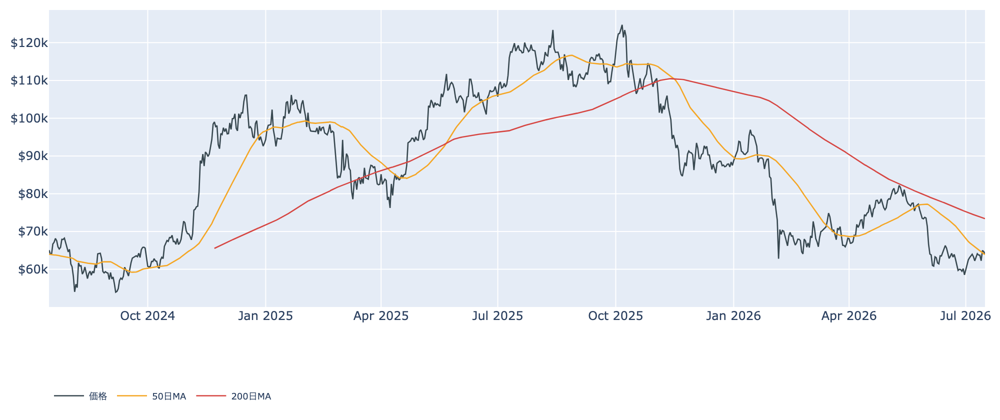
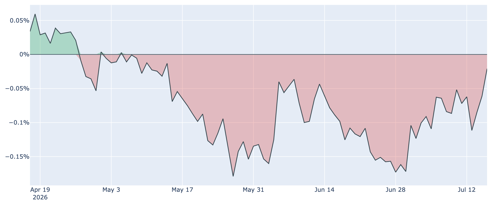
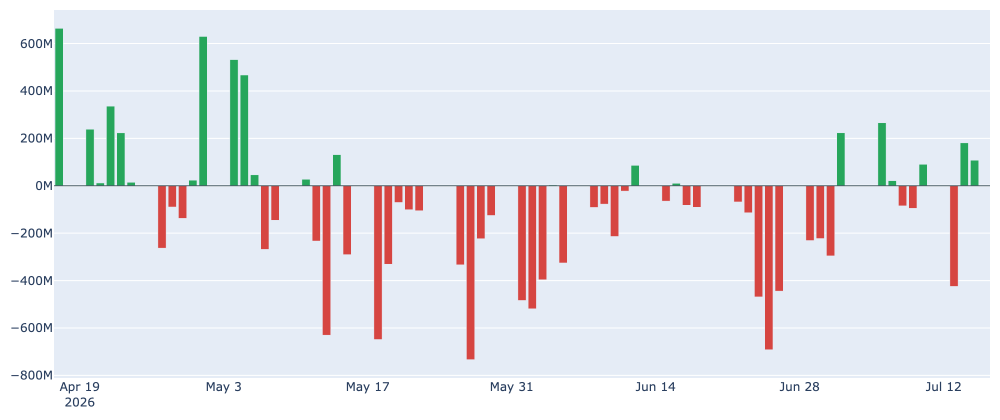
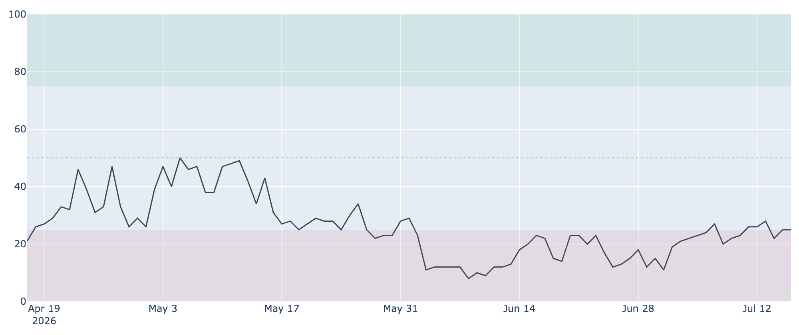

# ビットコイン、$64,000近辺で小康 ― 米国の売り圧力は和らぐも、長期勢の買い集めはペース鈍化

**2026年7月17日**

ビットコインは$64,000前後での小さな往来が続いています。週で見れば1%強のプラスと底堅いものの、1か月前と比べればまだマイナス圏で、方向感を欠いた「様子見」の状態です。今回は、米国勢の売り圧力がようやく和らいできた一方で、下値を支えてきた長期保有層の買い集めがペースを落としている、という少しねじれた足元の状況を整理します。

（このレポートは 2026-07-17 07:30 JST 時点で取得済みのデータのみを使っています。オンチェーン指標は7/15、価格・Fear & Greed・ETF資金フロー・Coinbase Premium は7/16が最新です。）

## 1. 現在の市場の全体像：下げ止まったが、上がる力もない

価格は約$63,900。1週間前と比べれば約+1.3%ですが、1か月前比では約-2.5%。6月末に$58,000台まで沈んだ底からは戻したものの、そこから先へ進めていません。

* **位置取り**: 現在値は50日移動平均（約$63,900）とほぼ同じ水準まで戻してきました。ただし200日移動平均（約$73,400）ははるか上にあり、中期のトレンドは依然「デッドクロス圏（弱い地合い）」のままです。
* **割安感は続く**: 割高・割安を測るMVRV Z-Scoreという指標は0.4前後。過去4年でも低い部類で、「歴史的には安い場所にいる」という土台は変わっていません。
* **マクロは動かない**: 7月28〜29日のFRB会合は「金利据え置き」が市場の中心シナリオ（約8割）で、利下げはほぼ織り込まれていません。むしろ2割前後は利上げを見ています（現行3.50〜3.75%）。リスク資産を押し上げる材料が外から来る状況ではありません。

## 2. データの解説：注目すべき5つのポイント

### ① 米国勢の「売り圧力」がようやく緩んできた

* **Coinbase Premium**: 米国の需要の強さを映すこの指標（米国の取引所が海外より高ければプラス）は、足元で約-0.02%。72日連続でマイナス圏という長い米国需要の弱さが続いていますが、そのマイナス幅は1週間前（約-0.09%）・1か月前（約-0.09%）から明確に縮小し、ゼロにかなり近づきました。
* **意味するところ**: 米国勢が積極的に買っているとまでは言えませんが、「叩き売られる状態」からは抜けつつあります。今回の局面では、これが一番前向きな変化です。

### ② ETFの資金はまだ腰が定まらない

* **直近1週間**: 現物ETF全体では約2.3億ドルの流出超。内訳を見ると7/13に約4.2億ドルというまとまった流出が出た後、7/14・7/15は小幅ながら流入（約+1.8億ドル、+1.1億ドル）と、日ごとに向きが変わっています。
* **見方**: 「戻ってきた」と言うにはまだ早く、機関投資家は入りかけては引く、を繰り返している段階です。①の米国需要の改善が本物なら、ここが継続的な流入に変わってくるはずです。

### ③ 長期勢の「静かな備蓄」がペースを落とした

* **ネットポジションの変化**: 長期保有層（155日以上保有）の過去30日の保有量変化は+約20.7万BTC。プラス＝買い集めは続いていますが、1週間前（+約33.1万BTC）、1か月前（+約33.5万BTC）と比べると勢いは明確に鈍っています。
* **なぜ重要か**: これまでの底堅さは「一般投資家が怖がる裏で長期勢が黙々と拾う」構図に支えられてきました。その買い手の食欲が落ちてきたということは、下値を支える力もその分弱くなるということです。今後注視すべき変化です。

### ④ 短期で買った人の原価（約$68,200）が上値の重石

* **コストベース**: 短期保有者（155日未満）の平均取得単価は約$68,200。現在値はこれを下回っており、直近に買った人たちは平均して約6%の含み損を抱えたままです。
* **売買の中身**: 利確か損切りかを示すSOPRという指標は市場全体で0.99台と「1」割れ。とくに長期保有者側は0.72前後と、動いたコインは大きな損切りになっています。戻したところで手放したい人が、まだ相応にいます。

### ⑤ センチメントは「極度の恐怖」に貼り付いたまま

* **Fear & Greed 指数**: 25で「極度の恐怖（Extreme Fear）」圏。1週間前が22、1か月前が23なので、価格が戻しても市場心理はほとんど改善していません。6月上旬に一桁台（8〜12）まで沈んだ底からは持ち直しましたが、そこで止まっています。
* **見方**: 「恐怖が極まる局面は逆張りの買い場」とよく言われますが、裏を返せば誰も強気に転じていないということでもあります。

（補足：マイナー側は、ハッシュレートが約852 EH/sと過去30日で約-7.8%、収益性を示すPuell Multipleも0.7前後の低位圏で、採算の厳しい状態が続いています。次回の採掘難易度調整はほぼ横ばい（約-0.01%）の見込みです。）

## 3. 相場転換を見極めるための「3つの分岐点」

1. **Coinbase Premium がプラスへ抜けるか**: 72日続いたマイナスがゼロを越えて定着すれば、米国の実需が戻ったことの分かりやすい証拠になります。今はゼロ手前まで来て足踏みしている段階です。
2. **ETFの流入が「日単位」から「週単位」の話になるか**: 7/14・7/15のような小幅流入が単発で終わるのか、週を通した純流入超へ育つのか。ここが①を裏づける最も直接的な材料です。
3. **長期勢の買い集めが再加速するか、それとも失速するか**: +20万BTC台まで落ちた蓄積ペースがここから戻せば下値は保たれますが、さらに細るようなら、これまで機能してきた下支えが外れることになります。マクロ（7月末のFRB会合）が動かない以上、需給の内側のこの変化がより効いてきます。

## 総括

割安感と長期勢の買いという「土台」は残しつつ、米国勢の売り圧力が緩む（好材料）一方で、その土台を作ってきた長期勢の食欲が落ちている（懸念材料）という、綱引きの構図がやや複雑になってきました。価格は50日線まで戻して小康状態ですが、ETFも心理も強気に転じておらず、マクロの追い風も当面期待しにくい状況です。**「底は割れていないが、支える手も少しずつ緩んでいる」レンジ継続**、というのが足元の姿だと言えます。

---

*本稿は情報提供を目的としたものであり、投資助言ではありません。将来の価格動向を保証・示唆するものではなく、投資判断は各自の責任において行ってください。*
