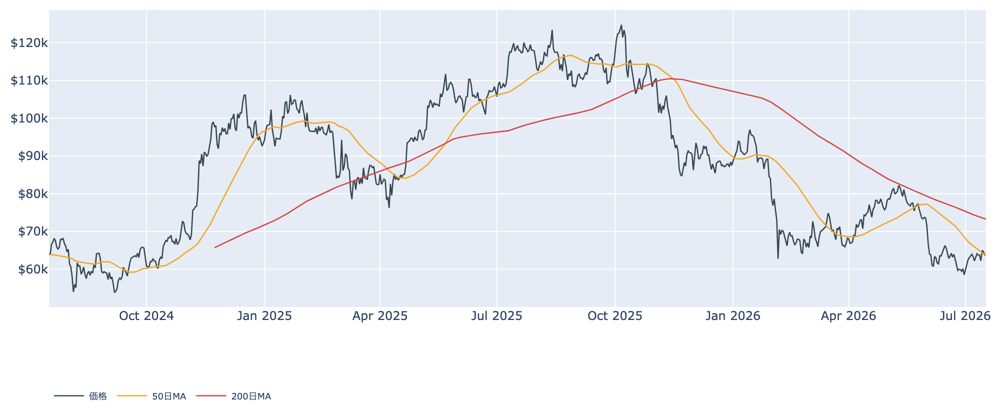
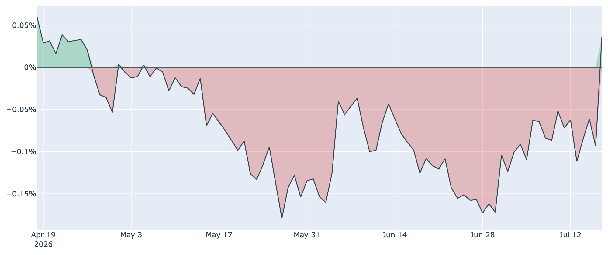
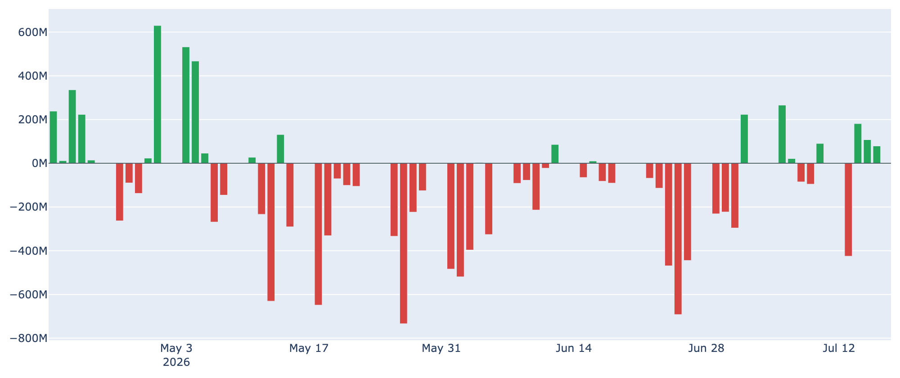
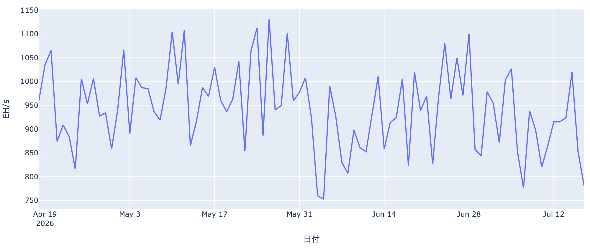
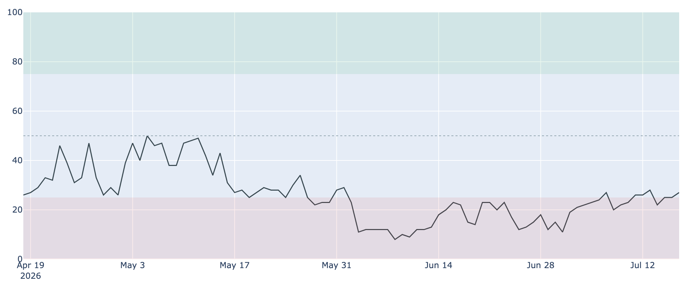

# 米国勢の「弱気」が約2か月ぶりに反転 ― 記録的ディスカウントの終わりと、$64,000の膠着

**2026年7月18日**

本レポートは2026年7月18日 7:30 JST 時点でキャッシュに取得したデータに基づきます（作成中のライブ再取得はしていません）。オンチェーン指標は7/16、BTC価格・Fear & Greed・ETF資金フロー・Coinbase Premium は7/17時点の値です。

ビットコインは$64,000近辺で横ばいが続いています。値動き自体は静かですが、その水面下で「米国勢の需要」に小さな転機が現れました。5月中旬から2か月近く続いていた米国市場の割安（ディスカウント）状態が、直近でようやくプラス側へ反転したのです。今日はこの変化を中心に、相場の綱引きを整理します。

## 1. 全体像：静かな横ばいの下で、需要の潮目が動く

価格は$64,000近辺で膠着したままです。7/17終値は約$63,900で、1週間前・30日前と比べてもほぼ横ばい（いずれも1%未満の変化）。この1週間は$62,000台前半〜$65,000弱のレンジを行き来しただけで、方向感は出ていません。

* **中期トレンドはまだ弱い地合い**：50日移動平均（約$63,700）はほぼ現在値と重なりますが、200日移動平均（約$73,300）はずっと上にあり、両者の関係は「デッドクロス圏（弱気寄り）」のまま。歴史的に見れば価格は過去2年でかなり安い部類（下位2割弱）に沈んでいます。
* **潮目の変化は需要側から**：値動きが乏しい一方で、後述する米国勢の需要指標と長期勢の備蓄ペースには、これまでと違う動きが出始めています。市場は「底は堅いが上値も重い」レンジのなかで、次の材料（月末のFRB会合）を待っている状態です。

## 2. 注目すべきポイント

### ① 米国勢の弱気が約2か月ぶりに反転

* **記録的なディスカウントが解消**：米国の買い需要の強さを映す「Coinbase Premium」（米大手Coinbaseと海外取引所の価格差）は、5月中旬から2か月近くマイナス圏（＝米国が相対的に割安＝需要が弱い）が続いていました。それが7/17にプラス圏へ転じ、米国勢の弱気が久々に和らいだサインです。
* **水準の改善も鮮明**：30日前は約-0.10%、1週間前も約-0.05%と割安でしたが、足元は約+0.04%とプラス側に浮上。過去1年で見ても高めの水準で、米国需要が最悪期を脱しつつあることを示唆します。ただしプラスに転じたのはまだ1日で、定着するかは要観察です。

### ② ETF資金フローはまだ「一進一退」

* **流入は戻りつつあるが力不足**：米国の現物ビットコインETFは、7/14〜16に3日連続で資金流入（合計で約+370百万ドル）が見られました。しかし直前の7/13に約-425百万ドルの大きな流出があったため、直近1週間の合計ではなお小幅なマイナスに沈んでいます。
* **年初来では流出超**：ETF全体は上場来では依然として大きな累積流入（累計で約+5.1兆円相当）を保つものの、2026年は年初来で流出が優勢な地合いが続いています。①の米国需要の反転が本物なら、次はETFへ持続的な資金流入が戻るかどうかが試金石になります。

### ③ 短期で買った層は依然「含み損」

* **原価割れが続く**：直近半年内に買った短期保有層の平均取得単価は約$68,200。現在価格（約$63,900）はこれを下回っており、直近参入者は平均で約6%の含み損を抱えたままです。
* **戻り待ちの売り**：利益・損失の状態を示すSOPRという指標は、全体でも短期勢でも「1」をわずかに割り込んでいます。価格が少し戻すたびに、含み損を抱えた人が撤退（戻り売り）を選んでおり、これが上値の重しになっています。

### ④ 長期勢の「静かな備蓄」はペースが鈍化

* **買い集めは続くが減速**：長期保有層（半年以上保有）の過去30日の保有量変化は+約20万BTCと、依然プラス圏＝買い集めが続いています。ただし1週間前（+約33万BTC）、30日前（+約34万BTC）と比べると勢いは目に見えて鈍っており、蓄積のペースは落ちています。
* **底堅さの源泉が細る局面**：長期勢の旺盛な買いはこれまで下値を支える柱でした。その積み増しが半分近いペースに落ちたことは、下支えがやや細り始めた兆しとも読めます。恐怖のなかで淡々と買う姿勢自体は崩れていませんが、加速から減速へ転じた点は要注意です。

### ⑤ マイナーの淘汰が進み、採掘難易度も低下へ

* **採掘の勢いが急減**：ネットワーク全体の採掘能力（ハッシュレート）は直近30日で約-22%と大きく落ち込みました。マイナーの収益水準を示すPuell Multipleも過去4年で最低圏に沈んだままで、採算の悪い（旧型・高コストの）マイナーが操業を止める「淘汰」が進んでいます。
* **難易度は下方修正の見込み**：この収益悪化を受け、次回の採掘難易度調整は約-2%のマイナスが見込まれます。短期的にはマイナーの手仕舞い売りが供給圧力になりますが、難易度が下がれば生き残ったマイナーの採算は改善し、中長期的には売り圧力が和らぐサインでもあります。

（補足：市場心理を測るFear & Greed指数は27で「恐怖」圏ですが、6月に一桁台まで沈んだ「極度の恐怖」からは着実に持ち直しています。手数料市場も1〜3 sat/vBと閑散で、投機的な過熱感は乏しい状況です。）

## 3. 相場転換を見極める「3つの分岐点」

1. **米国需要の反転が定着するか**：Coinbase Premium のプラス転換が一日限りで終わらず、ETFへの持続的な資金流入とセットで続くかどうか。①②が揃って初めて「米国勢が本格的に戻った」と言えます。
2. **価格が約$68,200（短期勢の原価）を上抜けるか**：この水準を明確に超えて定着すれば、短期投資家の含み損が解消し、これまでの「戻り売り圧力」が「買い支え」へ変わる転換点になります。今はまだ$64,000近辺で、この壁には距離があります。
3. **月末のFRB会合（7/28〜29）**：市場は利下げをほとんど織り込んでおらず、むしろ据え置き〜タカ派寄りの姿勢を警戒しています。この会合の結果と声明の空気が、リスク資産全体のムードを左右します。CPI・PPIなど直前の物価指標も含め、マクロ次第で膠着が上下どちらに崩れるかが決まりそうです。

## 総括

ビットコインは$64,000近辺の膠着から抜け出せていませんが、その水面下では「米国勢の弱気」が約2か月ぶりに反転し、需要の潮目に小さな変化が生まれました。オンチェーンのバリュエーションは引き続き割安圏にあり、下値は堅い一方、短期勢の含み損とETF資金の一進一退、そして長期勢の備蓄減速が上値を抑えています。米国需要の回復が本物か、それとも一時的な戻りに過ぎないか――月末のFRB会合を挟んで、その答えが見え始める局面と言えそうです。

---

*本稿は情報提供を目的としたものであり、投資助言ではありません。将来の価格動向を保証・示唆するものではなく、投資判断は各自の責任において行ってください。*
