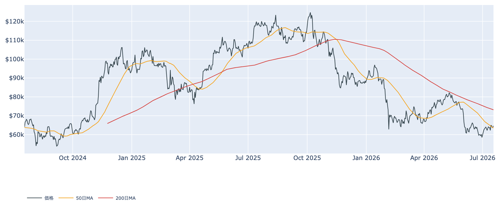
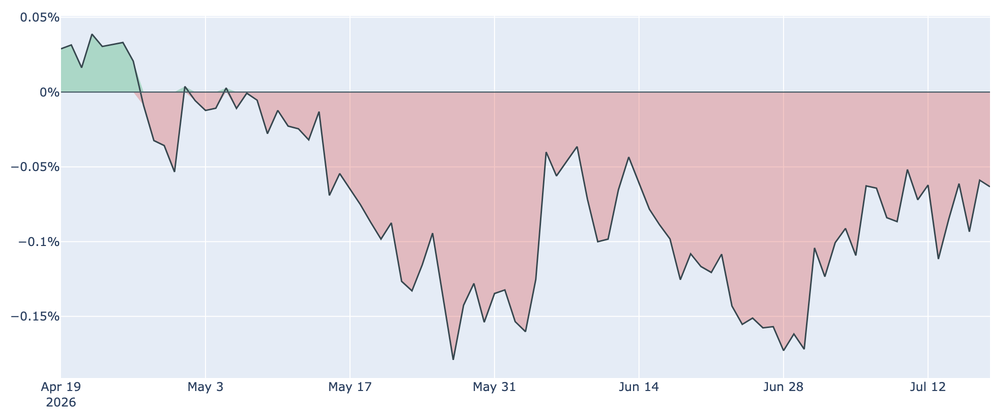
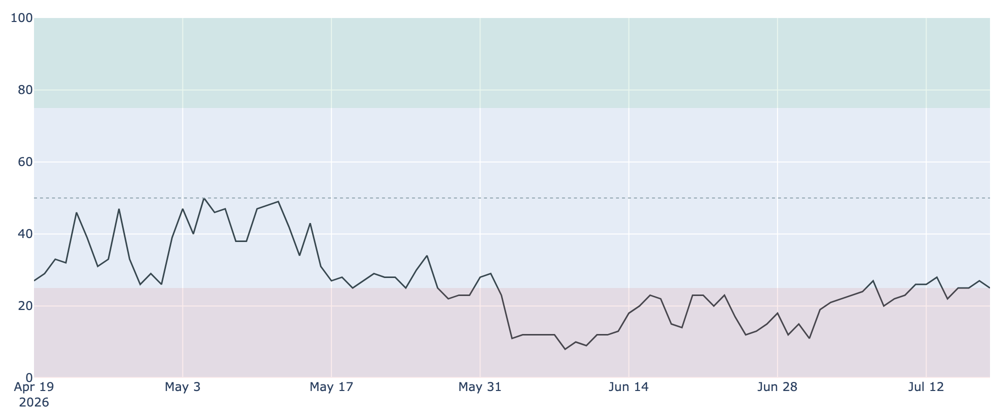

# 50日線を回復した$64,700 ― 米国マネーは戻り、長期勢の備蓄は一服

**2026年7月19日**

ビットコインは$64,700近辺まで持ち直し、下向きだった短期の目安（50日移動平均）をひとまず上抜けました。米国の現物ETFにも資金が戻りつつあります。一方で、これまで相場の下支え役だった長期保有者の買い集めには明確なブレーキがかかっており、「底堅いが力強さはこれから」という構図が続いています。今の相場を分かりやすく整理します。

（オンチェーン指標は7/17、BTC価格・センチメント・Coinbase Premiumは7/18、ETF資金フローは7/17時点のデータに基づきます。取得時刻は7/19 7:30 JST、作成中のライブ再取得はしていません。）

## 1. 現在の市場の全体像：小さな前進と、続く重さ

価格は6月末の$58,000台をボトムに、じわじわと水準を切り上げてきました。7/18終値は約$64,700で、1週間前より約1.4%、1か月前より約2.9%高い水準です。

* **小さな前進**: 現在値（約$64,700）は50日移動平均（約$63,500）を上回りました。前回（7/12）は50日線も下回っていたので、短期の地合いはわずかに改善しています。
* **続く重さ**: ただし200日移動平均（約$73,200）は大きく下回ったままで、中期のトレンドは依然「デッドクロス圏（弱い地合い）」。価格は過去2年のレンジでは下から2割弱の安値圏にあります。
* 市場心理は「極度の恐怖（Fear & Greed 25）」が続いていますが、6月中旬の最悪期（15前後）からは持ち直しています。恐怖が薄れきらないまま値を戻す、静かな回復です。

## 2. 注目すべき4つのポイント

### ① 短期勢の含み損が縮小してきた

* **コストベース（平均取得単価）**: 直近で買った層（保有155日未満）の平均取得単価は約$68,100まで下がりました。現在価格との差は約5%の含み損で、前回（約7%）から縮小しています。価格が上がり、取得単価が下がったことの両方が効いています。
* **売り圧力はまだ残る**: 利益・損失の状態を示すSOPRという指標は、なお1をわずかに下回っています（約0.996）。戻り局面で含み損を抱えた投資家が売りを出す動きは、完全には収まっていません。

### ② 米国マネーが戻りつつある

* **ETFへの資金流入**: 6月末まで続いた米国現物ETFからの資金流出が7月に入って止まり、流入の日が増えています。直近7営業日の合計は約+7,000万ドル、最新日（7/17）は約+1.3億ドルで、いずれもBlackRockのIBITが牽引しました。
* **米国需要のディスカウント縮小**: 米国勢の買い意欲を映すCoinbase Premiumはマイナス圏が74日連続と長引くものの、そのマイナス幅は着実に縮小しています（1か月前の約-0.13%から足元は約-0.06%へ）。「最悪期は脱しつつある」という点で①と整合的です。

### ③ 長期勢の「備蓄」は一服

* **蓄積ペースの鈍化**: これまで相場の底を支えてきた長期保有層（155日以上保有）の買い集めに、明確なブレーキがかかりました。過去30日の保有量変化は+約20万BTCと、まだプラス（蓄積継続）ではあるものの、1週間前（+約34万BTC）、1か月前（+約36万BTC）から大きく減速しています。
* **意味合い**: 「猛烈な備蓄」から「穏やかな備蓄」への移行です。下値を支える力が弱まったわけではありませんが、前回まで強調してきた"加速"の勢いは失われました。下支えの厚みが今後も続くかは、見ておきたい変化です。

### ④ マイナーの採算難は続く

* **収益の低迷**: マイナー（採掘業者）の稼ぎ具合を示すPuellMultipleは約0.63と、過去4年でも最低圏に沈んだままです。ネットワーク全体の採掘パワー（ハッシュレート）も直近30日で約3.6%低下し、効率の悪い業者の撤退が続いていることをうかがわせます。
* **落ち着いた供給圧力**: 次回の採掘難易度の調整はほぼ横ばい（-0.2%程度）の見込みで、6月に見られた急激な下方修正は一巡した形です。手数料市場も閑散（推奨1sat/vB近辺）で、オンチェーンは投機的な過熱とは無縁の静けさが続いています。

## 3. 相場転換を見極めるための3つの分岐点

1. **ETF資金流入が「定着」するか**: 単発の買い戻しではなく、週次でも明確な純流入超が続くかが鍵です。7月は流入の日が増えましたが、腰の据わったトレンドと呼ぶにはもう少し継続の確認が要ります。
2. **価格が約$68,100（短期勢の取得単価）を上抜けるか**: この水準を明確に超えて定着すれば、直近参入者の含み損が解消され、「売り圧力」が「買い支え」へと変わる転換点になります。今週$64,700まで戻してもこの壁には届いていません。
3. **7/28〜29のFRB会合**: 市場は「金利据え置き（約8割）」を織り込む一方、約2割は利上げを見込むタカ派寄りの見方が残ります。年内の利上げを見込む委員も半数近くおり、「higher for longer（高金利の長期化）」の空気が和らぐかどうかが、リスク資産全体の地合いを左右します。

## 総括

ビットコインは、割安なバリュエーションと戻りつつある米国需要を追い風に、50日線を回復する小さな前進を見せました。ただし、これまで最大の下支えだった長期勢の備蓄には一服感が出ており、上値には短期勢の戻り売りとマクロの不透明感が残ります。「底は堅いが、本格上昇の火種はまだこれから」という、辛抱の続くレンジ・底練り局面と言えそうです。

---

*本稿は情報提供を目的としたものであり、投資助言ではありません。将来の価格動向を保証・示唆するものではなく、投資判断は各自の責任において行ってください。*
