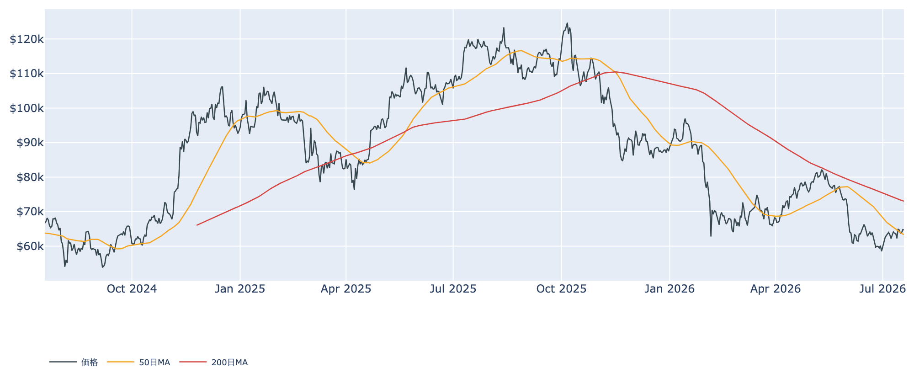
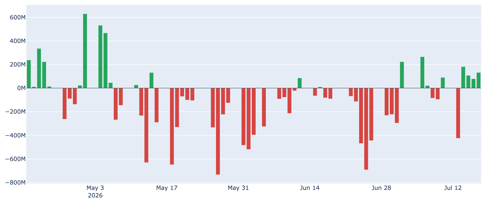
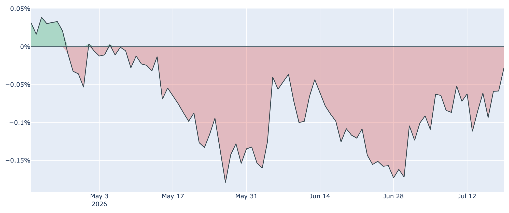
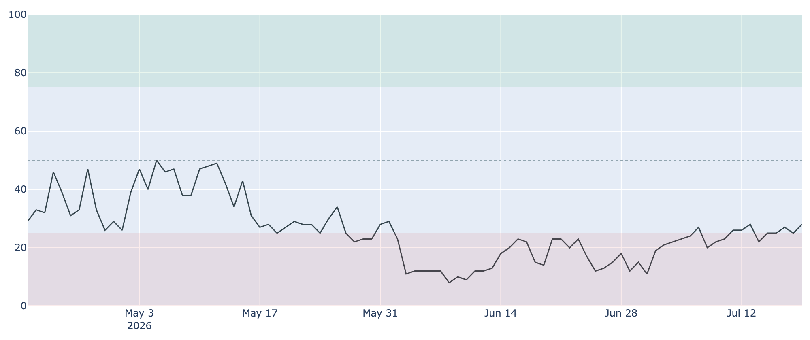
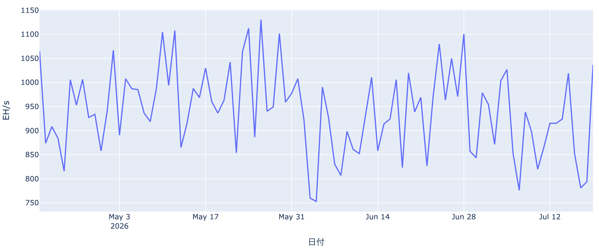

# 資金は4日続けて流れ込み ― $64,700の膠着と、下げ止まったマイナー採算

**2026年7月20日**

ビットコインは$64,700前後で小動きが続いていますが、水面下では風向きが変わりつつあります。米国の現物ETFへの資金流入が4営業日続き、米国勢の需要不足を示していた指標もほぼゼロまで戻ってきました。一方で価格は上値を追えず、長期保有層の買い集めペースも落ちています。今日はこの「資金は入るのに値が動かない」状態を整理します。

（このレポートは2026-07-20 07:30 JSTに取得したキャッシュに基づいています。データの最新日は、オンチェーン指標が7/18、BTC価格・Fear&Greed・Coinbase Premiumが7/19、ETF資金フローが7/17です。）

## 1. 全体像：買い手は戻ってきたが、値が付いてこない

価格は$64,713（7/19終値）。1週間前より約1.5%、30日前より約2%高い水準で、6月の急落後としては落ち着いた推移です。

* **買い手側**: ETFへの資金流入が4営業日連続。米国勢の需要不足も解消寸前。恐怖一色だった市場心理も、1か月かけて底から持ち直しています。
* **売り手側**: それでも価格は$64,000〜$65,000のレンジを抜けられません。6月の高値圏で買った短期勢の戻り売りが上値の蓋になっている構図が続いています。

移動平均で見ると、現在値は50日移動平均（約$63,400）は上回ったものの、200日移動平均（約$73,000）にはまだ遠く、中期のトレンドは「デッドクロス圏（弱い地合い）」のままです。歴史的な位置としては直近2年で見て下から2割程度の安値圏にあります。

## 2. 注目すべきポイント

### ① ETFに4営業日続けて資金が入った

* **直近の流入**: 7/17は日次で約+1.3億ドルの純流入。7/14以降4営業日続けてプラスで、直近7日の合計も約+0.7億ドルとプラス圏に浮上しました。
* **中身はほぼBlackRock**: 最新日の内訳はIBIT単独で約+1.4億ドル。他のファンドはほぼ動かず、資金の出し手が一極に偏っている点は留意が必要です。
* **意味合い**: 6月は月を通して流出が続いていました。価格が伸び悩む局面で資金が入るのは、値を追う買いではなく仕込みの買いが入っているサインと読めます。

### ② 米国勢の「弱さ」がほぼ消えた

* **Coinbase Premium**: 米国の買い需要の強弱を示すこの指標は約-0.03%まで戻り、ゼロ目前です。1週間前は約-0.06%、30日前は約-0.11%だったので、ディスカウントは1か月で3分の1以下に縮みました。
* **ただし記録は継続中**: マイナス圏そのものは75日連続で、まだ一度もプラスに転じていません。「最悪期は脱したが、米国勢が積極的に買い上げる段階には至っていない」という状態です。

### ③ 長期勢の買い集めはペースを落とし続けている

* **蓄積の減速**: 長期保有層（155日以上保有）の過去30日の保有量変化は+約20万BTC。プラス圏＝買い越しではあるものの、1週間前の+約30万BTC、30日前の+約35万BTCから明確に鈍っています。
* **売る側は損切り**: 長期勢が動かしたコインの損益状態を示すLTH-SOPRは約0.73で、売った分は平均して大きな含み損を確定させた計算になります。下値を支えてきた「静かな備蓄」が細っているのが、いま一番の弱材料です。

### ④ 市場心理は恐怖のまま、ただし底からは回復

* **Fear & Greed 指数**: 28で「恐怖（Fear）」圏。1週間前は26、30日前は14でしたから、6月のパニック的な水準からは着実に持ち直しています。
* **裏を返すと**: まだ「中立」にすら届いていません。過熱感が皆無という点では、上値余地は残っているとも言えます。

### ⑤ マイナーの採算が底を打った

* **難易度の反転**: 6月以降の下方修正が続いた採掘難易度は、次回調整が+約2%の見込みです。効率の悪い業者の淘汰が一巡し、ハッシュレート（採掘に投じられている計算能力）も直近1か月で約1.7%増えて過去最高圏に戻りました。
* **収益性の回復**: マイナー収益の水準を示すPuell Multipleは約0.84。1週間前の約0.69から持ち直し、過去4年で最低圏を脱しつつあります。採算改善は、マイナーが保有BTCを売り急ぐ必要が薄れることを意味します。

## 3. 相場転換を見極める3つの分岐点

1. **Coinbase Premiumがプラスに転じるか**: 75日続いたマイナスがプラスへ抜ければ、米国の機関マネーが本格的に買い手側へ回った合図になります。あと0.03%というところまで来ています。
2. **長期勢の蓄積が再加速するか**: +20万BTCまで細った買い集めが再び増えるかどうか。ここが減り続けてゼロに近づくと、下値の支えが弱くなります。ETFの流入がこれを補えるかが焦点です。
3. **7月28〜29日のFRB会合**: 市場は据え置き（現行3.50〜3.75%）を約8割織り込む一方、2割程度は利上げを見込むタカ派寄りの構図です。据え置きが確認されリスク資産の空気が緩めば、レンジ上抜けの後押しになり得ます。

## 総括

需給の担い手が入れ替わりつつある局面です。これまで下値を支えてきた長期保有層の買い集めが細る一方、ETF経由の米国マネーが4営業日続けて流入し、その穴を埋め始めました。マイナーの採算も底を打ち、供給側の売り圧力は和らぐ方向です。ただし価格は$65,000の壁を越えられず、米国需要も「マイナスが縮んだ」段階にとどまります。今週はFRB会合を控え、動きにくい膠着が続く可能性が高いと見ています。

---

*本稿は情報提供を目的としたものであり、投資助言ではありません。将来の価格動向を保証・示唆するものではなく、投資判断は各自の責任において行ってください。*
