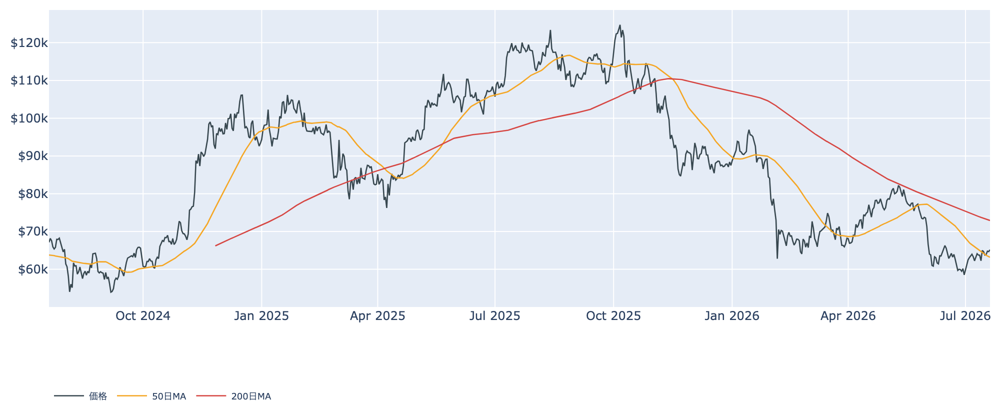
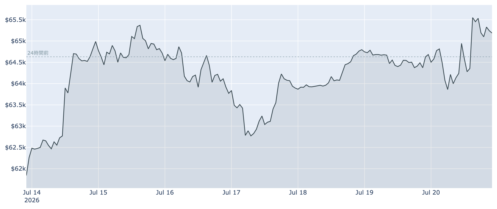
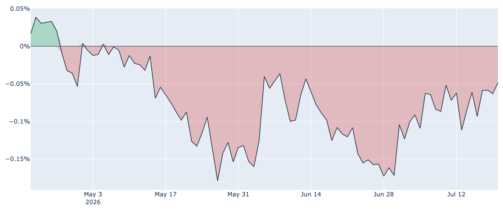
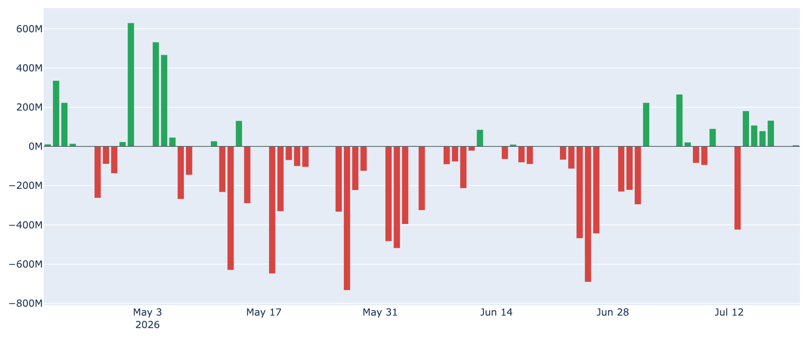
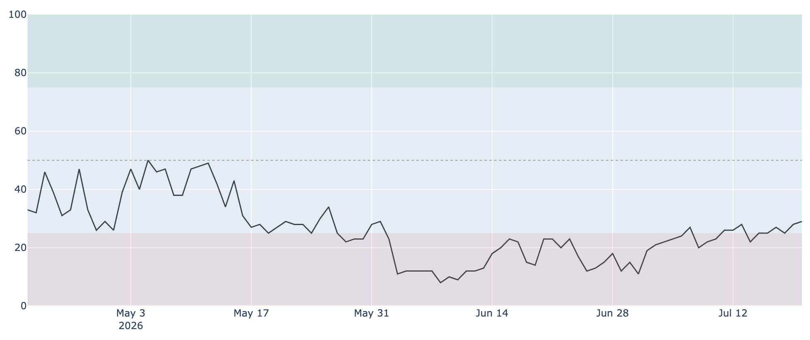

# 50日線を奪還 ― 米国勢の売りが薄れる一方、長期勢の買いは一服

**2026年7月21日**

ビットコインは週明けにかけてじりじりと切り上がり、7月21日7時30分時点で約6万5200ドルと、この1週間の高値圏で推移しています。50日移動平均を上回り、6月の急落からの戻りが一歩進みました。ただし本格的な上昇トレンドに戻るには壁も残ります。この状況を、各種データとマクロ環境から分かりやすく整理します。

（価格・取引所プレミアムは7月21日7時30分JST時点の実勢値、Fear & Greedは7月20日、オンチェーン指標は7月19日、ETF資金フローは7月20日時点のデータに基づいています。）

## 1. 現在の市場の全体像：静かな戻り

6月に一時5万8千ドル台まで沈んだ相場は、7月に入って底堅く推移し、足元では約6万5200ドルまで水準を切り上げました。過去1週間で約+4.7%と、方向感は上向きです。

* **節目の奪還**: 現在値は50日移動平均（約6万3200ドル）を上回りました。短期的な地合いは改善しています。
* **ただし中期の壁は残る**: 一方で200日移動平均（約7万2900ドル）はまだ大きく下回っており、中長期のトレンドは依然「デッドクロス圏（弱い地合い）」です。バリュエーション（MVRV Z-Scoreなど）で見れば過去4年でかなり割安な圏内にあることは変わりません。

つまり「短期は持ち直したが、中期の重さはまだ抜けていない」局面です。

## 2. 注目すべき4つのポイント

### ① 米国勢の売り圧力が薄らいでいる

* **Coinbase Premium**: 米国の機関・大口の需要を映すこの指標は76日連続でマイナス（米国需要が相対的に弱い）ですが、そのマイナス幅が着実に縮小しています。1週間前の約-0.11%、30日前の約-0.12%から、7月20日時点では約-0.05%へ。ゼロ（＝米国とアジアの需要が拮抗）に近づいてきました。
* **意味**: これまで上値を抑えてきた「米国勢の弱さ」が和らぎつつあり、戻りを後押しした一因と見られます。

### ② ETFへの資金が週ベースでプラスに転じた

* **ETF資金フロー**: 米国の現物ビットコインETFは、7月20日時点で直近7営業日の合計が約+1.7億ドルと流入超です。6月は記録的な流出（月間約45億ドル規模）に見舞われましたが、7月は流入する日が目立ち、機関マネーの出血が止まりつつあります。
* **注意**: とはいえ7月20日の日次は約+700万ドルと小幅で、まだ「勢いのある買い戻し」とまでは言えません。

### ③ 恐怖はやや和らいだが、まだ「強欲」には遠い

* **Fear & Greed 指数**: 市場心理は7月20日時点で29と、「恐怖（Fear）」圏です。30日前（23）、1週間前（28）と比べると少しずつ底上げしていますが、依然として弱気寄りの水準にとどまります。
* **意味**: 価格が戻しても投資家心理はまだ慎重で、過熱感はありません。歴史的には「恐怖」が続く局面は逆張りの買い場とされることが多く、下値の堅さと整合的です。

### ④ 長期勢の「静かな備蓄」はペースが鈍化

* **長期保有層の買い**: 155日以上保有する長期勢の過去30日の保有量変化は、7月19日時点で+約19.3万BTCと、依然プラス（買い集め）圏にあります。ただし1週間前（+約29.7万BTC）、30日前（+約36.4万BTC）と比べると勢いは明確に鈍っています。これまで相場の下支えだった「静かな備蓄」が一服しつつある点は、留意しておきたい変化です。
* **短期勢はなお含み損**: 短期保有者（155日未満）の平均取得単価は約6万8100ドルで、現在値（約6万5200ドル）はこれを下回ります。直近に買った層は平均で数%の含み損を抱えており、戻り売りの予備軍として上値の重しになりえます。

## 3. 相場転換を見極めるための「3つの分岐点」

1. **約6万8千ドル（短期勢の原価）〜200日線を取り戻せるか**: まず短期保有者の平均取得単価（約6万8100ドル）を上抜けて定着すれば、含み損の解消で「売り圧力」が「買い支え」に変わります。その先の200日線（約7万2900ドル）超えが中期トレンド好転の目安です。
2. **ETF流入と米国需要の改善が続くか**: 週次プラスと、Coinbase Premiumのマイナス幅縮小がこのまま続き、はっきりとプラス圏に戻るかが鍵です。単発で終われば戻りも失速しやすい段階です。先物の資金調達率は小幅ながらプラス（年率約+6%）が約25日続いており、投機筋もわずかに強気へ傾いています。
3. **マクロ環境（FRBの動向）**: 7月28〜29日のFOMCが最大の焦点です。市場は金利据え置き（現行3.50〜3.75%）をほぼ確実（9割超）と見ていますが、利下げはほぼ織り込まれず、わずかな確率の変化はむしろ「利上げ」方向とされます。据え置き自体は想定内でも、「higher for longer（高金利の長期化）」を裏付ける発言が出れば、リスク資産全体の重しになりえます。

## 総括

ビットコインは米国勢の売り圧力が薄らぎ、ETFへの資金も週ベースでプラスに転じたことを背景に、50日線を奪還して1週間の高値圏まで戻しました。バリュエーションは引き続き割安圏で、下値は堅めです。一方で、これまで下支えだった長期勢の買いはペースが鈍り、短期勢はまだ含み損、中期の200日線も遠いまま。マクロも来週のFOMC待ちで、決め手を欠きます。総じて「短期は持ち直したが、本格上昇には米国需要の定着とマクロの後押しが要る、戻りの初期局面」と言えそうです。

---

*本稿は情報提供を目的としたものであり、投資助言ではありません。将来の価格動向を保証・示唆するものではなく、投資判断は各自の責任において行ってください。*
