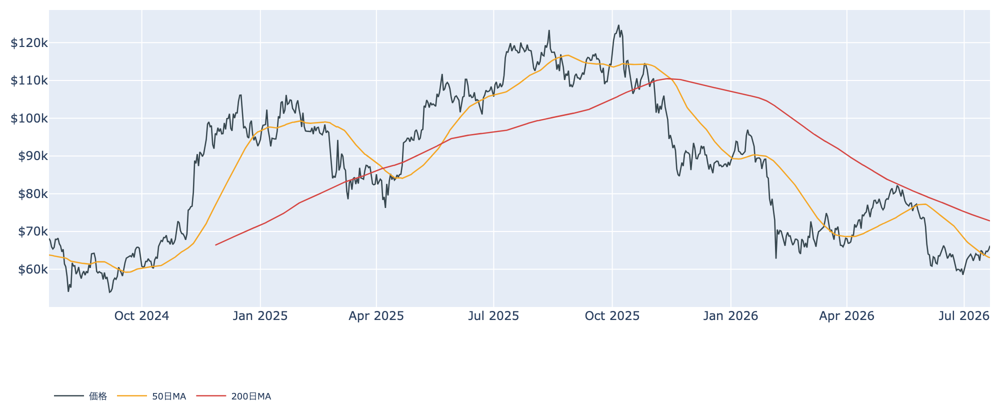
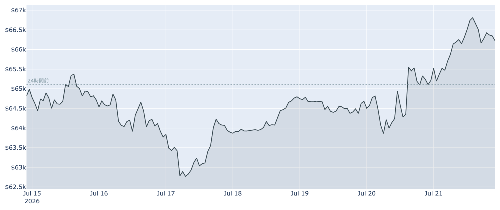
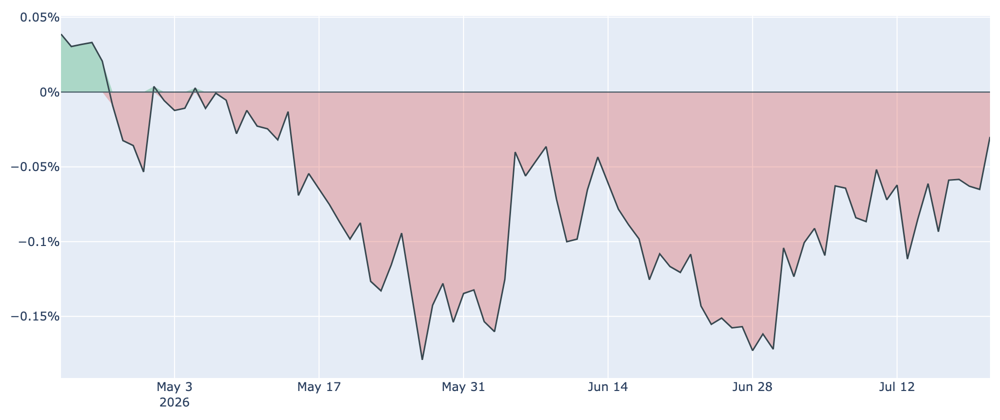
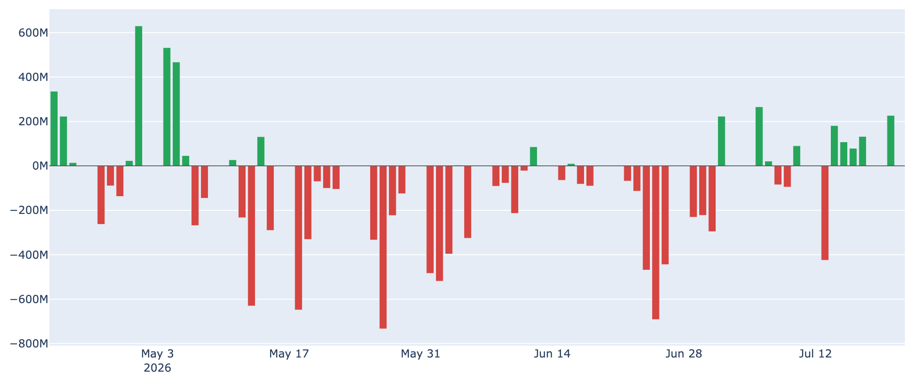
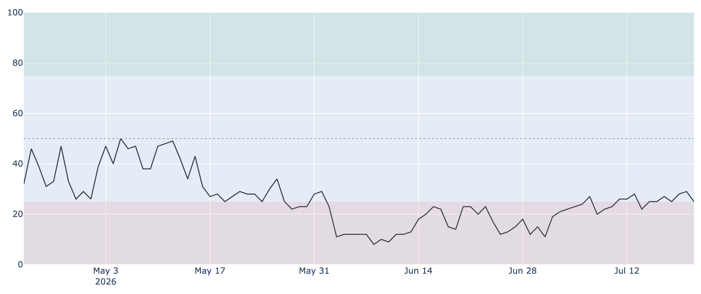

# 約5週間ぶりの$66,000台 ― 買い手は米国勢へ、長期勢は利益確定に回る

**2026年7月22日**

（本稿は2026年7月22日7時30分（JST）時点で取得した各種データに基づいています。BTC価格とCoinbase Premiumはその時点の実勢値、Fear & Greed指数とETF資金フローは7月21日、オンチェーン指標は7月20日時点が最新です。）

ビットコインは7月22日7時30分時点で約$66,200と、6月中旬以来・約5週間ぶりの高値圏まで戻してきました。米国の現物ETFに5営業日連続で資金が流れ込み、長らく続いた「米国勢の売り」がほぼ消えたことが背景です。一方で、これまで下値を支えてきた長期保有層は買い集めのペースを大きく落とし、一部は利益確定に回り始めており、市場の主役が静かに交代しつつあります。

## 1. 現在の市場の全体像：買い手と売り手の「交代」

* **買い手として戻ってきた米国勢**: 米国の機関需要を映すCoinbase Premiumのマイナス幅はほぼゼロまで縮小し、現物ETFへの資金流入も続いています。米国の暗号資産規制法案（CLARITY法案）が8月の議会休会前に上院を通過するのではという期待も、追い風として報じられています。
* **売り手に回り始めた長期勢**: 逆に、6月の安値圏で猛烈に買い集めていた長期保有層は、価格の戻りに合わせて積み増しを急減速させ、利益確定の売りを出し始めています。
* **それでも市場心理はまだ「極度の恐怖」**: Fear & Greed指数は7月21日時点で25と、恐怖圏の下限に張り付いたままです。過熱感のない、懐疑の中の戻りと言えます。

価格の位置で見ると、実勢の約$66,200は50日移動平均（約$63,100)を明確に上回った一方、200日移動平均（約$72,800）はまだ約9%上にあり、中期トレンドとしてはデッドクロス圏からの回復途上です。

## 2. データの解説：注目すべき5つのポイント

### ① 約5週間ぶりの高値圏に到達

* **価格の戻り**: 7月22日7時30分時点で約$66,200。直近24時間で約+1.7%、1週間前比で約+1.9%、30日前比では約+4.8%と、じり高の展開が続いています。
* **水準感**: 日足ベースでこの水準は6月15日以来です。直近24時間には一時$66,900台まで買われる場面もありました。

### ② 米国需要のディスカウントがほぼ解消

* **Coinbase Premium**: 7月21日時点で約-0.03%と、マイナス幅は30日前（約-0.12%）、1週間前（約-0.09%）から縮小を続け、ほぼゼロに達しました。
* **意味合い**: マイナス圏自体は77日連続と長いものの、「米国勢が売り続けている」状態は実質的に終わりつつあります。5〜6月の下落を主導したのが米国勢の売りだっただけに、この変化は大きい転換点です。

### ③ ETFへの資金流入が5営業日続いた

* **流入の定着**: 米国の現物ETFには7月14日〜20日の5営業日連続で資金が純流入し、合計で約7億ドルに達しました。5日連続の流入は4月末〜5月初め以来です（7月21日はほぼ横ばい）。
* **注意点**: 月間で見ると5月・6月は大幅な流出超だったため、まだ「失った分を取り戻し始めた」段階です。市場関係者からは「新規需要の流入というより、売り圧力の一巡」との慎重な見方も出ています。

### ④ 長期勢は「備蓄」から「利益確定」へ

* **積み増しの急減速**: 長期保有層（155日以上保有）の過去30日の保有量変化は、7月20日時点で+約14.5万BTC。1週間前（+約26.5万BTC）、30日前（+約39.2万BTC）から急ピッチで減っており、1か月で3分の1近くまで縮みました。
* **利確の兆し**: 長期保有者の売却が利益か損失かを示す指標（LTH-SOPR）は7月20日時点で約1.05と、利益確定側に転じています。安値で買い集めた玉の一部が、戻り局面で売りに出始めた形です。この売りをETF経由の米国需要が吸収できるかが、上値の伸びを左右します。

### ⑤ 過熱感はなし ― 心理は「極度の恐怖」のまま

* **センチメント**: Fear & Greed指数は7月21日時点で25（極度の恐怖）。価格が5週間ぶりの高値に戻っても、心理はほとんど改善していません。
* **先物市場も穏やか**: 無期限先物の資金調達率は約26日連続でプラスながら年率換算で約+4%と低く、建玉はこの1週間でむしろ約6%減少。レバレッジを効かせた投機的な買いが主導する上昇ではないことを示しています。

## 3. 相場転換を見極めるための「3つの分岐点」

1. **約$68,000（短期保有者の原価）を上抜けるか**: 短期保有者の平均取得単価は7月20日時点で約$68,100。現在値はその約3%下にあり、ここを明確に超えれば直近参入組の含み損が解消され、戻り売り圧力が和らぎます。逆にここで跳ね返されると、レンジ上限を確認しただけに終わります。
2. **FRBの7月会合（7月28〜29日）**: 市場の本命は据え置き（現行3.50〜3.75%）ですが、インフレの粘りを受けて利上げを見込む声が7月に入って増えています（月初の約2割弱から約36%へ）。タカ派寄りの結果はリスク資産全体の逆風になります。
3. **米国の規制法案（CLARITY法案）の行方**: 8月7日の議会休会までに上院を通過できるかが焦点で、通過期待は足元の上昇材料の一つと報じられています。採決が見送られれば、この期待分が剥落するリスクがあります。

## 総括

価格は約5週間ぶりの高値圏に戻り、その原動力は「米国勢の売りの消滅とETF経由の資金流入」です。一方で、底値圏を支えた長期勢は買いの手を緩めて利益確定に回り始めており、需給の担い手が入れ替わる過渡期にあります。センチメントや先物に過熱感はなく、戻りの質は悪くありません。ただし短期保有者の原価（約$68,000）という壁と、FRB会合・規制法案という2つのイベントが目前にあり、ここを越えられるかどうかで「本格反転」か「レンジ上限の確認」かが決まる局面です。

---

*本稿は情報提供を目的としたものであり、投資助言ではありません。将来の価格動向を保証・示唆するものではなく、投資判断は各自の責任において行ってください。*
