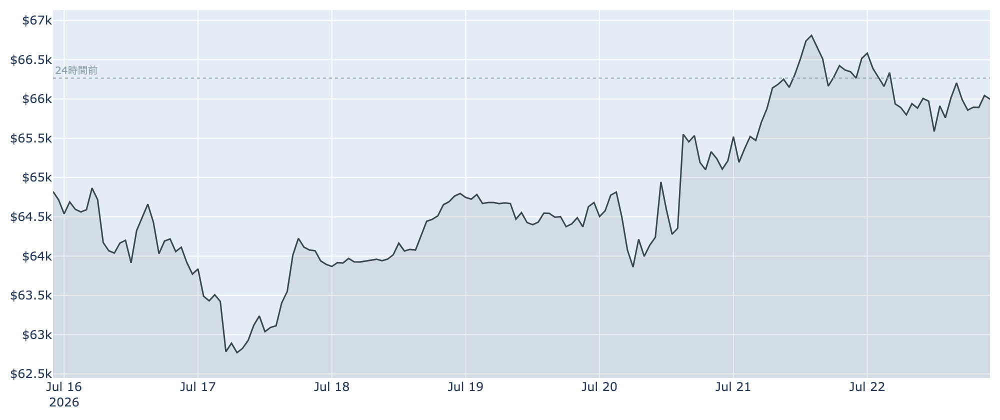
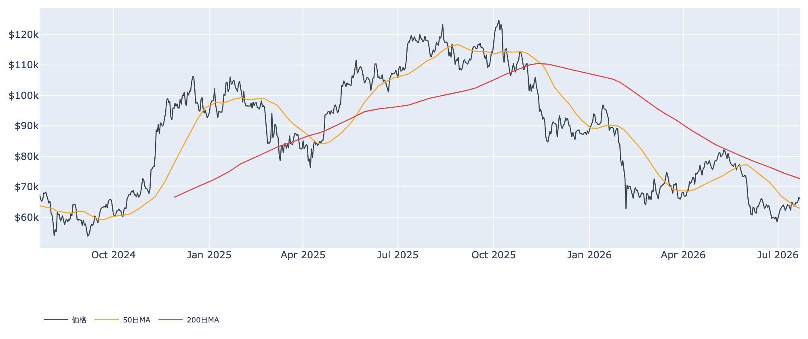
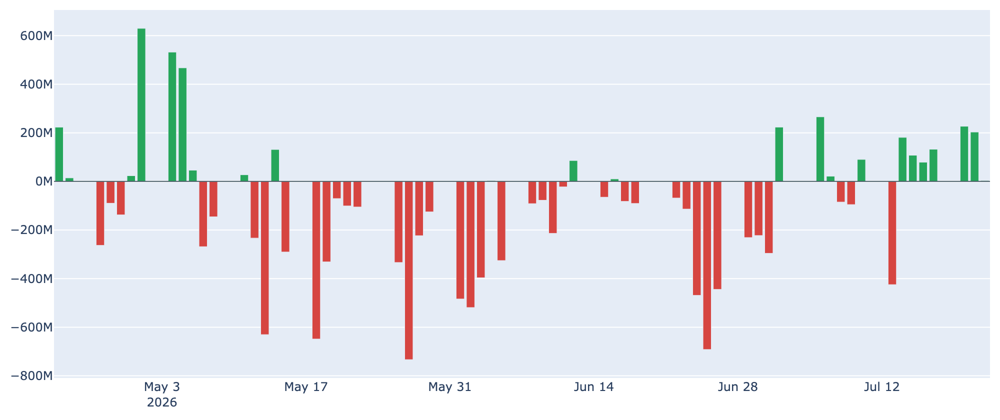
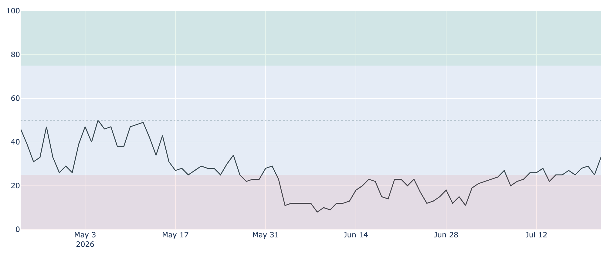
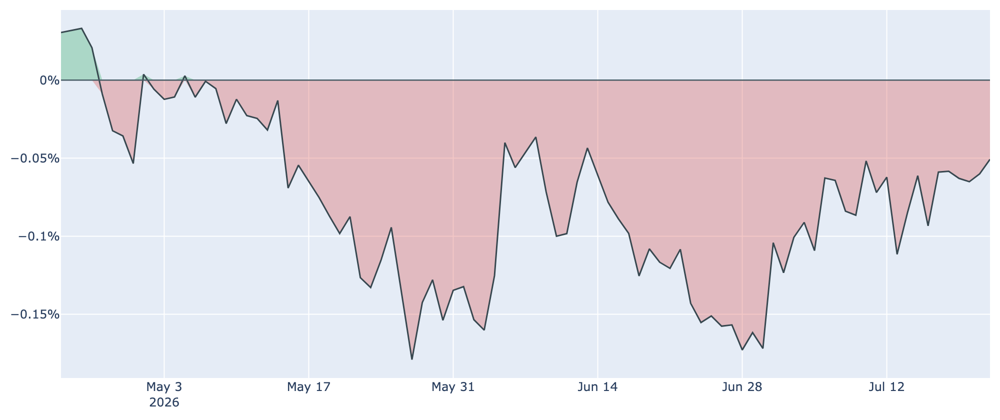

# ETFに資金が戻り$66,000台を回復 ― 薄れる恐怖、縮む短期勢の含み損

**2026年7月23日**

ビットコインは7月23日7時30分時点で約6万6000ドルと、6月末に付けた21か月ぶりの安値（約5万8000ドル）からの戻りを一段進めています。今週は現物ETFへの資金流入が続き、下値の堅さと市場心理の改善が同時に見え始めました。この状況を、オンチェーン・オフチェーンの各種指標とマクロ環境から整理します。

（数値は2026年7月23日8時5分（JST）時点の各種データに基づきます。価格・取引所プレミアムは同日7時30分時点の実勢値、市場心理・ETF資金フローは7月22日時点、オンチェーン指標は7月21日時点です。）

## 1. 現在の市場の全体像：底練りから「戻りの初動」へ

6月の急落で$58,000近辺まで沈んだ相場は、7月に入って緩やかに切り上がってきました。足元では二つの変化が重なっています。

* **需給の改善**: 6月に売り越しだった米国の現物ETFに資金が戻り始め、市場心理（Fear & Greed）も「極度の恐怖」圏を脱しつつあります。過熱の目安となる先物の強気の傾きも、いったん落ち着いた中立近辺にあります。
* **残る重し**: それでも価格は200日移動平均（約$72,700）を大きく下回ったままで、中期のトレンドは依然「デッドクロス圏（弱い地合い）」。米国勢の買い需要もまだ本調子ではありません。「底は固まったが、本格上昇の確認はこれから」という段階です。

なお背景として、6月の弱い米雇用統計（雇用者数の伸びが市場予想を大きく下回り、失業率も4.2%へ上昇）をきっかけに利下げ期待が高まったことが、リスク資産全体とビットコインへの資金回帰を後押ししています。

## 2. 注目すべきポイント

### ① 価格は$66,000台を回復し、50日移動平均を上抜け

* 実勢値は約$66,000（7月23日7時30分時点）。7日前比で約+2%、30日前比で約+3%と、じり高が続いています。直近7日は概ね$62,000〜$66,900のレンジで、上限に近い位置にいます。
* 価格は50日移動平均（約$63,100）を上回り、短期の地合いは改善。ただし200日移動平均（約$72,700）にはまだ距離があり、中期の本格反転はこれからです。

### ② 現物ETFに資金が戻ってきた

* 6月は解約（資金流出）が優勢でしたが、7月は流入基調に転換。直近7日の合計は約+9.3億ドルと、しっかりした買い越しです（7月22日時点、単日では小幅）。
* 米国の機関マネーが再び現物を積み増す動きは、この戻り相場のいちばんの支えです。長く続いた流出局面からの潮目の変化と言えます。

### ③ 恐怖は薄れつつある

* 市場心理を測るFear & Greed指数は33（「恐怖」）。1週間前は25、30日前は20だったので、悲観はじわりと和らいでいます（7月22日時点）。
* ただし「中立」（45〜55）や「強欲」にはまだ遠く、投資家心理は慎重なまま。過度な楽観による過熱はなく、上値追いには力不足の水準です。

### ④ 短期勢の含み損が縮小し、投げ売りが一服

* 短期保有者（保有155日未満）の平均取得単価は約$68,200（7月21日時点）。現在価格はこれを下回っており、直近の買い手は平均で約3%の含み損ですが、この取得単価は30日前の約$71,600からじりじり低下し、含み損の幅は縮んでいます。
* その日動いたコインが利益か損失かを示すSOPRという指標は「1」を回復（短期勢・全体とも）。価格が戻ってもすぐ投げ売りに押される、という重さがやや和らいだサインです。
* 一方、長期保有層の蓄積（過去30日の純増）は約+15.8万BTCとプラス圏を保つものの、そのペースは1週間前（約+21万BTC）・30日前（約+40万BTC）から鈍化しています。「静かな備蓄」は続くが、勢いはピークを越えつつあります。

### ⑤ バリュエーションはなお割安圏

* 割高・割安を測るMVRV Z-Scoreは約0.42と、過去4年で見て下位2割台の割安な水準（7月21日時点）。マイナー収益の水準を示すPuell Multipleも低迷圏にあり、価格の絶対水準としては歴史的に見て安いゾーンにいます。
* つまり「割安さ」が下支えとなる構図は健在で、ここに需給改善が重なってきたのが今の局面です。

## 3. 相場転換を見極める3つの分岐点

1. **7月28〜29日のFRB会合**: 来週の米連邦公開市場委員会が最大の焦点です。市場は「金利据え置き」（据え置き確率はおおむね8〜9割）を織り込み、7月中旬の予想を下回るインフレ指標を受けて利上げ観測は後退しました（現行3.50〜3.75%）。据え置きが確認され、先行きに利下げの余地がにじめば、リスク資産の追い風になります。
2. **ETF流入が定着するか**: 単発ではなく、週次でも明確な純流入が続くかどうか。7月は良い流れですが、6月の流出を挽回しきったわけではなく、定着してはじめて本物の需要回復と言えます。
3. **米国需要の底入れが本物か**: 米国勢の買い意欲を映す取引所プレミアムは-0.05%で、マイナス圏（米国需要が相対的に弱い）が78日連続。ただしマイナス幅は30日前の約-0.11%から縮小しており、底入れの兆しはあります。これがプラスへ転じ、価格が短期勢の取得単価（約$68,200）を上抜けて定着すれば、売り圧力が買い支えへ変わる転換点になります。

## 総括

ビットコインは、割安なバリュエーションという下支えに、ETF資金の回帰と市場心理の改善が加わり、6月の底練りから「戻りの初動」へ移りつつあります。短期勢の投げ売りも一服し、下値は着実に固まってきました。もっとも、価格は依然200日移動平均を下回り、米国需要の回復も道半ば。来週のFRB会合という関門も控えます。「底は固まりつつあるが、本格上昇の確認はこれから」という、方向感を見極める局面と言えそうです。

---

*本稿は情報提供を目的としたものであり、投資助言ではありません。将来の価格動向を保証・示唆するものではなく、投資判断は各自の責任において行ってください。*
