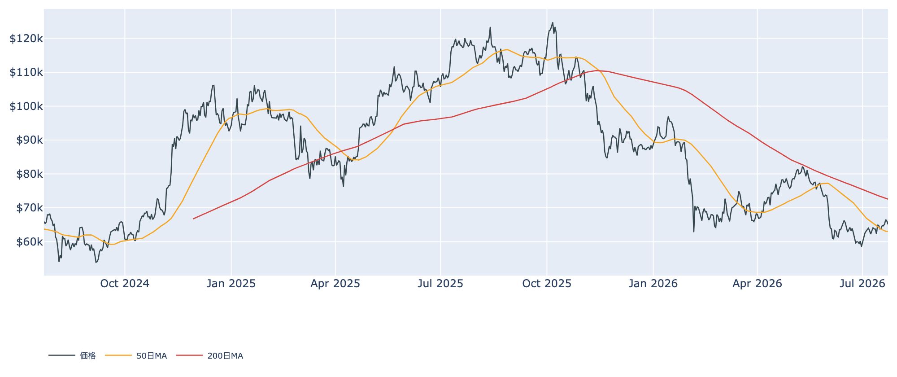
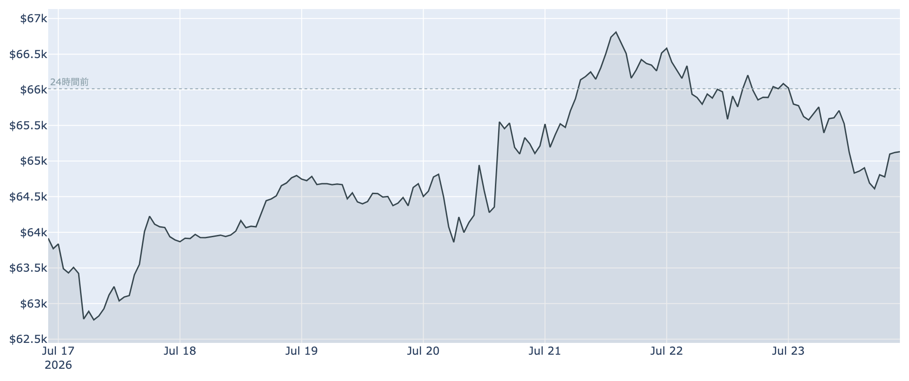
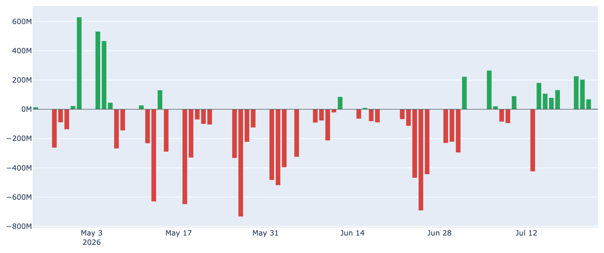
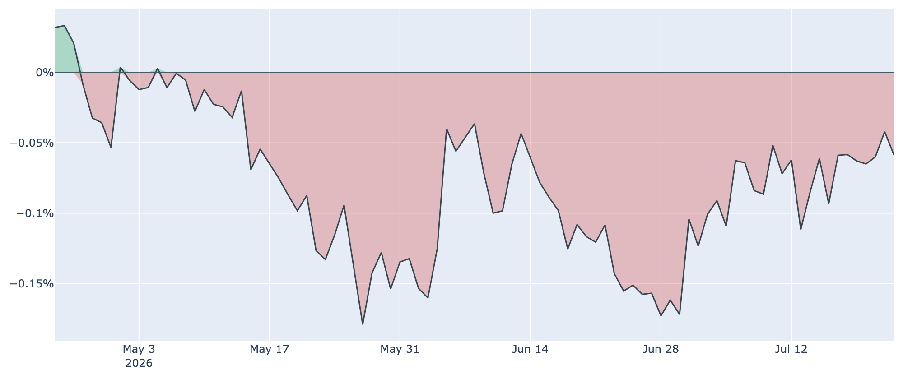
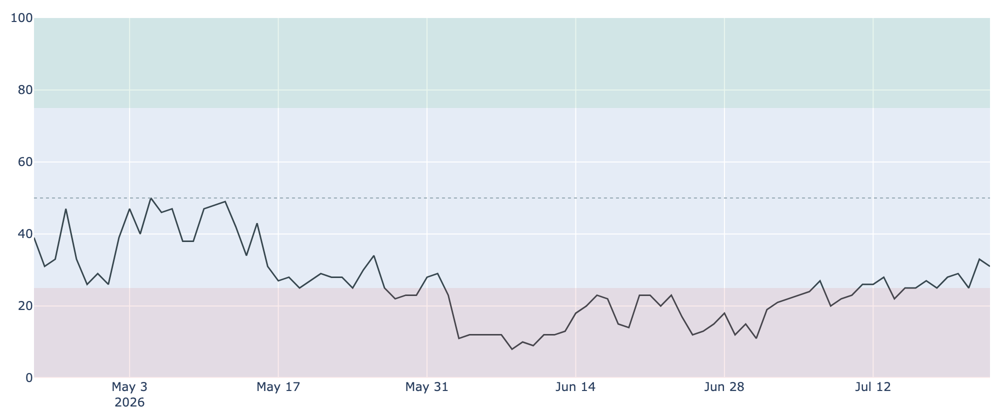

# $6万7000ドルの壁に跳ね返される ― 戻ってきた米国マネー、それでも重い上値

**2026年7月24日**

ビットコインは今週いったん$66,900近辺まで値を戻したあと、7月24日7時30分時点では約6万5100ドルへ押し戻され、24時間で約1.4%安と一服しています。米国の実需（ETFへの資金流入）が明確に戻ってきた一方、短期で買った人たちの含み損や上値の売り圧力が残り、「地合いは改善、でも壁はまだ厚い」という綱引きが続いています。オンチェーン・オフチェーンの各種指標とマクロ環境から、今の局面を分かりやすく整理します。

（数値は日本時間7月24日7時30分時点のものです。価格・取引所プレミアムはこの時刻の実勢値、市場心理は7月23日、オンチェーン指標は7月22日、ETF資金フローは7月23日までの値に基づきます。）

## 1. 現在の市場の全体像：需要は底入れ、でも上値は重い

数週間ぶりの高値である$66,900近辺まで一度は戻したものの、そこで跳ね返されて約6万5100ドルまで押し戻されました。相場を動かしているのは、次の二つの力です。

* **押し上げる力（米国の実需回復）**: 春先から続いた資金流出が止まり、現物ETFへの資金流入が連日続いています。恐怖一色だった市場心理も少しずつ和らぎ、需要が底を打ったサインが増えてきました。
* **抑え込む力（含み損の売りと重い抵抗線）**: 6月の急落で高値づかみをした短期勢の平均買値（約$68,200）が、現在の価格の少し上に控えています。ここを越えられず、戻ったところで「やれやれ売り」が出やすい状況です。

価格の位置を移動平均線で見ると、約6万5100ドルは50日移動平均（約$63,100）は上回ったものの、200日移動平均（約$72,600）は大きく下回ったまま。中期のトレンドはなお「デッドクロス圏（弱い地合い）」にあります。

## 2. 注目すべきポイント

### ① 米国マネーが明確に戻ってきた

* **ETF資金フロー**: 米国の現物ビットコインETFは7月17日〜23日の1週間で合計約+8億ドルと、はっきりした流入超になりました。春から夏にかけての大幅な流出局面から、機関投資家の姿勢が買いへ転じつつあります。
* **裏づけ**: 市場では「7営業日連続の流入は数か月ぶりの長さ」と報じられ、5〜6月に8週間で約80億ドルを引き揚げた流れからの反転と受け止められています。ただし本格的な回復と断じるには、あと数週間の継続が必要という慎重な見方も根強い段階です。

### ② 米国勢の「弱さ」も和らいできた

* **Coinbase Premium**: 米国の大口・機関の需要の強弱を映すこの指標は、7月23日時点で約-0.06%と、マイナス圏（米国需要がやや弱い）がおよそ79日連続で続いています。
* **ただし改善方向**: マイナス幅は着実に縮小しています（30日前の約-0.14%→1週間前の約-0.09%→足元は約-0.06%）。①のETF流入とあわせて、米国発の買いが最悪期を脱しつつあることを示しています。

### ③ 「恐怖」はやや薄らいだ

* **Fear & Greed指数**: 市場心理は7月23日時点で31（「恐怖」圏）。まだ弱気寄りですが、30日前の23、1週間前の25から着実に持ち直しており、極度の悲観からは一歩抜け出しています。
* **含意**: 悲観が和らぐこと自体は下値の堅さにつながりますが、まだ「強欲（過熱）」には程遠く、上昇の勢いに火がつくほどの楽観にはなっていません。

### ④ 短期で買った人はまだ含み損、長期勢の買いは減速

* **短期勢の含み損**: 短期保有者（保有155日未満）の平均買値は7月22日時点で約$68,200。現在の約6万5100ドルはこれを下回り、直近で買った層は平均して数%の含み損を抱えています。利益・損失の状態を示すSOPRという指標も1をわずかに割り込んでおり、戻り局面での投げ売りが上値を抑えています。
* **長期勢の蓄積は鈍化**: 長期保有層（155日以上）の過去30日の積み増しは7月22日時点で+約17万BTCと、プラス（買い集め）は続いていますが、1週間前の+約21万BTC、30日前の+約39万BTCと比べると勢いは目に見えて鈍っています。静かな備蓄は続くものの、ペースは落ちてきました。

### ⑤ マイナーは苦境が続く

* **収益の低迷**: マイナー（採掘業者）の収益水準を示すPuell Multipleは7月22日時点で約0.60と、過去4年でも最低圏に沈んだままです。ネットワークの採掘能力（ハッシュレート）も30日で約-25%と大きく低下しており、採算の合わないマイナーの淘汰が進んでいます。
* **含意**: 短期的には生き残りをかけたマイナーの売りが重石ですが、能力の低下は中長期的に供給圧力を和らげる面もあります。

## 3. 相場転換を見極めるための「3つの分岐点」

1. **7月28〜29日のFRB会合**: 最大の焦点です。市場は金利据え置き（現行3.50〜3.75%）を8割超織り込み、7月中旬の物価指標が落ち着いたことで利上げ観測は後退しました。ウォーシュ議長の会見の口ぶりがタカ派に振れれば重石、ハト派に傾けばリスク資産全体の追い風になります。
2. **ETF流入が「数週間」続くか**: 今回の連続流入が一時的な買い戻しで終わるのか、それとも構造的な資金回帰の始まりなのか。週をまたいで純流入が定着すれば、需給が売り優勢から買い優勢へ変わる転換点になります。
3. **約$68,200（短期勢の買値）と$72,600（200日線）を抜けるか**: まず短期保有者の平均買値を明確に上抜けると、含み損の解消で「売り圧力」が「買い支え」へ変わりやすくなります。その先の200日移動平均を回復できれば、中期トレンドの弱気地合いからの脱却が視野に入ります。

## 総括

今のビットコインは、バリュエーション面（過去4年で割安圏）と米国の実需回復という追い風を得つつも、短期勢の含み損・重い抵抗線・マイナーの苦境という重石を抱えた「地合いは改善したが、上値はまだ重い戻り待ちの局面」にあります。$66,900の壁に一度跳ね返された今、来週のFRB会合とETF資金の継続が、次の方向を決める鍵になりそうです。

---

*本稿は情報提供を目的としたものであり、投資助言ではありません。将来の価格動向を保証・示唆するものではなく、投資判断は各自の責任において行ってください。*
