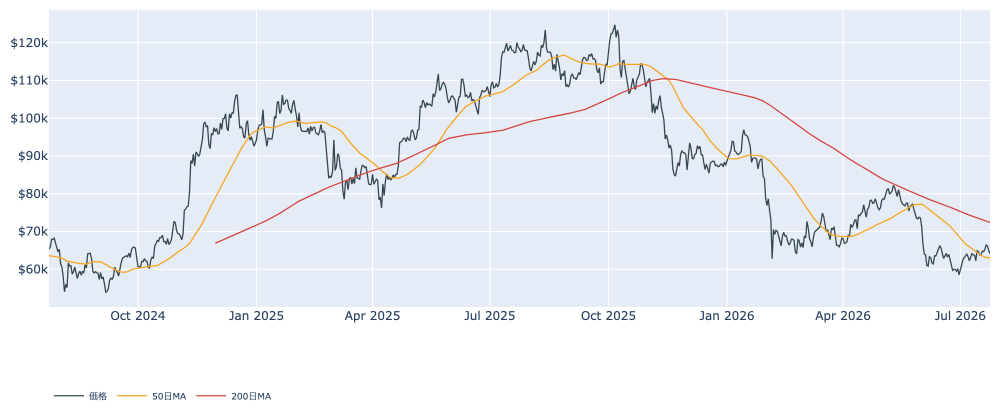
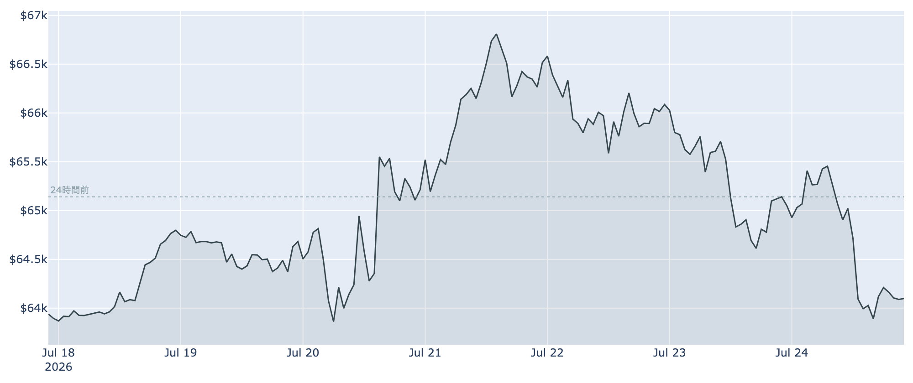
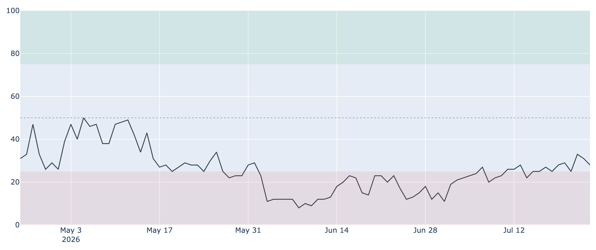
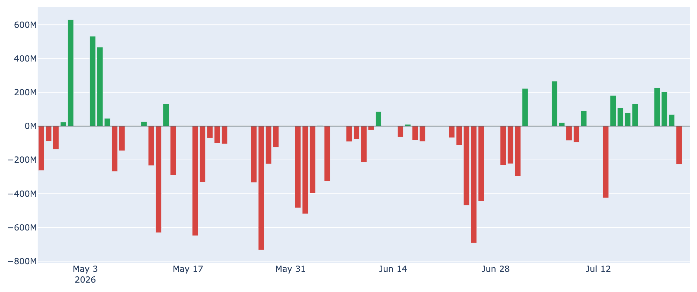
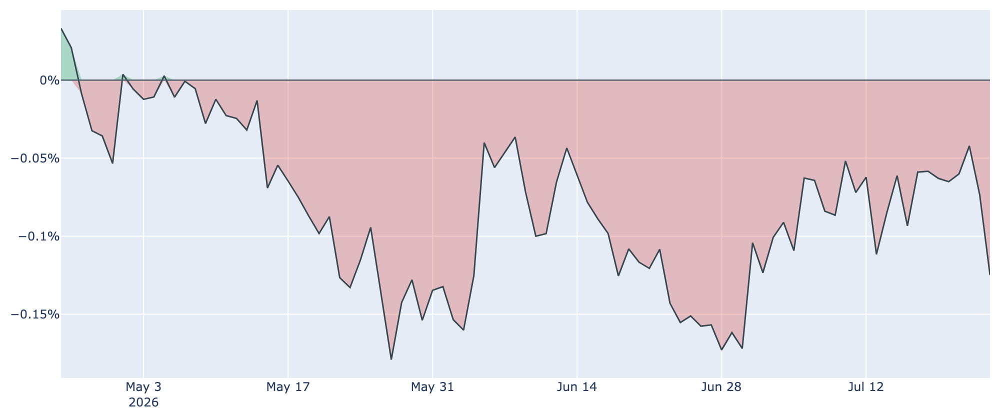

# 関税と金利上昇に押されて$64,000台へ ― 途切れたETFの連続流入、再び遠のく米国マネー

**2026年7月25日**

ビットコインは週の前半に付けた$66,900台から水準を切り下げ、7月25日7時30分時点では約$64,100で推移しています。米国の新関税や原油高を背景に長期金利が上昇し、ハイテク株を含めたリスク資産全体から資金が引く流れに巻き込まれた格好です。オンチェーン・オフチェーンの各種指標とマクロ環境から、いま何が起きているのかを整理します。

（本稿の数値は2026年7月25日7時30分時点のデータに基づきます。価格と取引所プレミアムはこの時刻の実勢値、Fear & Greed指数は7月24日、オンチェーン指標は7月23日、ETF資金フローは7月24日までの集計です。）

## 1. 全体像：外部環境に押し戻された一週間

先週から今週前半にかけての戻りは、米国勢の買い戻しとETFへの資金流入に支えられたものでした。その支えが今週後半に一斉に弱まり、価格は上げ幅の大半を吐き出しています。

* **押し戻した力（マクロ）**: 米政権が60カ国を対象とする新関税を7月24日に発効させ、原油高も重なってインフレ懸念が再燃。米長期金利が上昇し、機関投資家の資金がリスク資産から国債へ回りました。米ハイテク大手7社は木曜だけで約8,000億ドルの時価総額を失っています。
* **踏みとどまった力（下値の厚み）**: それでもビットコインの下げは株式ほど急ではなく、24時間で約1.6%安にとどまりました。価格は50日移動平均（約$63,100）をなお上回っており、長期保有層の買いも続いています。

移動平均で見ると、現在値（約$64,100）は50日線の上、200日線（約$72,400）の下という位置で、中期の地合いは依然「デッドクロス圏（弱め）」です。

直近1週間の値動きを細かく見ると、週前半に$66,900台まで買われた後、じりじりと売られて7日間の安値圏（約$63,600）まで戻ってきたことが分かります。

市場心理も同じ方向です。Fear & Greed指数は7月24日時点で28と「恐怖」圏。7月22日に付けた33からは後退しましたが、1か月前の17に比べればまだ落ち着いた水準です。

## 2. 注目すべきポイント

### ① 7営業日続いたETFへの資金流入が途切れた

* **流入の中断**: 米国の現物ビットコインETFは7月14日から22日まで7営業日連続で資金が流入し、合計は約10億ドルに達していました。この連続記録が7月23日に止まり、同日は約2.3億ドルの流出に転じています。
* **それでも週単位ではプラス**: 直近7営業日の合計では+約4.9億ドルと、まだ流入超を保っています。1回の流出で流れが変わったと決めつけるのは早く、来週も流出が続くかどうかが見どころです。

### ② 米国勢の需要が再び後退

* **取引所プレミアムの悪化**: 米国の大口・機関の需要を映すCoinbase Premium（米国と海外の取引所の価格差）は、7月22日の約-0.04%から7月24日には約-0.12%へマイナス幅が再び広がりました。1週間前（約-0.06%）と比べても明確な悪化です。
* **長期の弱さは続く**: マイナス圏は80日連続で、過去10か月で見ても低い部類に入ります。今週前半に語られた「米国マネーの帰還」は、少なくとも足元では一服したことになります。

### ③ 短期勢はまだ約6%の含み損

* **平均取得単価との距離**: 直近に買った層（保有期間155日未満）の平均取得単価は7月23日時点で約$68,200。現在の価格はこれを約6%下回っており、短期勢は依然として含み損を抱えたままです。
* **売りに傾く投資家**: その日動いたコインが利益で売られたか損失で売られたかを示すSOPRという指標は、7月23日時点で約0.998と「1」をわずかに割り込んでいます。戻り局面で我慢していた層が、上値が重いと見るや損切りに動く構図が続いています。

### ④ 長期勢の買い集めペースは半減

* **蓄積の鈍化**: 長期保有層（155日以上保有）の過去30日の保有量の純増は、7月23日時点で+約19.9万BTC。1か月前の+約37万BTCからほぼ半減しました。プラス圏＝買い越しであることに変わりはなく、下値は支えられていますが、6月のような猛烈な買い集めではなくなっています。
* **含み益は厚い**: 一方で長期勢の平均取得単価は約$49,400と現在の価格よりかなり低く、慌てて投げる必要のない層が大半です。長期保有者の売却を示す指標も1を大きく下回っており、「売れる人が売っていない」状態が続いています。

（補足：ネットワーク側では、計算力の総量を示すハッシュレートが約836EH/sと、この30日で2割強低下しました。採算の合わないマイナーの撤退が進んでいるサインですが、次回の採掘難易度の調整は約-0.7%と小幅で、淘汰そのものは落ち着きつつあります。無期限先物の資金調達率は年率+8%程度の小幅なプラスで、過度な強気の傾きは見られません。）

## 3. 相場転換を見極める3つの分岐点

1. **ETFへの資金が戻るか**: 7月23日の流出が一過性で終わり、来週も流入基調に復帰できるかどうか。ここが割れると、今月の戻り相場を支えてきた最大の柱が失われます。
2. **$66,900と$63,100のどちらを先に抜けるか**: 上は今週の高値、下は50日移動平均です。50日線を明確に割り込むと、7月に積み上げた戻りが帳消しになります。上抜けした場合の次の目標は短期勢の原価である約$68,200で、ここを回復すれば売り圧力が買い支えに変わります。
3. **7月28〜29日のFRB会合と、インフレ再燃の行方**: 市場は金利据え置き（現行3.50〜3.75%）を8割強の確率で織り込む一方、利上げの可能性もなお残ると見ています。関税と原油高がインフレ指標を押し上げれば、長期金利のさらなる上昇を通じてリスク資産全体の重しになります。

## 総括

今週のビットコインは、自身の需給ではなく外部環境に押し戻された一週間でした。関税と原油高による金利上昇がリスク資産全体から資金を吸い上げ、7営業日続いたETFへの流入も途切れ、米国勢の需要も再び後退しています。それでも株式ほど崩れず50日線の上に踏みとどまっているのは、長期保有層の買い越しと厚い含み益という下支えがあるためです。「下は堅いが、上値はマクロ次第」という構図が、来週のFRB会合まで続きそうです。

---

*本稿は情報提供を目的としたものであり、投資助言ではありません。将来の価格動向を保証・示唆するものではなく、投資判断は各自の責任において行ってください。*
