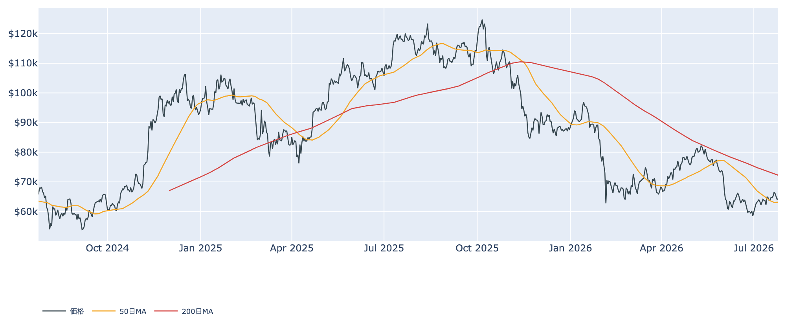
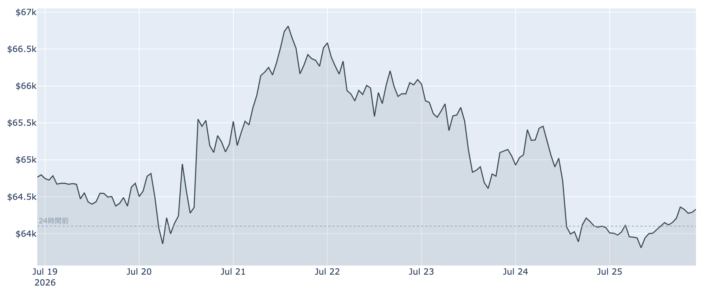
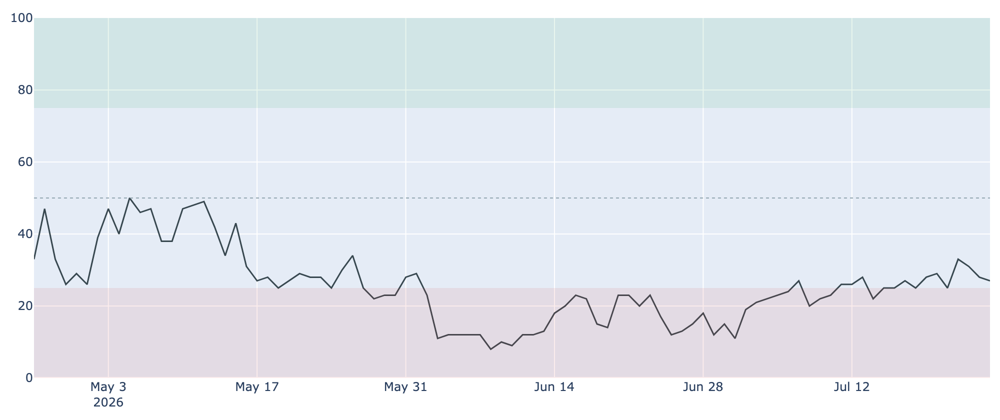
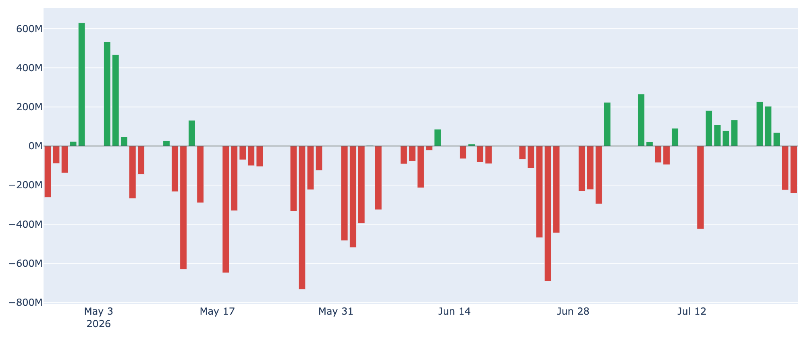
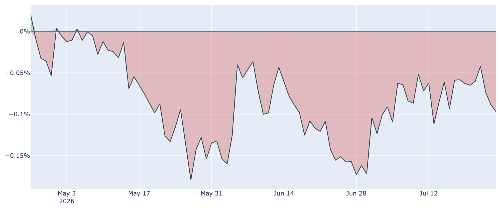

# $64,300で下げ止まり ― ETFの流出は2日連続、それでも先物には買いが積み上がる

**2026年7月26日**

週後半に$66,900台から水準を切り下げたビットコインは、7月26日7時30分時点で約$64,300と、ようやく下げ止まった格好です。24時間の値幅は約$63,700〜$64,400と狭く、来週のFRB会合を前にした様子見の色が濃くなっています。現物のETFからは資金が抜ける一方、先物では建玉が増えるという食い違いが起きており、そこが今の相場のいちばんの特徴です。

（本稿の数値は2026年7月26日7時30分時点のデータに基づきます。価格と取引所プレミアムはこの時刻の実勢値、Fear & Greed指数は7月25日、オンチェーン指標とETF資金フローは7月24日までの集計です。）

## 1. 全体像：外部要因の重しは残ったまま、値動きだけが小さくなった

先週から続く重さの原因は、ビットコイン自身の需給よりも外にあります。米政権の新関税に加え、原油（ブレント）が1バレル$100を超えたことでインフレ懸念が再燃し、米10年債利回りは約4.7%と2025年1月以来の高さまで上がりました。金利が上がればリスク資産には逆風で、株式もハイテク中心に週間で下げています。

* **押し下げる力**: 高止まりする長期金利と、現物ETFからの2営業日連続の資金流出。米国勢の需要も再び弱まっています。
* **支える力**: 50日移動平均（約$63,200）を割らずに踏みとどまっていること、長期保有層が買い越しを続けていること、そして先物で新規の買いポジションが積み上がっていること。

移動平均で見ると、現在値は50日線の上・200日線（約$72,300）の下という位置で、中期の地合いは引き続き「デッドクロス圏（弱め）」です。1週間前と比べれば約0.7%安ですが、1か月前と比べれば約8%高で、6月の底からの戻り自体は保たれています。

直近1週間を細かく見ると、週前半の$66,900台から3日かけてじりじり売られ、$64,000割れ付近で買いが入って横ばいに転じた流れが読み取れます。

市場心理は7月25日時点で27と「恐怖」圏にとどまりますが、1か月前の12という極端な水準からは大きく改善しています。悲観の底は抜けたが、強気にも戻り切らない、という中途半端な位置です。

## 2. 注目すべきポイント

### ① ETFからの資金流出が2営業日続いた

* **連日の流出**: 米国の現物ビットコインETFは7月23日に約2.3億ドル、7月24日にも約2.4億ドルの流出となりました。7月14日から22日まで7営業日で積み上げた約10億ドルの流入分を、2日で半分近く吐き出した計算です。
* **BlackRock頼みの裏返し**: 7月24日の流出のうち約2.1億ドルは最大手のIBIT1本によるもので、残りはFBTCの約0.3億ドルだけでした。流入局面でも流出局面でも同じファンドが振れ幅をつくっており、資金の出入りが一極集中している構図が見えます。
* **週単位ではまだプラス**: 直近7営業日の合計は+約2.5億ドルで、流入超は保っています。ただし2日続いた以上、「一過性の調整」と片づけにくくなってきました。

### ② 米国勢の需要は81日連続で弱いまま

* **プレミアムの再悪化**: 米国と海外の取引所の価格差（Coinbase Premium）は7月26日7時30分時点で約-0.10%。1週間前の約-0.06%からマイナス幅が広がりました。米国勢が海外勢より安く買っている＝買い意欲が相対的に弱い状態です。
* **記録的な長さ**: マイナス圏は81日連続。1か月前（約-0.15%）よりは改善しているものの、今週前半に見えた「米国マネーの帰還」は続かなかったことになります。ETFの流出と方向が一致しており、米国需要の弱さは一時的なノイズではなさそうです。

### ③ 現物から資金が抜ける裏で、先物の買いは増えている

* **建玉の増加**: 無期限先物の未決済ポジション（建玉）はこの7日間で約6%増え、約10.8万BTC（約68億ドル）になりました。価格がほぼ横ばいのまま建玉だけ増えているのは、新規の資金が先物側に入っているサインです。
* **傾きは強気寄り、ただし穏やか**: ロングとショートの間でやり取りされる手数料（資金調達率）は8回連続でプラス、年率に直すと約+4%。ロング側が払っている＝強気に傾いていますが、過熱と呼ぶほどの水準ではありません。
* **両刃の剣**: 現物（ETF）が売られる一方でレバレッジの買いが積み上がる構図は、下値を支える力になる半面、いったん価格が崩れると損切りの連鎖を招きやすい燃料でもあります。値動きが小さい今のうちに積み上がっている点は覚えておく価値があります。

### ④ 短期勢は約6%の含み損、長期勢の買い集めは続くが鈍い

* **含み損の解消はまだ先**: 直近に買った層（保有期間155日未満）の平均取得単価は7月24日時点で約$68,200。現在の価格はこれを約6%下回っており、戻り局面で売りが出やすい状態が続いています。その日動いたコインが利益で売られたか損失で売られたかを示すSOPRという指標も7月24日時点で約0.994と「1」割れです。
* **長期勢は買い越しを維持**: 長期保有層（155日以上保有）の過去30日の保有量は7月24日時点で+約18.5万BTCの純増。1か月前の+約38万BTCからは半減しており、勢いは明確に鈍っていますが、売り越しには転じていません。平均取得単価が約$49,400と現在価格よりはるかに低く、慌てて投げる必要のない層が中心です。

### ⑤ マイナーの採算は底を打ち、淘汰は一巡

* **収益性の持ち直し**: マイナーの稼ぎを1年平均と比べる指標（Puell Multiple）は7月24日時点で約0.79。1週間前の約0.63から回復し、6月に沈んだ最低圏からは明確に上向いています。
* **設備の撤退も止まった**: ネットワーク全体の計算力は約973EH/sで、この1か月ではほぼ横ばい。次回の採掘難易度の調整も約-0.9%とわずかな下げにとどまる見込みです。採算割れによる撤退が一巡し、マイナーの売り圧力という下押し要因は薄れつつあります。

（補足：オンチェーンの割高・割安を測るMVRV Z-Scoreは7月24日時点で約0.42と、過去4年で見て低い部類のまま。ネットワークの混雑度も低く、手数料は最低水準の1〜2sat/vB近辺で、投機的な取引の少なさは価格の膠着と整合的です。）

## 3. 相場転換を見極める3つの分岐点

1. **7月28〜29日のFRB会合**: 市場は金利据え置き（現行3.50〜3.75%）を8割前後の確率で織り込んでいます。焦点は決定そのものより、関税と原油高でインフレが再燃するなかWarsh議長が引き締めの余地をどこまで残すかです。タカ派に傾けば長期金利のさらなる上昇を通じて重しになります。
2. **ETFの流出が3日、4日と続くか**: 2日連続の流出はまだ調整の範囲内ですが、これが週をまたいで続けば、7月の戻り相場を支えてきた最大の柱が折れます。逆に週明けに流入へ戻れば、今回の下げは押し目だったことになります。
3. **$63,200を守れるか、$66,900を抜けるか**: 下は50日移動平均、上は今週の高値です。50日線を明確に割り込むと、増えた先物の買いポジションが損切りを誘発する展開に注意が要ります。上抜けした場合の次の関門は短期勢の原価である約$68,200で、ここを回復して初めて売り圧力が買い支えに変わります。

## 総括

値動きが止まったのは、買いが戻ったからではなく、売りと買いが同じ場所で釣り合ったからです。現物のETFからは2日続けて資金が抜け、米国勢の需要も弱いまま。その一方で長期保有層は買い越しを続け、先物には新規の買いが積み上がり、マイナーの売り圧力も薄れました。強い材料と弱い材料が拮抗した「$64,000台での様子見」であり、均衡を破る最初のきっかけは、来週のFRB会合になる可能性が高そうです。

---

*本稿は情報提供を目的としたものであり、投資助言ではありません。将来の価格動向を保証・示唆するものではなく、投資判断は各自の責任において行ってください。*
