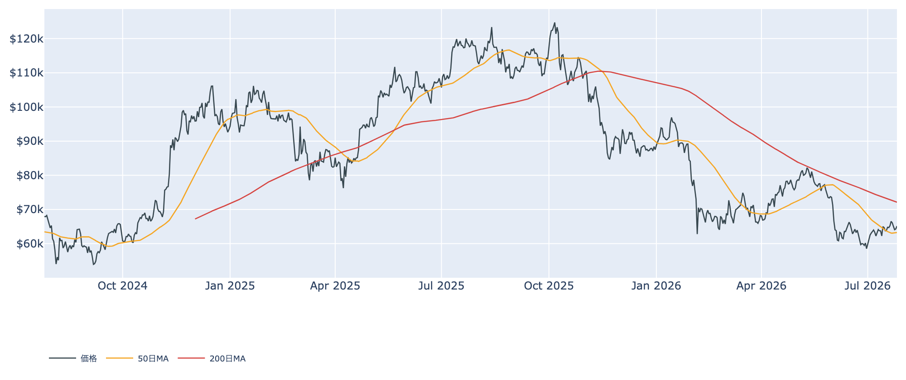
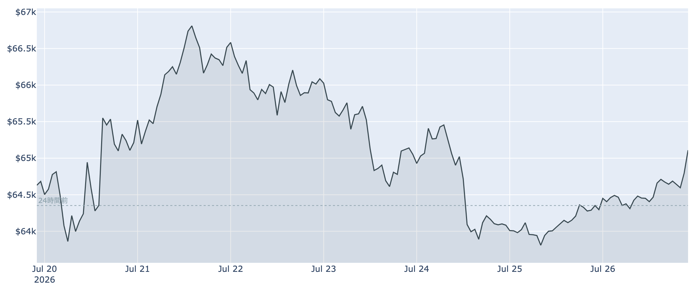
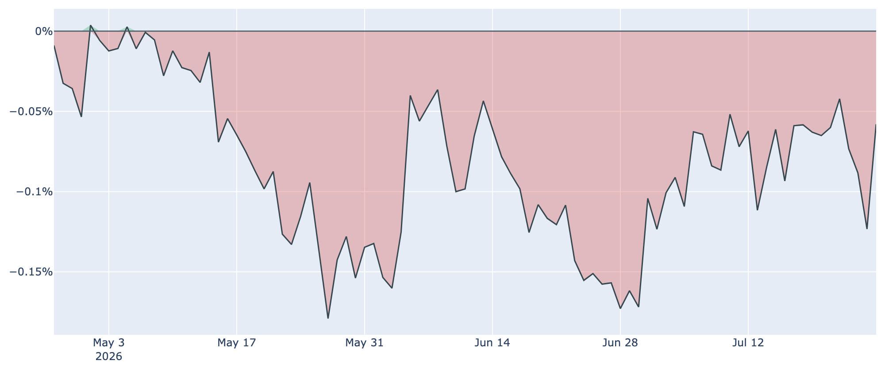
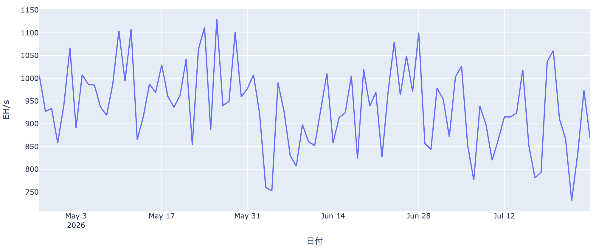

# FOMCを前に$65,000台を回復 ― 長期勢に久々の利益確定、それでも崩れない下値

**2026年7月27日**

週末の薄い商いのなかでビットコインは下げ止まり、$65,000台まで戻しました。今週は7月28〜29日のFRB会合という大きな関門が控えています。オンチェーン・オフチェーンの指標とマクロ環境から、いまの相場の位置を整理します。

（本稿は7月27日7時30分（日本時間）に取得した各種データに基づいています。価格・取引所プレミアムはこの時刻時点の実勢値、市場心理指数は7月26日まで、オンチェーン指標は7月25日時点、ETF資金フローは7月24日時点の数値です。）

## 1. 全体像：材料待ちの小康、視線はFRBへ

- **価格の位置**: 7月27日7時30分時点で約$65,200。24時間前より約1.3%高く、1週間前とはほぼ変わらず（約+0.7%）、1か月前と比べると約9%高い水準です。この1週間は$63,600〜$66,900のレンジで往復しており、方向感は出ていません。
- **中期のトレンド**: 50日移動平均（約$63,300）は上回っているものの、200日移動平均（約$72,100）ははるか下。中期は依然として弱い地合い（デッドクロス圏）のままで、いまの戻りは「弱い流れのなかの反発」の域を出ていません。

- **市場心理**: 恐怖・強欲指数は26（「恐怖」）。1週間前の28からわずかに悪化しましたが、1か月前の13という極度の恐怖からは明確に持ち直しています。悲観が薄まりつつも、まだ楽観にはほど遠い、という中途半端な位置です。
- **マクロ**: 最大の焦点は7月28〜29日のFRB会合です。市場は据え置きを本命視（6割強）していますが、3割前後は利上げを見込むタカ派寄りの構えです。原油が$100台へ戻してインフレ期待が再び上を向いており、リスク資産全体が身構えている状況です。同じ週にはハイテク大手の決算も集中しており、株式市場のムードもビットコインに波及しやすい局面です。

## 2. 注目すべきポイント

### ① 週末の下値を守った ― $65,000回復

- 先週後半は$64,000台前半まで押されましたが、そこから切り返して$65,000台を回復しました。市場では「週末を$65,000より上で終えられるかどうか」が短期の分かれ目と見られており、ひとまず買い方が守った形です。
- ただし、戻したのは薄商いの週末です。本当の答えが出るのは、機関投資家の資金が動く平日の取引が戻ってからになります。

### ② 長期保有層に久々の「利益確定」

- 長期保有者（155日以上の保有）の売却行動を示す指標が、7月25日時点で約2.0まで跳ね上がりました。1週間前は約0.7（損切り優勢）でしたから、含み益の乗った古いコインがまとまって動いたことになります。長く持っていた層が、この戻り局面で一部を利益確定した形です。
- もっとも、この指標は1日単位で大きくぶれます。より落ち着いて見るべきは保有量の増減で、長期層の過去30日の純増は7月25日時点で約+18.9万BTCと、依然プラス圏（＝買い越し）です。ただし1週間前の約+20.0万BTC、1か月前の約+38.8万BTCと比べると、積み増しのペースは明らかに鈍っています。
- **読み方**: 「長期勢の静かな買い集めが下値を支える」という構図はまだ生きていますが、その勢いは春先ほどではありません。下支えは効くが、押し上げる力にはなりにくい段階です。

### ③ ETFは2日続けて流出、それでも週単位ではプラス

- 米国のビットコイン現物ETFは7月23日・24日と2営業日続けて資金が出ていきました（24日は約2億4000万ドルの流出）。うち大半はブラックロックのIBITからの解約です。
- 一方で、直近7営業日を合計すると約+2億4500万ドルの流入超。7月20〜22日に入った資金が、後半の流出を打ち消している格好です。「大きな流れとしては戻りつつあるが、日々の振れは大きい」というのが7月24日時点の姿です。

### ④ 米国勢の弱さは変わらず、ただしマイナス幅は縮小

- 米国の需要の強弱を映す取引所プレミアム（Coinbase と Binance の価格差）は、7月26日時点で約-0.06%。マイナス圏＝米国勢が相対的に買っていない状態が、これで82日連続となりました。
- ただしマイナス幅は着実に浅くなっています（1か月前は約-0.16%）。米国需要が積極的な買いに転じたわけではないものの、「売り急ぐ側」でもなくなってきた、という程度の改善です。

### ⑤ マイナーの採算は低位、ただし採掘競争は戻りつつある

- ネットワークの計算能力（ハッシュレート）は約869EH/sで、1か月前より約17%低い水準です。電気代に見合わなくなった採掘業者の脱落（淘汰）が続いてきた結果です。
- 一方、次回の採掘難易度の調整は**プラス約2.7%**が見込まれています。難易度が上向くのは、離脱していたマシンが戻ってきている（＝採算がいくぶん改善した）サインです。マイナーの収益水準を示す指標も、歴史的には低い圏内ながら底ばいで推移しています。
- **読み方**: マイナーによる「持ち分の投げ売り」圧力が急拡大する局面ではなさそうです。

（補足：先物市場では、強気側が費用を払い続ける状態が約4日連続で続き、未決済の建玉も1週間で約6%増えました。レバレッジをかけた買いが積み上がっている状態で、急落時には清算の連鎖で下げが加速しやすい点には注意が要ります。）

## 3. 相場転換を見極める3つの分岐点

1. **FRB会合（7月28〜29日）の中身**: 据え置きが本命とはいえ、原油高でインフレ再燃の懸念が出ています。声明や会見が「年内の利上げ」に踏み込む調子だと、リスク資産全体が押されやすくなります。逆に想定よりハト派なら、いまの戻りに勢いが付く余地があります。
2. **平日のETF資金が戻るか**: 週末の反発が本物かどうかは、週明けのETFフローが答えを出します。7月20〜22日のような流入が再び並べば底入れの説得力が増し、23〜24日の流出が続くようなら7月の戻りは「失敗した底打ち」に終わりかねません。
3. **約$68,100（短期保有者の平均取得単価）を超えられるか**: 直近で買った人たちの平均コストがこの水準で、現在値は約4%下にあります。ここを明確に超えて定着すれば、いまの「戻ったら売りたい」圧力が「押したら買いたい」支えへ変わる転換点になります。7月の高値$66,900でも届いていません。

## 総括

歴史的な割安圏という土台と、長期保有層の買い越しという下支えは維持されています。ただしその積み増しペースは鈍り、長期勢の一部は戻り局面で利益確定に動きました。米国需要は最悪期を脱しつつあるものの本格回復とは言えず、ETF資金も日ごとに出入りを繰り返しています。結論としては、**下値は堅いが上値も重い小康状態**であり、その均衡を今週のFRB会合が揺らすかどうか、という局面です。

---

*本稿は情報提供を目的としたものであり、投資助言ではありません。将来の価格動向を保証・示唆するものではなく、投資判断は各自の責任において行ってください。*
