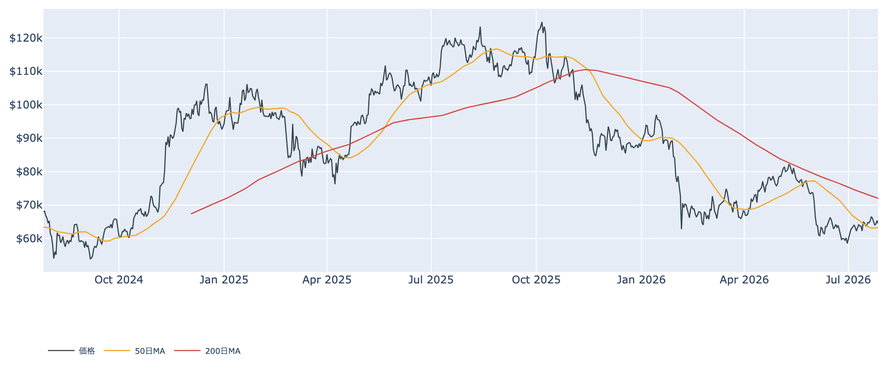
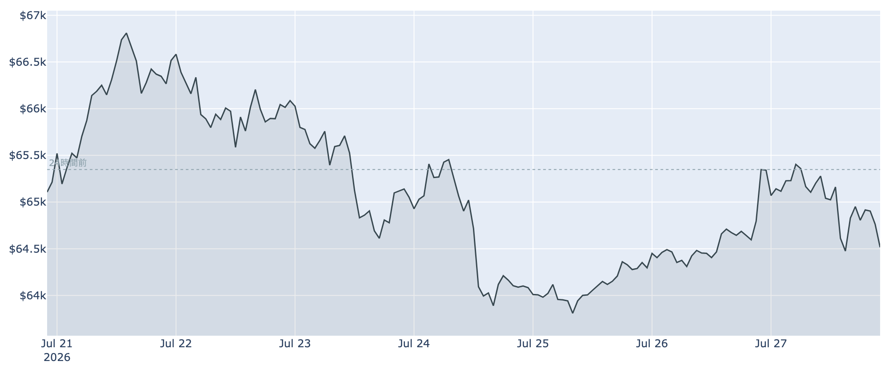
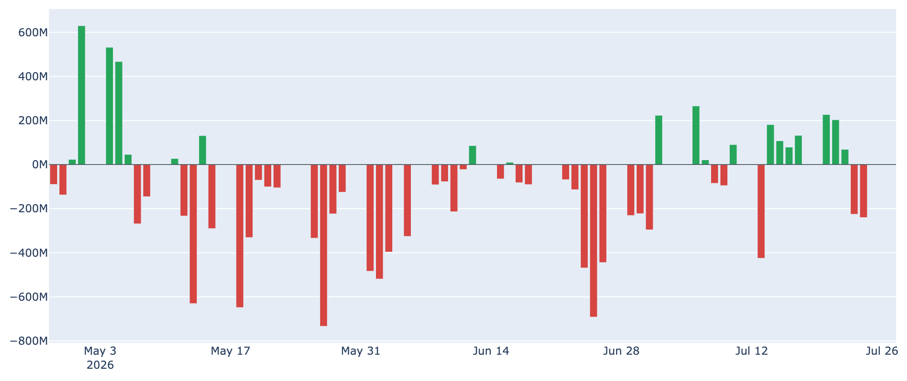
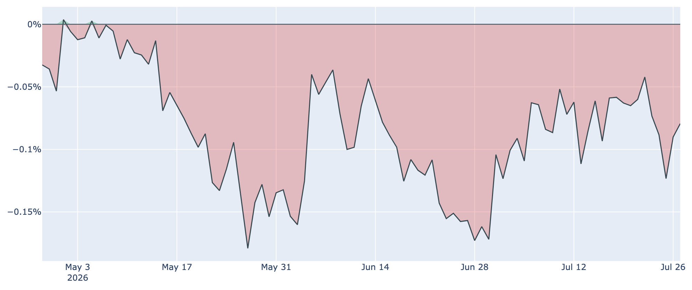
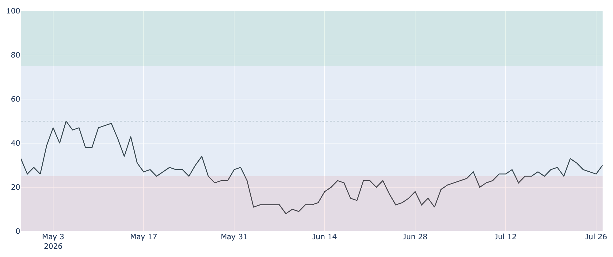

# 利上げ観測が重石、$64,500へ押し戻し ― 強気を保つ先物、細る長期勢の買い集め

**2026年7月28日**

米連邦公開市場委員会（FOMC）の会合初日を迎え、ビットコインは前日に回復した$65,000台から再び押し戻されました。7月28日7時30分時点で約6万4500ドル、24時間前と比べて約1.3%安です。ただ下値は崩れておらず、相場は「金利の答え合わせ待ち」で足を止めた格好です。

本稿は2026年7月28日7時30分（日本時間）に取得した各種データに基づきます。価格と取引所プレミアムは同時刻の実勢値、Fear & Greed 指数は7月27日、ETF資金フローは7月27日、オンチェーン指標は7月26日時点の数値です。

## 1. 全体像：上も下も動けない「FOMC待ち」

市場のエネルギーは、今週の金融政策に吸い取られています。会合の結果が出るのは日本時間30日未明。市場は据え置きをほぼ織り込む一方、**9月の利上げ**を8割方見込むタカ派寄りの構えで、リスク資産全体が身動きを取りにくい状況です（6月の米消費者物価は前年比3.5%と5月の4.2%から鈍化したものの、エネルギー高を背景に再加速を警戒する声が残ります）。

その中でビットコインは、7日間で見れば約1%安とほぼ横ばい、30日前と比べれば約8%高。6月の急落からの戻り相場は生きているが、勢いは失速している――という位置づけです。

## 2. 注目すべきポイント

### ① 50日線の上は死守、しかし200日線ははるか遠い

* 現在値（約6万4500ドル）は50日移動平均（約6万3300ドル）を2%ほど上回っており、7月中旬に奪還した短期の支持線は保たれています。
* 一方で200日移動平均は約7万2000ドル。中長期のトレンド判定は依然「デッドクロス圏（弱い地合い）」のままで、ここ1週間の値動きは6万3600〜6万6900ドルの狭いレンジに収まっています。

### ② ETFは「週で見れば流入、日で見れば腰が引けている」

* 米国のスポットETFは7月23日・24日に2日続けて流出し、合計で約4.7億ドルが抜けました。金利警戒と米ハイテク株の調整が重なった局面です。
* それでも直近7営業日の合計は約+1.7億ドルとかろうじてプラス圏。週単位では3週連続の流入となり、5〜6月の大量流出からの「修復期」は続いています。ただし2026年通年ではなお流出超で、機関投資家の姿勢は慎重なままです。

### ③ 米国勢の需要は83日連続で弱いまま

* CoinbaseとBinanceの価格差で米国の買い意欲を測る取引所プレミアムは、7月27日時点で約-0.08%。マイナス圏が**83日連続**と、記録的な長さになりました。
* もっとも、マイナス幅そのものは30日前（約-0.16%）から半分程度に縮んでいます。「米国勢が買い上がってはいないが、投げてもいない」という距離感です。

### ④ 先物だけは強気に傾いたまま

* 無期限先物の資金調達率は8時間あたり+0.0076%（年率換算で約+8%）と、14回連続でプラス。ロング（買い持ち）側が手数料を払ってでもポジションを維持している状態です。
* 建玉も7日で約2%増え、約10.5万BTC（約68億ドル）。現物のETFが腰の引けた動きをする裏で、レバレッジを使う層は上方向に賭けています。**ここが偏りすぎると、下振れ時の投げ（清算）が値動きを増幅させる**点は頭に置いておきたいところです。

### ⑤ 長期勢の買い集めはペースが半減

* 長期保有層（155日以上の保有）の過去30日の保有量変化は、7月26日時点で+約18.6万BTC。プラス（蓄積）は続いていますが、1か月前の+約37.7万BTCから半分近くまで細っています。
* 7月25日には長期勢がまとまった利益確定に動いた形跡があり、翌26日には落ち着きました。「静かな備蓄」は止まってはいないものの、以前ほど強力な下支えではなくなりつつあります。

（補足：採掘の計算能力は30日で約5%減り、次回の難易度調整も約-3%の見込み。手数料も最低水準が続き、ネットワーク側は静かなままです。）

## 3. 相場転換を見極める3つの分岐点

1. **FOMCの一言（日本時間30日未明）**: 据え置き自体はほぼ織り込み済みで、焦点は「9月以降の利上げをどこまで示唆するか」。ここが和らげばリスク資産全体の空気が変わります。
2. **6万8100ドル（短期保有者の平均取得単価）を取り返せるか**: 直近で買った層は7月26日時点でまだ平均5%前後の含み損。この水準を回復すれば、戻り売り圧力が買い支えに変わる転換点になります。逆に50日線（約6万3300ドル）割れなら、7月の戻りは一巡と見るべき局面です。
3. **ETFの流入が日次でも定着するか**: 週次ではプラスでも、日々の動きは流入と流出が交互に出る不安定な状態。連続した流入が戻るかどうかが、米国需要の本格回復を測る物差しになります。

## 総括

センチメントは恐怖（Fear & Greed 指数30）にとどまるものの、6月の極度の恐怖（15前後）からは着実に改善しました。バリュエーション面では歴史的に見て割安な圏内が続き、下値は堅い。しかし米国の現物需要は83日連続で弱く、長期勢の買い集めも細り、上値を押し上げる力は見当たりません。**強気なのは先物だけ**という偏りを抱えたまま、市場は金利の答えを待っています。

---

*本稿は情報提供を目的としたものであり、投資助言ではありません。将来の価格動向を保証・示唆するものではなく、投資判断は各自の責任において行ってください。*
