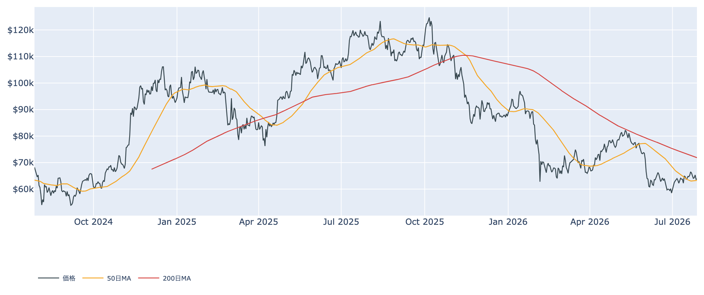
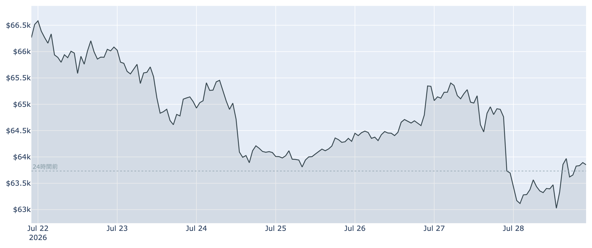
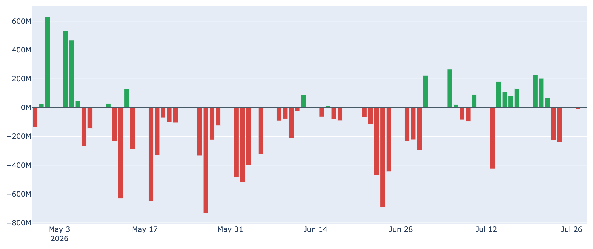
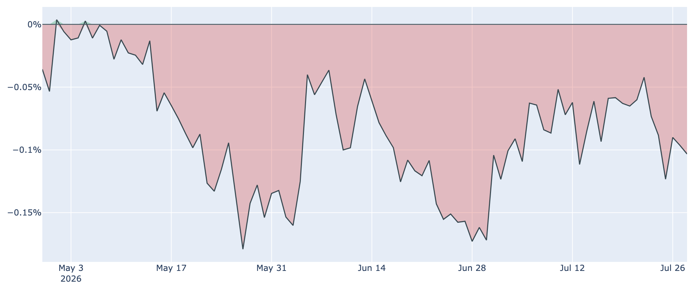
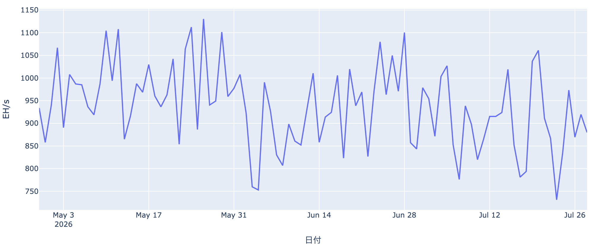

# 金利判断を待って$63,800で膠着 ― 週間4%安、それでも積み上がる先物の強気

**2026年7月29日**

7月29日7時30分（日本時間）時点のビットコインは約6万3800ドル。24時間ではほぼ横ばい（+0.1%）ですが、1週間では約4%下げ、7月21日に付けた6万6700ドル台から水準を切り下げたままです。米国の金融政策決定（FOMC）の結果がこの日の米国時間に出るため、市場は動くに動けない状態にあります。一方で先物には買い建てが積み上がり、現物の資金は止まったまま。この「静けさの中身」を整理します。

（価格・ネットワーク状況は7月29日7時30分時点の実勢値、市場心理とETF資金フローは7月28日、オンチェーン指標は7月27日時点のデータに基づいています。）

## 1. 全体像：様子見の膠着、下では50日線がぎりぎり効いている

先週の戻りを吐き出したあと、値動きは狭い範囲に収まっています。直近1週間の値幅は約6万2600〜6万6700ドル。現在値は50日移動平均（約6万3300ドル）をわずかに上回る位置で、ここが当面の踏ん張りどころになっています。200日移動平均（約7万1900ドル）は依然はるか上で、中期の地合いは弱いまま（デッドクロス圏）です。

背景にあるのは米国の金融政策です。政策金利は3.50〜3.75%に据え置かれる見方が優勢ですが、利上げの確率が1週間前の2割台から3割台へ切り上がり、9月の利上げ観測はさらに高い水準にあります。「据え置きでも、その先はタカ派」という見立てが、リスク資産全体の上値を抑えています。市場心理を示すFear & Greed指数は7月28日時点で29（恐怖）と、1か月前の18からは持ち直しましたが、まだ楽観には遠い水準です。

## 2. 注目すべきポイント

### ① 短期勢は含み損、長期勢の買い集めは急速に細っている

* **短期保有者の平均取得単価**は7月27日時点で約6万7600ドル。現在値はこれを下回っており、直近半年以内に買った層は平均して約6%の含み損を抱えています。戻り局面で「やれやれ売り」が出やすい構図は変わっていません。
* **長期保有層の買い集めは失速**しています。過去30日の保有量の純増は7月27日時点で約13万BTC。1か月前の約36万BTCから3分の1近くまで縮みました。加えて長期勢の売却は取得単価を下回る水準で行われており（LTH-SOPRが1を大きく割る0.86）、「安値でも手放す古参」がじわりと出ていることを示します。下値を支えてきた最大の勢力が、静かに手を緩めつつあります。
* もっとも、割高・割安の目安となるMVRV Z-Scoreは7月27日時点で0.43と、歴史的には依然として割安圏にあります。

### ② 先物には強気が積み上がっている（値下がりしたのに）

* 無期限先物の**資金調達率は17回連続でプラス**（年率換算で約+11%）。買い持ちの側が手数料を払い続けている＝強気に傾いた状態です。
* **建玉（未決済の契約量）は1週間で約4%増**の約10万4000BTC（約67億ドル）。価格は週間で4%下げたのに、先物の買い建ては減るどころか増えました。
* これは「押し目買い」の裏返しでもありますが、同時に**巻き戻しの燃料**でもあります。金利判断をきっかけに下方向へ振れれば、積み上がった買い建ての強制的な手じまいが下げを加速させかねません。

### ③ 現物ETFの資金は「止まっている」

* 7月28日の米国スポットETFの純流出入は約+5百万ドル、直近7営業日の合計でも約+27百万ドルと、実質的にゼロ近辺です。7月23〜24日の2億ドル規模の流出のあと、出も入りもしない状態が続いています。
* 機関マネーが決定を見送っている典型的な形で、上にも下にも力がかかっていません。

### ④ 米国勢の需要は再びじわりと後退

* 米国の買い意欲を測るCoinbase Premiumは7月28日時点で約-0.10%。**84日連続のマイナス圏**です。
* 注目したいのは方向で、1週間前の約-0.06%から再び幅が広がりました。7月中旬にいったん縮んだ米国勢のディスカウントが、また開き始めています。米国での暗号資産の法制化（市場構造法案）が上院で先送りされ、年内成立の見通しが後退したことも、この重さと無縁ではないでしょう。

### ⑤ マイナーの撤退が続いている

* ネットワーク全体の計算力（ハッシュレート）は約880 EH/s。**30日で約20%も落ちました**。採算の合わない採掘業者が次々に機械を止めている、はっきりとした淘汰の局面です。
* 次回の難易度調整も約-3.8%の下げが見込まれています。短期的にはマイナーの持ちBTC売却が売り圧力になりますが、難易度が下がれば生き残った側の採算は改善し、中長期では供給圧力が和らぐ方向に働きます。マイナー収益の水準を示すPuell Multipleは0.72と、7月27日時点でも低位のままです。

## 3. 相場転換を見極める3つの分岐点

1. **金利判断とその言い回し**：据え置きが優勢とはいえ、利上げ確率が3割台まで上がっている以上、サプライズの余地は残ります。据え置きでも声明が引き締め寄りなら、9月の利上げ観測が強まって上値はさらに重くなります。
2. **先物の買い建てが解消されるか**：価格が下げても増え続けた買い建てが、どこかで一斉に手じまわれると急落の引き金になります。直近1週間の下限である6万2600ドル台を割るかどうかが、その分かれ目です。
3. **現物の資金が戻るか**：ETFへの流入が再開し、Coinbase Premiumのマイナス幅が縮み始めれば、米国需要の底入れとして意味を持ちます。上値の目安は短期保有者の取得単価である約6万7600ドル。ここを回復して定着すれば、これまでの売り圧力が買い支えに変わります。

## 総括

歴史的な割安感は残っているものの、下値を支えてきた長期勢の買い集めは細り、現物の資金は止まり、米国勢の需要も再び後退気味です。その空白を埋めているのが先物のレバレッジという状態で、地合いとしては決して健全ではありません。金融政策の判断がこの膠着を解く鍵になりますが、方向は上にも下にも開いています。当面は6万2600〜6万6700ドルのレンジと、その内側にある50日移動平均の攻防を見ておくのがよさそうです。

---

*本稿は情報提供を目的としたものであり、投資助言ではありません。将来の価格動向を保証・示唆するものではなく、投資判断は各自の責任において行ってください。*
