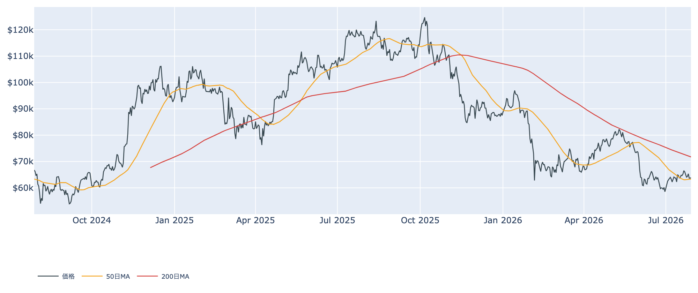
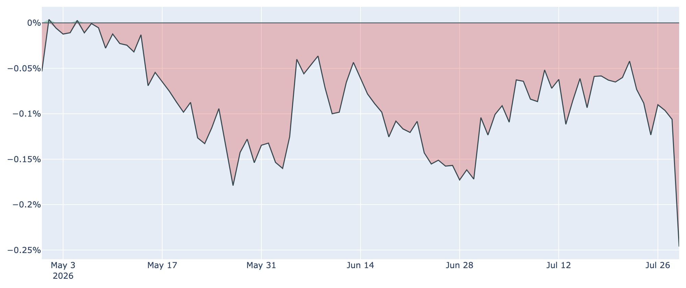
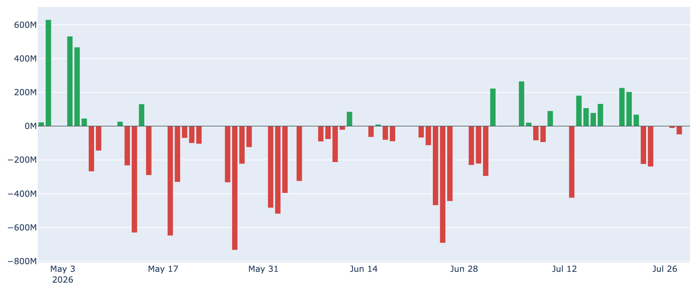
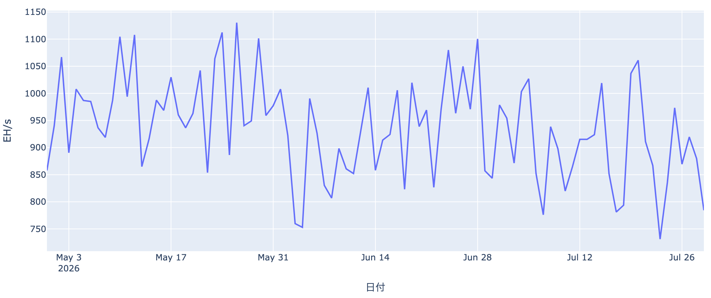

# 6万3000ドル台で足踏み ― 米国勢の腰折れとタカ派寄りFRBが重し

**2026年7月30日**

ビットコインは7月半ばに6万6000ドル台まで戻す場面がありましたが、その後は上値を切り下げて6万3000ドル台まで押し戻されています。オンチェーンの指標で見ると価格自体は依然「歴史的に見て割安な水準」にありますが、米国勢の買い需要を示す指標が軒並み弱含み、需給の綱引きは再び売り方優位に傾きつつあります。

（本稿の価格・ネットワーク関連の数値は2026年7月30日7時(JST)時点のスナップショット、Fear&Greed指数とETF資金フローは7月29日時点、オンチェーン指標は7月28日時点のデータに基づいています。）

## 1. 現在の市場の全体像：米国勢が腰折れし、需給は再び売り方優位に

7月21日に6万6500ドル台まで戻したビットコインは、そこから約1週間かけてじわじわと値を下げ、7月30日7時時点では約6万3785ドルまで低下しています（7日前比 -3.48%、24時間では-0.15%とほぼ横ばい）。現在値は50日移動平均（約6万3325ドル）はわずかに上回っているものの、200日移動平均（約7万1728ドル）を大きく下回る「デッドクロス圏」が続いており、中期のトレンドは依然弱含みです。

価格が過去4年のレンジで見て下位15%程度の割安圏にあること自体は変わりませんが、後述するとおり米国発の買い需要を示す指標が軒並み悪化しており、割安感だけでは上値が重い状況を跳ね返せていません。市場心理を示すFear & Greed指数も29（恐怖）と、1週間前の33からやや悪化しています（1か月前の12=極度の恐怖からは脱していますが、強気に転じたとは言えない水準です）。

## 2. 注目すべきポイント

### ① 米国勢の買い需要が再び後退

* **Coinbase Premium（米国需要の目安）**: 直近値は約-0.25%と、1週間前（-0.04%）から急速に悪化し、過去1年弱のレンジでも最低水準に沈みました。マイナス圏（米国需要が相対的に弱い状態）は85日連続と長期化しています。
* **ETF資金フロー**: 米国スポットETF全体は直近7営業日合計で約2.5億ドルの流出超。7月下旬は一時プラス転換する場面もありましたが、勢いは続いていません。

### ② 短期保有者は含み損、SOPRも「1割れ」に

* **短期保有者のコストベース**: 保有期間155日未満の投資家の平均取得単価は約6万8059ドル。現在値（約6万3785ドル）はこれを下回っており、直近で買った層は平均で約6%の含み損を抱えています。
* **SOPR**: 利益状態を示すこの指標は全体・短期勢とも1週間前は1をわずかに上回っていましたが、直近は0.997前後まで低下し「1割れ」に。戻り売りから損切りへ、売り方の姿勢が強まったことを示しています。

### ③ 長期保有層の「静かな備蓄」は継続もペースは鈍化

* **長期保有層の30日純増**: 直近約16.4万BTCの積み増しで、依然プラス圏（蓄積継続）ではあるものの、1か月前（約37.8万BTC）と比べるとペースは半分以下に減速しています。
* **長期保有者のSOPR**: 0.98台まで上昇しており（1か月前は0.79）、長期勢の一部が少しずつ利益確定に動き始めた可能性もうかがえます。

### ④ 先物市場だけは強気姿勢を維持、現物との温度差

* **資金調達率**: 年率換算で約+8%のプラスが20回（約6.7日）連続。無期限先物ではロング側がプレミアムを払い続けており、レバレッジ勢の強気な傾きは崩れていません。
* **建玉（OI）**: 約10.3万BTC（約66億ドル）で、7日間の変化はほぼ横ばい（-1.0%）。現物・ETFで見える米国勢の弱気とは対照的な構図です。

### ⑤ マイナーの淘汰が続き、ネットワークは閑散

* **ハッシュレート**: 784.3 EH/sで30日変化率は-8.5%。採算悪化に伴う稼働停止（淘汰）が続いています。
* **難易度調整**: 次回調整も-5.76%の下方修正が見込まれており、マイナー収益性の低さを示すPuell Multiple（0.65）も過去4年で下位14%程度の低水準です。
* 手数料市場は最低水準の1sat/vB近辺で推移しており、オンチェーンの投機的な動きも乏しい状況です。

## 3. 相場転換を見極めるための「3つの分岐点」

1. **米国需要（Coinbase Premium・ETFフロー）が底を打つか**: 両指標とも直近1週間で悪化しており、この反転が最初のシグナルになりそうです。
2. **価格が短期保有者のコスト（約6.8万ドル）を回復できるか**: この水準を上回れば含み損が解消され、売り圧力が和らぐ転換点になります。
3. **FRBの姿勢と中東情勢**: 7月29日のFOMCは政策金利を3.50〜3.75%で5会合連続据え置きとしましたが、9対3の分かれた採決で3人の当局者が利上げを主張するなど、タカ派寄りの空気が強まっています。加えて中東情勢の緊張も株式・仮想通貨双方のリスク回避を誘発しやすく、当面はこの2つが相場の重しとして意識されそうです。

## 総括

ビットコインはオンチェーンの割安感（バリュエーション指標の低さ）という下支えを保ちながらも、米国発の買い需要（Coinbase Premium・ETFフロー）が1週間で目に見えて弱まり、短期保有者の含み損とSOPRの悪化も相まって、上値の重い展開に押し戻されています。長期保有者の蓄積自体は続いているもののペースは鈍化しており、無条件の楽観はできません。一方で先物市場は強気姿勢を崩しておらず、現物とデリバティブの間には温度差が生じています。タカ派寄りのFRBと中東情勢という外部要因も重なり、当面は「底堅いが上値の重いレンジ相場」が続くと見られます。

---

*本稿は情報提供を目的としたものであり、投資助言ではありません。将来の価格動向を保証・示唆するものではなく、投資判断は各自の責任において行ってください。*
