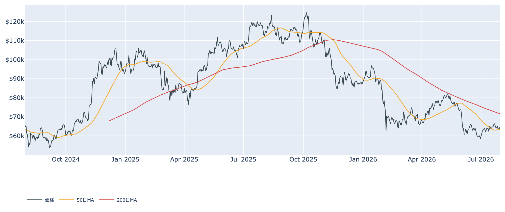
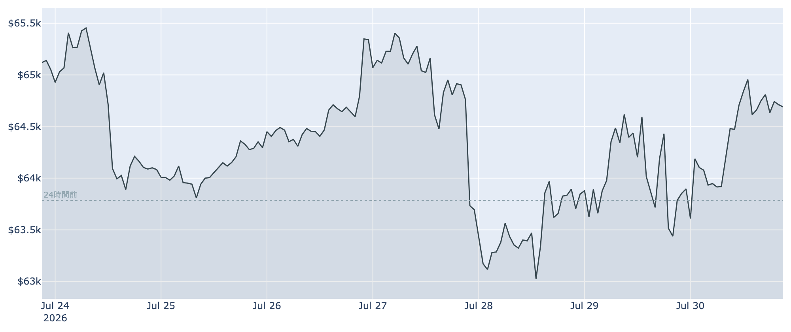
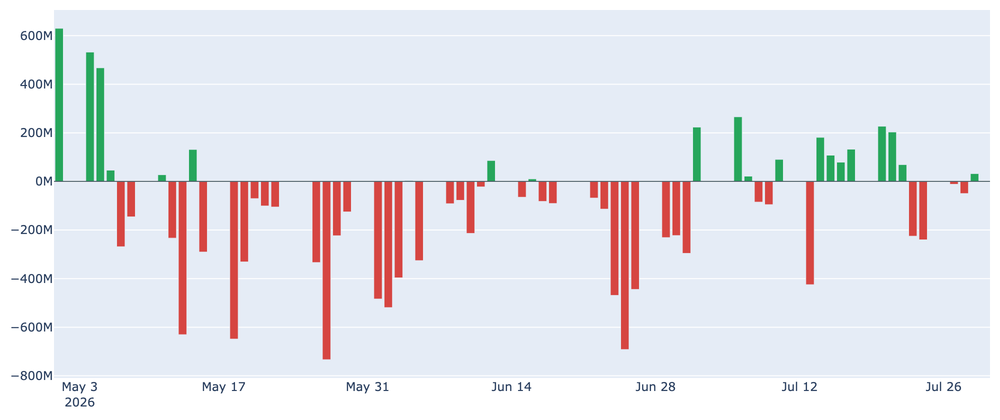
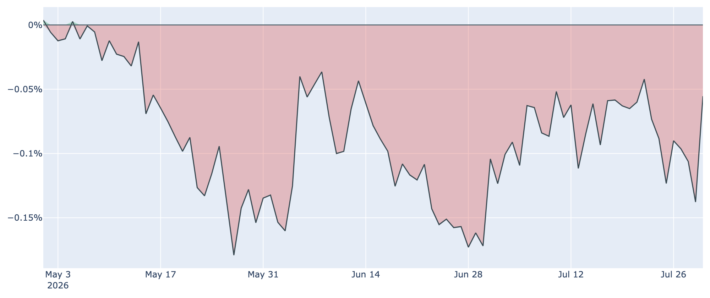

# 原油高と株安のなかで$64,700を維持 ― 通過したFOMC、なお動かない米国マネー

**2026年7月31日**

（本稿は2026年7月31日 7時00分(JST)時点の各種データに基づきます。価格・ネットワーク状況はこの時刻の実勢値、市場心理は7月30日、取引所プレミアムと米国ETFの資金フローは7月30日、オンチェーン指標は7月29日時点のものです。）

7月29日のFRB会合を通過し、市場は最大の関門を越えました。その直後の30日は中東情勢の緊迫で原油が急騰し、米国株が大きく崩れましたが、ビットコインはほとんど揺れませんでした。7月31日7時ちょうど時点の価格は約6万4700ドル（24時間で約+1.4%）。株の下げに引きずられない「相対的な底堅さ」が今回の特徴です。

## 1. 全体像：材料は通過、しかし資金は戻っていない

- **金利の霧は晴れた（ただし完全ではない）**: FRBは7月29日、政策金利を3.50〜3.75%に据え置きました。6会合連続の据え置きですが、採決は9対3で、3人の委員が「0.25%の利上げ」を主張しての反対でした。つまり「利下げ待ち」ではなく「利上げ再開の芽が残る据え置き」です。
- **リスク資産のなかで独り歩き**: 7月30日、イランによる弾道ミサイル発射を受けて原油は1日で約8%高・1バレル90ドル台へ戻し、ダウは約2.2%安、ナスダックは3か月ぶりの安値をつけました。この日ビットコインは6万4000ドル近辺でほぼ横ばい。悪材料に対する反応の鈍さは、下値で拾う手が途切れていないことの裏返しです。
- **ただし相場は動いていない**: 直近7日間のレンジは約6万2600〜6万5800ドルで、1週間前と比べれば約0.6%安。30日前比では約+10.5%と持ち直したものの、7月後半はほぼ横ばいの膠着です。市場心理を示すFear & Greed指数も28（「恐怖」）で、1週間前の31からわずかに悪化しています。
- **中期のトレンドは依然として弱い**: 現在値は50日移動平均（約6万3400ドル）をわずかに上回る一方、200日移動平均（約7万1600ドル）は大きく下。中長期では「デッドクロス圏（弱い地合い）」のままです。

## 2. 注目すべきポイント

### ① 悪材料に反応しなかった1日

- 会合の結果が出た29日から30日にかけて、価格は6万3500〜6万5100ドルの狭い幅で推移しました。株と原油が大きく動いた日に、ビットコインだけが動かなかった格好です。
- 材料出尽くしで下げるでもなく、安心感で買われるでもない。「売る人も買う人も出てこない」という、様子見の極みのような値動きでした。

### ② 先物では強気が積み上がったまま

- 無期限先物で強気側（買い持ち）が弱気側へ払う手数料（資金調達率）は、8時間ごとの集計で23回連続のプラス（約7.7日連続）。年率に直すと約+7.6%で、買い持ちがコストを払ってでもポジションを維持しています。
- 未決済の建玉も直近7日で約+2.1%と増加。**価格が動かないまま買い持ちだけが積み上がっている**状態で、上に抜ければ加速しやすい半面、下に振れたときの投げ（清算）も出やすい構図です。

### ③ ETFの資金は止まったまま

- 7月30日時点で、米国の現物ビットコインETFの日次資金は差し引きほぼゼロ。直近7営業日の合計では約4億2500万ドルの流出超で、7月中旬に見られた連続流入は途切れたままです。
- 7月23日・24日の2日間で計約4億6500万ドルが流出し、その大半が最大手のIBIT（ブラックロック）でした。以降は小幅な出入りに終始しており、機関投資家は「買い増しも投げ売りもしない」構えです。

### ④ 米国需要のディスカウントは長期化、それでも底は打ちつつある

- 米国勢の買い意欲を映す取引所プレミアム（Coinbase価格とBinance価格の差）は7月30日時点で約-0.06%。マイナス圏、つまり米国の需要が相対的に弱い状態が**86日連続**という長さになっています。
- ただし、そのマイナス幅は30日前の約-0.17%から着実に縮小しており、悪化の一途ではありません。「米国勢が戻ってきた」とまでは言えませんが、最悪期は過ぎたと見てよさそうです。

### ⑤ 短期勢は約5%の含み損、長期勢の買い集めは細っている

- 7月29日時点で、直近に買った層（短期保有者）の平均取得単価は約6万8100ドル。現在値はこれを下回っており、平均して約5%の含み損を抱えています。この価格帯は戻り売りの壁として意識されやすい水準です。
- 長期保有層（155日以上の保有）が過去30日で積み増した量は約+18.5万BTCと、依然プラス（買い越し）ですが、30日前の約+35.8万BTCからは半減しています。下値を支える力は残るものの、勢いは明らかに落ちています。
- バリュエーション指標（MVRV Z-Score）は約0.38で、過去4年で見ればなお割安圏。ただし1週間前の0.47からはやや低下しました。

## 3. 相場転換を見極める3つの分岐点

1. **9月に向けた利上げ観測**: 今回の据え置きは「タカ派的な据え置き」と受け止められ、市場では9月会合での利上げ観測が再燃しています。中東発の原油高がインフレを押し上げれば、この観測はさらに強まります。金利の再上昇は、リスク資産全体にとって最も分かりやすい逆風です。
2. **ETFへの資金が流入超へ戻るか**: 単発の買い戻しではなく、週を通した明確な純流入が続くかどうか。現状は「出入りが止まった」段階であり、ここが動かない限り上値追いの燃料は不足したままです。
3. **短期勢の原価（約6万8100ドル）を回復できるか**: この水準を明確に超えて定着すれば、直近参入層の含み損が解消し、これまでの売り圧力が買い支えへ転じます。その先には200日移動平均（約7万1600ドル）が控えており、中期トレンドの転換にはそこまでの回復が必要です。

## 総括

最大の不確実性だったFRBの判断は通過し、株と原油が荒れた日にもビットコインは崩れませんでした。下値の堅さは本物です。一方で、上へ押し上げる力は見当たりません。ETFの資金は止まり、米国勢の需要は弱いまま、長期勢の買い集めも細ってきています。動いているのは先物の買い持ちだけ——実需ではなくレバレッジが積み上がった状態です。当面は「材料待ちの膠着」が続き、9月の金利観測が次の方向を決める公算が大きいと考えられます。

---

*本稿は情報提供を目的としたものであり、投資助言ではありません。将来の価格動向を保証・示唆するものではなく、投資判断は各自の責任において行ってください。*
