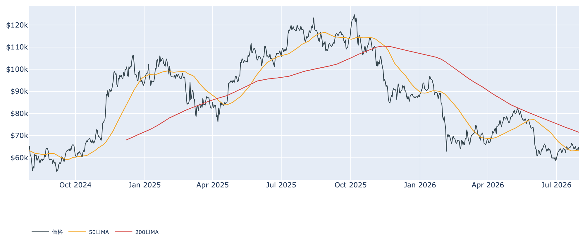
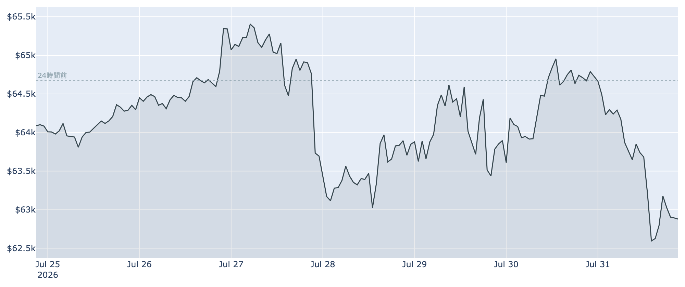
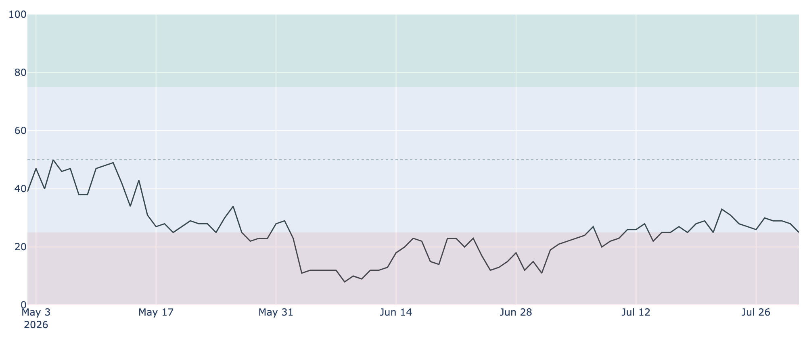
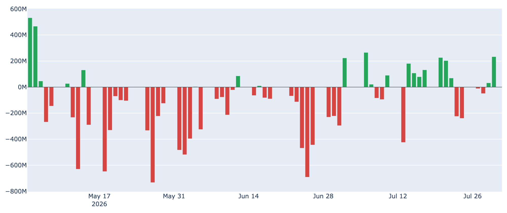

# 月末最終日に3%安、$62,900へ ― 7月を上昇で終えても、割れてしまった50日線

**2026年8月1日**

ビットコインは7月最終日に約3%下げ、8月1日7時00分時点で約6万2900ドルまで水準を切り下げました。1か月前と比べればまだ約5%高く、7月自体は上昇で終えています。それでも最後の1日で50日移動平均を割り込み、市場心理は再び「極度の恐怖」へ戻りました。上がりきらないまま月をまたいだ相場を、オンチェーン・オフチェーンの指標とマクロ環境から整理します。

（本稿の数値は2026年8月1日7時00分（日本時間）に取得したデータに基づきます。価格・取引所プレミアム・ネットワーク状況はこの時刻時点、Fear & Greed指数とETF資金フローは7月31日まで、オンチェーン指標は7月30日時点の値です。）

## 1. 全体像：月間ではプラス、しかし終わり方が悪い

7月のビットコインは、利上げ観測の再燃・債券利回りの上昇・AI関連株の急落という逆風のなかでも月間ではプラスを確保しました。ところが最終日に流れが変わります。

* **崩れた最後の1日**：24時間で約2.8%の下落。直近24時間のレンジは約6万2400〜6万5400ドルで、安値圏に張り付いたまま週末に入りました。米国の大手取引所の決算が市場予想に届かなかったこと、中東情勢をめぐる報道が一進一退だったことが、暗号資産のリスク回避を強めています。
* **下値を支えるもの**：オンチェーンで見た割安感は健在です。市場価格と保有者の平均取得単価の乖離を測る指標（MVRV Z-Score）は過去4年で下位2割の水準にとどまり、長期保有層は依然として買い越しです。
* **上値を抑えるもの**：米国発の資金（ETF・機関投資家）が7月後半に息切れし、FRBのタカ派姿勢が金利面から重石になっています。

現在の水準（約6万2900ドル）は、50日移動平均（約6万3400ドル）も200日移動平均（約7万1500ドル）も下回りました。7月後半は50日線の上で持ちこたえていただけに、ここを割ったことは地合いの弱さを示しています。

## 2. 注目すべきポイント

### ① 直近1週間の戻りをすべて吐き出した

* **7日ベースでマイナスに**：1週間前と比べて約1.9%安。7月下旬は6万5000ドル台をうかがう場面もありましたが、月末の下げでその戻り分は消えました。
* **直近の確定した日足終値**は7月30日（協定世界時）で約6万4700ドル。そこから1日で2000ドル近く水準が下がった計算になります。

### ② 市場心理は再び「極度の恐怖」へ

* **Fear & Greed指数は25**（7月31日）で、「極度の恐怖」圏に逆戻りしました。1週間前の28からじりじり低下しています。
* **ただし6月の底とは別物**：30日前は11という極端な数字でした。そこからは明確に改善しており、パニックというより「疑心暗鬼が続いている」状態と読むのが妥当です。

### ③ ETFの資金は7月後半に息切れ

* **直近7営業日の合計は約2.6億ドルの流出超**。7月30日には約2.3億ドルの流入があったものの、月末営業日はほぼ差し引きゼロで、流入の勢いは続きませんでした。
* **米国需要そのものは底寄り**：米国勢の買い意欲を映す取引所プレミアムは7月31日時点で約-0.06%。87日連続でマイナス圏という長さではあるものの、マイナス幅は30日前の約-0.10%から縮小しています。「積極的には買わないが、売り急いでもいない」という温度感です。

### ④ 先物のロングは投げ切られていない

* **資金調達率はプラスが26回連続**（8時間ごとの計算で約8.7日）。年率に直すと約+6.5%で、強気に傾いたポジションを持つ側が手数料を払い続けています。
* **建玉は7日で約2%増**（約10.9万BTC、金額にして約69億ドル）。価格が下げても未決済のロングが減っていないということは、下値で投げが出る余地が残っているという意味でもあります。8月に入って一段安となる場合、この滞留したポジションが下げを速める材料になり得ます。

### ⑤ 長期勢の買い集めはペースダウン、それでも割安圏

* **長期保有層（155日以上保有）の30日間の保有量変化は+約16.7万BTC**（7月30日時点）。プラス圏＝買い越しは維持していますが、1週間前の+約19.9万BTC、30日前の+約35.6万BTCと比べると、積み増しのペースは明確に鈍っています。
* **短期勢はまだ含み損**：直近に買った層（保有155日未満）の平均取得単価は7月30日時点で約6万8100ドル。現在価格はこれを7%ほど下回っており、戻り局面で「やれやれ売り」が出やすい構図は変わっていません。
* **マイナーの採算はやや改善**：採掘収益の水準を示すPuell Multipleは7月30日時点で約0.79と、1か月前（約0.67）から持ち直しました。ハッシュレートは30日で約2%減、次回の難易度調整も小幅な下げ（約-0.5%）の見込みで、極端な採算悪化の局面は脱しつつあります。

## 3. 相場転換を見極める3つの分岐点

1. **50日移動平均（約6万3400ドル）を取り戻せるか**：ここを早期に回復できれば「月末特有の一時的な下げ」で済みます。逆に下に定着すると、次に意識されるのは7月安値圏の6万2000ドル台前半です。オプション市場では8月に6万ドルを試す展開への備えが増えているとも伝えられており、警戒感は実際に存在します。
2. **ETFへの資金流入が8月に戻るか**：7月中旬のような連続流入が再開すれば、米国需要の底入れが本物だったと確認できます。数日の流出が続くようなら、7月の戻りは一時的な買い戻しにすぎなかったことになります。
3. **FRBの次の一手と原油**：7月末の会合で政策金利は3.50〜3.75%に据え置かれましたが、3名が利上げを主張して反対票を投じ、市場は9月の利上げ可能性を織り込み始めています。中東情勢を背景とした原油高がインフレを押し戻せば、この観測はさらに強まります。リスク資産全体の空気を左右する最大の変数です。

## 総括

7月は月間で上昇して終えたにもかかわらず、最終日の急落で50日移動平均を割り、心理指標は「極度の恐怖」へ戻りました。オンチェーンで見た割安感と長期保有層の買い越しという下支えは残っているものの、その買い集めペースは鈍化し、ETFの資金も月後半は息切れしています。加えて、強気に傾いたままの先物ポジションが投げ切られていないため、下振れの余地も抱えたままです。「底は割れていないが、上へ向かうきっかけを欠いたまま8月に入った」というのが現状の姿だと言えます。

---

*本稿は情報提供を目的としたものであり、投資助言ではありません。将来の価格動向を保証・示唆するものではなく、投資判断は各自の責任において行ってください。*
