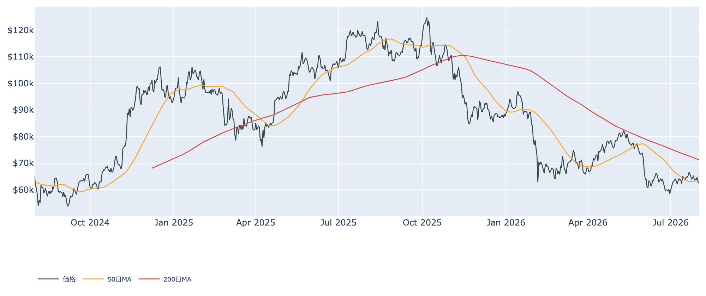
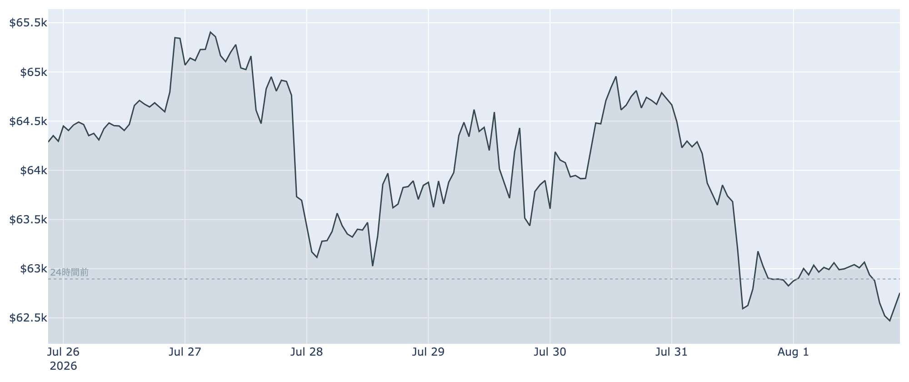
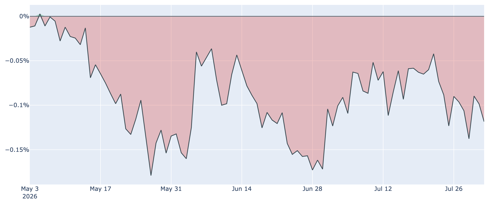

# $62,700で迎えた8月 ― 長期勢の買い集めが30日前の3分の1に鈍化

**2026年8月2日**

7月末の急落からの戻りは鈍く、ビットコインは8月2日7時00分（日本時間）時点で約6万2800ドルと、前日からほぼ横ばいで週末を通過しました。週間では約2.4%安。価格そのものより気になるのは、これまで下値を支えてきた長期保有層の買い集めが目に見えて細ってきたことです。一方で先物市場は強気を崩しておらず、いつになく分かりにくい足元の需給を整理します。

（本稿の数値は8月2日7時00分に取得したデータに基づきます。価格と取引所プレミアムは同時刻の実勢値、Fear & Greed 指数は8月1日、オンチェーン指標とETF資金フローは7月31日時点のものです。）

## 1. 全体像：下支えが薄くなったところへ、上値の重さは変わらず

7月は月間で見れば小幅な上昇でしたが、最終週に失速し、月末に50日移動平均（約6万3400ドル）を割り込んだまま8月に入りました。200日移動平均は約7万1300ドルと遥か上にあり、中期のトレンドは引き続き弱い地合い（デッドクロス圏）です。

これまでこの弱い地合いを下から支えていたのは「長期保有層の静かな買い集め」でしたが、7月31日時点でその勢いは明確に鈍化しました（下の②）。代わりに目立つのは先物市場の強気で、価格が下げても建玉は増え、強気側が手数料を払い続けています。つまり足元の下支えは、現物のじっくりした買いから、レバレッジの効いた買いへと質が入れ替わりつつある状態です。

センチメントは Fear & Greed 指数が27＝「恐怖」で、1週間前と同じ水準。悲観が深まったわけではなく、盛り上がりもない、という無風です。マクロ側では、7月29日のFRB会合が9対3の賛成多数で金利据え置き（3.50〜3.75%）を決めた一方、反対票はいずれも「利上げすべき」という主張で、市場は年内1〜2回の利上げを織り込み始めています。中東情勢を背景に原油（ブレント）が1バレル100ドルを回復しており、インフレの上振れがそのままリスク資産の重石になる構図です。

## 2. 注目すべきポイント

### ① ETFは月末最終日に大口の流出、週で見ても資金は出ている

* **7月31日の純流出は約2億6500万ドル**。内訳はIBITが約1億2300万ドル、FBTCが約5500万ドル、GBTCが約5300万ドルと、大手が揃って流出しました。
* **直近7営業日の合計も約5億3000万ドルの流出超**。7月を月間で見れば辛うじて小幅な流入超で終えたものの、月末にかけて流れが反転した形です。
* 単日の数字に一喜一憂する必要はありませんが、機関投資家の実需を映す部分だけに、この流出が8月に入って続くかどうかは下値の堅さに直結します。

### ② 長期勢の買い集めが、この1か月で3分の1に

* 長期保有層（155日以上保有）の過去30日の保有量変化は、7月31日時点で**+約12万BTC**。1週間前は+約18万BTC、30日前は+約35万BTCでしたから、**1か月で3分の1近くまで縮んだ**ことになります。
* プラス圏＝依然として買い越しではあるので「売りに転じた」わけではありません。ただ、これまでのレポートで繰り返し「下値を支える主役」と書いてきた勢いが、明らかに落ちています。
* 春から続いた「静かな備蓄」の局面が一区切りついたのか、価格が戻るのを待って手を止めているだけなのか。判断はもう数週間の推移を見る必要がありますが、下値が今までほど自動的には固まらない、という前提で見るべき段階に来ました。

### ③ 短期勢は約8%の含み損、戻り売りの壁は動かず

* 短期保有層（155日未満）の平均取得単価は7月31日時点で**約6万7900ドル**。現在の価格はこれを下回っており、直近1〜5か月に買った人たちは平均して**約8%の含み損**を抱えています。
* 利益状態を示すSOPRという指標は、全体・短期勢とも「1」をわずかに下回ったまま。戻したところで損切りが出る、という7月からの構図に変化はありません。
* 一方でバリュエーション指標（MVRV Z-Score）は過去4年で見て低い水準にとどまっており、「割安だが上値は重い」という組み合わせは変わっていません。

### ④ 先物だけが強気を保ち、建玉は増えている

* 無期限先物の資金調達率は**年率換算で約+5%のプラス**が29回連続（約10日間）。強気側（ロング）が弱気側へ手数料を払い続けている状態です。
* 建玉も**7日間で約3%増加**して10.8万BTC相当。**価格が下がっているのに建玉が増える**のは、押し目を拾う買いが積み上がっているサインですが、同時に「下に振れたときに投げ売りを誘発しやすい」燃料が溜まっているということでもあります。
* 現物の買い（長期勢・ETF）が細るなかでレバレッジ側だけが強気、という並びは、値動きが荒くなりやすい組み合わせです。

### ⑤ 米国需要は88日連続でマイナス圏、しかし悪化もしていない

* 米国勢の買い意欲を映す Coinbase Premium は8月2日7時00分時点で**約-0.12%**。**マイナス圏が88日連続**と記録的な長さです。
* もっとも、1週間前・30日前もほぼ同じ水準で、じわじわ悪化しているわけではありません。「米国マネーが積極的に買いに来ない状態で固定されている」という膠着です。ETFの流出と合わせて見ると、米国側からの新規資金は当面期待しにくい局面と言えます。

## 3. 相場転換を見極める3つの分岐点

1. **長期勢の買い集めが持ち直すか**。7月31日時点の+約12万BTCがこのまま減り続けてゼロを割るようなら、これまで機能してきた下支えが外れます。逆にここから再び積み増しが加速すれば、7月末の下げは押し目だったという解釈になります。
2. **50日移動平均（約6万3400ドル）を取り戻せるか**。ここを回復できないまま日柄が進むと、7月の戻り高値（約6万5700ドル）が遠のきます。上値の本丸は短期勢の原価である約6万7900ドルで、ここを超えれば売り圧力が買い支えに変わります。
3. **利上げ観測の行方**。9月15〜16日のFRB会合に向けて、これから出てくる物価指標と原油価格が焦点です。エネルギー主導のインフレが収まらなければ利上げ観測が強まり、リスク資産全体の重石になります。中東情勢はこの経路でビットコインにも効いてきます。

## 総括

割安感（バリュエーション）は残っているものの、それを買いに変えていた主役――長期保有層の蓄積とETFへの資金流入――が、7月末にかけて揃って勢いを落としました。代わりに前面に出ているのは先物の強気で、下支えの質は現物からレバレッジへ移りつつあります。上値には短期勢の戻り売りが残り、マクロは利上げ寄り。「底は堅いが上がらない」というこれまでの構図から、「底の堅さそのものを確かめ直す局面」へ、静かに一歩進んだ週明けです。

---

*本稿は情報提供を目的としたものであり、投資助言ではありません。将来の価格動向を保証・示唆するものではなく、投資判断は各自の責任において行ってください。*
