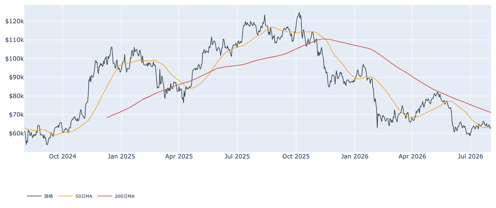
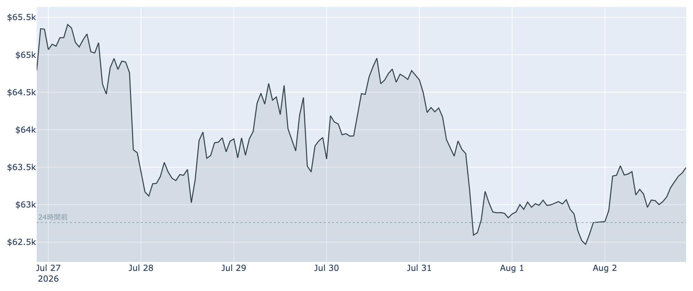
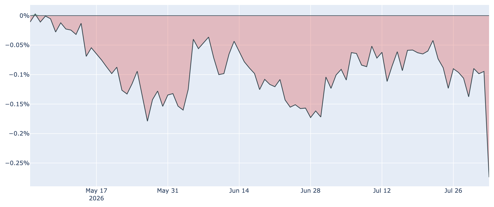
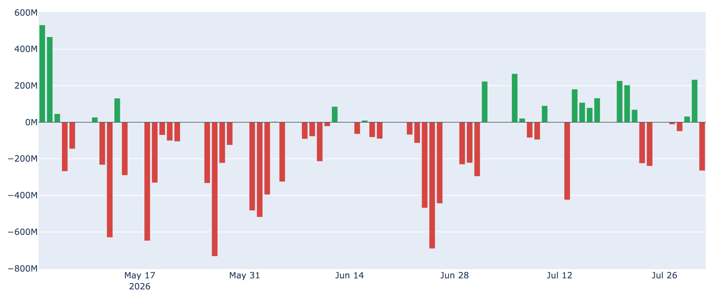
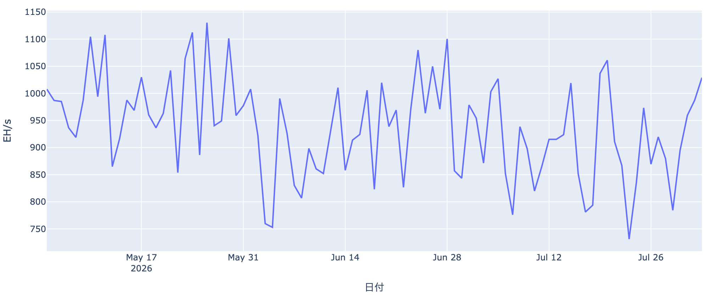

# 週明けは$63,500へ小反発 ― 米国勢の需要はこの10か月で最も弱く

**2026年8月3日**

新しい週のビットコインは、24時間で+1.3%の小幅な反発となり、8月3日7時0分時点で約6万3500ドルです。50日移動平均線（約$63,300）をぎりぎり取り戻した形ですが、反発のわりに買い手の顔ぶれは心もとない状況です。米国の買い需要を映す指標がこの10か月の観測で最も弱い水準に沈み、ETFも月末に流出へ逆戻り、長期保有層の買い集めも減速が続いています。「売り込まれてはいないが、引っ張り上げる主体も見当たらない」――そんな週明けです。

（本稿は2026年8月3日 7:00 JST時点までに取得したデータに基づきます。価格・ネットワーク関連は同時刻の実勢、Fear & Greed指数は8月2日分、オンチェーン指標は8月1日分、ETF資金フローは7月31日分が最新です。）

## 1. 現在の市場の全体像：反発しても「けん引役が不在」

* **価格の位置**: 8月3日7時0分時点で約6万3500ドル（24時間で+1.3%）。直近1週間では約-2.8%で、7月末の下げ（月末最終日に約3%安）をまだ取り返せていません。50日移動平均（約$63,300）を挟んだ攻防に戻った一方、200日移動平均（約$71,100)にはほど遠く、中期トレンドは弱い地合い（デッドクロス圏）のままです。
* **市場心理**: Fear & Greed指数は27（8月2日、「恐怖」）。1週間前（26）とほぼ横ばいで、恐怖圏に沈んだままです。
* **マクロ**: 7月末のFRB会合は9対3の割れた評決で金利据え置き（3.50〜3.75%）となりました。ただし委員会は年内1回の「利上げ」を想定しており、9月会合は「生きた会合」。今週末（8月7日）の雇用統計が次の焦点です。
* **需給のねじれ**: 現物側の買い手（米国勢・ETF・長期保有層）がそろって細る一方、先物ではロング優勢（強気側が手数料を払う状態が約11日連続）が続いています。現物の裏付けが乏しいまま先物だけが強気という、やや不安定な組み合わせです。

## 2. 注目すべき4つのポイント

### ① 米国勢の「売り優勢」がこの10か月で最も深く

* **Coinbase Premium**: 米国の機関投資家・大口の需要を示すこの指標が、8月2日に約-0.27%まで急低下しました。データを取り始めた昨年10月以降の約10か月で最も深いマイナスで、1週間前（約-0.09%）から一気に3倍の深さです。
* **意味合い**: マイナス圏は89日連続と約3か月に及びます。単日の急変には振れの可能性もありますが、方向としては「米国からの買いが戻るどころか、一段と弱くなっている」ことを示します。7月半ばに見えかけた改善の芽は、いったん折れた形です。

### ② ETFは月末に流出へ逆戻り

* **直近の動き**: 7月31日は約2.7億ドルの純流出で、直近7営業日の合計も約5.3億ドルの流出超。最大手のIBITを含め、主要ファンドが軒並み流出側に並びました。
* **7月全体で見ると**: 月の合計は差し引きほぼゼロ（2億ドル弱の流入）。月半ばの持ち直しを月末の流出が打ち消した格好で、「資金が定着しない」状態が続いています。

### ③ 長期保有層の買い集め、減速が止まらない

* **ペースの推移**: 長期保有層（155日以上保有）の過去30日の保有量変化は、8月1日時点で+約9.8万BTC。30日前（+約34万BTC）の3分の1以下、1週間前（+約18.9万BTC）からもさらに半減しています。
* **損切りの形跡も**: 8月1日は、長期保有者が動かしたコインの売却価格が取得価格を約2割下回る水準（LTH-SOPRという指標で約0.80）でした。古参の一部が損を承知で手放しており、「静かな備蓄」で下値を支えてきた層の勢いが明らかに衰えています。

### ④ 短期組は約7%の含み損 ― ただしマイニング面には明るさ

* **短期保有者の原価**: 8月1日時点で約$67,800。現在の価格（約$63,500）はこれを約7%下回っており、直近参入組の含み損が戻り売り圧力として残ります。その日動いたコイン全体でも損切り優勢（SOPRという指標が1割れ）です。
* **一方でマイナーは峠越え**: ハッシュレートは約1029 EH/sと30日で+18%と急回復し、次回の難易度調整は+1.1%とプラス転換の見込み。マイナー収益を示すPuell Multipleも30日前の約0.61から約0.83へ持ち直しました。6〜7月の「淘汰」局面は最悪期を過ぎたようです。

## 3. 相場転換を見極めるための「3つの分岐点」

1. **米国需要が底を打つか**: Coinbase Premiumのマイナス幅が縮小へ転じるか、ETFに流入が戻るか。今回の底練りを終わらせるのに最も欠けているピースです。逆にこの深さのディスカウントが続くなら、戻りは売られやすいままです。
2. **価格レンジの上下**: 目先はまず50日線（約$63,300）を保てるか。下は直近1週間の安値$62,200前後、上は短期保有者の原価$67,800が壁です。この間にいる限り「底練り」の判定は変わりません。
3. **8月7日の雇用統計とFRB**: 市場予想は雇用増+9万人程度・失業率4.3%への小幅悪化。弱い数字なら利上げ観測が後退してリスク資産に追い風、強い数字なら「9月利上げ」が現実味を帯び、逆風が強まります。据え置きでも9対3と割れたFRBの次の一手を、この統計が大きく左右します。

## 総括

週明けの小反発で50日線は取り戻したものの、その中身は「売りの一服」であって「買いの復活」ではありません。米国勢の需要はこの10か月で最も弱く、ETFは月末に流出へ逆戻り、長期保有層の買い集めも3分の1以下に減速と、下値を支えてきたエンジンが軒並み出力を落としています。救いはマイナーの淘汰が峠を越えつつあることと、センチメントの悪化に歯止めがかかっていること。当面は$62,200〜$67,800のレンジを前提に、米国需要の底打ちと8月7日の雇用統計を待つ局面です。

---

*本稿は情報提供を目的としたものであり、投資助言ではありません。将来の価格動向を保証・示唆するものではなく、投資判断は各自の責任において行ってください。*
