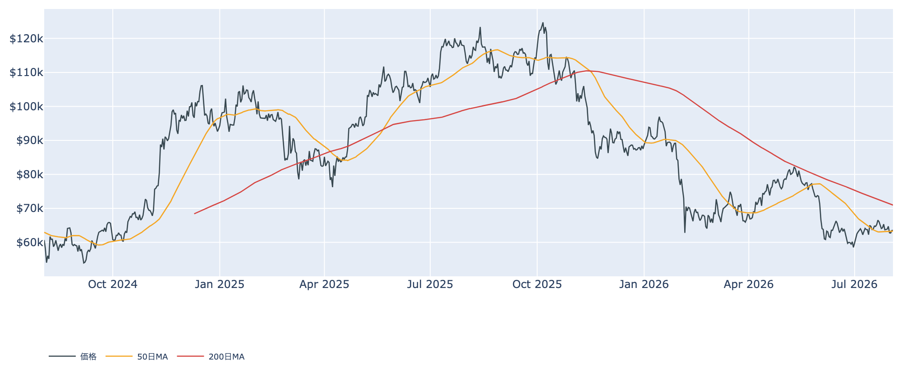
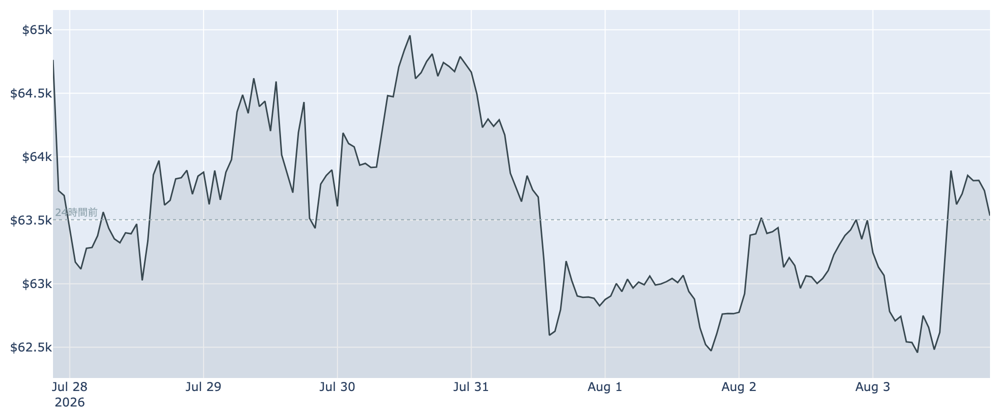
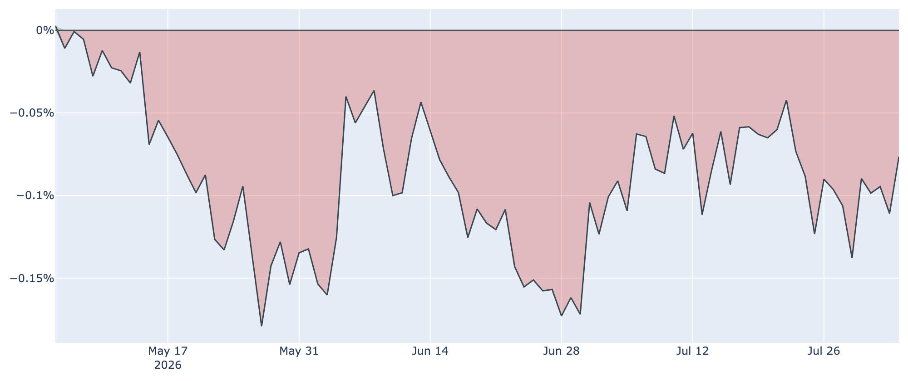
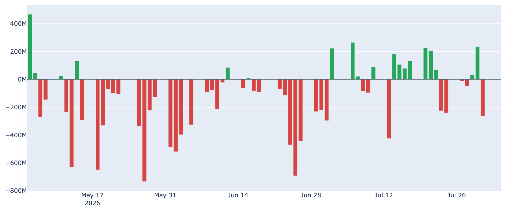

# 一時$62,200まで沈んで戻す「行って来い」 ― 長期勢の買い集めは30日前の4分の1に

**2026年8月4日**

ビットコインは過去24時間で一度6万2200ドル台まで押されたあと6万3500ドル前後へ戻し、差し引きではほぼ変わらずという一日でした。値幅は約3%あったのに行き先は同じ場所――上にも下にも決め手がない膠着です。その水面下では、これまで下値を支えてきた長期保有層の買い集めが目に見えて細っています。

（本稿は2026年8月4日 7:00 JST時点までに取得したデータに基づきます。価格・ネットワーク関連は同時刻の実勢、Fear & Greed指数は8月3日分、オンチェーン指標は8月2日分、ETF資金フローは8月3日分が最新です。）

## 1. 現在の市場の全体像：値幅はあれど、行き先がない

* **価格の位置**: 8月4日7時0分時点で約6万3500ドル（24時間で+0.1%）。1週間前比も-0.3%とほぼ横ばいで、7月末に割った50日移動平均（約$63,300）のすぐ上に貼りついています。200日移動平均（約$71,000）ははるか上方で、中期の地合いは弱いまま（デッドクロス圏）です。
* **振れ幅は小さくない**: 直近24時間の値幅は$62,200〜$64,000。1週間の安値をこの24時間で更新したうえで押し返しており、「下は買われるが、上も続かない」レンジの両端を1日で往復した形です。
* **市場心理**: Fear & Greed指数は28（8月3日、「恐怖」）。1週間前（30）とほぼ変わらず、恐怖圏で固まったままです。悲観が深まってもいませんが、和らいでもいません。
* **マクロ**: 7月末のFRB会合は9対3の割れた評決で金利据え置き（3.50〜3.75%）。3人が即時の「利上げ」を主張したことで、市場は9月会合での利上げを7割近い確率で織り込んでいます。次の焦点は8月7日の雇用統計です。加えて8月はビットコインにとって季節的に弱い月で、この時期の重さは相場参加者にも意識されています。

## 2. 注目すべき4つのポイント

### ① 長期勢の「静かな備蓄」がほぼ止まりかけている

* **ペースの推移**: 長期保有層（155日以上保有）の過去30日の保有量変化は、8月2日時点で+約7.2万BTC。30日前（+約32万BTC）の4分の1以下、1週間前（+約19万BTC）からもさらに6割減りました。5月には100万BTCを超えていた時期があることを思えば、勢いの落ち方は明らかです。
* **意味合い**: プラスである以上まだ「売り越し」ではありませんが、この数か月ずっと下値を支えてきたエンジンが失速しつつあります。長期保有者が動かしたコインは8月2日時点でも取得価格を4%ほど下回る水準（LTH-SOPRという指標で約0.96）で、古参の一部が損を承知で手放している状態も続いています。

### ② 米国勢の需要は「わずかに戻したが、依然マイナス」

* **Coinbase Premium**: 米国の機関投資家・大口の需要を映すこの指標は8月3日時点で約-0.08%。1週間前（約-0.10%）、30日前（約-0.09%）と比べればわずかに浅くなりましたが、マイナス圏は90日連続と3か月に及びます。
* **読み方**: 直近の数字は「弱さが少し和らいだ」程度で、方向が変わったと言えるほどではありません。米国からの買いが戻る気配が出るまでは、戻り局面が売られやすい構図が続きます。

### ③ ETFは資金が入らない状態が継続

* **直近の動き**: 8月3日の純流出入はほぼゼロ。直近7営業日の合計では約3億ドルの流出超で、7月末の流出を取り返せていません。
* **月次で見ると**: 7月全体の資金流入は差し引きで2億ドル程度と、上場来で最も薄い月になりました。売り浴びせられているわけではないものの、新しい資金が入ってこないという点では、5〜6月の大量流出とは別種の重さがあります。

### ④ 先物は「強気の形」だけが残る

* **資金調達率**: 無期限先物では強気側（ロング）が手数料を払う状態が35回連続（約12日）続いています。ただし率そのものは年率にして+0.2%程度と、この30日の平均の30分の1ほどしかありません。「強気に傾いてはいるが、熱はほとんどない」水準です。
* **建玉**: 未決済の契約量は約10.9万BTC（約69億ドル）で、1週間で+4.6%と積み上がっています。現物側の買い手（米国勢・ETF・長期保有層）が細るなか、先物のポジションだけが増えている点は、値動きが一方向に振れたときの振幅を大きくしやすい要因です。

### ⑤ 割安圏は続くが、短期組はなお含み損

* **バリュエーション**: 時価総額と取得原価の乖離を見るMVRV Z-Scoreは8月2日時点で約0.35と、過去4年で見てもかなり低い、割安寄りの水準にとどまっています。
* **上値の重さ**: 一方、短期保有者（155日未満）の平均取得単価は約$67,700。現在の価格はこれを約6%下回っており、直近に買った層の含み損が「やれやれ売り」の予備軍として残ります。その日動いたコイン全体でも、8月2日時点でわずかに損切り優勢（SOPRという指標が1をやや下回る）でした。

## 3. 相場転換を見極めるための「3つの分岐点」

1. **8月7日の雇用統計**: 弱い数字なら9月利上げ観測が後退してリスク資産に追い風、強い数字なら逆風です。据え置きでも9対3と割れたFRBの次の一手を、この統計が大きく左右します。
2. **長期保有層の買い集めが下げ止まるか**: いま最も注意すべき変化です。プラス圏を保ったまま再加速するなら下値は堅いままですが、マイナス（＝長期勢の分配）に転じれば、支えを失った価格が$62,000割れを試す展開もあり得ます。
3. **レンジの上下**: 下は直近の安値$62,200前後、上は短期保有者の原価$67,700が壁です。まずは50日線（約$63,300）の上に居座れるかどうか。この間にいる限り「底練り」の判定は変わりません。

## 総括

値幅の割に行き先のない一日でしたが、中身を見れば静かな変化が進んでいます。米国勢の弱さがわずかに和らぎ、悲観の深まりも止まった一方で、下値を支えてきた長期保有層の買い集めは30日前の4分の1にまで細りました。ETFにも新しい資金は入らず、先物だけが形ばかりの強気を保っています。当面は$62,200〜$67,700のレンジを前提に、長期勢の姿勢と8月7日の雇用統計を見極める局面です。

---

*本稿は情報提供を目的としたものであり、投資助言ではありません。将来の価格動向を保証・示唆するものではなく、投資判断は各自の責任において行ってください。*
