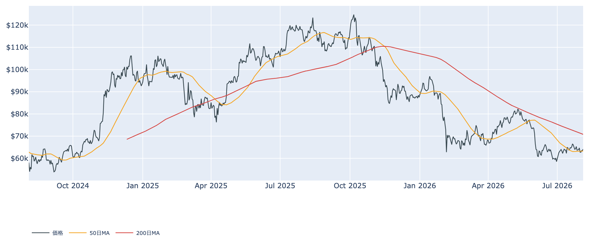
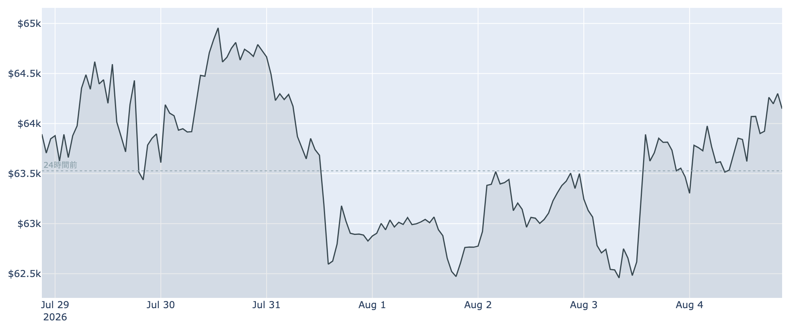
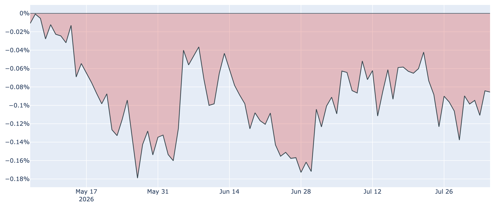
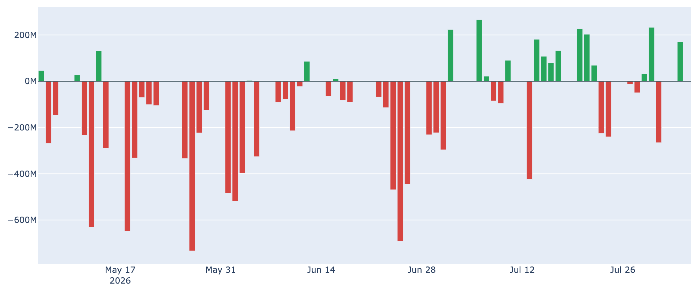
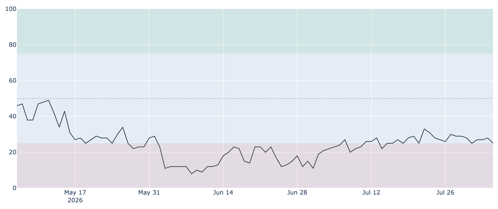

# 50日線を取り返して$64,100 ― けれど長期勢の買い集めは、ほぼ止まった

**2026年8月5日**

ビットコインは8月5日7時時点で約6万4100ドル。8月1日にいったん割り込んだ50日移動平均線を取り返し、この1週間はおおむね6万2000〜6万5000ドルの狭い範囲で行き来しています。値動きだけ見れば静かですが、その裏側でこの相場をずっと支えてきた「長期保有者の買い集め」が、8月に入ってほぼ止まりました。今日はそこを中心に整理します。

（数値は2026年8月5日7時00分（日本時間）に取得したものです。価格と取引所プレミアムはこの時刻時点の実勢、市場心理は8月4日まで、オンチェーン指標は8月3日時点、ETF資金フローは8月4日時点のものです。）

## 1. 全体像：値位置は改善、でも「支え役」が後退した

価格そのものは持ち直しています。8月5日7時時点で約6万4100ドル、24時間前と比べて約+1%、1週間前・1か月前と比べても+0.5%前後で、ほぼ横ばいのなかを小幅に切り上げた形です。

* **短期の地合いはやや改善**：8月1日に割り込んだ50日移動平均（約6万3300ドル）を上回って戻しました。
* **中長期の地合いは弱いまま**：200日移動平均は約7万800ドルと、現在値よりはるか上にあります。「デッドクロス圏（中長期は下向き）」の構図は変わっていません。

直近1週間の値動きを細かく見ると、6万2000ドル台前半で二度下げ止まり、そこから買い戻される展開が続いています。下値は拾われているものの、6万5000ドル台には定着できていません。

## 2. 注目すべきポイント

### ① 長期勢の買い集めが、ほぼゼロまで減速した

* **数字**：長期保有者（155日以上持っている層）の過去30日の保有量変化は、8月3日時点で+約9,500BTC。1週間前は+約13万BTC、1か月前は+約31万BTCでしたから、勢いが30分の1近くまで落ちたことになります。
* **急ブレーキ**：7月末は+約12万BTC、8月1日+約10万BTC、8月2日+約7万BTCと、ここ数日で一直線に細っています。「買い集めが減った」というより「買いと売りがほぼ釣り合った」水準です。
* **なぜ効くか**：この数か月、上値の重い相場でも下値が堅かった最大の理由が、この長期勢の黙々とした買い集めでした。それが止まったということは、下支えの主役が一人退場しつつあるということです。
* **付け加えると**：8月3日時点で、動いた古参のコインは平均して取得単価を1割ほど下回る価格で手放されています（長期勢の損益状態を示す指標が0.92）。買い増しが止まっただけでなく、一部は損を確定して降りている状態です。

### ② 割安であること自体は変わらない

* 時価と取得原価の乖離を測るMVRV Z-Scoreは8月3日時点で約0.37。過去4年で見て下から2割ほどの位置で、「歴史的には安い」圏内にとどまっています。
* マイナーの収益水準を示すPuell Multipleも約0.77と低位のまま。採掘の採算の厳しさは続いており、ネットワークの計算能力（ハッシュレート）はこの30日で約8%減りました。効率の悪い採掘業者の脱落が進んでいる状況です。
* ただし「割安」は引き金にはなりません。6月以降ずっと割安圏にいながら価格が動いていないことが、それを示しています。

### ③ 米国勢の需要は弱いまま、しかし最悪期は脱しつつある

* 米国の買い意欲を映す取引所プレミアムは8月5日7時時点で約-0.09%。マイナス圏は91日連続と、記録的な長さになりました。
* 一方でマイナス幅は縮んでいます。1か月前の約-0.11%、1週間前の約-0.11%に対し、足元は約-0.09%。「米国勢が積極的に買っている」わけではありませんが、「投げている」状態でもありません。

### ④ ETFへの資金は、細いながらプラス

* 米国の現物ETFは8月3日に約+1.7億ドルの流入、8月4日は差し引きほぼゼロ。直近7営業日の合計は約+1.1億ドルと、小幅なプラスです。
* 7月後半の流出（7月23〜24日に計約4.7億ドルの流出）から見れば持ち直していますが、相場を押し上げるほどの規模ではありません。長期勢の買いが細った穴を、機関マネーが埋めきれてはいない、というのが実情です。

### ⑤ 市場心理は「極度の恐怖」へ逆戻り

* Fear & Greed指数は8月4日時点で25（極度の恐怖）。1週間前の29から低下しました。1か月前の23からはわずかに改善しているものの、6月以降ずっと恐怖圏に沈んだままです。
* 価格が50日線を取り返しても心理が改善していないのは、この戻りが「買いたい人が増えた結果」ではなく「売りたい人が減った結果」であることを示唆します。

## 3. 相場転換を見極める3つの分岐点

1. **長期勢の買い集めが戻るか**：+約9,500BTCという水準が一時的なもので、再び10万BTC規模の積み増しへ戻れば、下値の堅さは維持されます。逆にここからマイナス圏（長期勢が売り越し）へ沈むと、これまで下支えだった層が売り手に回ることになり、意味合いが大きく変わります。
2. **6万7600ドルを取り返せるか**：直近に買った層（短期保有者）の平均取得単価がこの水準です。現在値はこれを約5%下回っており、戻り待ちの売りが上値に控えている計算になります。ここを明確に超えれば、その売り圧力が支えに変わります。
3. **マクロの空気が変わるか**：FRBの政策金利は3.50〜3.75%で据え置きが続いており、市場では「年内は動かない」という見方が主流です。一部に9月の利下げを見込む声もありますが、確度は高くありません。加えて8月は歴史的にビットコインが弱含みやすい月とされ、季節的にも追い風は期待しにくい局面です。

## 総括

価格は50日線を取り返し、米国勢の需要も最悪期を脱しつつあり、ETFへの資金も細いながらプラス圏。表面的な材料は先週より改善しています。しかしその裏で、この相場をずっと下から支えてきた長期保有者の買い集めが、ほぼ止まりました。バリュエーションは依然として割安圏にありますが、割安さは相場を上げる力を持ちません。「下値は堅いが上がらない」だった局面から、「下値の堅さそのものを確かめ直す」局面へ移りつつある――そう見ておくのが妥当な段階だと考えられます。

---

*本稿は情報提供を目的としたものであり、投資助言ではありません。将来の価格動向を保証・示唆するものではなく、投資判断は各自の責任において行ってください。*
