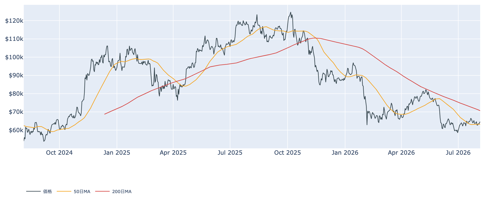
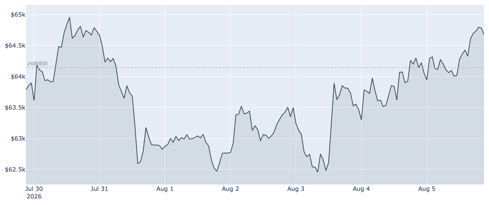
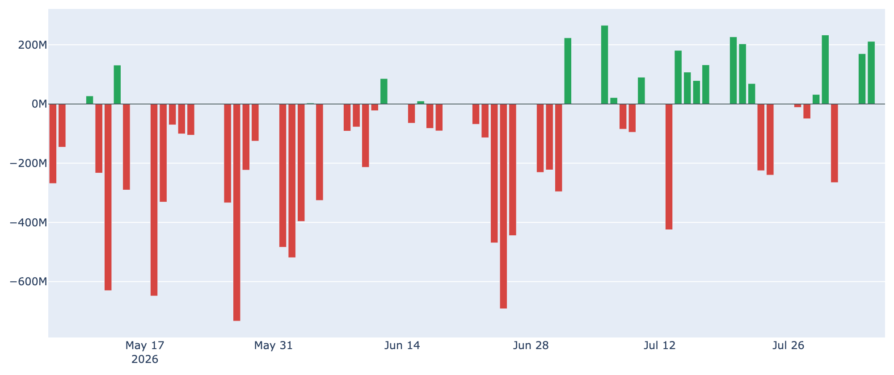
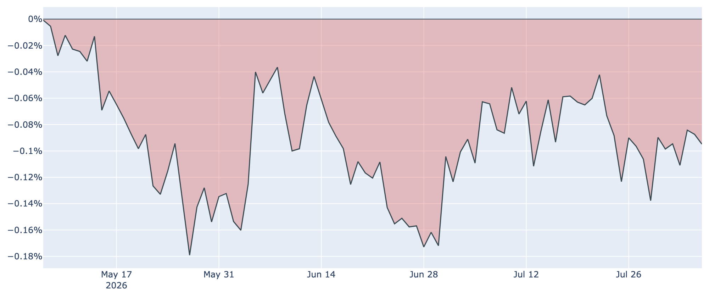

# 長期勢がついに売り越しへ ― $64,700まで戻しても、下支えの主役が消えた

**2026年8月6日**

ビットコインは8月6日7時00分（日本時間）時点で約6万4700ドル。24時間で約+0.8%、1週間でも約+1.2%と、じりじりと値を戻しています。ただしこの数日で相場の「土台」が静かに入れ替わりました。半年以上にわたって下値を支えてきた長期保有者の買い集めが、ついに売り越し（分配）へ転じています。

（この記事は8月6日7時00分に取得した各種データに基づきます。価格・取引所プレミアム・ネットワーク状況はその時点の値、市場心理は8月5日まで、オンチェーン指標とETF資金フローは8月5日時点のものです。）

## 1. 全体像：値動きは静かに強く、需給の担い手は入れ替わった

価格そのものは落ち着いています。ここ1週間のレンジは約6万2200〜6万5400ドルで、7月末に一度割った50日移動平均（約6万3200ドル）はすでに取り返し、その上で推移しています。一方で200日移動平均は約7万700ドルとまだはるか上にあり、中期のトレンドは弱い地合い（デッドクロス圏）のままです。

需給の中身を見ると、これまでとは違う構図が出てきました。

* **抜けた下支え**：長期保有者の買い集めが止まり、8月5日時点では逆に手放す側へ回りました（後述）。これまで「静かな備蓄」が担っていた下値の堅さは、当面あてにできません。
* **入れ替わった買い手**：代わりに動き始めたのが米国の現物ETFです。8月に入って資金が戻り、直近7営業日の合計は+約3.3億ドルのプラス。値持ちの良さはここが支えている可能性が高いところです。
* **市場心理は冷えたまま**：Fear & Greed指数は8月5日時点で27（「恐怖」）。1週間前の29からほぼ横ばいで、価格が戻っても投資家の気分は明るくなっていません。

## 2. 注目すべきポイント

### ① 長期勢の30日ネットが、ついにマイナスへ

* **数字**：長期保有者（155日以上保有）の過去30日の保有量変化は、8月5日時点で**-約3.4万BTC**。1週間前は+約18万BTC、30日前は+約29万BTCでしたから、わずか1か月でプラス圏から抜け落ちました。5月には+110万BTCという猛烈な買い集めがあったことを思えば、様変わりです。
* **意味**：これまでの「一般投資家が怖がっている裏で、長期目線の層が黙々と拾う」という構図が、いったん終わったということです。パニック的な投げ売りではなく、買い集めが止まって少し戻し始めた程度の水準ですが、**下値の堅さの根拠がひとつ減った**点は押さえておく価値があります。
* **補足**：長期保有者の売却行動を示すLTH-SOPRは約0.84と、彼らが平均して損を出す価格帯で動かしている状態です。強気になって利確しているのではなく、我慢の限界に近い層から順に出ている、という読み方が自然です。

### ② ETFの資金は8月に入って戻ってきた

* **数字**：8月3日に+約1.7億ドル、4日に+約2.1億ドルと2営業日続けて流入。7月末の-約2.7億ドルから明確に潮目が変わりました。上場来の累計は+約517億ドルです。
* **中身**：流入のほとんどをブラックロックのIBITが占めており、資金は幅広く戻っているというより一極集中です。実際、この8月には流入の細ったETFのひとつが償還・閉鎖を発表しています。「ETF全体が復活した」ではなく「本命銘柄にだけ資金が戻っている」というのが正確なところです。

### ③ 米国需要の弱さは、記録更新中

* **数字**：米国勢の買い圧力を示すCoinbase Premium（Coinbaseと海外取引所の価格差）は8月5日時点で約-0.09%。マイナス圏は**92日連続**で、記録を更新し続けています。
* **ただし**：1週間前の約-0.14%からは幅が縮んでおり、悪化が進んでいるわけではありません。ETFの流入と合わせて読めば「米国マネーはまだ本腰ではないが、最悪期からは離れつつある」という段階です。

### ④ 短期勢は約4%の含み損、上値の重しは残る

* **コストベース**：短期保有者（155日未満）の平均取得単価は約6万7600ドル。現在の約6万4700ドルはこれを下回っており、直近に買った人たちは平均して**約4%の含み損**を抱えています。
* **売買の質**：市場全体の利益状態を示すSOPRは0.9946と、わずかに1を割った状態が続いています。戻ったところで「やれやれ売り」が出る展開は変わっていません。ただし短期勢だけを見たSTH-SOPRは1.0003とほぼ均衡で、投げ売りが加速している様子はありません。

### ⑤ 先物は緩やかな強気、過熱はしていない

* **資金調達率**（先物のロング側が払う手数料）は年率換算で約+3.8%。プラス圏が13日以上続いており、強気に傾いてはいますが、過熱と呼べる水準ではありません。建玉も7日で+約5%と穏やかな増加です。
* 相場を無理に押し上げているレバレッジは、今のところ積み上がっていません。

（補足：ネットワークは平穏です。ハッシュレートは約880 EH/sで30日前比+約3%、採掘難易度の次回調整も+約1%とほぼ横ばい。手数料も最低水準の1 sat/vB近辺で、投機的な混雑はありません。）

## 3. 相場転換を見極める3つの分岐点

1. **長期勢の売り越しが一時的か、定着するか**：8月5日時点のマイナスはまだ浅く、数日で反転する可能性も十分あります。ここからさらにマイナス幅が広がるようなら、下値の支えが本格的に失われたと見るべき場面です。
2. **ETFの流入が本命銘柄以外へ広がるか**：単発の大口買いではなく、複数のファンドに資金が戻り、Coinbase Premiumのマイナス圏脱出を伴うかどうか。米国需要の本格回復はこの2つが揃って初めて確認できます。
3. **金融政策の方向**：FRBは政策金利を3.50〜3.75%に据え置いており、原油高と粘るインフレを背景に「当面は下げない」姿勢です。市場では利下げどころか年内の利上げを見込む声すら出ています。次の9月会合でこの空気が緩むかどうかが、リスク資産全体の重しを外す鍵になります。

## 総括

価格の戻りだけを見れば、地合いは改善しています。50日線を回復し、ETFには資金が戻り、先物にも過熱はありません。しかしその足元で、これまで相場を支えてきた長期保有者が買い手から売り手へ回りました。**下値の堅さの担い手が、静かな備蓄から米国の機関資金へ交代しつつある**局面です。後者はまだ本命1銘柄に偏った細い流れであり、この交代がうまくいくかどうかが、当面の底の強さを決めることになります。

---

*本稿は情報提供を目的としたものであり、投資助言ではありません。将来の価格動向を保証・示唆するものではなく、投資判断は各自の責任において行ってください。*
