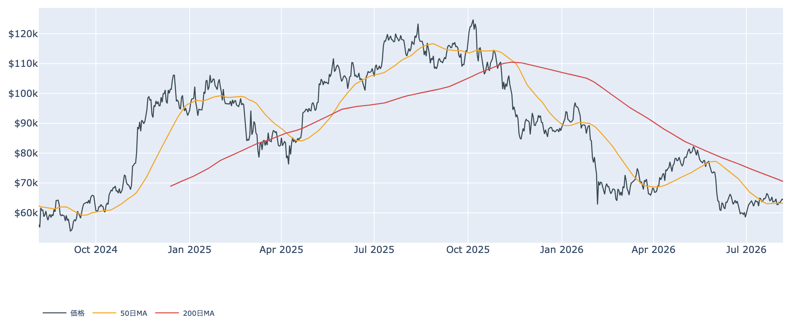
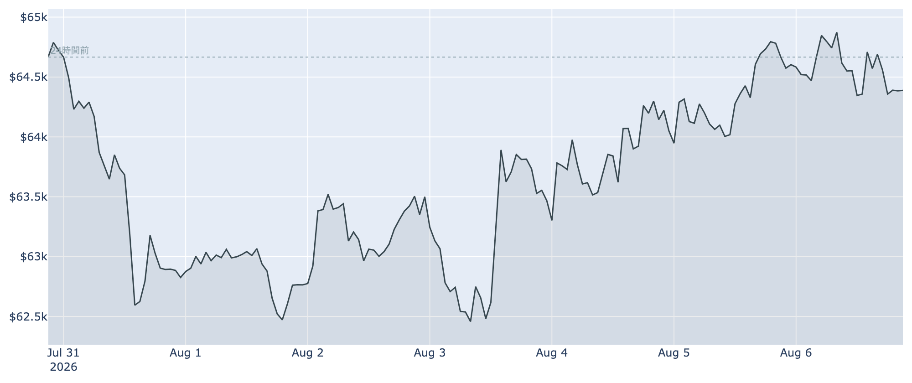
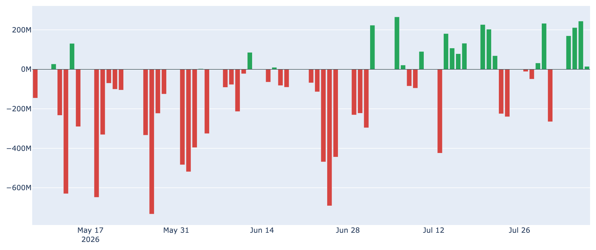
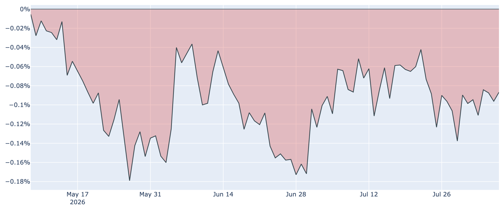
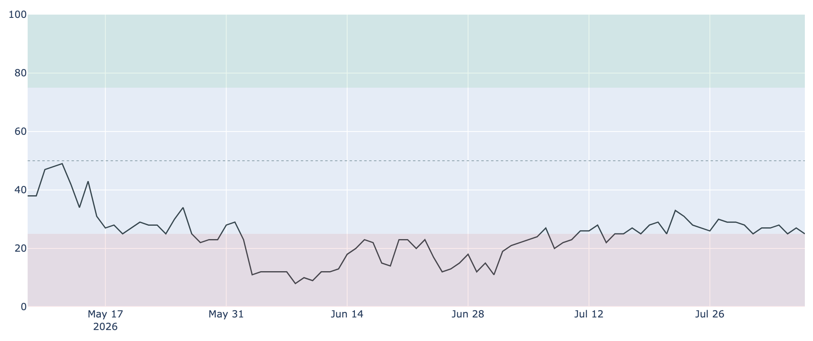

# ETFに戻り始めた資金 ― 長期勢が売り手に回るなかで、$64,400を維持

**2026年8月7日**

ビットコインは8月7日7時00分時点で約6万4400ドル。この1週間はほぼ横ばい（-0.5%程度）で、6万2000ドル台前半から6万5000ドル台前半の狭いレンジを行き来しています。目立たない値動きの裏で、相場を支える顔ぶれが入れ替わりつつあります。長らく買い支えてきた長期保有層が売り手に回る一方、米国の現物ETFには4営業日続けて資金が入りました。

（価格・取引所プレミアム・ネットワーク概況は2026年8月7日7時00分（JST）時点、Fear & Greed指数は8月6日、オンチェーン指標とETF資金フローは8月6日時点のデータに基づいています。）

## 1. 全体像：買い手の「バトンタッチ」が試されている

価格そのものは動いていません。しかし需給の中身は静かに変わっています。

* **これまでの下支え役だった長期保有層が、買い集めをやめて売り越しに転じた**（8月6日時点）。5〜6月に相場の底を支えていた最大の勢力が、支え手から外れつつあります。
* **代わりに手を挙げ始めたのが米国の現物ETF**。8月3日から6日まで4営業日続けて資金流入となり、直近7日間の合計は約+6.4億ドルに達しました。
* この「バトンタッチ」がうまくいくかどうかが、当面の焦点です。片方が抜けた穴をもう片方が埋めきれなければ、下値は再び緩みます。

価格の位置を移動平均線で見ると、実勢の約6万4400ドルは50日移動平均（約6万3200ドル）を上回り、短期の地合いは持ち直しています。ただし200日移動平均（約7万500ドル）ははるか上にあり、中長期のトレンドは依然として弱い「デッドクロス圏」のままです。

## 2. 注目すべきポイント

### ① ETFに資金が戻ってきた

* **4営業日連続の流入**：8月3日から順に+約1.7億ドル、+約2.1億ドル、+約2.4億ドル、+約0.1億ドルと、8月6日まで4日続けてプラス。7〜8月の断続的な流入のなかでも、まとまった買いが並んだのは久しぶりです。
* **意味合い**：ETFに資金が入ると、運用会社は裏付けとなる現物ビットコインを買います。つまりこれは機関投資家の実需そのもの。ただし7月は流出と流入がせめぎ合う月で、まだ「流れが定着した」と言い切れる段階ではありません。

### ② 長期勢の売り越しが一段と深まった

* **保有量の増減**：長期保有層（155日以上保有）の過去30日の保有量変化は8月6日時点で約-4.8万BTC。1週間前は+約16.6万BTC、30日前は+約30.9万BTCと、わずか1か月で「猛烈な買い集め」から「純減」へ反転しました。
* **売り方の中身**：長期勢の損益状態を示す指標はわずかな利益超（約1.03）で、投げ売りではなく、含み益が乗ったところでの計画的な利益確定に近い動きです。慌てた降参ではない一方、これまでの強力な下支えが薄くなったことは確かです。

### ③ 米国の「直接の買い」はまだ弱い

* **Coinbase Premium**：米国勢の需要の強さを示すこの指標は8月6日時点で約-0.09%と、93日続けてマイナス圏にあります。1週間前（約-0.09%）からもほぼ横ばいで、改善の兆しは見えません。
* **ETFとの食い違い**：資金はETFという「箱」には入るものの、取引所での直接の買い上がりには広がっていない。米国需要はまだ一部の経路に限られている、という読み方ができます。

### ④ 心理は「極度の恐怖」に貼りついたまま

* **Fear & Greed指数**：8月6日時点で25と、「極度の恐怖」の境目にあります。1週間前（28）、30日前（27）とほぼ変わらず、6月の一桁台からは回復したものの、そこから先へ進めていません。
* **価格との乖離**：価格は7月末の急落から立ち直り、月間では小幅プラス圏にあるのに、投資家心理は改善していません。悲観が残っているうちは急激な過熱も起きにくく、それ自体は底堅さの裏返しでもあります。

### ⑤ 短期勢はなお約5%の含み損、ただし投げは止まった

* **平均取得単価**：短期保有層（155日未満）の平均取得単価は8月6日時点で約6万7600ドル。実勢の約6万4400ドルはこれを約5%下回り、直近で買った人たちは平均して含み損の状態です。
* **売りの質**：利益か損失かを示すSOPRという指標は、全体・短期勢とも「1」をわずかに上回りました（8月6日時点）。損切りの投げが一巡し、売り圧力が和らいでいることを示します。上値の重さは残りますが、7月中旬までの「戻れば売られる」状態からは一歩進みました。

（補足：ネットワークの計算力は約899EH/sで30日前から約+16%と力強く回復しており、6〜7月に進んだマイナーの淘汰は一段落した様子です。先物の資金調達率も15日近くプラスが続き、小幅ながら強気寄りに傾いています。）

## 3. 相場転換を見極めるための「3つの分岐点」

1. **ETFの流入が「週単位」で定着するか**：長期勢が抜けた穴を埋められるかが最大の焦点です。日次のプラスが数日続いても、翌週に流出へ戻れば下支えにはなりません。
2. **約6万7600ドル（短期勢の平均取得単価）を上抜けるか**：ここを超えて定着すれば、含み損を抱えた層の売り圧力が買い支えへ変わります。下では6万2000ドル台前半が7月末以降の支持帯で、ここを割ると流れが変わります。
3. **マクロと制度の行方**：7月末のFRB会合は金利据え置き（3.50〜3.75%）でしたが、3人が利上げを主張するタカ派的な内容で、9月会合をめぐる警戒がくすぶっています。加えて米議会の暗号資産関連法案は議会休会入りで先送りとなり、制度面の追い風は当面期待しにくい状況です。一方で中東情勢の緊張緩和はリスク資産全般の支えとなっています。

## 総括

価格は動いていませんが、支え手は交代しつつあります。5〜6月の底を作った長期保有層は買い集めをやめて売り越しに転じ、代わりにETF経由の資金が戻り始めた——これが8月6日時点の相場の姿です。バリュエーション面では歴史的に見て依然として割安な圏内にあり、短期勢の投げも一巡しました。ただし米国勢の直接の買いは93日連続で弱く、心理も「極度の恐怖」から抜け出せていません。**新しい買い手が根を張るまでは、6万2000〜6万5000ドルのレンジで様子見が続く**と見るのが妥当でしょう。

---

*本稿は情報提供を目的としたものであり、投資助言ではありません。将来の価格動向を保証・示唆するものではなく、投資判断は各自の責任において行ってください。*
