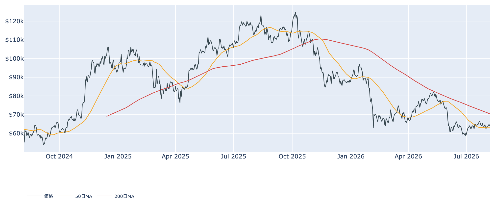
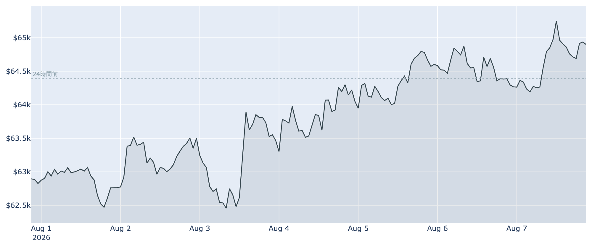
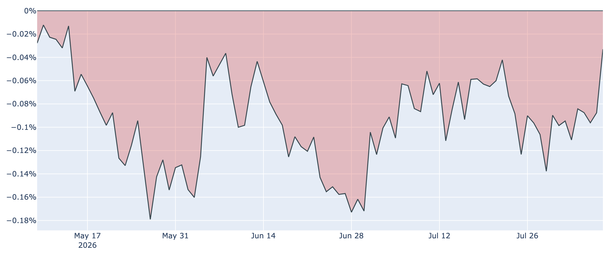
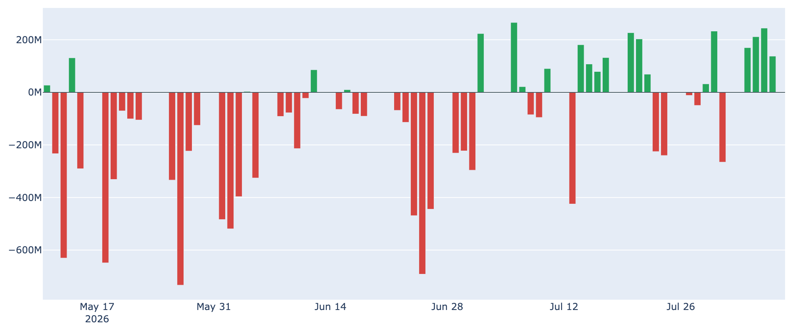

# 弱い米雇用統計を追い風に6万4,900ドル ― 米国勢の弱気は約3か月ぶりの小ささへ

**2026年8月8日**

ビットコインは8月8日7時00分（日本時間）時点で約6万4,900ドル。24時間で+0.8%、1週間では+3.3%と、じり高の歩調が続いています。8月7日に発表された米雇用統計が大きく市場予想を下回り、金融引き締めへの警戒がいったん緩んだことが背景にあります。7月まで相場を支えてきた「長期保有者の買い集め」が売り越しへ転じるなかで、代わりに米国の需要が戻りつつある――その入れ替わりを、オンチェーン・オフチェーンの指標から整理します。

（データは2026年8月8日7時00分（日本時間）時点のものです。価格と取引所プレミアムはこの時刻の実勢値、Fear & Greed指数は8月7日確定値、オンチェーン指標とETF資金フローは8月7日時点の値にもとづきます。）

## 1. 全体像：下支えの主役が「長期勢」から「米国勢」へ

価格は6月末の5万8,500ドル台を底に、ゆるやかな戻りを続けています。ただし中身は7月までと入れ替わりつつあります。

* **抜けた支え**：長期保有者（155日以上保有）の30日間の保有量増減は、8月7日時点で**約-6.2万BTCの純減**。1週間前は+約12万BTC、30日前は+約33万BTCでしたから、春から続いた「静かな備蓄」は完全に止まり、分配（売り）側に回っています。
* **入ってきた支え**：入れ替わるように、米国の現物ETFへ資金が戻りました。8月3日から6日までの4営業日で合計**約+7.6億ドル**の純流入と、7月の流出基調から様変わりしています。
* **マクロの追い風**：8月7日発表の7月米雇用統計は、非農業部門雇用者数が**2.3万人の減少**（市場予想は8万人前後の増加）と大幅な下振れ。失業率は4.1%、賃金の伸びも前年比3.2%まで鈍りました。9月の利上げを主張していたFRB高官の声が通りにくくなり、リスク資産にはひとまず追い風となっています。

価格の位置づけとしては、50日移動平均（約6万3,300ドル）は上回ったものの、200日移動平均（約7万400ドル）ははるか上。中期のトレンドは依然「デッドクロス圏」で、これは戻りであって上昇転換ではありません。

直近1週間のレンジは約6万2,200〜6万5,300ドル。週の前半に押した分を取り返し、上限付近で頭を抑えられている形です。

## 2. 注目すべきポイント

### ① 米国勢のディスカウントが約3か月ぶりの小ささに

* **取引所プレミアム**：米国（コインベース）とアジア（バイナンス）の価格差は8月7日時点で**約-0.03%**。マイナス＝米国勢の買いが弱い状態は94日連続ですが、その幅は1週間前の約-0.10%、30日前の約-0.08%から大きく縮み、**5月中旬以来の小ささ**になりました。
* **読み方**：8月上旬までは「米国勢の需要はこの10か月で最も弱い」水準でしたから、ここへ来ての縮小は方向としての改善です。ただしまだプラス圏（米国が買い上がる状態）には戻っておらず、「売り優勢が薄れた」段階にとどまります。

### ② ETFへの資金流入が4営業日続いた

* **8月の流入**：8月3日+1.7億ドル、4日+2.1億ドル、5日+2.4億ドル、6日+1.4億ドル。7月が今年もっとも弱い月だっただけに、月替わりで流れが変わった格好です。上場来の累計流入は約521億ドルとなりました。
* **注意点**：牽引しているのはブラックロックの一本足で、複数のファンドへ広く資金が戻ったわけではありません。単月・単発で終わるか、週単位で定着するかはこれからです。

### ③ 短期勢の含み損が4%まで縮小した

* **コストベース**：短期保有者（155日未満）の平均取得単価は8月7日時点で**約6万7,500ドル**。現在値との差は約4%の含み損で、30日前の約10%からかなり圧縮されました。価格が上がっただけでなく、高値で買った人が損切りを終えて原価そのものが下がってきたことの両方が効いています。
* **とはいえ利益は出ていない**：その日動いたコインが利確か損切りかを示すSOPRという指標は8月7日時点で0.994と、まだ1を下回っています。戻り局面で「やれやれ売り」を出す層は残っており、これが上値の重さの正体です。

### ④ センチメントは「恐怖」のまま改善中

* **Fear & Greed指数**：8月7日時点で29と「恐怖」圏。ただし1週間前の25、30日前の20からは着実に持ち直しています。6月には一桁台（極度の恐怖）まで沈んでいたことを思えば、悲観は薄れつつあります。
* **バリュエーション**：時価総額の割高・割安を測るMVRV Z-Scoreは約0.39で、過去4年でみて下位2割の水準。歴史的には安い部類に位置したままです。

### ⑤ 先物は静かに強気、ただし新規資金は乏しい

* **資金調達率**：無期限先物でロング側がショート側へ手数料を払う状態が47回連続（約16日）続いており、年率換算で約+6.7%。傾きは強気寄りです。
* **建玉は増えていない**：一方で未決済の建玉は約68億ドルと、7日間で-0.8%の微減。「価格上昇＋建玉増加＝新規資金の流入」という組み合わせにはなっておらず、この戻りはレバレッジ主導ではないと読めます。急落時に連鎖清算が起きにくい反面、上昇の燃料も細いということです。

## 3. 相場転換を見極める3つの分岐点

1. **ETFの流入が「週」で定着するか**：4営業日の連続流入は歓迎材料ですが、7月にも数日続いた後に反転した場面がありました。週次でも明確な純流入超が続き、かつブラックロック以外へも広がるかどうかが試金石です。
2. **6万7,500ドル（短期勢の原価）を上抜けるか**：ここを明確に超えて定着すれば、直近参入者の含み損が解消し、いまの売り圧力が買い支えへ変わります。その先には200日移動平均の約7万400ドルが控えており、中期トレンドの転換を語るにはそこまで必要です。
3. **9月16日のFRB会合**：政策金利は3.50〜3.75%に据え置かれたまま、インフレは目標の2%を上回り続けています。弱い雇用統計で利上げ観測は後退しましたが、「景気減速の確認」でもあるため、株式を含むリスク資産全体の空気がどちらに振れるかは、まだ読み切れません。

## 総括

ビットコインは6万4,900ドル前後まで戻し、50日線を回復しました。ただし相場を支えている顔ぶれは春先とは違います。長期保有者は買い集めをやめて売り越しに転じ、代わって米国の現物ETFと、雇用統計の下振れによる金融緩和期待が価格を押し上げている構図です。米国勢のディスカウントが約3か月ぶりの小ささまで縮んだことは前向きな変化ですが、依然マイナス圏、短期勢は含み損、建玉も増えていません。「悲観は薄れたが、買い直しの資金はまだ細い戻り局面」というのが現時点の姿だと言えます。

---

*本稿は情報提供を目的としたものであり、投資助言ではありません。将来の価格動向を保証・示唆するものではなく、投資判断は各自の責任において行ってください。*
