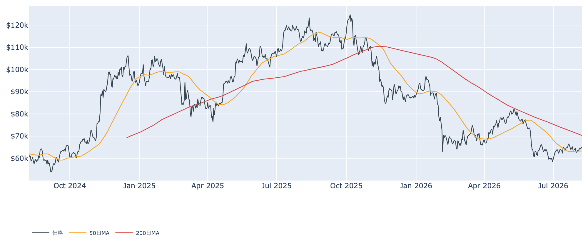
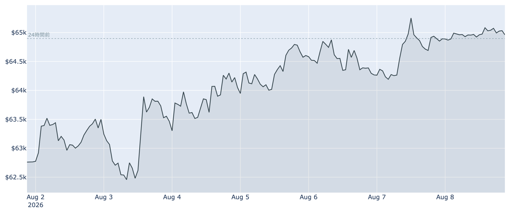
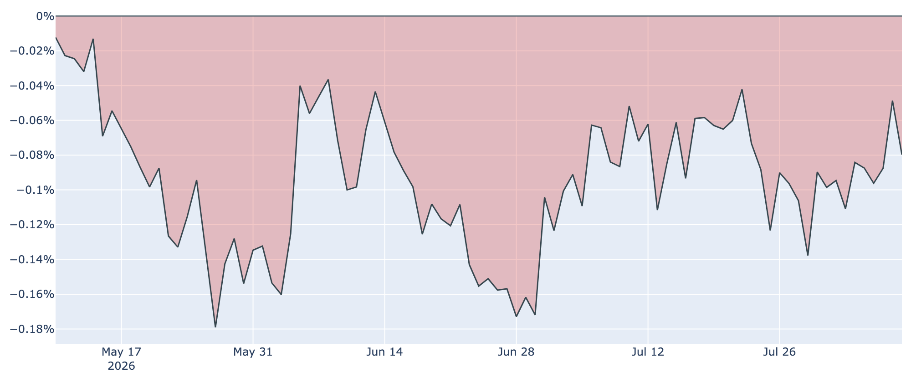
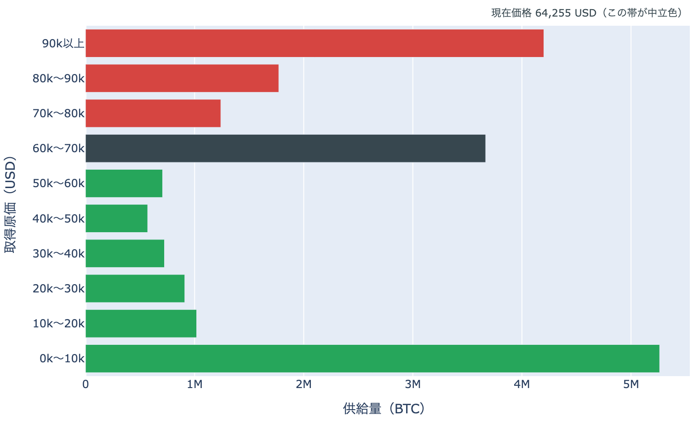

# 5営業日続いたETF買い、それでも6万5,000ドルの手前 ― 上値の重さは「原価の分布」に表れている

**2026年8月9日**

ビットコインは8月9日7時00分（日本時間）時点で約6万5,000ドル。24時間ではほぼ横ばい（+0.1%）ですが、1週間では+3.5%と戻り基調は保っています。米国の現物ETFには8月3日から7日まで5営業日続けて資金が入り、マクロも金融緩和期待が優勢――それでも週間の高値圏（6万5,300ドル台）を抜けられずにいます。この「あと一歩」が出ない理由を、保有者の取得原価の分布から整理します。

（データは2026年8月9日7時00分（日本時間）時点のものです。価格と取引所プレミアムはこの時刻の実勢値、Fear & Greed指数は8月8日確定値、オンチェーン指標とETF資金フローは8月7日時点の値にもとづきます。）

## 1. 全体像：買い手は入れ替わったが、勢いは足りていない

* **買っているのは米国のETF**：8月に入って5営業日連続の純流入。7月の流出基調から明確に潮目が変わりました。
* **売っているのは長期勢**：長期保有者（155日以上保有）の30日間の保有量増減は、8月7日時点で約-6.2万BTCの純減。1週間前は+約12万BTC、30日前は+約33万BTCでしたから、春から続いた買い集めは止まったままです。
* **マクロは追い風**：8月7日発表の米雇用統計が大きく下振れしたことで、9月の利上げを見込む声は後退しました。金利先物市場は年内1〜2回の利下げを織り込む方向へ傾き、米株も最高値圏で推移しています。

つまり「ETFの買い」と「長期勢の売り」がほぼ拮抗しており、価格は上へも下へも大きく動けない。1週間のレンジは約6万2,200〜6万5,300ドルで、いまはその上限付近です。

50日移動平均（約6万3,300ドル）は上回った一方、200日移動平均（約7万300ドル）ははるか上にあります。中期のトレンドは依然「デッドクロス圏」で、これは戻りであって上昇転換ではありません。

## 2. 注目すべきポイント

### ① ETFの流入は続いたが、担い手は1社に偏っている

* **5営業日連続**：8月7日は+約1.0億ドルで、直近7日の合計は約+8.3億ドル。上場来の累計流入は約522億ドルに乗せました。
* **中身は偏り**：8月7日の内訳を見ると、ブラックロックのIBITが+8,670万ドルと全体の大半を占め、一方でHODLやBTCOからは小幅な流出が出ています。「業界全体に資金が戻った」というより「1社に集まっている」段階です。

### ② 米国勢のディスカウント縮小は、1日で元に戻った

* **取引所プレミアム（＝米国とそれ以外の価格差）**：8月8日時点で約-0.08%。前日はいったん約-0.05%まで縮み、5月中旬以来の小ささになっていましたが、1日で従来の水準へ戻りました。
* **95日連続のマイナス**：1週間前は約-0.09%、30日前は約-0.09%で、幅そのものは横ばい圏です。改善の兆しはあるものの、まだトレンドと呼べる動きではありません。

### ③ 短期勢は約4%の含み損のまま

* **平均取得原価**：短期保有者（155日未満）の平均取得単価は8月7日時点で約6万7,500ドル。現在値はこれを約4%下回っており、直近で買った層は依然として含み損を抱えています。
* **SOPR（＝動いたコインの損益）**：8月7日時点で0.994と、1をわずかに下回ったまま。戻り局面で「やれやれ売り」を出す層が残っており、これが上値を抑えています。

### ④ 先物は強気に傾いたまま、しかし新規の資金は入っていない

* **資金調達率（＝先物の買い持ちが払う金利）**：8時間あたり0.0055%（年率換算で約+6%）のプラスが50回連続、約17日間続いています。方向としては強気寄りですが、水準自体は控えめです。
* **建玉（＝先物の未決済残高）**：約69億ドルで、7日間では-2.3%の減少。価格が3.5%上げるあいだに未決済残高は減っており、この戻りはレバレッジ主導ではありません。急落時の連鎖清算は起きにくい反面、上昇の燃料も細いということです。

### ⑤ 心理は「恐怖」のまま、ゆっくり改善

* **Fear & Greed（＝市場心理の指数）**：8月8日時点で30と「恐怖」圏。1週間前は27、30日前は22でしたから、少しずつ持ち直しています。6月に一桁台まで沈んだことを思えば、悲観の底は越えました。
* **バリュエーション**：MVRV Z-Score（＝市場全体の含み益）は8月7日時点で約0.39。過去4年で見ればなお安い部類にとどまっています。

（補足：ネットワーク面は静かです。推奨手数料は最低水準の1sat/vB、ハッシュレートは993EH/sと30日で約+11%の伸び、次回の採掘難易度調整は約-2%の見込みです。）

## 3. 相場転換を見極める3つの分岐点

### 1. 6万7,500ドルを抜けられるか ― 上に眠る供給の重さ

短期勢の原価である約6万7,500ドルが、当面の第一関門です。その重さは、いくらで手に入れられたコインがどれだけ残っているかを見ると分かります。

* **7万ドル以上で得た供給が、全体のおよそ3分の1**。とくに9万ドル超の帯が最も厚く、昨年の高値圏で市場に出たコインが大量に残っています。この層は戻り売りの候補であり続けます。
* **現在価格を含む6万〜7万ドルの帯にも全体の約2割**が集まっています。価格がこの帯の中にいるということは、少し下げるだけで含み損に転じる供給が一気に増えるということでもあります。上値が重い一方で、下も脆いという両面性があります。
* ※これは取得原価の分布であって、保有者の人数や取引所の在庫ではありません。原価は各コインが動いた日の終値による近似で、「誰が持っているか」まではこのデータからは言えません。

### 2. ETFの流入が「週」で定着し、広がるか

5営業日の連続流入は7月にはなかった動きですが、7月にも数日続いたあと反転した場面がありました。週次でも純流入超が続くこと、そしてブラックロック以外のファンドへも資金が回り始めることが、定着の目安になります。

### 3. 9月16日のFRB会合

政策金利は3.50〜3.75%に据え置かれたままで、インフレは目標の2%を上回り続けています。雇用統計の下振れで利上げ観測は後退しましたが、それは同時に景気減速の確認でもあります。緩和期待が素直にリスク資産の支えになるか、景気懸念が上回るかは、まだどちらとも言えません。

## 総括

ビットコインは6万5,000ドル手前で足踏みしています。ETFには5営業日続けて資金が入り、心理も少しずつ改善し、マクロも緩和寄りに傾いた――材料は揃っているのに、価格が週間高値を抜けきれない。取得原価の分布を見ると、その理由がはっきりします。7万ドル以上で得た供給が全体の約3分の1も残っており、上へ行くほど戻り売りの候補が厚くなるからです。長期勢の買い集めが止まり、先物にも新規資金が乏しいいま、この層を消化するには時間がかかりそうです。「悲観は薄れたが、上値の在庫を食べきるには買い手がまだ足りない」というのが現時点の姿だと言えます。

---

*本稿は情報提供を目的としたものであり、投資助言ではありません。将来の価格動向を保証・示唆するものではなく、投資判断は各自の責任において行ってください。*
