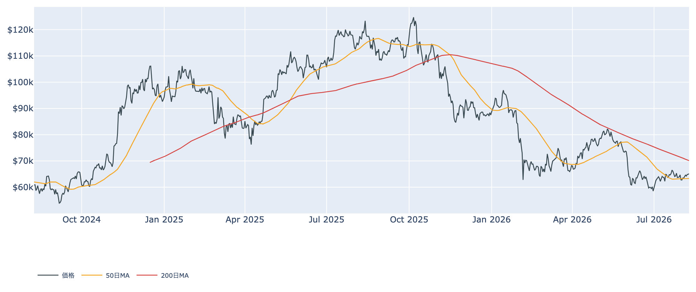
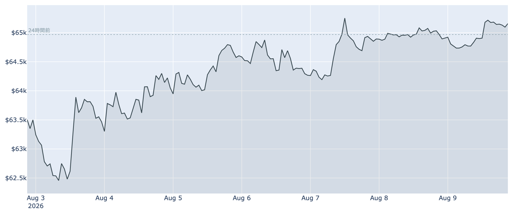
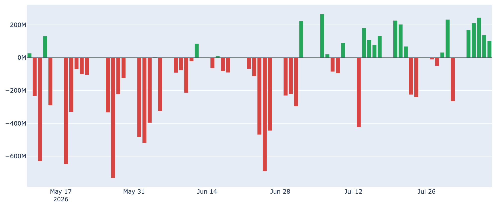
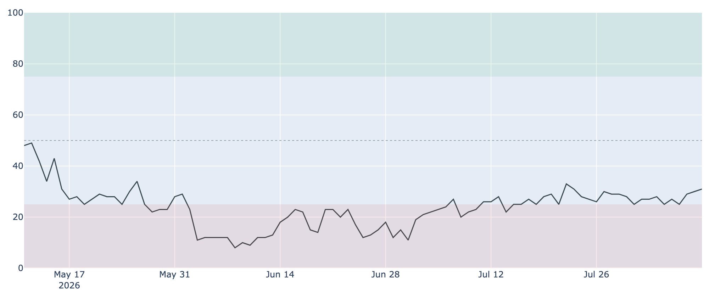
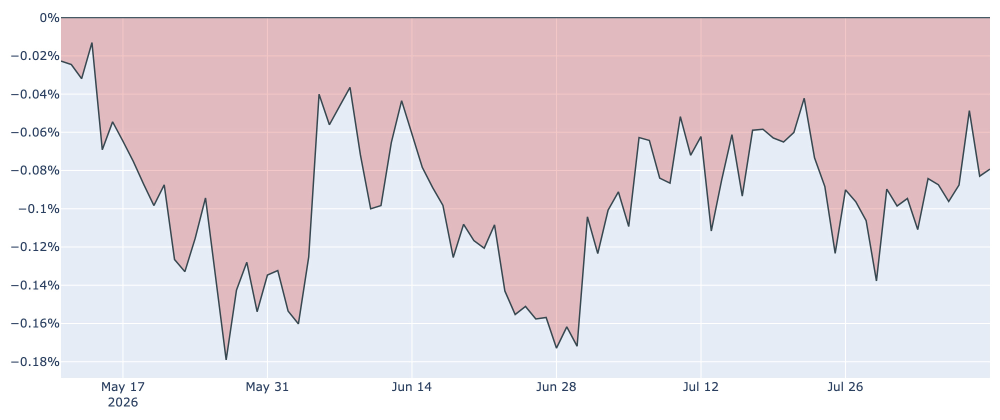

# 分裂騒ぎを素通りして6万5,000ドル台 ― 買っているのはETF、売っているのは長期勢

**2026年8月10日**

週末のビットコインは、8月9日に起きたネットワークの分裂騒ぎ（BIP-110）をほとんど無視して、6万5,000ドル台を維持しました。7日前と比べて約+2.6%。ただし買い手はETF、売り手は長期保有層という、これまでとは主役が入れ替わった需給が続いています。

（数値は2026年8月10日 7時00分（JST）時点で取得したものです。価格と市場心理は8月9日まで、オンチェーン指標とETF資金フローは8月7日時点のデータに基づいています。）

## 1. 全体像：やや上向き、ただし主役不在

- **価格**: 8月10日7時00分時点で約6万5,100ドル。直近の確定終値は8月8日（UTC）の約6万4,900ドルで、24時間ではほぼ横ばい（+0.3%）、7日前比では+2.6%です。7日間の値幅は約6万2,200〜6万5,300ドルで、週の安値から切り上がってきました。
- **トレンド**: 50日移動平均（約6万3,300ドル）は上回っていますが、200日移動平均（約7万ドル）ははるか下。中期の地合いは依然として「デッドクロス圏（弱い側）」です。
- **需給の構図**: 下値を支えているのは米国のETF経由の資金で、上値を抑えているのは長期保有層の売りと、含み損を抱えたままの短期勢。**春までの「長期勢が買い集め、ETFが売られる」構図が、そっくり裏返っています。**

## 2. 注目すべきポイント

### ① 分裂騒ぎはネットワークに傷を残さなかった

- 8月9日、取引に埋め込むデータ量を制限する提案（BIP-110）を支持するノードが、条件を満たさないブロックを拒否して本流のチェーンから分岐しました。ただし支持したマイナーはごくわずかで、分かれた側のチェーンは数時間で事実上停止しています。
- **本流は平常運転のまま**でした。10日朝時点でブロック高は約96万1,780、推奨手数料は最低水準の1sat/vB、ハッシュレート（＝採掘に投じられている計算能力）は約905EH/sと30日前より約+10%です。**価格が24時間でほぼ動かなかったこと自体が、市場の評価**と言えます。

### ② ETFは5営業日続けて資金流入、ただし勢いは細っている

- 8月7日の米国スポットETFは+約1.0億ドルの流入。8月3日から5営業日連続のプラスで、直近7日の合計は+約8.3億ドルと、春以来の強さです。
- ただし日々の額は8月5日の+約2.4億ドルをピークに、+約1.4億ドル、+約1.0億ドルと**尻すぼみ**です。最新日の内訳もIBIT（+約8,700万ドル）とFBTC（+約4,100万ドル）に集中し、流出しているファンドもあります。

### ③ 長期勢の売り越しが4日続けて広がった

- 長期保有層のネットポジション変化（＝長期勢の保有量の増減、過去30日）は8月7日時点で**-約6.3万BTC**。1週間前は+約12万BTC、30日前は+約32.7万BTCでしたから、蓄積から分配への転換がはっきりしてきました。
- LTH-SOPR（＝長期勢の損益）も0.85と1を大きく下回っています。**長期勢は「利確」ではなく「損を確定させて降りる」側に回っている**わけで、下支えの主役が抜けた状態が続いています。

### ④ 市場心理は5月中旬以来の水準まで回復、けれど米国勢はまだ弱い

- Fear & Greed（＝市場心理の指数）は8月9日時点で31。区分としては「恐怖」のままですが、1週間前の27、30日前の23から着実に改善し、**5月中旬以来の高さ**まで戻ってきました。6月上旬に一桁台まで沈んだことを思えば、空気はかなり和らいでいます。
- 一方でCoinbase Premium（＝米国とそれ以外の価格差）は8月9日時点で-約0.08%と、**96日連続のマイナス**。8月7日にいったん-0.05%まで縮んだ後、また少し開いています。米国勢の弱気は底を打ちつつあるものの、回復は足踏み気味です。

### ⑤ 短期勢はなお約4%の含み損

- 短期保有層（保有155日未満）の平均取得原価は8月7日時点で約6万7,500ドル。現在の価格はこれを4%ほど下回っており、**直近で買った人たちは平均すると含み損**のままです。
- SOPR（＝動いたコインの損益）も0.99と1をわずかに割り込んだまま。戻り局面で「やれやれ売り」が出やすい地合いは変わっていません。

## 3. 相場転換を見極める3つの分岐点

1. **約6万7,500ドルを回復できるか**: 短期勢の平均原価にあたる水準です。ここを明確に超えて定着すれば、いまの売り圧力が買い支えに変わる転換点になります。今週の高値6万5,300ドルからは、まだ3%強の距離があります。
2. **ETFの流入が「細り」で終わるか、続くか**: 5営業日続いた流入は好材料ですが、金額は日を追って小さくなっています。長期勢が売り手に回っているいま、ETFの買いが止まれば下支えは薄くなります。来週も日次でプラスが並ぶかが試金石です。
3. **金融政策の風向き**: 7月下旬の時点では、9月までに利上げがあるとの見方が市場で8割近くまで高まっていました。しかし8月8日に発表された弱い米雇用統計を受けてその観測は後退しており、この揺り戻しが続くかどうかがリスク資産全体の空気を左右します。

## 総括

分裂騒ぎという「起きるかもしれない悪材料」を無傷で通過し、価格は週の安値から切り上がりました。市場心理も5月中旬以来の水準まで戻っています。ただし中身を見ると、買っているのはETFの資金だけで、これまで下値を固めてきた長期保有層はむしろ売り手に回りました。**上を目指すには、ETFの流入が細らずに続くことが条件**という、支えの細い上昇局面です。

---

*本稿は情報提供を目的としたものであり、投資助言ではありません。将来の価格動向を保証・示唆するものではなく、投資判断は各自の責任において行ってください。*
