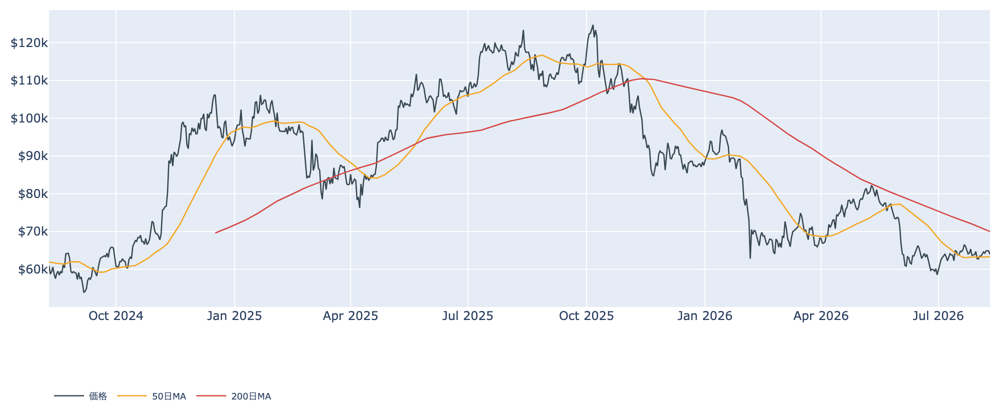
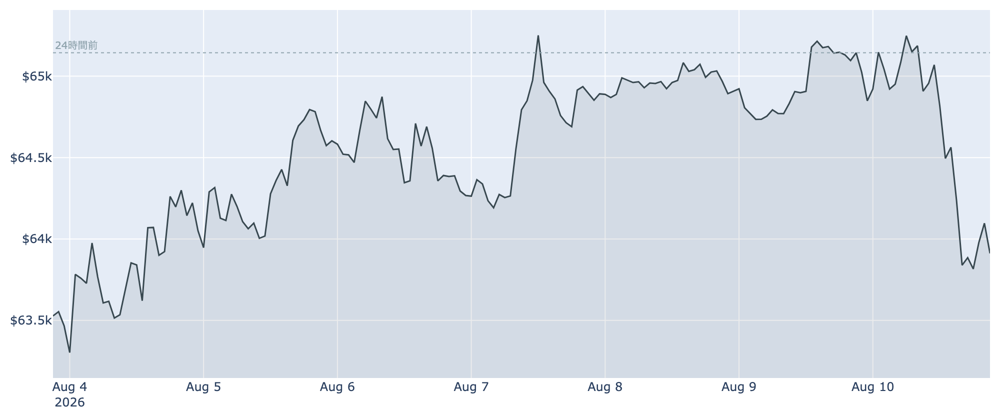
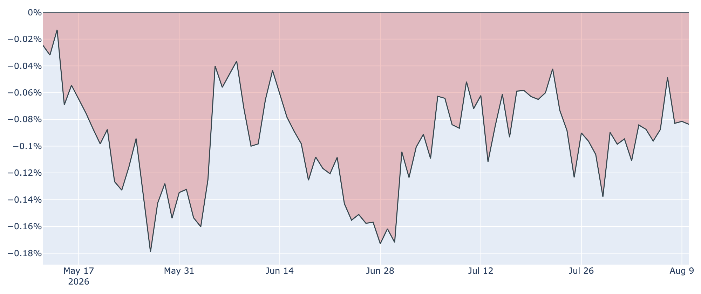
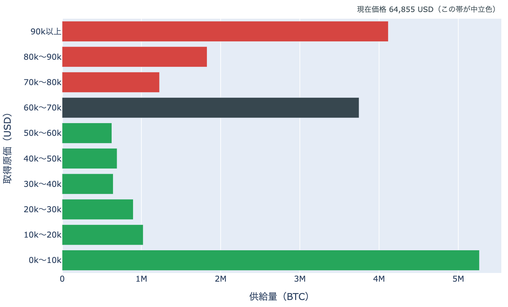

# 1,690BTCの売却で上値が折れる ― 6万5,400ドルから一日で6万3,900ドルへ

**2026年8月11日**

前日まで6万5,000ドル台をうかがっていたビットコインは、米国時間の午後に急落し、8月11日7時00分（日本時間）時点で約6万3,900ドルと24時間で約2%安。きっかけは保有企業による1,690BTCの売却でした。買い手（ETF）と売り手（長期保有層）の綱引きという構図は変わらず、そこに単発の大口売りが上値を折った形です。

（価格・市場心理は8月11日7時00分（日本時間）時点、オンチェーン指標は8月9日時点、ETF資金フローは8月7日時点の各種データに基づいています。）

## 1. 全体像：買い手はETF、売り手は長期勢と大口 ― 押し戻された週明け

価格は24時間で6万5,400ドルから6万3,700ドルまで振れ、7時00分時点では約6万3,900ドルに戻しています。7日間で見ればほぼ横ばい（+約0.7%）で、6万3,000〜6万5,400ドルのレンジは崩れていません。

ただし位置取りは楽ではありません。50日移動平均（約6万3,300ドル）のすぐ上に張り付いており、200日移動平均（約7万ドル）ははるか上。中期の地合いは依然として「デッドクロス圏（弱い側）」です。

## 2. 注目すべきポイント

### ① 上昇は「大口の売り」で止められた

* **急落のきっかけ**: ビットコインを大量保有する米企業が1,690BTC（約1億ドル相当）を売却し、優先株の買い戻しに充てたことが伝わると、6万5,400ドル台から一気に6万4,000ドル割れまで押し戻されました。5,000万ドル規模の買い持ちポジションが強制的に清算されたと報じられています。
* **売り材料はもう一つ**: 米上院が暗号資産の規制枠組み法案の採決を9月以降へ先送りしました。ただし市場の反応は限定的で、価格を大きく動かしたのは前者です。

### ② それでもETFには資金が入り続けている

* **流入の継続**: 8月7日時点の日次フローは+約1億ドル。直近7営業日の合計は+約8.3億ドルと、7月後半の一進一退から明確に流入超へ切り替わっています。
* **顔ぶれ**: 8月7日は最大手のIBITが+約8,700万ドル、FBTCが+約4,100万ドルと、大型ファンドが素直に買われています。価格が押した局面でも解約に転じていないことが、下値を厚くしています。

### ③ 長期保有層の売り越しは、むしろ加速している

* **保有量の増減**: 長期保有層（155日以上）の30日間の保有量変化は8月9日時点で-約10.2万BTCと、マイナス幅がさらに広がりました。1週間前（+約6.9万BTC）、30日前（+約34万BTC）と比べると、8月に入って買い集めから手放す側へ回った流れがはっきりしています。
* **手放し方**: LTH-SOPR（＝長期勢の損益）は約0.86で、原価を下回る水準で売られていることを示しています。高値で仕込んだ古参が、戻りを待たずに整理しているという読み方になります。市場全体のSOPR（＝動いたコインの損益）も約1.00とちょうど損益の分かれ目です。

### ④ 米国需要の弱さと「恐怖」は変わらず

* **Coinbase Premium（＝米国とそれ以外の価格差）**: 8月10日時点で-0.08%と、マイナス圏が97日連続。8月8日にいったん-0.05%まで縮んだ後、再び広がりました。ETFという「箱」には資金が入る一方、現物の取引所レベルでは米国勢の買いがまだ強くない、という食い違いが続いています。
* **Fear & Greed（＝市場心理の指数）**: 8月10日時点で30と「恐怖」圏。1週間前の28からほぼ横ばいで、価格が6万5,000ドルに迫っても投資家心理は改善していません。

## 3. 相場転換を見極める3つの分岐点

### ① 50日移動平均（約6万3,300ドル）を守れるか

8月5日に取り返したばかりの水準で、今回の急落はここで止まりました。日足でこの線を明確に割り込むと、8月の反発は「戻り売りに終わった」という整理になります。

### ② 6万ドルを割ったときの支えの薄さ

取得原価の分布（URPD）を見ると、現在価格を含む6万〜7万ドルの帯に約370万BTCが集まる一方、その下の5万〜6万ドルの帯は約60万BTCと極端に薄くなっています。つまり6万ドルを割ると、そこから下には「この値段で得た供給」がほとんどなく、価格が滑りやすい空白地帯に入ります。逆に言えば、いま価格の周りに厚い層があること自体が、レンジが続いてきた理由でもあります。

なお、これはコインの取得原価の分布であって、誰がどれだけ持っているかを示すものではありません。原価も生成日の終値による近似です。

### ③ 9月のFOMCと金利の方向

次回の米連邦公開市場委員会は9月15〜16日。市場の織り込みは据え置きが5割強、0.25%利上げが4割強で、利下げはほぼ想定されていません。7月の弱い雇用統計でドルが軟化したことが8月の反発を支えてきましたが、今後発表される物価・雇用の指標が上振れれば、この支えは簡単に外れます。

## 総括

需給の構図は「ETFが買い、長期勢が売る」で先週から変わっていません。8月11日の急落はその綱引きの結果ではなく、単発の大口売却がレンジ上限で重なったものです。とはいえ、上値を試すたびに売りが出て6万5,000ドルの手前で押し戻される展開は3日続いており、ここを抜けるには長期勢の売り越しが一巡するか、米国の現物需要が戻るか、どちらかの変化が要るように見えます。下は50日線と6万ドルという二段の目安を意識しながら、レンジの継続を前提に見ておくのが妥当な局面です。

---

*本稿は情報提供を目的としたものであり、投資助言ではありません。将来の価格動向を保証・示唆するものではなく、投資判断は各自の責任において行ってください。*
