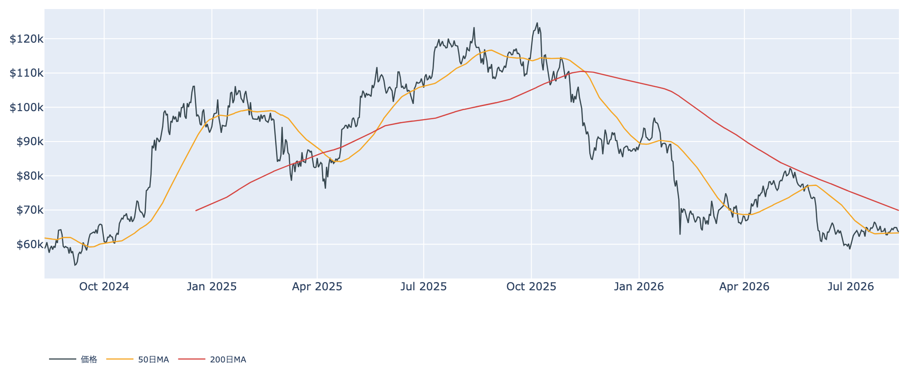
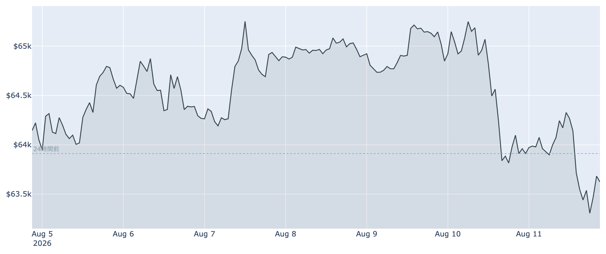
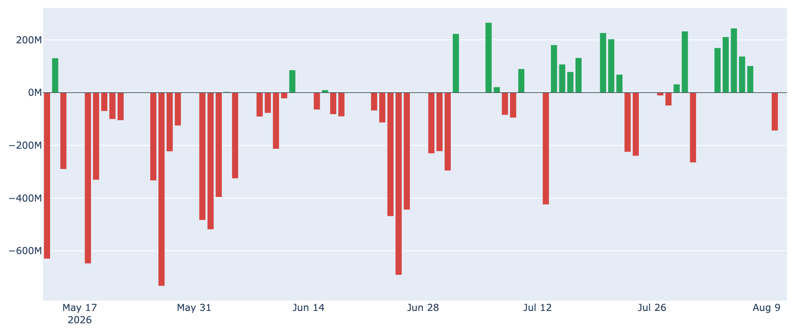
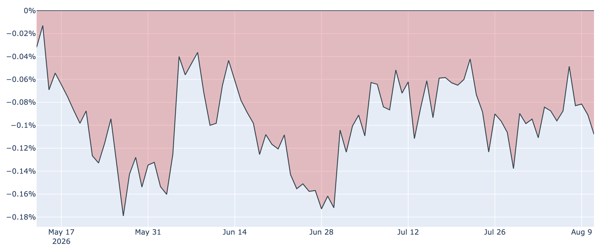
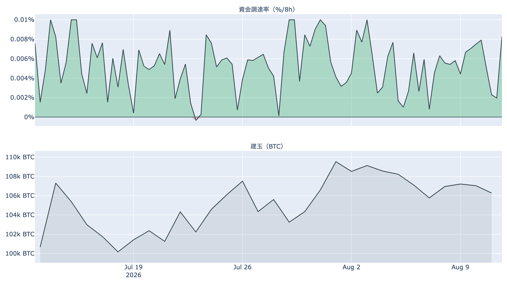

# 急落の翌日に買い戻しは入らず ― 6万3,600ドル、支えは50日線ひとつ

**2026年8月12日**

前日に6万5,400ドルから6万3,900ドルまで押し戻されたビットコインは、そのまま戻りきれずに8月12日7時00分（日本時間）時点で約6万3,600ドル。24時間ではさらに約0.5%下げ、7日レンジのほぼ下端に沈んでいます。押し目買いが入らなかった一日の裏で、8月の反発を支えていた買い手（ETF）にも変化が出ました。

（価格・市場心理は8月12日7時00分（日本時間）時点、オンチェーン指標は8月10日時点、ETF資金フローは8月11日時点の各種データに基づいています。）

## 1. 全体像：買い手が一日休み、売り手は休まなかった

8月に入ってからの構図は「ETFが買い、長期保有層が売る」でした。今回はその買い手側が8月10日にいったん止まり、売り手側は勢いを増しています。価格は7日間で約0.7%安、30日間でも約0.2%安と、ほぼ1か月動いていません。

位置取りは前日よりわずかに悪化しました。50日移動平均（約6万3,300ドル）との差は0.5%足らずで、実質的にこの線の上に乗っているだけの状態です。200日移動平均（約7万ドル）ははるか上にあり、中期の地合いは「デッドクロス圏（弱い側）」のままです。

Fear & Greed（＝市場心理の指数）は8月11日時点で29と「恐怖」圏。1週間前の25、30日前の26からはわずかに上を向いていますが、水準としては投資家の警戒が解けたとは言えません。

## 2. 注目すべきポイント

### ① 押し目買いが入らなかった24時間

* **値動き**: 24時間のレンジは6万3,200〜6万4,400ドル。前日の急落で開いた6万4,000ドル台を取り返せず、じりじりと下端方向へ。7日レンジ（6万3,200〜6万5,400ドル）の下側に位置しています。
* **読み方**: 大口の売りで一気に下げた後は買い戻しが入ることが多い局面ですが、今回はそれが起きませんでした。下げの原因が単発だったとしても、拾いにくる需要がその値段では待っていなかった、ということになります。

### ② ETFの5営業日連続の買い越しが途切れた

* **流入の中断**: 8月10日の日次フローは約-1.45億ドルと、8月3日から5営業日続いた流入（合計で約+8.5億ドル）が途切れました。解約が集中したのは最大手のIBITとGBTCです。
* **とはいえ地合いは維持**: 直近7営業日の合計では、なお約+7.2億ドルのプラス。1日の反転で流れが変わったと決めつける段階ではなく、ここから連日の流出になるかどうかが分かれ目です。

### ③ 長期保有層の売り越しは、さらに深くなった

* **保有量の増減**: 長期保有層（155日以上）の30日間の保有量変化は8月10日時点で-約15.0万BTC。1週間前（+約0.7万BTC）、30日前（+約29.4万BTC）と並べると、8月に入ってからの「備蓄から放出へ」の転換が加速していることが分かります。
* **手放し方**: LTH-SOPR（＝長期勢の損益）は約0.89で、原価を下回る値段での売却が続いています。市場全体のSOPR（＝動いたコインの損益）も約1.00とわずかに1割れで、動いたコインの平均が損切り側にあります。

### ④ 米国需要の弱さが、また広がった

* **Coinbase Premium（＝米国とそれ以外の価格差）**: 8月11日時点で-0.11%と、マイナス圏が98日連続。8月8日に-0.05%まで縮んで「最悪期は脱したか」と見えた場面から、この3日で逆戻りしました。過去10か月のなかでも深い部類の数字です。
* **ETFとの食い違い**: ETFという箱には資金が入っていた一方、現物の取引所レベルでは米国勢の買いが戻っていません。その箱への流入が8月10日に止まったことで、米国側の買い手が両方から細る形になりました。

### ⑤ 先物：強気の傾きは残り、規模だけが縮んでいる

* **資金調達率（＝先物の買い持ちが払う金利）**: 直近8時間で+0.010%（年率にして約11%）。プラスが59回連続（約20日）で、買い持ち側が払い続けています。ただしこの銘柄の上限（8時間あたり±0.3%）には遠く、過熱と呼べる水準ではありません。
* **建玉（＝先物の未決済残高）**: 10.9万BTC（約68億ドル）で、7日間で約2%減。前日の急落で持ち高の整理が進んだ形です。傾きは強気のまま、規模だけが細るこの組み合わせは、下向きの動きが出たときに支えになりにくい点に注意が要ります。

## 3. 相場転換を見極める3つの分岐点

### ① 50日移動平均（約6万3,300ドル）を守れるか

現在値との差は300ドル弱。8月5日に取り返し、8月11日の急落もここで踏みとどまった水準です。日足で明確に割り込むと、8月の反発は「戻り売りに終わった」という整理になり、次の目立った支えは6万ドルまで下がります。

### ② 6万7,300ドル（短期勢の平均取得原価）に届くか

短期保有層（155日未満）の平均取得単価は約6万7,300ドルで、現在値はそこから約5%下。この水準を回復しない限り、直近の買い手は含み損を抱えたままで、戻るたびに売りが出る構造は変わりません。なお市場全体の含み益（MVRV Z-Score）は約0.4と、過去4年で見れば依然として低い水準にあります。

### ③ 9月のFOMCと物価指標

次回の米連邦公開市場委員会は9月15〜16日。市場の織り込みは0.25%利上げと据え置きがほぼ半々で、やや利上げ寄りに傾いています。利下げはほとんど想定されていません。判断材料となる8月の米消費者物価指数は9月11日発表で、ここが上振れればリスク資産全体の空気が重くなります。

（補足：ハッシュレートは約881EH/sで30日間に約4%低下し、次回の採掘難易度調整も-1.9%程度の見込み。Puell Multiple（＝マイナー収入の平年比）も約0.73と低く、マイナーの採算は厳しいままです。手数料市場は1〜3sat/vBと閑散で、価格停滞と整合的です。）

## 総括

前日の急落は単発の大口売りがきっかけでしたが、そこから買い戻しが入らなかったこと、そして同じタイミングでETFの連続流入が途切れたことが、この日の意味です。長期保有層の売り越しは深まり、米国の現物需要も広がった弱さに戻りました。買い手と売り手の綱引きという構図は変わらないものの、綱の張り具合は8月上旬より買い手側に不利になっています。まずは50日線を守れるか、そしてETFの流出が1日で終わるかどうか。この2点が、レンジ継続と一段下げを分ける当面の目安になります。

---

*本稿は情報提供を目的としたものであり、投資助言ではありません。将来の価格動向を保証・示唆するものではなく、投資判断は各自の責任において行ってください。*
