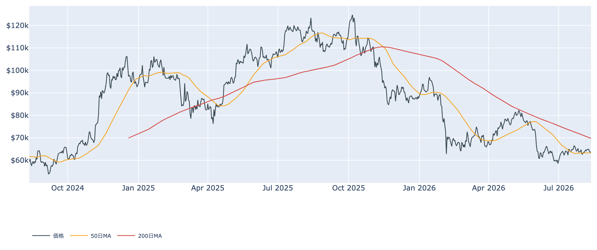
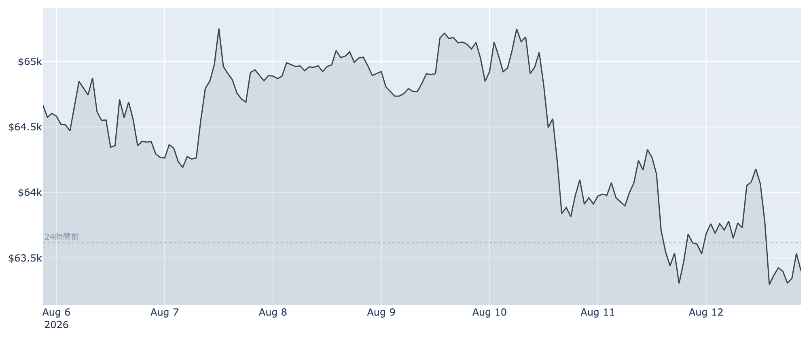
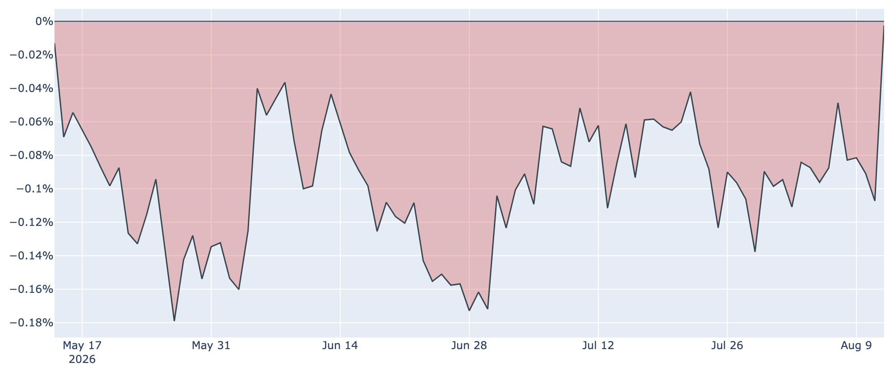
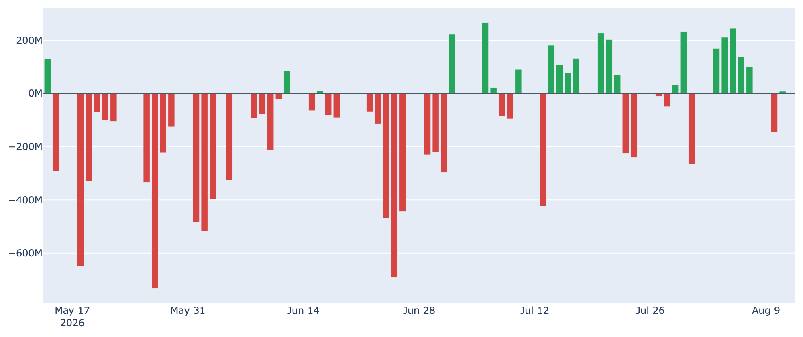
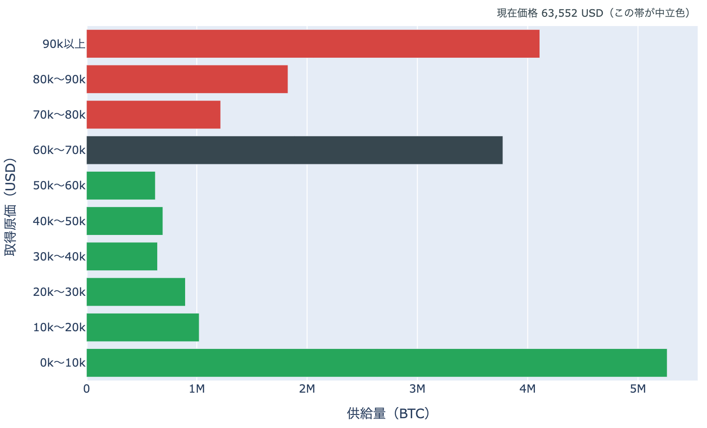

# 物価指標の追い風は一日ももたず ― 6万3,400ドル、50日線の真上で長期勢の売りが深まる

**2026年8月13日**

8月12日に発表された米国の物価指標は、市場が待っていた方向の内容でした。それを受けてビットコインは一時6万4,200ドル付近まで上げたものの、8月13日7時00分（日本時間）時点では約6万3,400ドル。24時間では約0.4%の下げに転じ、上げ幅をほぼ吐き出しています。追い風が吹いた日でさえ上値が伸びない理由は、価格の外側ではなく内側――誰が売っているか――にありそうです。

（価格と米国の価格差は8月13日7時00分（日本時間）時点、市場心理は8月12日時点、オンチェーン指標は8月11日時点、ETF資金フローは8月11日時点までの各種データに基づいています。）

## 1. 全体像：材料は好転、需給は好転せず

7月の米消費者物価指数は前月比+0.1%、前年比3.4%と、6月の3.5%からわずかに鈍化しました。食品とエネルギーを除いたコアも前年比2.5%へ低下。これを受けて、9月の会合での利上げ確率は市場の織り込みで42%まで下がっています。リスク資産にとっては素直に追い風の内容です。

それでもビットコインの位置取りは前日とほとんど変わりませんでした。50日移動平均は約6万3,300ドルで、現在値との差は0.1%足らず。この線の上にかろうじて乗っているだけの状態が3日続いています。200日移動平均（約6万9,700ドル）は9%上方にあり、中期の地合いは「デッドクロス圏（弱い側）」のままです。

Fear & Greed（＝市場心理の指数）は8月12日時点で27の「恐怖」圏。1週間前も30日前もほぼ同じ水準で、物価指標の好転は投資家の気分をまだ動かしていません。

## 2. 注目すべきポイント

### ① 好材料を半日で消化しきれなかった値動き

* **値動き**: 24時間のレンジは6万3,200〜6万4,400ドル。物価指標の発表後にいったん上端方向へ振れたあと、そのまま押し戻されました。7日レンジ（6万3,200〜6万5,400ドル）の下端付近に張り付いたままです。
* **読み方**: 材料で上げた分をその日のうちに返す形は、上値に待っている売り注文が材料の強さを上回っていることを示します。7日間で約1.9%安、一方で30日間では約1.8%高。方向感のないレンジが1か月続いている構図は変わりません。

### ② 長期保有層の売り越しが、一週間で6倍に深まった

* **保有量の増減**: 長期保有層（155日以上）の30日間の保有量変化は、8月11日時点で-約15.6万BTC。1週間前は-約2.4万BTCでしたから、この7日間で売り越し幅が6倍以上に広がりました。30日前は+約29.4万BTCの買い越しだったので、ひと月で「備蓄」から「放出」へ完全に裏返っています。
* **手放し方**: LTH-SOPR（＝長期勢の損益）は約0.86で、1週間前の約0.93からさらに低下。原価を2割ほど下回る値段で手放す動きが続いており、利益確定ではなく撤退に近い売り方です。市場全体のSOPR（＝動いたコインの損益）も約0.99と1割れが定着しています。
* **なぜ効くか**: 8月の反発局面で下値を支えてきたのはこの層でした。その主役が売り手側に回ったまま深まっているため、好材料が出ても上値が軽くならない状態が続いています。

### ③ 米国需要のディスカウントが、ほぼ消えた

* **Coinbase Premium（＝米国とそれ以外の価格差）**: 8月13日7時00分時点でほぼゼロ（-0.00%）。1週間前は-0.10%、30日前は-0.11%でしたから、この差は明確に縮まりました。マイナス圏は99日連続と記録的な長さですが、深さという意味では過去10か月で最も浅い部類です。
* **注意点**: これは進行中の値であり、確定した一日の差ではありません。8月8日にも-0.05%まで縮んだあと3日で-0.11%へ戻り切った経緯があるため、ゼロ接近が定着するかどうかは数日見る必要があります。それでも、米国勢の弱気がここまで薄まる場面は4月以来ありません。

### ④ ETFの買いは8月を通して続いている

* **8月の流れ**: 8月4日から11日までの6営業日で、日次フローの合計は約+5.6億ドル。このうち流出は8月10日の1日（約-1.45億ドル）だけで、翌11日には小幅ながら約+780万ドルのプラスへ戻りました。7月ひと月分を上回るペースの流入が、8月に入ってから続いています。
* **構図**: 長期保有層が放出しているコインを、ETFという箱が吸収している――8月の相場は基本的にこの綱引きです。価格が動かないのは、買い手が不在だからではなく、両者の力がほぼ拮抗しているからだと読めます。

### ⑤ マイナーの採算は厳しさを増している

* **ハッシュレート**: 約823EH/sで、30日間に約10%低下しました。前日時点の約4%低下から一段と落ち込みが目立ちます。効率の悪い設備が停止に追い込まれている形です。
* **難易度と収益**: 次回の採掘難易度調整は-3.97%程度の見込み（進捗28%時点）。Puell Multiple（＝マイナー収入の平年比）は約0.67と、過去4年で見ても低い水準に沈んだままです。短期的にはマイナーの売り圧力になりますが、難易度低下は生き残った側の採算を改善させる方向にも働きます。

（補足：先物の資金調達率は直近8時間で+0.009%（年率にして約10%）で、プラスが62回連続（約20日）。建玉は約11.1万BTC（約70億ドル）と7日間で約1%増え、前日の縮小からわずかに戻しました。傾きは強気寄りですが、上限（8時間あたり±0.3%）には遠く、過熱と呼べる水準ではありません。手数料市場は1〜2sat/vBと閑散のままです。）

## 3. 相場転換を見極める3つの分岐点

### ① 50日移動平均（約6万3,300ドル）を守れるか

現在値との差はわずか0.1%で、実質的に線の上に座っているだけの状態です。8月5日に取り返し、8月11日の急落もここで止まりました。日足で明確に割り込めば、8月の反発は「戻り売りに終わった」という整理になります。

### ② 6万ドルを割ったときの、支えの薄さ

取得原価の分布（URPD）を見ると、現在価格を含む6万〜7万ドルの帯に約380万BTCが集中する一方、その下の5万〜6万ドルの帯は約62万BTCと極端に薄くなっています。6万ドルを割ると、そこから下には「この値段で得た供給」がほとんどない空白地帯に入るため、価格が滑りやすくなります。裏を返せば、いま価格の周囲に厚い層があること自体が、6万3,000ドル台でレンジが続いてきた理由でもあります。

なお、これはコインの取得原価の分布であって、誰がどれだけ持っているかを示すものではありません。原価も生成日の終値による近似です。

### ③ 9月のFOMCと、米国需要の向き

次回の米連邦公開市場委員会は9月15〜16日。7月の物価指標を受けて利上げ確率は42%まで下がりましたが、依然として据え置きとの間で見方が割れています。金融政策の側で圧力が抜けるなら、あとは米国側の現物需要が戻るかどうかです。その意味で、ゼロ手前まで縮んだ米国とそれ以外の価格差がプラスへ転じるかが、当面いちばん分かりやすい目印になります。

## 総括

物価指標という追い風が吹いた日でさえ、ビットコインは6万4,000ドル台に定着できませんでした。理由は需給側にあります。8月に入って長期保有層の売り越しは-15.6万BTCまで深まり、それをETFの流入がちょうど打ち消している――だから価格はほとんど動かない。ただし米国とそれ以外の価格差はゼロ手前まで戻し、99日続いた米国需要の弱さには変化の兆しが見えます。売り手の勢いが先に尽きるか、支えの50日線が先に折れるか。まずは6万3,300ドルを守れるかどうかが、この綱引きの当面の判定線です。

---

*本稿は情報提供を目的としたものであり、投資助言ではありません。将来の価格動向を保証・示唆するものではなく、投資判断は各自の責任において行ってください。*
