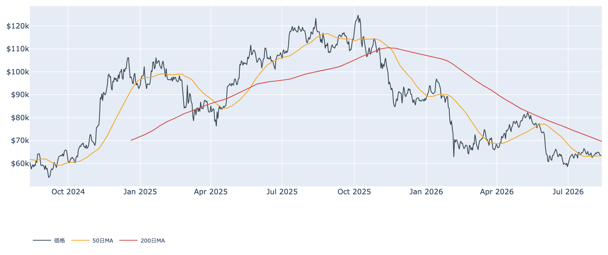
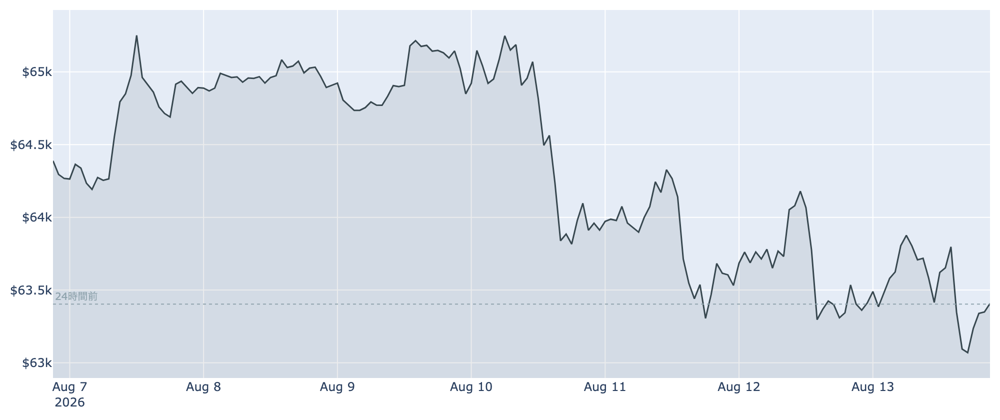
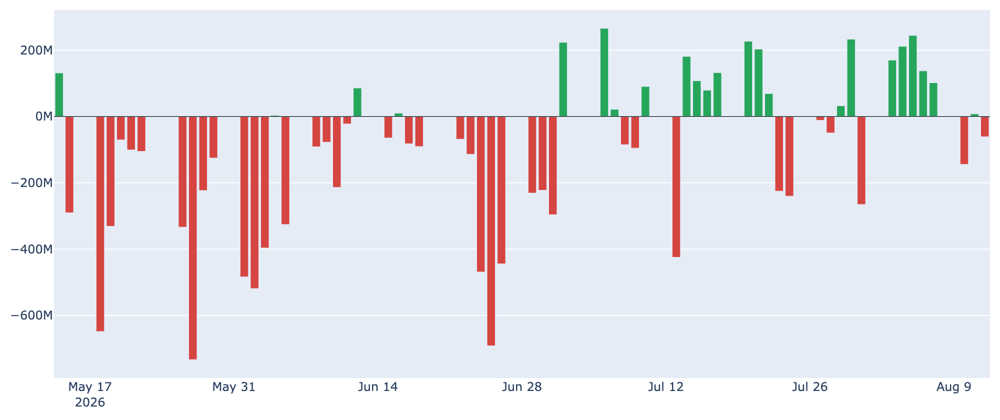
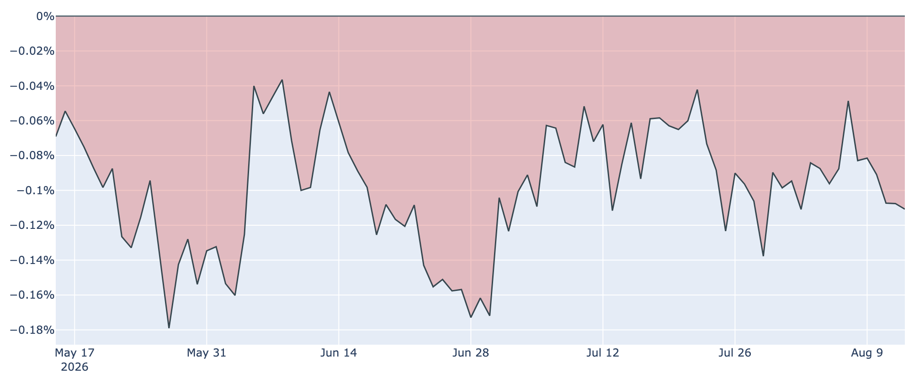
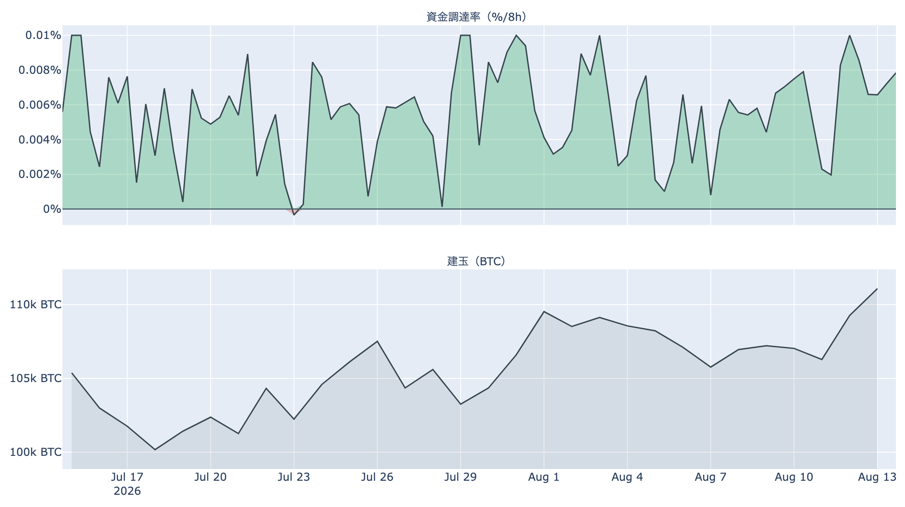

# 米国株は最高値、ビットコインは24時間で±0% ― 6万3,400ドル、50日線に張り付く

**2026年8月14日**

8月13日の米国株はS&P500種が初めて7,800を超えて過去最高値を更新しました。同じ日、ビットコインはほとんど動いていません。8月14日7時00分（日本時間）時点で約6万3,400ドル、24時間の変化は±0%。リスク資産全体が上を向くなかで、ビットコインだけが50日移動平均線の真上でぴたりと止まっています。動かない一日の内側で何が起きているかを、オンチェーン・オフチェーンの指標から整理します。

（価格・ネットワークの数値は8月14日7時00分（日本時間）時点、市場心理は8月13日時点、オンチェーン指標とETF資金フローは8月12日時点のデータに基づいています。）

## 1. 全体像：外は追い風、中は売り手が主役のまま

株式市場は7月の物価指標（8月12日発表、前年比3.4%）と生産者物価（前月比横ばい）を受けて、インフレ鈍化を素直に買いに行きました。ビットコインはその流れに乗れていません。

* **上値を抑える勢い（長期勢の投げ）**: 長期保有層が保有を減らし続けており、しかもそれが利確ではなく損切りです。今の相場でいちばん強い売り圧力はここにあります。
* **下値を支える勢い（買いの薄い足場）**: 8月前半に相場を持ち上げた米国の現物ETFの買いは、直近の数営業日で失速しました。代わりに支えているのは先物のロング（買い持ち）で、これは長続きする買い手とは言えません。

市場心理は依然として「恐怖」圏（100点満点で29）にあり、株の最高値更新とは対照的な空気が続いています。価格の位置は50日移動平均（約6万3,400ドル）とほぼ同値、200日移動平均（約6万9,600ドル）は大きく上――中期の地合いは弱いままです。

## 2. 注目すべき5つのポイント

### ① 24時間で「±0%」、ただし中身は動いていた

* 24時間の値幅は約6万2,800〜6万4,000ドル。**この間に1週間の安値（約6万2,800ドル）をつけて戻しています**。数字の上では無風でも、下を試して押し返された一日でした。
* 週で見ると1週間前より約1.3%安、1か月前より約2.4%安。8月8〜9日につけた6万5,400ドル台からは、じりじりと水位が下がっています。

### ② 長期勢の売りが「損切り」で加速している

* **長期勢の保有量の増減**: 過去30日で約-15万BTCと、売り越しが一段と深まりました。1週間前は約-3.7万BTC、1か月前は+26万BTCの買い越しでしたから、この1か月で完全に向きが変わったことになります（8月12日時点）。
* **長期勢SOPR（＝長期勢の損益）**: 0.80。**動いた古いコインが平均して約2割の損失で手放されている**という意味です。1週間前の0.83からさらに低下しました。高値で買った古参が、戻りを待たずに降りている構図です。

### ③ ETFの買いは3営業日で息切れ

* 8月3日から7日まで5営業日続いた資金流入は、そこで途切れました。8月10日は約-1億4,000万ドル、11日はほぼ横ばい、12日は約-6,100万ドルと、直近3営業日で差し引き約2億ドルの流出です。
* 7日間の合計ではまだ約+5億ドルのプラスですが、これは前半の5日で稼いだ貯金であり、勢いは今の水準では止まっています。

### ④ 米国の需要は戻るどころか弱まった

* **Coinbase Premium（＝米国とそれ以外の価格差）**: -0.11%（8月13日時点）で、マイナス圏が100日連続となりました。
* 注目すべきは方向です。1週間前は約-0.09%、1か月前も約-0.09%で、**マイナス幅はむしろ広がっています**。株式市場に資金が向かうなか、米国勢はビットコインを買い上がっていません。

### ⑤ 先物：建玉は増えているのに、価格はついてこない

* **建玉（＝先物の未決済残高）**は約11万BTC（約70億ドル）で、7日間で+3.7%。一方で価格は同じ7日間で約1.3%下げています。**新しく入ってきた買い持ちが、報われていない**状態です。
* **資金調達率（＝先物の買い持ちが払う金利）**は8時間あたり+0.0098%（年率にして約11%）で、プラスが約22日続いています。過熱と呼ぶ水準ではありませんが、傾きは一貫して買い方向です。
* 買い持ちが積み上がったまま価格が下を試すと、投げが投げを呼ぶ形になりやすくなります。①で触れた6万2,800ドル割れが起きた場合の下落は、速くなりやすい地合いです。

## 3. 相場転換を見極める3つの分岐点

1. **50日移動平均（約6万3,400ドル）を守れるか**: 現在値はこの線とほぼ同値で、支えとして機能するかを試している最中です。ここを日足で明確に割ると、次の目安は1週間の安値（約6万2,800ドル）になります。逆に反発できれば、8月の上昇の押し目として整理できます。
2. **短期勢の平均取得原価（約6万7,200ドル）まで戻せるか**: 直近半年内に買った層の平均コストで、現在価格は約6%下。ここを回復するまでは「戻ったら売りたい人」が上値に居座り続けます。当面はまだ遠い水準です。
3. **9月のFRB会合をどう織り込むか**: 政策金利は3.50〜3.75%に据え置かれたままで、市場は9月会合について**利上げの確率を4割強**とみています。7月のインフレ鈍化はその見方を和らげる材料ですが、まだ「利下げを織り込む」段階ではありません。株が最高値を更新してもビットコインが動かないのは、この金利観の重さが効いている面があります。

## 総括

24時間の変化が±0%という数字は、需給が均衡していることを意味しません。今日のビットコインは、**長期勢の損切りという明確な売り**を、**ETFの息切れした買いと先物のロング**が辛うじて受け止めている状態です。株式市場が最高値を更新し、物価も落ち着いてきたという外部環境の追い風を、価格に転換できていません。50日移動平均の真上という位置は、この綱引きがどちらに傾くかを見るのに、これ以上ないほど分かりやすい場所にあります。

---

*本稿は情報提供を目的としたものであり、投資助言ではありません。将来の価格動向を保証・示唆するものではなく、投資判断は各自の責任において行ってください。*
