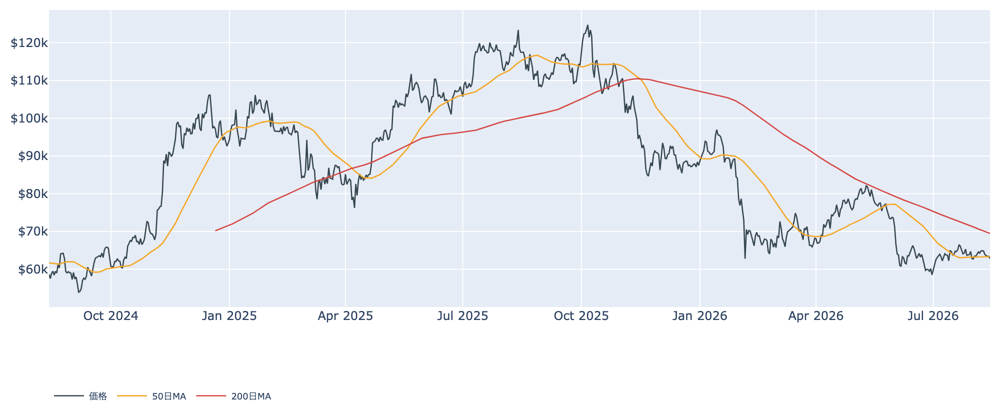
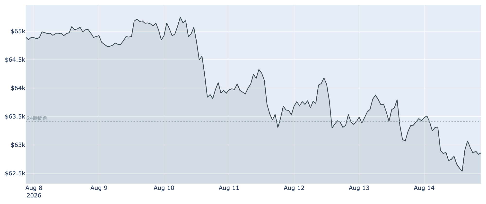
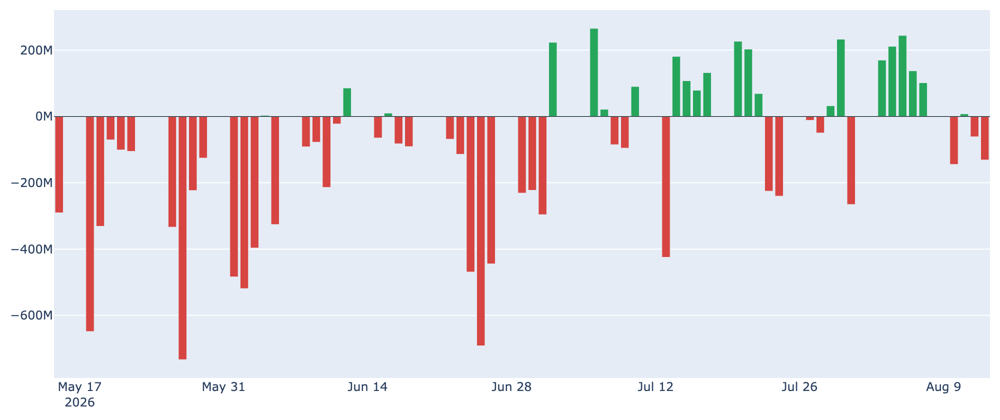
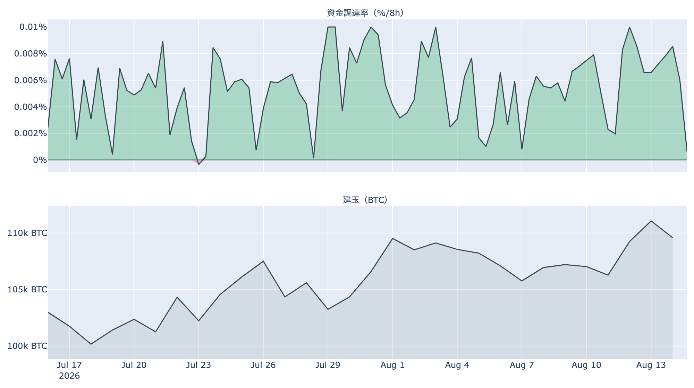
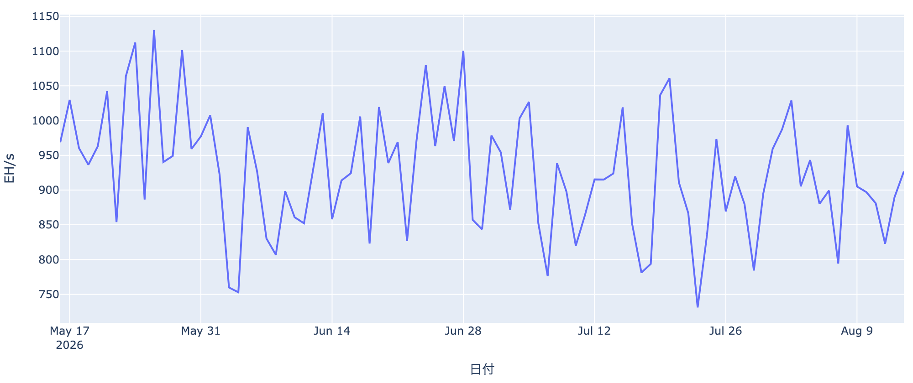
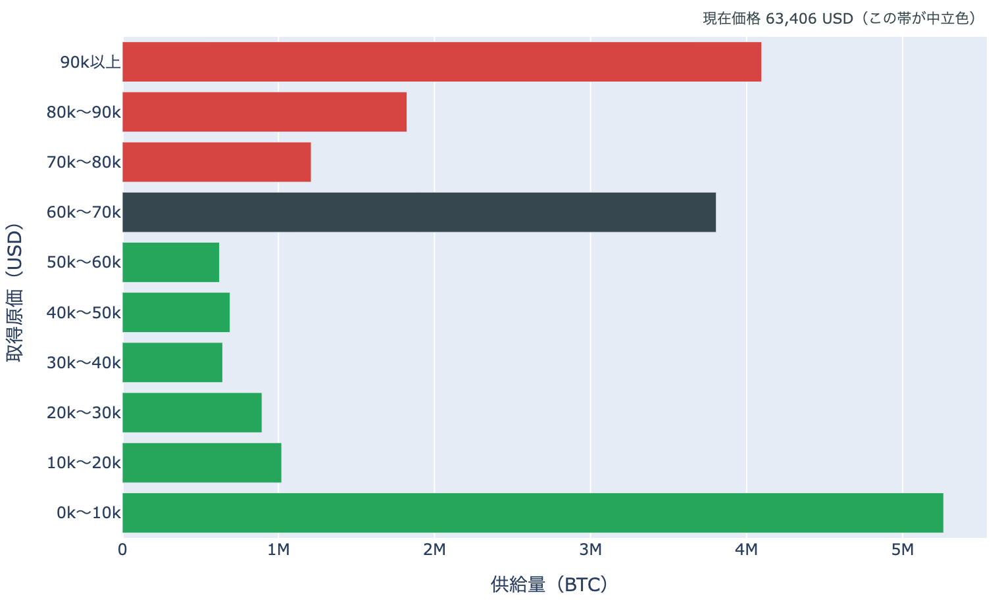

# 支えだった50日線を割り込む ― 6万2,900ドル、下がるほど原価の層は薄くなる

**2026年8月15日**

今週の材料はビットコインにとって悪くありませんでした。7月の物価指標は落ち着き、9月の利上げ観測は月初の6割超から2〜3割へ後退し、米国株は最高値を更新しています。それでも価格は8月15日7時00分（日本時間）で約6万2,900ドル。24時間で約0.9%安、1週間で約3.1%安となり、ここ数日ぎりぎりで支えられていた50日移動平均をついに下回りました。追い風のなかで下げる相場の中身を、オンチェーン・オフチェーンの指標から整理します。

（価格・ネットワークの数値は8月15日7時00分（日本時間）時点、市場心理は8月14日時点、オンチェーン指標とETF資金フローは8月13日時点のデータに基づいています。）

## 1. 全体像：外の追い風が、内側の売りに届いていない

* **上値を抑える勢い**: 米国勢の買いが止まっています。現物ETFは4営業日のうち3日が流出、米国とそれ以外の価格差もマイナス幅が広がりました。長期保有層の売り越しも続いています。
* **下値を支える勢い**: 先物の買い持ちだけが増え続けています。ただしこれは現物を抱える買い手ではなく、支えとしては脆いものです。

市場心理は「恐怖」圏（100点満点で29）のまま1週間動いていません。パニック的な投げではなく、買い手が出てこないまま水位が下がる形の下落です。バリュエーションで見れば、市場全体の含み益は過去4年でもかなり低い水準にあり、割高感はありません。問題は割安さではなく、買う人がいないことにあります。

価格の位置は50日移動平均（約6万3,400ドル）を約0.9%下回り、200日移動平均（約6万9,500ドル）ははるか上。中期の地合いは弱いままです。

## 2. 注目すべき5つのポイント

### ① 50日線を割り、1週間の安値を更新した

* 24時間の値幅は約6万2,500〜6万3,600ドル。この下限は1週間の安値でもあり、**下を試して戻せなかった**一日でした。
* 8月8〜9日の6万5,400ドル台から、5日連続で水位が切り下がっています。1か月前と比べても約2.9%安です。
* 昨日まで「50日線の真上」でこらえていた形が崩れました。テクニカル上の支えという意味では、当面わかりやすい足場を失っています。

### ② 米国勢の買いが止まった

* **ETF資金フロー**: 8月13日は約-1億3,100万ドル。8月10日以降の4営業日で差し引き約3億3,000万ドルの流出です。7日間の合計はまだ約+1億5,000万ドルのプラスですが、これは8月上旬に稼いだ貯金の残りにすぎません。
* **Coinbase Premium（＝米国とそれ以外の価格差）**: 8月15日7時00分時点で約-0.10%。マイナス圏が101日連続となり、しかも1週間前の約-0.05%から**幅は倍に広がりました**。株が最高値を更新するなかで、米国の資金はビットコインに向かっていません。

### ③ 長期勢の売りは続く、ただし「投げ」の深さは和らいだ

* **長期勢の保有量の増減**: 過去30日で約-14万BTCと、売り越しが続いています（8月13日時点）。1週間前は約-4.9万BTC、1か月前は+21万BTCの買い越しでしたから、この1か月で向きが変わったことは変わりません。
* **長期勢SOPR（＝長期勢の損益）**: 0.94。動いた古いコインが平均して約6%の損失で手放されたという意味です。ただし前日の0.80からは戻しており、**最も深い投げは一巡した可能性**があります。ここが1に近づいてくれば、売り圧力の質は変わります。

### ④ 先物：建玉は増え続け、強気の傾きは半減

* **建玉（＝先物の未決済残高）**は約11万2,000BTC（約70億ドル）で、7日間で+3.6%。同じ7日間で価格は約3.1%下げており、**入ってきた買い持ちが報われていない**構図が続いています。
* **資金調達率（＝先物の買い持ちが払う金利）**は8時間あたり+0.0043%（年率にして約4.7%）。プラスは約23日続いていますが、前日の約+0.0098%から半分以下に落ちました。強気に傾ける動きが弱まっています。
* 含み損の買い持ちが積み上がったまま安値を試す形は、下げが速くなりやすい地合いです。①の6万2,500ドル割れが起きた場合は注意が要ります。

### ⑤ マイナーの撤退が数字に出てきた

* **ハッシュレート**（ネットワーク全体の計算力）は約927EH/sで、30日で約9%の低下。採算の合わない設備が止まり始めています。
* 次回の採掘難易度は約-3.4%の下方修正が見込まれています。短期的にはマイナーの売り圧力になりますが、難易度が下がれば生き残った側の採算は改善します。マイナー収入の平年比も低い水準が続いており、この調整はもう少し続きそうです。

## 3. 相場転換を見極める3つの分岐点

1. **6万ドル台という「原価の厚い帯」に留まれるか**: 取得原価の分布を見ると、6万〜7万ドルで得られた供給は約380万BTCと最大級の塊で、いまの価格はこの中にいます。一方、その下の5万〜6万ドル台は約60万BTCしかありません。**6万ドルを割ると、原価による足場は急に薄くなります**。逆に言えば、この帯にいる限りは「買値の近く」で持ちこたえている人が多く、慌てた売りは出にくい水準です。なお、これは取得原価の分布であって、誰がいくら持っているかを示すものではありません。

2. **50日移動平均（約6万3,400ドル）を早めに取り戻せるか**: 割った直後に戻せれば「一時的な下振れ」として整理できますが、この線の下に居座るほど、上の価格帯で買った層の戻り売りが上値の壁として意識されやすくなります。次に見えている本格的な壁は、短期勢の平均取得原価である約6万7,200ドルです。

3. **金利観の改善が価格に効き始めるか**: 9月の利上げ確率は月初の6割超から2〜3割へ下がりました。これはリスク資産にとって明確な追い風で、株はすでにそれを買っています。それでもビットコインが下げているのは、いまの弱さが金利ではなく需給（米国勢の買いの不在と長期勢の売り）に由来していることを示しています。ETFの流入が戻るかどうかが、この追い風を価格に変える条件です。

## 総括

外部環境は改善しているのに、価格は支えを一段割りました。今日のビットコインの弱さはマクロ由来ではなく、**買い手の不在**に由来しています。米国勢はETF経由でも現物価格でも買い上がらず、長期勢は売り越しを続け、残った買い手は先物のレバレッジだけ――その構図のまま、50日移動平均を明け渡しました。一方で、長期勢の投げの深さは和らぎ、価格はまだ最も厚い原価の帯の中にあります。下値の足場が本当に試されるのは6万ドル、上への転換が確認できるのは50日線の回復。しばらくはこの間で、どちらが先に来るかを見る局面です。

---

*本稿は情報提供を目的としたものであり、投資助言ではありません。将来の価格動向を保証・示唆するものではなく、投資判断は各自の責任において行ってください。*
