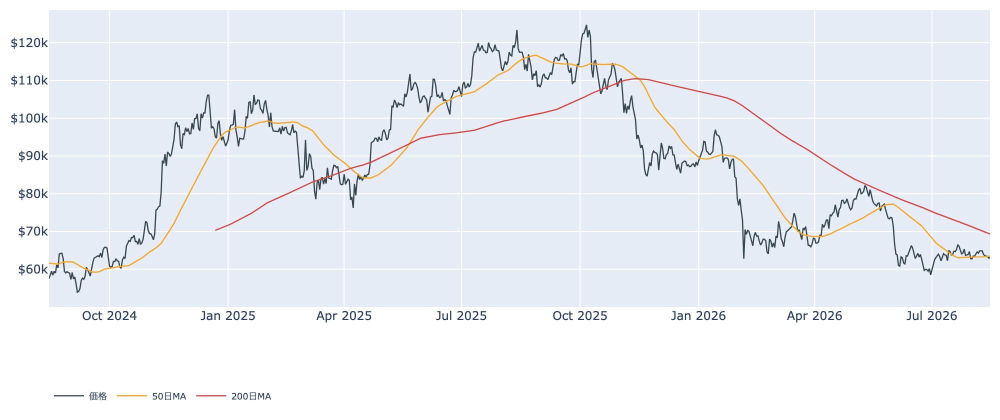
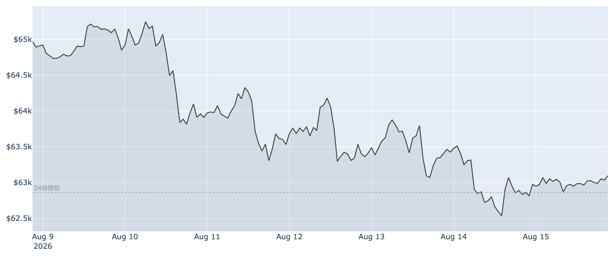
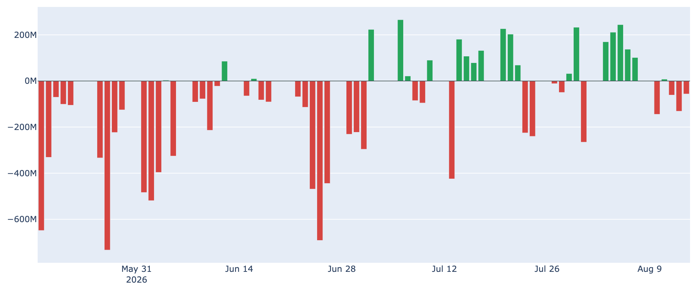
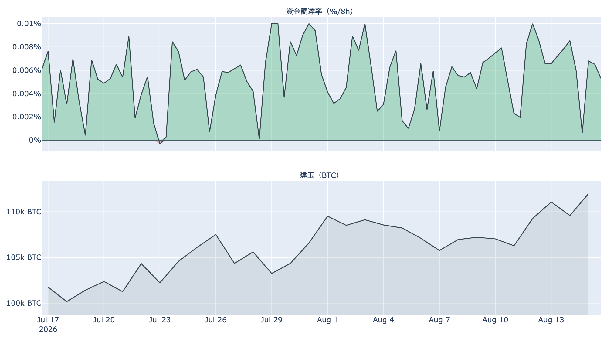
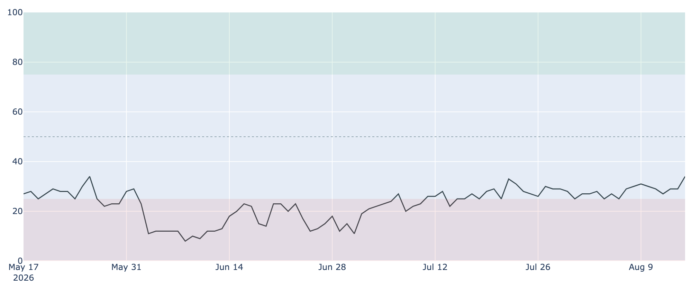

# 効いたのは金利ではなく規制 ― 週間2.8%安のあと、6万3,100ドルで止まる

**2026年8月16日**

先週のビットコインは、月曜から金曜にかけて約2,500ドルを失いました。物価指標は落ち着き、米国株はS&P500が7,800を超えて最高値を更新した週です。それでもビットコインだけが下げた理由は、金利ではなくワシントンにありました。米SEC（証券取引委員会）が8月14日に予定していた暗号資産ルールの採決を取りやめ、市場は年内の制度整備という前提を外しにかかっています。価格は8月16日7時00分（日本時間）で約6万3,100ドル。24時間では約0.4%高と、ようやく水位の低下が止まりました。この一週間の中身を、オンチェーン・オフチェーンの指標から整理します。

（価格・ネットワークの数値は8月16日7時00分（日本時間）時点、市場心理は8月15日時点、オンチェーン指標とETF資金フローは8月14日時点のデータに基づいています。）

## 1. 全体像：外は追い風、内は買い手不在のまま

* **下げの原因が入れ替わった**: 先週前半までは「金利観は改善しているのに買われない」でしたが、週後半に規制という具体的な材料が加わりました。予測市場では、米国の暗号資産関連法が年内に成立する確率が年初の約8割から約2割へ下がっています。
* **上値を抑える勢い**: 現物ETFは1週間の合計が流出超に転じ、米国とそれ以外の価格差もマイナスのまま102日目に入りました。長期保有層も売り越しを続けています。
* **下値を支える勢い**: 買いの実体は乏しく、増えているのは先物の持ち高だけです。ただし価格そのものは1週間の安値（約6万2,500ドル）を割らずに踏みとどまっています。

価格の位置は50日移動平均（約6万3,500ドル）を約0.7%下回り、200日移動平均（約6万9,400ドル）ははるか上です。中期の地合いは弱いままですが、割った直後の50日線はまだ手の届く位置にあります。

## 2. 注目すべき5つのポイント

### ① 安値は更新せず、値幅が細った

* 24時間の値幅は約6万2,700〜6万3,100ドル。前日に付けた1週間の安値（約6万2,500ドル）を試すことなく、狭いレンジで一日が終わりました。
* 1週間では約2.8%安ですが、1か月前と比べると約1.1%安にとどまります。8月上旬に上げた分をそのまま吐き出した形で、下方向に加速しているわけではありません。
* 週末で参加者が少ない時間帯であることは割り引いて見る必要があります。方向感が出るとすれば週明けです。

### ② 米国勢の買いは戻らず、1週間の合計がマイナスへ

* **ETF資金フロー**: 8月14日は約-5,600万ドル。7日間の合計は約1億4,600万ドルの流出超で、前日まで残っていた8月上旬の「貯金」が消えました。
* 流出の中身はほぼIBIT1本（約-5,600万ドル）で、他のファンドはほとんど動いていません。全面的な解約というより、大口の資金が一つ抜けている状態です。
* **Coinbase Premium（＝米国とそれ以外の価格差）**: 8月16日7時00分時点で約-0.10%。マイナス圏が102日連続となりました。株式市場に資金が向かうなかで、米国勢はビットコインを買い上がっていません。

### ③ 先物：持ち高は30日で最大、しかし強気の傾きは消えかけ

* **建玉（＝先物の未決済残高）**は約11万1,400BTC（約71億ドル）で、7日間で+4.7%。この30日でいちばん多い水準です。同じ7日間で価格は約2.8%下げており、**入ってきた持ち高が報われていない**構図が続いています。
* **資金調達率（＝先物の買い持ちが払う金利）**は8時間あたり+0.0017%、年率にすると約1.9%です。プラスは約24日続いていますが、30日平均（+0.0056%）の3分の1以下まで下がりました。買い持ちがほとんど手数料を払わずに済む＝強気に傾ける動きがほぼ消えた水準です。
* 含み損の持ち高が膨らんだまま値幅だけが細る形は、どちらかに動いたときに振れが大きくなりやすい地合いです。

### ④ 長期勢の投げは、一巡していなかった

* **長期勢SOPR（＝長期勢の損益）**は8月14日時点で0.89。動いた古いコインが平均して約11%の損失で手放されたという意味で、前日の0.94から再び沈みました。深い投げが終わったと見るのは早かったことになります。
* **長期勢の保有量の増減**: 過去30日で約-13.8万BTCの売り越し。1週間前は約-6.3万BTC、1か月前は+20.9万BTCの買い越しでしたから、この1か月で向きが完全に変わりました。
* 一方で**SOPR（＝動いたコインの損益）**は市場全体で0.996と、1のごくわずか下。市場全体としては損切りが殺到しているわけではなく、痛んでいるのは古参層に偏っています。

### ⑤ 心理は「恐怖」のまま、それでも改善に向いた

* **Fear & Greed（＝市場心理の指数）**は8月15日時点で100点満点の34。「恐怖」圏ですが、前日の29から一日で5ポイント上がり、1週間前（30）・1か月前（25）と比べても改善しています。価格が下げるなかで心理だけが上向くのは、下げが投げ売りによるものではないことの傍証です。
* **MVRV Z-Score（＝市場全体の含み益）**は約0.35で、過去4年でも下から2割ほどの低い水準。割高感はありません。
* ただし**短期保有層の平均取得原価は約6万7,100ドル**で、現在価格はこれを約6%下回ります。直近で買った層が含み損を抱えたままである点は変わっていません。

## 3. 相場転換を見極める3つの分岐点

1. **1週間の安値（約6万2,500ドル）を守れるか**: 今週この水準を割ると、次に意識されるのは6万ドルの節目です。取得原価で見ても6万ドルより下は供給の層が薄く、下げが速くなりやすい領域に入ります。逆にここを守ったまま週明けを迎えられれば、先週の下げは規制材料への一過性の反応として整理できます。

2. **50日移動平均（約6万3,500ドル）を早めに取り戻せるか**: 割ってからまだ2日で、価格との差は1%足らず。すぐに戻せば「一時的な下振れ」で済みますが、この線の下に居座るほど上値の壁として意識されます。その先の本格的な壁は、短期保有層の平均取得原価である約6万7,100ドルです。

3. **規制の日程が戻るか、そしてFRBの姿勢**: 見送られた採決がいつ仕切り直されるかが、当面いちばん大きな材料です。加えて9月16日のFOMCでは、市場は据え置きを7割超、利上げを2〜3割織り込んでいます（現行3.50〜3.75%）。利下げはほぼ想定されていません。物価指標の落ち着きで利上げ観測は後退しましたが、それが価格に効くには、まずETF経由の資金が戻る必要があります。

## 総括

先週の下げは、金利でもマクロでもなく制度への期待の後退が主因でした。株が最高値を更新するなかでビットコインだけが2.8%下げたのは、外部環境ではなく暗号資産固有の材料が効いた証拠です。そのぶん、材料が戻れば反転の理屈も立ちます。足元では価格が1週間の安値の手前で止まり、心理はむしろ改善し、値幅は細りました。一方で長期勢の投げは深まり、先物の持ち高だけが積み上がっています。売り手が枯れる前に買い手が戻るかどうか――当面は6万2,500ドルと50日移動平均（約6万3,500ドル）の間で、どちらが先に破られるかを見る局面です。

---

*本稿は情報提供を目的としたものであり、投資助言ではありません。将来の価格動向を保証・示唆するものではなく、投資判断は各自の責任において行ってください。*
