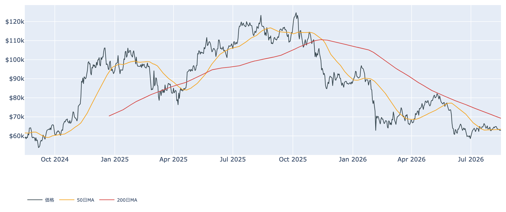
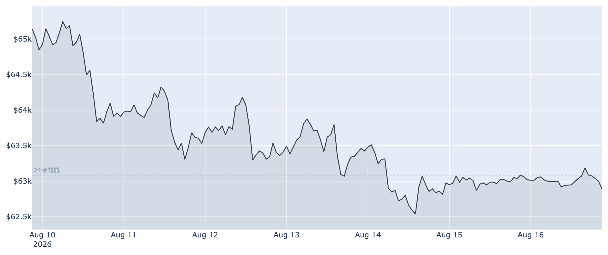
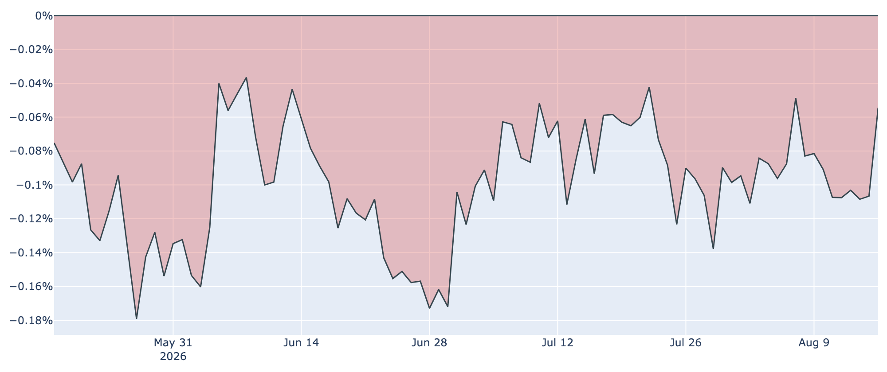
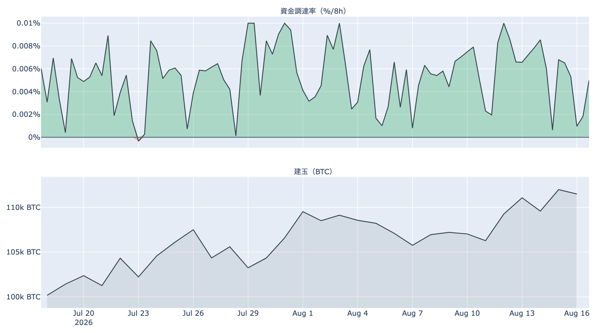
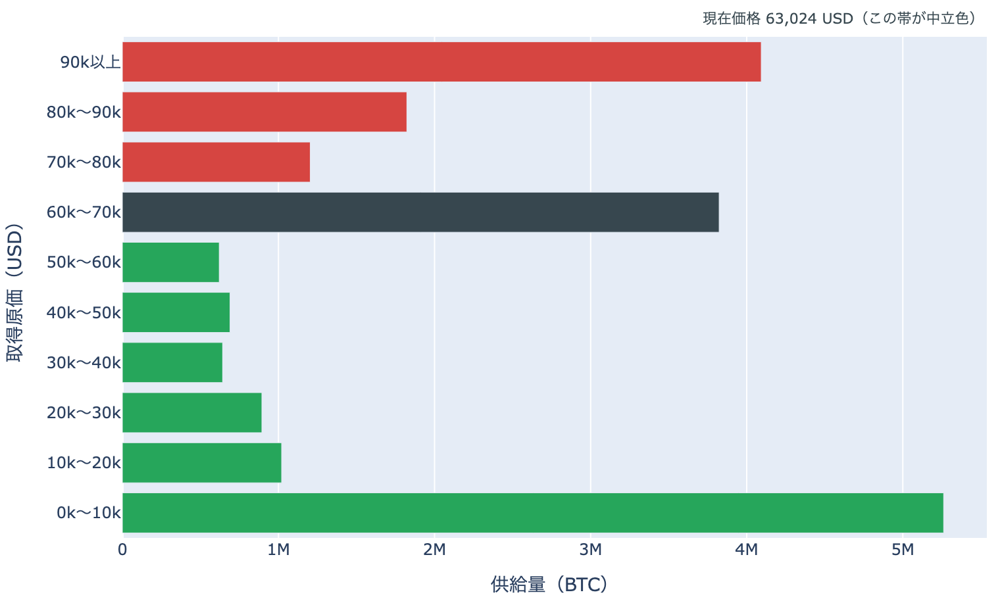

# 売り手が細ってきた ― 6万2,900ドル、長期勢の投げは4日続けて浅くなった

**2026年8月17日**

週明けの朝、ビットコインは約6万2,900ドル。24時間の変化は約-0.4%、値幅は600ドルほどしかなく、先週末からの膠着がそのまま続いています。買い手が戻った気配はまだありません。ただ先週いちばんの重しだった長期保有層の売りは、4日続けて勢いを落としています。買いが増えて上がるのではなく、売りが枯れて下げ止まる――そういう形の底入れが始まりかけているのかどうか。今朝の指標を整理します。

（価格・ネットワーク・先物の数値は8月17日7時00分（日本時間）時点、市場心理は8月16日時点、オンチェーン指標は8月15日時点、ETF資金フローは8月14日時点のデータに基づいています。）

## 1. 全体像：下げは止まったが、上げる材料も揃っていない

* **先週の重しは動いていない**: 8月14日に予定されていた米SEC（証券取引委員会）の暗号資産ルール採決は見送られたまま、新しい日程は出ていません。制度整備が年内に進むという前提が外れた状態が続いています。
* **上値を抑える勢い**: 現物ETFは1週間の合計が流出超。米国とそれ以外の価格差もマイナスのまま103日目に入りました。米国株が最高値圏にあるなかで、資金はビットコインへ向かっていません。
* **下値を支える勢い**: 明確な買いではなく「売りの減速」です。長期保有層の売り越し幅は8月11日をピークに4日続けて縮み、先物では買い持ちに傾ける動きがわずかに戻りました。

価格の位置は50日移動平均（約6万3,600ドル）を約1.1%下回り、200日移動平均（約6万9,200ドル）ははるか上です。中期の地合いは弱いままですが、50日線との差は1%台で、まだ手の届く距離にあります。

## 2. 注目すべき5つのポイント

### ① 値幅がさらに細り、週安値は試されなかった

* 24時間のレンジは約6万2,700〜6万3,300ドル。前日に付けた水準の内側で収まり、1週間の安値（約6万2,500ドル）を試すことなく週末を終えました。
* 1週間では約3.1%安ですが、1か月前と比べると約1.6%安にとどまります。8月上旬に積み上げた分を吐き出したところで止まっており、下方向に加速してはいません。
* 週末の薄商いという事情はあります。方向感が出るとすれば、参加者が戻る今週前半です。

### ② 長期勢の投げが、4日続けて浅くなった

* **長期保有層の保有量の増減**: 過去30日で約-12.9万BTCの売り越しです。8月11日の約-15.6万BTCを底に、4日続けて売り越し幅が縮みました。1週間前は約-6.7万BTC、1か月前は+19.6万BTCの買い越しでしたから、向きが変わった事実は動きません。ただし「悪化の速度」は明確に鈍っています。
* **長期勢SOPR（＝長期勢の損益）**は8月15日時点で0.96。動いた古いコインが平均して約4%の損失で手放されたという意味で、前日の0.89（約11%の損失）から浅くなりました。ただしこの指標は日ごとの振れが大きく、直近1週間は0.80〜0.96の間を行き来しています。一日の改善で「投げが終わった」と決めるには早すぎます。
* **SOPR（＝動いたコインの損益）**は市場全体で0.999、短期勢に限っても1.000と、ほぼ損益ゼロの水準です。市場全体としては損切りが殺到する局面ではありません。

### ③ 米国勢の弱気は半分になったが、ETFの資金は戻っていない

* **Coinbase Premium（＝米国とそれ以外の価格差）**: 8月17日7時00分時点で約-0.05%。前日の約-0.11%から弱気の度合いが半分になり、1週間前（約-0.08%）よりも改善しました。とはいえマイナス圏は103日連続で、米国勢が買い上がる側に回ったわけではありません。
* **ETF資金フロー**: 最新の数字は8月14日の約-5,600万ドルで、週末をはさんで更新されていません。7日間の合計は約1億4,600万ドルの流出超のままです。流出の中身はほぼIBIT1本で、他のファンドはほとんど動いていません。
* 価格差の改善は「売り圧力が緩んだ」ことを示しますが、実際の資金がプラスに転じるのはETFの数字が更新される今週以降の話です。

### ④ 先物：強気の傾きが少し戻り、持ち高はわずかに減った

* **資金調達率（＝先物の買い持ちが払う金利）**は8時間あたり+0.0043%、年率にすると約4.8%です。ほぼゼロまで沈んでいた前日（年率約1.9%）から2倍以上に戻り、30日平均（+0.0054%）に近づきました。プラスは74回連続、約25日続いています。
* もっとも年率5%弱は、この銘柄の水準としては平常です。買い持ちが過熱している状態とは言えません。
* **建玉（＝先物の未決済残高）**は約11万800BTC（約70億ドル）で、7日間で+4.0%。前日の約11万1,400BTCからわずかに減りました。積み上がり続けていた持ち高が、ここへ来て頭打ちになっています。
* 値幅が細るなかで持ち高が減り始めるのは、様子見に転じた参加者が出ている合図です。

### ⑤ 心理は「恐怖」で足踏み、割高感は依然としてない

* **Fear & Greed（＝市場心理の指数）**は8月16日時点で100点満点の34。前日と同じ値で、「恐怖」圏にとどまりました。1週間前（31）・1か月前（27）と比べれば改善していますが、この2日は上向きが止まっています。
* **MVRV Z-Score（＝市場全体の含み益）**は約0.35で、過去4年でも下から2割ほどの低い水準です。バリュエーションの面で割高な部分はありません。
* ただし**短期保有層の平均取得原価は約6万7,100ドル**で、現在価格はこれを約6%下回ります。直近で買った層が含み損を抱えたままである構図は変わっていません。

（補足：ハッシュレートは約918EH/sで、1か月で約17.6%増えました。価格が横ばいのまま採掘競争だけが強まっており、マイナー収入の平年比を示すPuell Multipleは0.75と低いままです。次回の難易度調整は約-1.0%の見込みです。）

## 3. 相場転換を見極める3つの分岐点

1. **1週間の安値（約6万2,500ドル）を今週も守れるか**: 週末は試されずに済みましたが、参加者が戻る今週が本番です。ここを割ると次に意識されるのは6万ドルの節目で、取得原価の分布を見ると6万ドルより下は供給の層が薄く、いったん入ると値動きが速くなりやすい領域です。逆に守り切れれば、先週の下げは規制材料への一過性の反応として整理できます。

   

2. **売りの減速が、買いの再開につながるか**: 長期勢の投げが浅くなったことと、ETFに資金が戻ることは別の話です。前者は「下げ止まり」まで、後者がなければ「上昇」にはなりません。当面の目安は、現物ETFの日次が再びプラスに転じ、米国とそれ以外の価格差がゼロに近づくかどうか。50日移動平均（約6万3,600ドル）を早めに取り戻せるかが、その最初の目に見える形になります。

3. **マクロと制度の日程**: 9月16日のFOMCについて、市場は据え置きと利上げをほぼ拮抗した確率で見ており、利下げはほとんど織り込まれていません（現行3.50〜3.75%）。その前に8月27〜29日のジャクソンホール会合があり、28日にはウォーシュFRB議長の講演が予定されています。加えて、見送られたSECの採決がいつ仕切り直されるか。この3つのうちどれかで空気が変われば、細った値幅は一気にほどけます。

## 総括

先週の下げは止まりましたが、止めたのは買いではなく「売りの息切れ」です。長期勢の投げは4日続けて浅くなり、米国勢の弱気も半分になり、先物では買い持ちの傾きがわずかに戻りました。一方でETFの資金はまだ出ていく側にあり、心理は「恐怖」のまま足踏みしています。値幅は600ドルまで細り、先物の持ち高も増加が止まりました。売り手が枯れかけたところへ買い手が戻れば50日移動平均（約6万3,600ドル）の奪還が視野に入り、戻らなければ1週間の安値（約6万2,500ドル）が改めて試されます。今週は、その答えが出やすい週です。

---

*本稿は情報提供を目的としたものであり、投資助言ではありません。将来の価格動向を保証・示唆するものではなく、投資判断は各自の責任において行ってください。*
