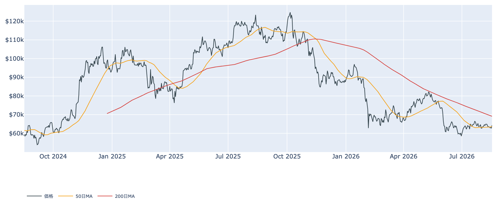
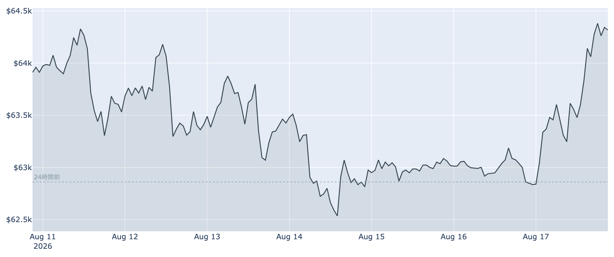
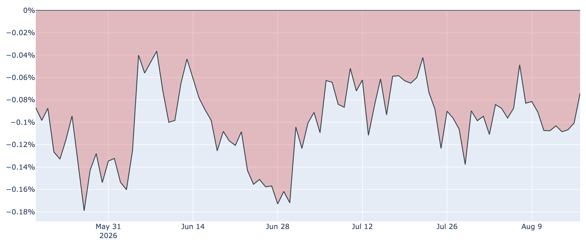
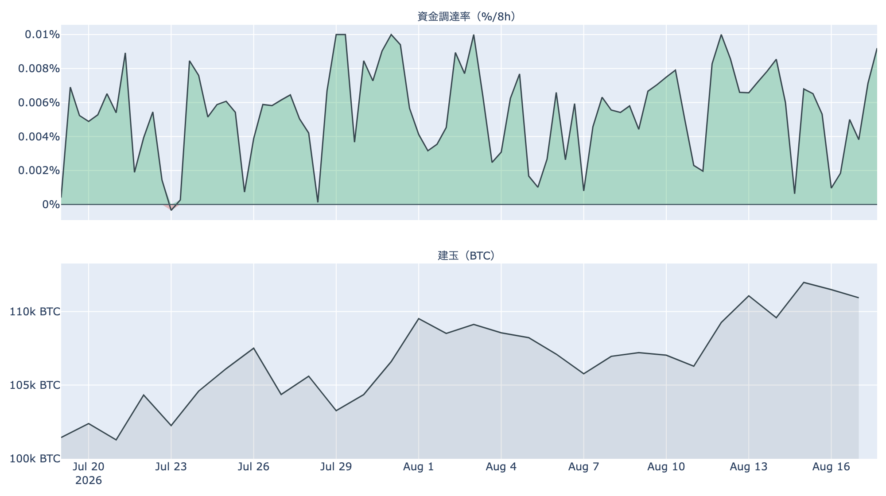
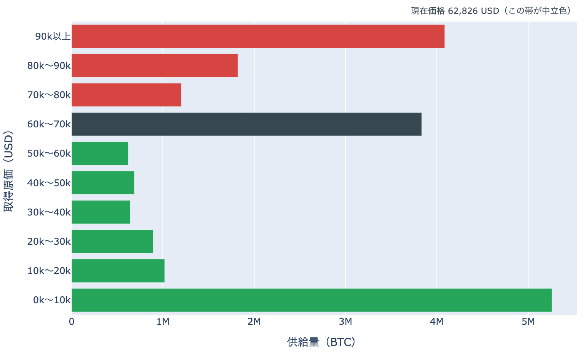

# 利上げ観測の後退で6万4,300ドル ― 上げを作ったのは外の材料、長期勢は戻りを売った

**2026年8月18日**

火曜の朝、ビットコインは約6万4,300ドル。24時間で約+2.4%上げ、先週割り込んだ50日移動平均を取り戻しました。ただし材料は暗号資産の外にあります。9月の利上げ観測が急速に薄れ、ドルが6月上旬以来の安値に沈んだ――その追い風です。一方でオンチェーンの中身は改善していません。むしろ長期保有層は、この戻りを売っています。今朝の指標を整理します。

（価格・ネットワーク・先物の数値は8月18日7時00分（日本時間）時点、市場心理は8月17日時点、オンチェーン指標は8月16日時点、ETF資金フローは8月14日時点のデータに基づいています。）

## 1. 全体像：外から来た追い風、中身は変わらず

* **上げた理由**: 米国の物価指標が落ち着いたことで、9月の利上げ確率の織り込みは1週間前の約52%から約31%へ下がりました。ドル指数は6月上旬以来の安値です。リスク資産全般に効く追い風であって、ビットコイン固有の買い材料ではありません。
* **上値を抑える勢い**: 現物ETFは1週間の合計が流出超のまま、米国とそれ以外の価格差もマイナス圏で104日目です。8月14日に見送られた米SEC（証券取引委員会）の暗号資産ルール採決も、新しい日程が出ていません。
* **中身の悪化**: 昨日まで4日続けて浅くなっていた長期保有層の投げが、8月16日に再び深まりました。売りが枯れて下げ止まる、という筋書きは一日で崩れています。

価格の位置は50日移動平均（約6万3,700ドル）を約1%上回り、200日移動平均（約6万9,100ドル）は約7%上です。中期の地合いが弱いことは変わりませんが、先週失った足場はいったん取り戻しました。

## 2. 注目すべき5つのポイント

### ① 1週間の値幅を上抜けて、週高値と同値で朝を迎えた

* 24時間のレンジは約6万2,600〜6万4,600ドル。値幅は約2,000ドルで、前日の約600ドルから3倍以上に広がりました。膠着は解けています。
* この6万4,600ドルは1週間の高値でもあります。つまり先週金曜に付けた安値（約6万2,500ドル）からレンジの上端まで、3営業日で戻したことになります。
* もっとも1週間前と比べれば約+0.7%、1か月前とは約-0.7%。往って来いの範囲を出てはいません。

### ② 長期勢は、戻りを売った

* **長期勢SOPR（＝長期勢の損益）**は8月16日時点で0.71。動いた古いコインが平均して約29%の損失で手放されたという意味で、前日の0.96（約4%の損失）から急激に深まりました。直近3か月でも下から数えるほうが早い水準です。
* **長期保有層の保有量の増減**: 過去30日で約-15.1万BTCの売り越しです。8月15日の約-12.9万BTCから再び拡大し、8月11日に付けた売り越しのピークとほぼ同じ水準に戻りました。1か月前は+19.4万BTCの買い越しでしたから、この1か月で向きが完全に入れ替わったことになります。
* 昨日の時点では「投げが4日続けて浅くなった」と読める形でしたが、それは続きませんでした。値が戻ったところで古い持ち手が出てくる構図は、まだ終わっていません。
* **SOPR（＝動いたコインの損益）**は市場全体で0.993、短期勢に限れば0.999。市場全体が損切りに走っているわけではなく、損失を確定させているのは古い層に偏っています。

### ③ 米国勢：価格差は改善、ETFの資金はまだ出ていく側

* **Coinbase Premium（＝米国とそれ以外の価格差）**: 8月18日7時00分時点で約-0.07%。1週間前（約-0.09%）よりわずかに改善しましたが、マイナス圏は104日連続です。米国勢が買い上がる側に回った形にはなっていません。
* **ETF資金フロー**: 最新は8月14日の約-5,600万ドルで、7日間の合計は約1億4,600万ドルの流出超。中身はほぼIBIT1本（約-5,600万ドル）で、他のファンドはほとんど動いていません。
* 今朝の上げは、この数字が更新される前に起きています。8月17日以降の資金がどちらを向いたかは、今週の更新を待つしかありません。

### ④ 先物：価格は上げたのに、持ち高は減った

* **建玉（＝先物の未決済残高）**は約10万6,400BTC（約70億ドル）。前日の約11万800BTCから約4%減りました。7日間で見ればまだ+3.7%ですが、直近では明確に減少しています。
* 価格が上がりながら持ち高が減るのは、新しい資金が入ったというより、売り持ちの買い戻しが上げを押したことを示します。上昇の中身としては軽い部類です。
* **資金調達率（＝先物の買い持ちが払う金利）**は8時間あたり+0.0038%、年率にすると約4.2%。プラスは77回連続（約26日）ですが、30日平均（+0.0054%）よりは低く、平常の範囲です。買い持ちが過熱している状態ではありません。

### ⑤ 心理は上げに付いてきていない

* **Fear & Greed（＝市場心理の指数）**は8月17日時点で100点満点の31。2日前の34から下がり、「恐怖」圏にとどまりました。価格が2%上げても、心理の側は反応していません。
* **MVRV Z-Score（＝市場全体の含み益）**は約0.34で、過去4年でも下から2割ほど。バリュエーションに割高な部分はありません。
* ただし**短期保有層の平均取得原価は約6万7,100ドル**で、現在価格はこれを約4%下回ります。今朝の戻りでも、直近の買い手はまだ含み損のなかにいます。

（補足：ハッシュレートは約1,025EH/sで、初めて1,000EH/sの大台に乗りました。1か月で約29%増です。採掘競争が強まる一方、マイナー収入の平年比を示すPuell Multipleは0.84と、1か月前の0.64からは持ち直しました。次回の難易度調整は約+0.7%の見込みです。）

## 3. 相場転換を見極める3つの分岐点

1. **50日移動平均（約6万3,700ドル）の上に留まれるか**: 先週はここを割ったところから下げが加速しました。取り戻した今、明日以降も上で引けられるかが最初の関門です。上抜けが続くなら次は1週間の高値（約6万4,600ドル）、その先は8月上旬の高値圏（約6万4,900ドル）です。

2. **戻りの上限は「原価の壁」にある**: 上値の重さは、いくらで買った供給がどこに残っているかで説明できます。6万ドル台には取得原価の層が厚く、戻すたびに「やれやれ売り」が出やすい領域です。とりわけ短期保有層の平均原価である約6万7,100ドルまでは、含み損を抱えた供給の中を上っていくことになります。逆に6万ドルより下は層が薄く、いったん入ると値動きが速くなりやすい領域です。長期勢の投げが続いている今は、この壁が実際に効くかどうかが試される局面です。

   

   ※これは「どの価格帯で得られた供給がどれだけ残っているか」の分布であり、誰が保有しているかを示すものではありません。

3. **8月27〜29日のジャクソンホール会合**: 利上げ観測の後退が今朝の上げを作った以上、それを覆すのも同じ場所です。28日にはウォーシュFRB議長の講演が予定されており、9月16日のFOMCに向けた最大の手がかりになります（現行金利3.50〜3.75%）。加えて、見送られたSECの採決がいつ仕切り直されるか。どちらも、オンチェーンの数字とは無関係に相場の空気を変えられる材料です。

## 総括

50日移動平均を取り戻し、1週間の高値まで戻したのは前進です。ただし押し上げたのは利上げ観測の後退とドル安という外の材料で、先物の持ち高はむしろ減り、買い戻し主導の軽い上げにとどまっています。中身のほうは逆方向で、長期保有層は8月16日に約29%の損失を確定させながら売り、30日の売り越し幅も再び拡大しました。ETFの資金は出ていく側にあり、心理は「恐怖」のままです。外の追い風が続く間に長期勢の投げが収まり、ETFの資金が戻るか――そこが揃わない限り、6万7,000ドル台の原価の壁までは距離があります。

---

*本稿は情報提供を目的としたものであり、投資助言ではありません。将来の価格動向を保証・示唆するものではなく、投資判断は各自の責任において行ってください。*
