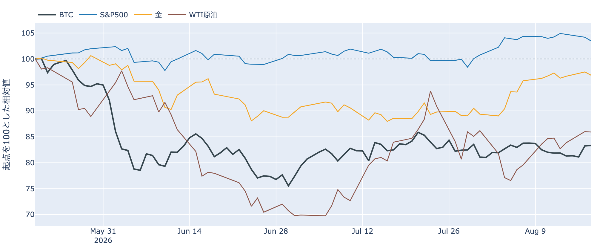
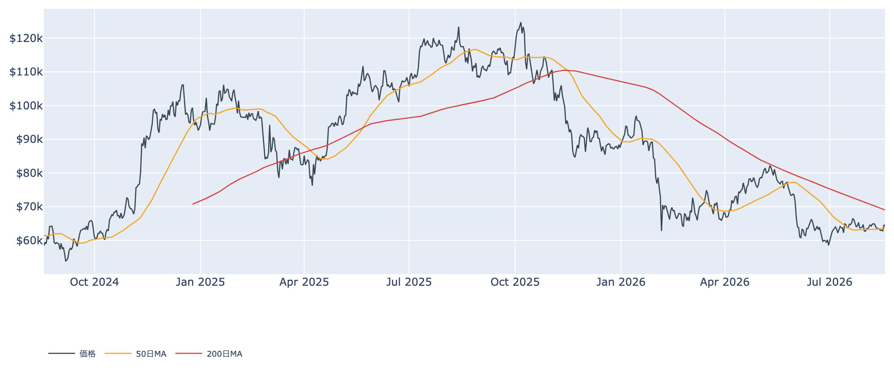
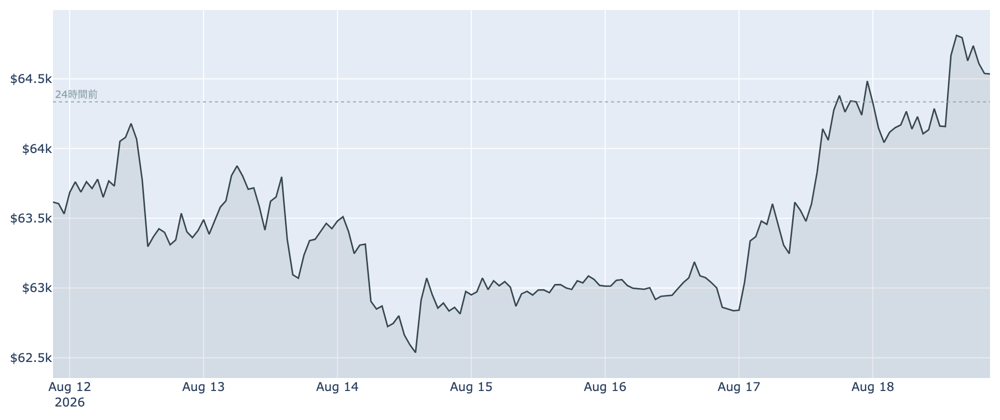
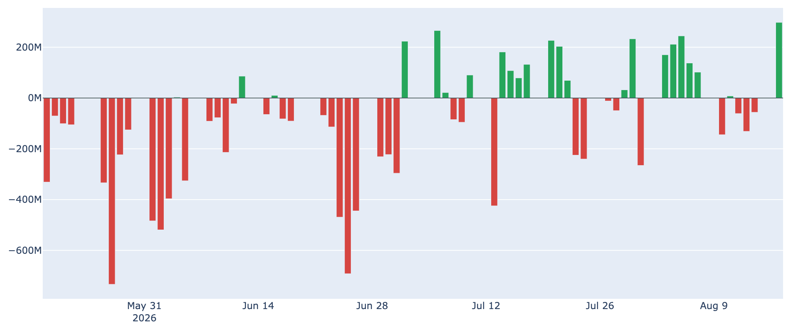
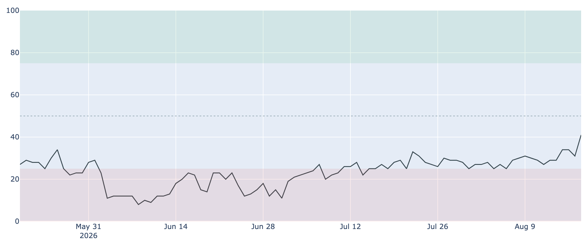
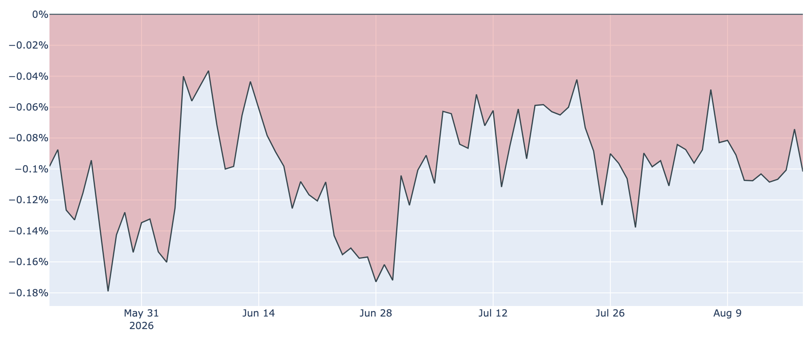

# ETFに3か月半ぶりの大口流入 ― 6万4,500ドル、株が3日続落するなかで週高値をうかがう

**2026年8月19日**

水曜の朝、ビットコインは約6万4,550ドル。24時間ではほぼ横ばいですが、この2日で6万2,800ドル台から約2.7%戻し、50日移動平均の上に居座っています。外の環境はむしろ逆風で、米国株は3日続落、原油は84ドル台へ張り付いたままです。そのなかで目を引いたのが現物ETFで、8月17日に約2億9,750万ドルの流入と、5月上旬以来の大きさになりました。今朝の指標を整理します。

（価格・先物・ネットワーク・米国との価格差は8月19日7時00分（日本時間）時点、市場心理とマクロ資産は8月18日時点、オンチェーン指標とETF資金フローは8月17日時点のデータに基づいています。）

## 1. 全体像：外は重い、中は戻り始めた

* **外の環境**: 8月18日の米国株（S&P500）は約-0.7%で3日続落。VIX（＝株式市場の恐怖指数）は約15.8へ+4.3%上昇し、WTI原油は84.42ドルと5営業日で約+1.5%です。米国とイランが6月に結んだ交渉期限が8月17日に切れ、延長しない意向が伝えられたことで、中東情勢とエネルギー価格への警戒が続いています。リスク資産全体の重しになりうる状況です。
* **そのなかでのビットコイン**: 株が3日下げるあいだにビットコインは2日で約+2.7%。株・金・原油と並べても、この2日は別々の方向を向いています。ただしこれは値動きの並びであって、原因の説明ではありません。
* **中身の変化**: 現物ETFへ8月17日に大口の資金が入り、市場心理も一日で10ポイント改善しました。一方で米国勢の現物の値付け（Coinbase Premium）は逆に悪化し、長期保有層は8月17日時点でまだ売り越しを広げています。戻りの足場は、まだ揃っていません。

価格の位置は50日移動平均（約6万3,750ドル）を約1%上回り、200日移動平均（約6万9,050ドル）は約7%上にあります。中期の地合いは弱いままです。

## 2. 注目すべき5つのポイント

### ① 週高値は、この24時間のうちに付けたもの

* 8月17日の確定終値は6万4,484ドルで、前日（約6万2,840ドル）から約+2.6%。8月19日7時00分時点の実勢は約6万4,550ドルで、上げたあとの水準をそのまま保っています。
* 24時間のレンジは約6万3,980〜6万5,020ドル。この6万5,020ドルは1週間の高値でもあり、週の値幅の上端を今朝方に試したことになります。
* もっとも1週間前と比べれば約+1.6%、1か月前とは約-0.2%。往って来いの範囲は出ていません。

### ② ETFに、5月上旬以来の大口流入

* **ETF資金フロー**は8月17日に約+2億9,750万ドル。日次でこの規模が出たのは5月5日以来、約3か月半ぶりです。
* 内訳はIBITが約+1億6,020万ドル、FBTCが約+1億1,190万ドルで、この2本で9割超。残りはARKBが約+1,420万ドル、MSBTが約+1,120万ドルと小口です。
* これで7日間の合計は約+1,400万ドルとほぼ均衡に戻りました。前日まで1億ドル超の流出超だったことを考えれば、一日で帳消しにした形です。ただし8月10〜14日の流出（合計約3億9,000万ドル）を埋めたのが1日分の流入であるため、傾向と呼ぶには早すぎます。

### ③ 市場心理が一日で10ポイント上がった

* **Fear & Greed（＝市場心理の指数）**は8月18日時点で100点満点の41。前日の31から一気に10ポイント上がり、1週間前（29）・1か月前（28）と比べても明確な改善です。
* とはいえ区分はまだ「恐怖」。6月上旬に11〜12まで沈んだ水準からは戻ったものの、中立（45〜55）には届いていません。
* 前日までは「価格が上げても心理が付いてこない」形でしたが、その差はいったん埋まりました。

### ④ 米国勢の価格差は、逆に悪化している

* **Coinbase Premium（＝米国とそれ以外の価格差）**は8月19日7時00分時点で約-0.10%。8月17日の確定値（約-0.07%）からむしろ広がりました。マイナス圏は105日連続です。
* 過去300日で見ると下から2割ほどの低い位置で、1か月前（約-0.06%）よりも悪い水準です。
* ETFには資金が入ったのに、現物の値付けでは米国勢が買い上がる側に回っていない――この二つが食い違っている点は、今朝いちばん気になるところです。

### ⑤ 長期勢はまだ売り越し、短期勢の投げは一巡

* **長期勢SOPR（＝長期勢の損益）**は8月17日時点で0.81。動いた古いコインが平均して約19%の損失で手放されたという意味です。前日の0.71（約29%の損失）よりは浅くなりましたが、1を大きく下回る状態が続いています。
* **長期保有層の保有量の増減**は過去30日で約-17.4万BTC。1週間前（約-15.0万BTC）からさらに拡大し、1か月前の約+19.7万BTCとは向きが完全に逆です。戻り局面で古い持ち手が出てくる構図は変わっていません。
* 対照的に**短期勢SOPR（＝短期勢の損益）**は1.003で、1週間前の0.997から1の上へ戻りました。直近の買い手による損切りは、いったん止まっています。
* ただし**短期保有層の平均取得原価は約6万7,090ドル**で、現在価格はこれを約4%下回ったまま。**MVRV Z-Score（＝市場全体の含み益）**も約0.40と過去4年で下から2割の水準で、割高な部分はありません。

（補足：先物は静かです。**資金調達率（＝先物の買い持ちが払う金利）**は8時間あたり+0.0005%、年率にすると約+0.6%で、30日平均の+0.0054%を大きく下回り、レンジのほぼ下限にあります。**建玉（＝先物の未決済残高）**は約10万6,600BTC（約69億ドル）で7日間ほぼ横ばい。週高値をうかがう場面でレバレッジが追いかけていない状態です。ネットワーク側ではハッシュレートが約1,000EH/s、次回の難易度調整は約+0.9%の見込み、マイナー収入の平年比を示すPuell Multipleは0.84と1週間前の0.73から持ち直しました。）

## 3. 相場転換を見極める3つの分岐点

1. **ETFの流入が単発で終わるか**: 8月17日の約3億ドルが週をまたいで続けば、8月10〜14日の流出は一時的な調整だったと読めます。逆にここから再び流出へ戻れば、今朝の戻りを支える買い手が見当たらなくなります。あわせて、米国勢の価格差がマイナス圏の105日を抜け出せるかも見どころです。上値の壁は依然として短期保有層の平均原価（約6万7,090ドル）で、そこまでは含み損を抱えた供給の中を上っていくことになります。

2. **今夜のFOMC議事要旨と、来週のジャクソンホール**: 7月28〜29日会合の議事要旨が8月19日14時（米東部時間、日本時間20日未明）に公表されます。この会合は3.50〜3.75%の据え置きでしたが、9対3で3人が利上げを主張した異例の結果でした。その後の経済指標が弱く、9月の利上げ織り込みは約3分の1まで下がっています。議事要旨がどの程度タカ派寄りに読めるかで、この見方が揺れます。8月27〜29日のジャクソンホール会合（28日にウォーシュFRB議長の講演）はその先の手がかりです。

3. **ホワイトハウスの暗号資産会合と、宙に浮いたままの規則採決**: 8月19日、トランプ大統領がSEC（証券取引委員会）のアトキンス委員長、CFTC（商品先物取引委員会）のセリグ委員長、業界各社を集めた会合を開くと伝えられています。8月14日に予定されながら直前で取り下げられたSECの暗号資産ルール採決は、いまも新しい日程が示されていません。何がいつ決まるかは会合の結果次第で、現時点で見えているのは日程だけです。

## 総括

ビットコインは6万4,500ドル台で2日目を迎え、1週間の高値を今朝方に試しました。米国株が3日続落し原油が高止まりする外の環境とは、この2日は切り離れて動いています。中身では、現物ETFへ3か月半ぶりの大口流入が入り、市場心理も一日で10ポイント改善し、短期勢の損切りは止まりました。一方で米国勢の現物の価格差はむしろ悪化し、長期保有層は約19%の損失を確定させながら売り越しを広げています。先物のレバレッジも追いかけていません。戻りの材料は増えたものの支え手はまだ一枚で、6万7,000ドル台の原価の壁までは距離があります。

---

*本稿は情報提供を目的としたものであり、投資助言ではありません。将来の価格動向を保証・示唆するものではなく、投資判断は各自の責任において行ってください。*
