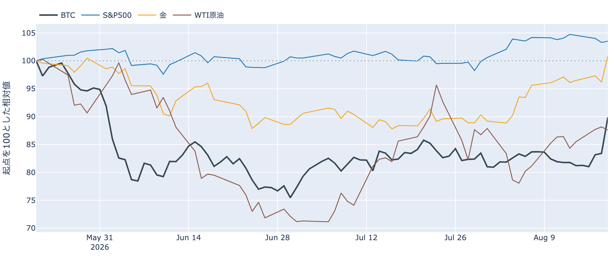
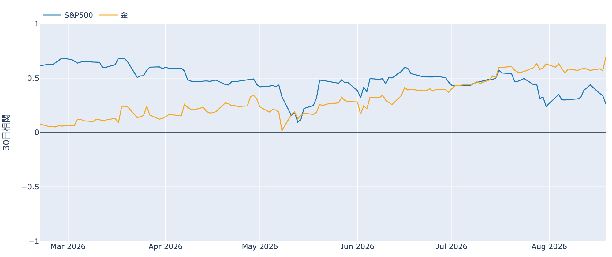
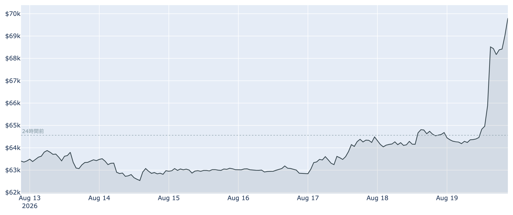
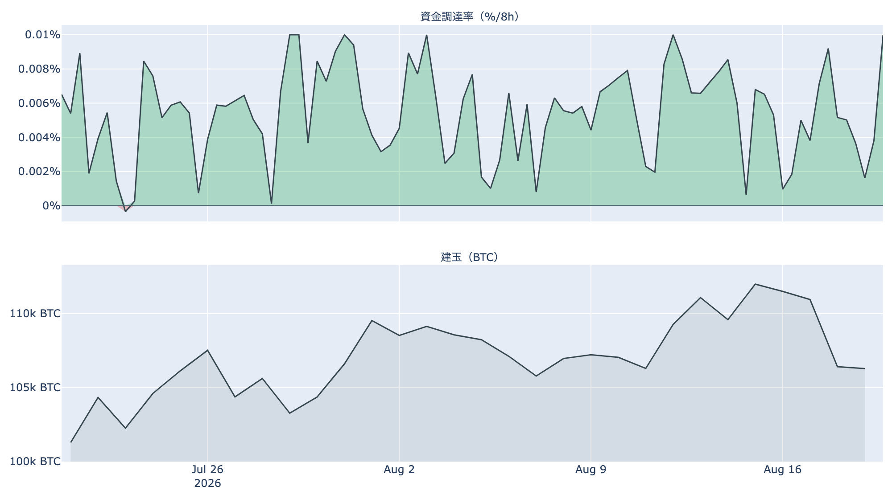
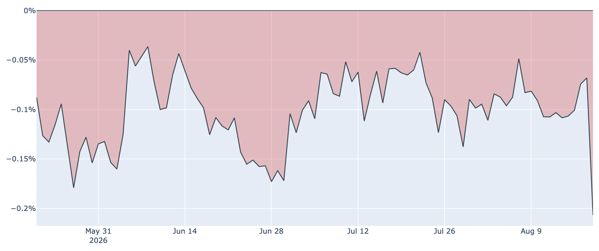
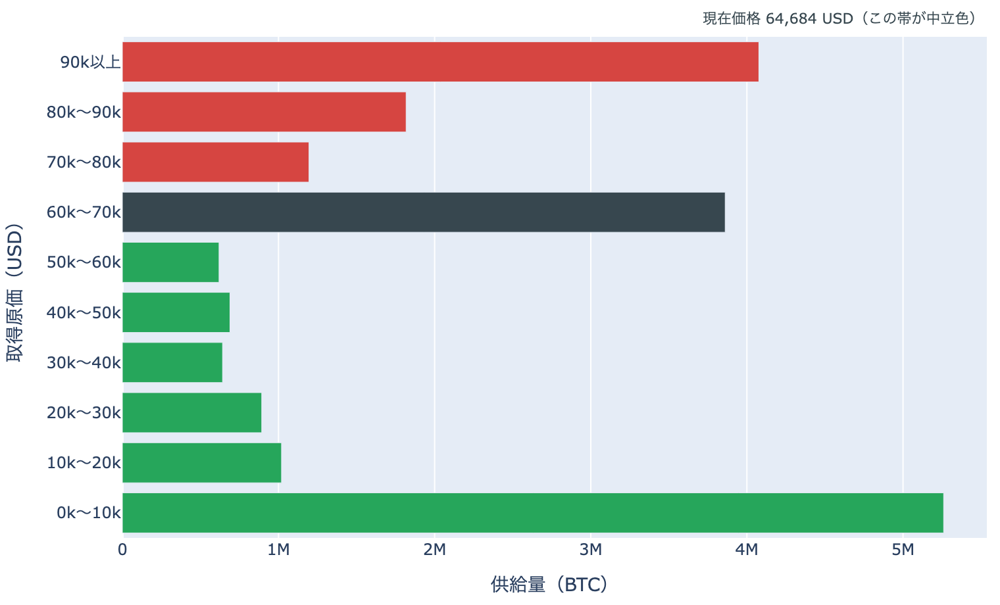
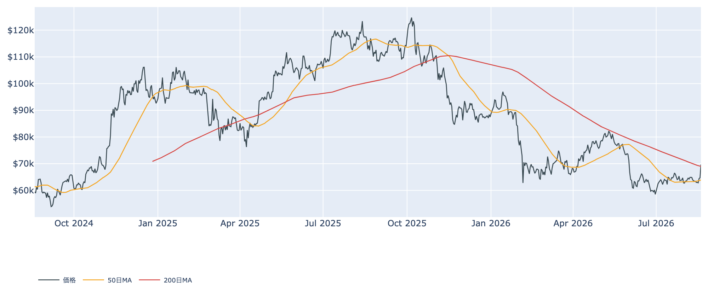

# 国債買い入れの倍増で6万9,700ドル ― 24時間で8%高、200日線を9か月半ぶりに上回る

**2026年8月20日**

6万2,000〜6万4,000ドル台で1週間以上ほとんど動かなかった相場が、8月19日に一気に切り上がりました。8月20日7時時点の実勢価格は約6万9,700ドルで、24時間で+8.2%。きっかけは米国の国債買い入れ拡大という、ビットコインの外側から来た材料でした。ただし中身を見ると、上げを作ったのは新しい買いというより「売り建ての踏み上げ」で、米国の現物需要はむしろ置き去りにされています。

（数値は8月20日7時時点で取得した各種データに基づきます。価格・取引所プレミアムは同時刻の実勢値、市場心理は8月19日の確定値、オンチェーン指標とETF資金フローは8月18日時点、株・金などの終値は8月19日時点です。）

## 1. 全体像：金利とドルが下げ、金とビットコインが跳ねた

米財務省が8月19日、長期国債（10〜20年・20〜30年）の買い入れオペの上限を1回あたり20億ドルから少なくとも40億ドルへ引き上げると発表しました（適用は9月9日から）。これを受けて30年債利回りは8bp超、10年債利回りも低下し、ドルは約3か月ぶりの安値をつけています。

この日の値動きの並びは、はっきり偏っていました（すべて8月19日の終値）。

* **金 4,580ドル（+4.9%）／ドル指数 98.79（-0.9%）／米10年債利回り 4.65%（-1.1%）** ― 金利低下とドル安に反応する側が大きく動きました。
* **S&P500 7,708（+0.2%）／VIX（＝株式市場の恐怖指数）14.89（-6.0%）** ― 株はほぼ横ばい。株高を伴った全面高ではありません。
* 全体としての地合いは「まちまち」で、5営業日で見ればむしろリスクオフ寄りが残っています。

つまりこの上昇は「リスク資産が一斉に買われた」というより、**金利低下・ドル安に効く資産に資金が寄った局面**と並べて見るのが素直です。実際、ビットコインと金の30日相関は+0.70まで上がり、7月以降は株（+0.26）との相関を明確に上回りました。今年前半は株との連動が主だったことを思えば、これは水準の変化です。

なお同じ週、米SECが暗号資産の新規制案「Regulation Crypto Assets」を公表しました。発行体が一定額まで簡便に資金調達できる免除規定を設ける内容で、意見公募は60日間です。規則案の段階であり、決まったのは「案が出た」ことまでです。

## 2. 注目すべきポイント

### ① 6日間の膠着を4時間で抜けた

* 8月13日から18日までは6万2,800〜6万4,500ドルの狭いレンジで、日中の値幅もほとんどありませんでした。それが19日の発表後、数時間で6万8,500ドル付近まで垂直に上昇し、いったん押したあと6万9,700ドルまで伸びています。
* 24時間レンジは6万4,112〜7万0,022ドルと約6,000ドル。7日前比+9.9%、30日前比+6.9%です。
* 直近の確定した日足終値は8月18日（UTC）の6万4,681ドルなので、**この上げはまだ日足として確定していません。**

* 市場心理も1週間で様変わりしました。Fear & Greed（＝市場心理の指数）は8月19日で46。まだ「恐怖」の側ですが、1週間前の27、30日前の29から+19ポイントと、中立の一歩手前まで戻しています。

### ② 上げを作ったのは新規の買いではなく踏み上げ

* 建玉（＝先物の未決済残高）は8月19日時点で107,139BTC（約68.8億ドル）。**価格が7日で約10%上がったのに、建玉は7日で-2.7%と減っています。**
* 価格上昇と建玉減少が同時に起きるのは、新しい資金が買い持ちを積んだのではなく、**売り建てが決済に追い込まれた（踏み上げ）**ときの典型的な形です。実際この日は10億ドル規模の売り建て清算が報じられました。
* 資金調達率（＝先物の買い持ちが払う金利）は8時間あたり0.0100%で、年率にすると約11%。83回連続でプラス（約27.7日）と強気寄りではありますが、この銘柄の上限（±0.3%/8h）には遠く、過熱と呼べる水準ではありません。
* 踏み上げで上がった相場は、**踏むべき売り建てが尽きたところで燃料が切れる**という弱点を抱えます。ここから先は買い持ちを新たに積む資金が要ります。

### ③ 米国勢は、この上げに乗っていない

* Coinbase Premium（＝米国とそれ以外の価格差）は8月19日時点で-0.207%。**この10か月で最も低い水準**で、マイナス圏は106日連続になりました。1週間前は-0.108%だったので、上昇の日にむしろ倍近く沈んだことになります。
* この指標がマイナスに沈むのは、米国の取引所での値付けが海外より安い状態、つまり米国の現物買いが相対的に弱いことを意味します。**8%上げた日に米国需要の弱さが際立ったのは、上げの担い手がどこにいたかを示す材料**です。
* ETF資金フローは8月18日時点で+1.89億ドル（IBITが+1.44億ドル）と流入超でしたが、これは上昇の前日の数字です。直近7営業日の合計は+1.0億ドルにとどまり、大きな流れになったとまでは言えません。

### ④ 長期勢は、上がる前から売り続けていた

* 長期勢の保有量の増減（過去30日）は8月18日時点で-18.1万BTC。1週間前の-15.6万BTC、30日前の+18.9万BTCと比べると、**7月中旬に積み増しから放出へ転じ、その放出が今も深まっています。**
* 長期勢SOPR（＝長期勢の損益）は8月18日で0.786。1を大きく下回っており、**古参の保有者が含み損を確定させながら手放している**ことを示します。1週間前は0.858、30日前は1.338でした。
* これらはいずれも19日の急騰**より前**の数字です。上げに対して長期勢がどう動いたか（利食いを増やしたのか、売りを止めたのか）は、数日後のデータを待つ必要があります。

### ⑤ 短期勢の原価を、価格が上抜けた

* 短期勢（保有155日未満）の平均取得原価は8月18日時点で約6万7,000ドル。ここ1か月は6万7,000〜6万8,000ドル台で緩やかに下がってきました。
* 8月20日7時の実勢価格6万9,700ドルは、この原価を約4%上回っています。**直近で買った層が平均して含み損から含み益に反転した**ことになり、これまで戻り売りの供給源だった層の性格が変わりうる水準です。
* ただしSOPR（＝動いたコインの損益）は8月18日時点で0.996とまだ1割れ、MVRV Z-Score（＝市場全体の含み益）も0.41と過去4年で低い側（下位2割）にとどまります。**バリュエーションとしては依然として安い側**で、8%上げた程度で景色が変わったわけではありません。

## 3. 相場転換を見極める分岐点

1. **200日移動平均に定着できるか。** 8月20日7時の実勢価格は200日移動平均（約6万9,000ドル）をわずかに上回りました。この線の上で日足が確定すれば**2025年11月2日以来、約9か月半ぶり**です。ただし50日線（約6万4,000ドル）は200日線の下にあり、中期のトレンドはまだデッドクロス圏。1日抜けただけでは判定できません。
2. **7万ドルの上は、意外と層が薄い。** 取得原価の分布（8月18日時点）を見ると、6万〜7万ドルで取得された供給が約385万BTCと最も厚い一方、7万〜8万ドルの帯は約120万BTCしかありません。**いま価格はその最も厚い帯の上端にいます。** 抜け切れば当面の戻り売りは相対的に薄く、逆に押し戻されればその厚い層がそのまま上値の重しとして残ります。なおこれは「いくらで取得された供給がどれだけあるか」の分布であって、保有者の人数や属性を示すものではありません。
   
3. **金利の綱引きが、どちらに転ぶか。** 買い入れ拡大は長期金利を押し下げる方向ですが、同じ8月19日に公表された7月FOMC（7月28〜29日）の議事要旨は、9対3の分裂した採決で、3人が利上げを主張していたことを示しました。利下げを支持する声は記録されていません。**買い入れは長期金利を下げ、金融政策は逆を向きうる**という状態で、次の焦点は9月15〜16日のFOMCと、それまでの物価指標です。買い入れ拡大の実施は9月9日から。

## 総括

1週間の膠着を破ったのは、ビットコイン自身の需給ではなく米国の国債政策でした。8月20日7時時点で約6万9,700ドル、200日線をわずかに上回るところまで来ています。ただし建玉は減り、米国のプレミアムは10か月ぶりの低水準、長期勢は8月18日時点で放出を続けており、**踏み上げが作った上げに、現物の買い手がまだ追いついていない構図**です。短期勢の原価を上抜けたこと、市場心理が1週間で19ポイント戻したことは前向きな変化ですが、この水準に定着できるかは、ここから現物の買いが入ってくるか次第だと考えられます。

---

*本稿は情報提供を目的としたものであり、投資助言ではありません。将来の価格動向を保証・示唆するものではなく、投資判断は各自の責任において行ってください。*
