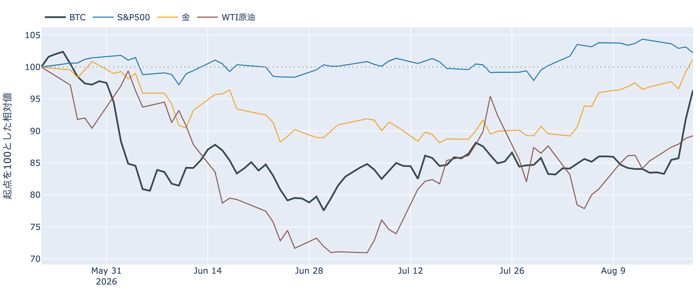
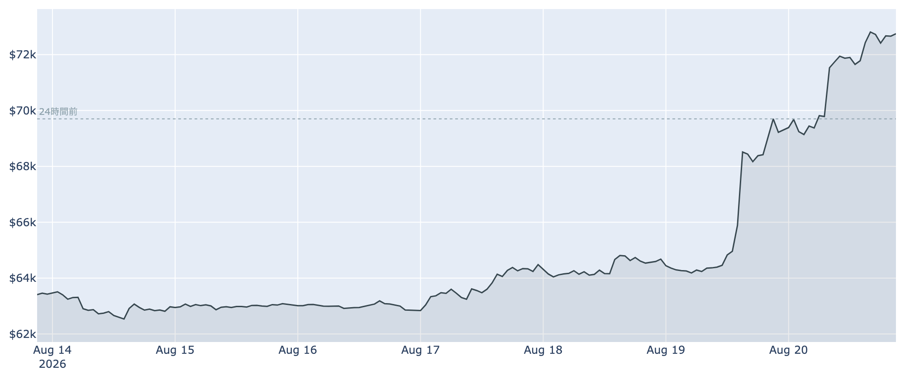
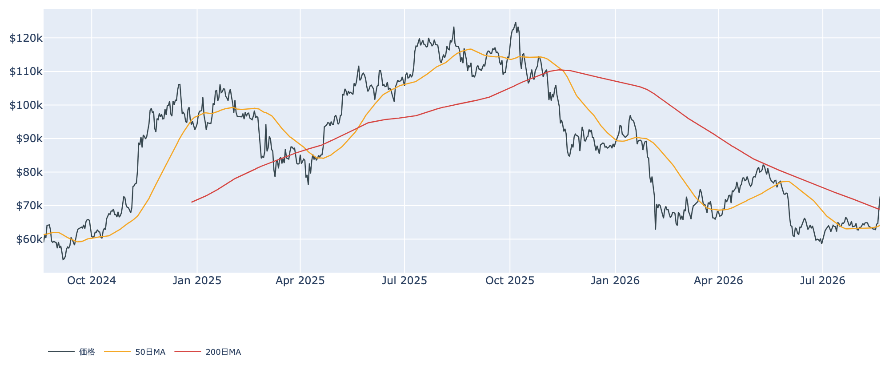
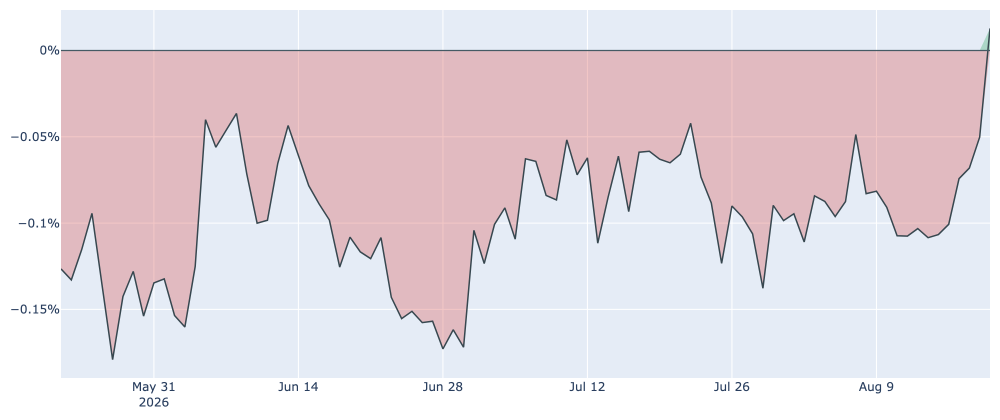
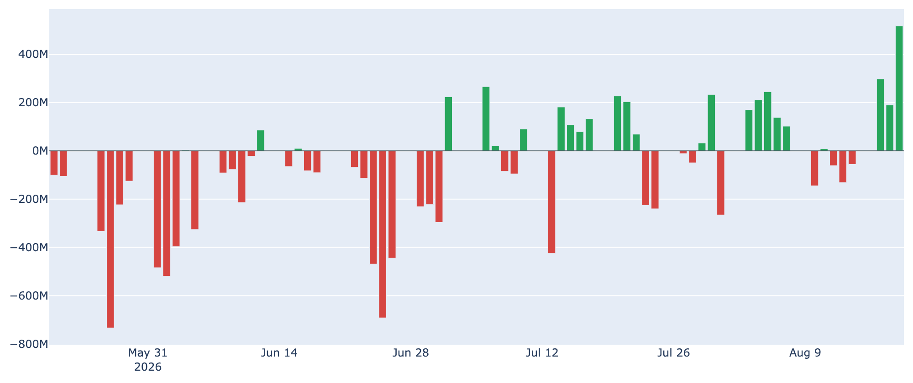
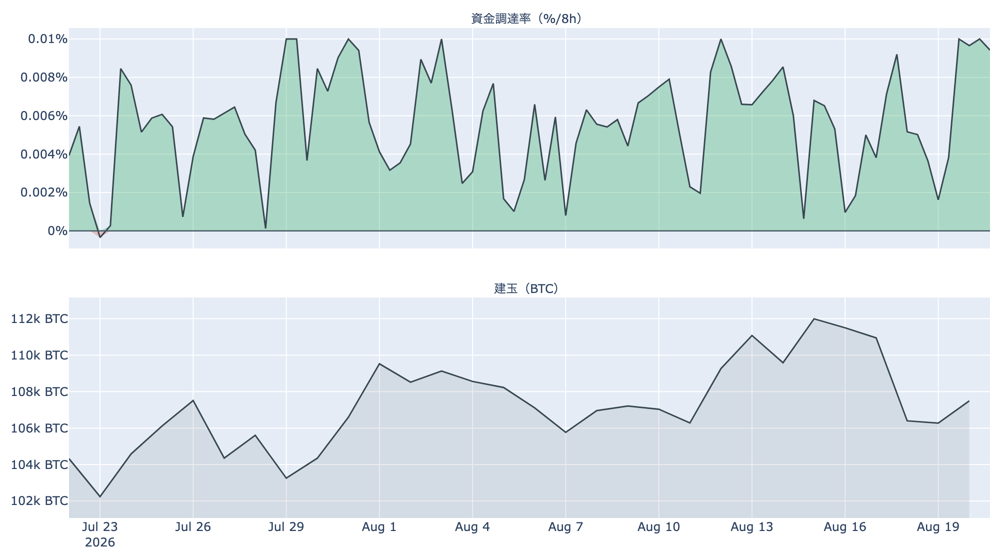
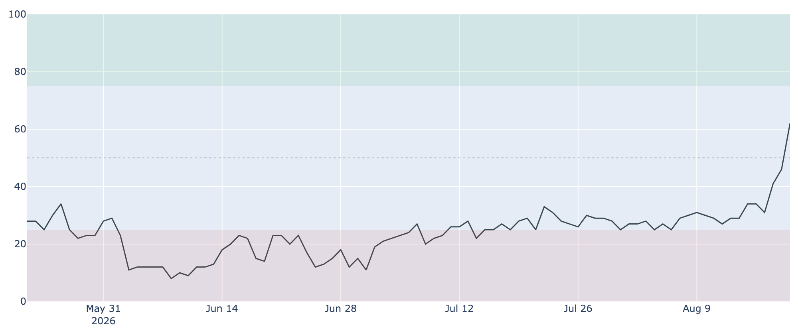

# 現物の買いが追いついてきた ― 7万2,700ドル、米国プレミアムは3か月半ぶりにプラスへ

**2026年8月21日**

国債買い入れの拡大をきっかけに8%上げた前日の相場は、失速せずにさらに切り上がりました。8月21日7時時点の実勢価格は約7万2,700ドルで、24時間で+4.4%。一時7万3,000ドル台に乗せ、6月上旬以来の水準です。前日のレポートは「踏み上げが作った上げに、現物の買い手がまだ追いついていない」と締めましたが、この24時間で出てきたデータ——ETFへの大口流入、米国プレミアムのプラス浮上——は、その買い手が現れ始めたことを示しています。

（数値は8月21日7時時点で取得した各種データに基づきます。価格・取引所プレミアムは同時刻の実勢値、市場心理は8月20日の確定値、オンチェーン指標とETF資金フローは8月19日時点、株・金などの終値は8月20日時点です。）

## 1. 全体像：株安・金利上昇のなかで、ビットコインだけが伸びた

8月20日の株式市場は上値の重い一日でした（すべて8月20日の終値）。

* **S&P500 7,641（-0.9%）／VIX（＝株式市場の恐怖指数）16.01（+7.5%）** ― 株は下落し、警戒感はやや上向き。7月FOMC議事要旨のタカ派的な内容が引き続き意識されています。
* **米10年債利回り 4.70%（+0.9%）** ― 買い入れ拡大の発表で低下した長期金利は、早くも戻し始めました。**上げの起点になった「金利低下」は、1日で一部巻き戻された**ことになります。
* **金 4,575ドル（+1.9%）／WTI原油 86.21ドル（5営業日で+6.1%）** ― 金は続伸。原油は約4週間ぶりの高値圏です。
* 全体の地合いはリスクオフ寄りでした。**その並びのなかでビットコインは+4%超**と、株とは明らかに別の動きをしています。

ビットコインと株の30日相関は+0.15と低く、金との相関は+0.62。**この局面のビットコインは、株と一緒のリスク資産としてではなく、金と同じ「金利低下・ドル安に効く資産」の側で動いている**——この構図が2日続きました。

## 2. 注目すべきポイント

### ① 200日線の上で、日足が確定した

* 前日のレポートで分岐点に挙げた「200日移動平均の上での日足確定」が実現しました。8月19日（UTC）の確定終値は6万9,300ドルで、200日線（約6万9,000ドル）を上回っています。**200日線の上で日足を終えたのは2025年11月2日以来、約9か月半ぶり**です。
* その後も上値を伸ばし、8月21日7時時点で約7万2,700ドル。24時間レンジは6万8,900〜7万3,100ドル、1週間では約15%の上昇です。
* ただし50日線（約6万4,200ドル）はまだ200日線の下にあり、中期のトレンド判定としてはデッドクロス圏のまま。**線を1本抜けた段階と、トレンドが転換した段階は分けて見る必要があります。**

### ② 米国プレミアムが106日ぶりにプラスへ浮上

* Coinbase Premium（＝米国とそれ以外の価格差）は、8月21日7時時点の値でプラス0.01%。**マイナス圏が106日続いたあと、約3か月半ぶりにプラスへ顔を出しました**（この日次値はまだ確定していません）。確定した8月19日の値もマイナス0.05%と、1週間前のマイナス0.10%から半減しています。
* 前日の急騰時にはむしろ深く沈んでいた指標なので、**「上げの初日に置き去りにされた米国勢が、翌日から追いつき始めた」**という順序になります。水準そのものはゼロ近辺で、米国の買いが優勢と言い切るのはまだ早い段階です。

### ③ ETFに約4か月で最大の流入

* ETF資金フローは8月19日時点で+約5.2億ドルと、**4月中旬以降の約4か月で最大の日次流入**です。内訳はIBITが+約2.8億ドルと中心で、ARKB・FBTCなど複数のファンドに流入が分散しています。
* 流入はこれで3営業日連続（+3.0億、+1.9億、+5.2億ドル）、直近7営業日の合計は+約7.6億ドル。8月中旬まで小幅な流出が続いていた流れが、急騰をはさんで明確に反転しました。
* 前日のレポートで「大きな流れになったとまでは言えない」と書いた部分が、この1日で更新された形です。**単発で終わるか定着するかは、今週の残りの営業日で判断できます。**

### ④ 短期勢は利食いに動き、長期勢の放出は続く

* 急騰初日・8月19日時点のオンチェーンが見えてきました。短期勢SOPR（＝短期勢の損益）は1.011と、**過去4年で上位1割に入る利食い水準**です。短期勢の平均取得原価（約6万7,200ドル）を価格が上抜けたことで、含み益になった層が早速利益確定に動いています。SOPR（＝動いたコインの損益）全体も1.005と、8月半ばまで続いた1割れから浮上しました。
* 一方、長期勢の保有量の増減（過去30日）は8月19日時点で-約15.4万BTCと放出が継続中です（30日前は+約14万BTCの積み増し）。長期勢SOPRも0.81と1を下回ったままで、**古参の売りが止まった証拠はまだありません。** 急騰当日は前日より放出がやや浅くなりましたが、1日分では傾向とは言えず、続報待ちです。
* MVRV Z-Score（＝市場全体の含み益）は0.56へ上昇したものの、過去4年ではまだ下位3割。**1週間で15%上げても、バリュエーションは依然として安い側**にあります。

### ⑤ 過熱の兆候は、まだ限定的

* Fear & Greed（＝市場心理の指数）は8月20日で62と、**直近90日で初めて「強欲」の圏に入りました。** 1週間前は29（恐怖）だったので、7日間で+33ポイントという急激な戻りです。楽観へ振れる速度としては警戒に値しますが、水準としては「極度の強欲」（76以上）にはまだ距離があります。
* 先物側は落ち着いています。資金調達率（＝先物の買い持ちが払う金利）は8時間あたり0.0023%と前日からむしろ低下し、年率換算で約2.5%。建玉（＝先物の未決済残高）は約10.7万BTCで、**価格が1週間で15%上がったのに7日で-3.2%と減ったまま**です。
* つまりこの2日の上げは、レバレッジの積み増しではなく、踏み上げと現物の買いで作られています。**先物に過熱がない分、急落の燃料も小さい**——心理の急回復と合わせて、いま測れる過熱はセンチメント側に偏っています。

## 3. 相場転換を見極める分岐点

1. **7万〜8万ドルの「薄い帯」を通過できるか。** 取得原価の分布（8月19日時点）では、6万〜7万ドル台で取得された供給が最も厚く、いま価格がいる7万〜8万ドルの帯は相対的にかなり薄い領域です。**上値の戻り売りが薄い分、動くときは速い**——上にも下にも、です。押し戻されて6万ドル台後半の厚い帯へ戻れば、そこが支えになるか重しになるかが次の攻防になります。
   
2. **金利の追い風が剥がれても水準を保てるか。** 今回の上げの起点は8月19日の国債買い入れ拡大（実施は9月9日から）でしたが、10年債利回りは8月20日に4.70%へ反発しました。**金利低下という外側の追い風が続かなくても7万ドル台を維持できるなら、上げの主役が現物の需給に移った証拠**になります。次の大きな日程は9月15〜16日のFOMCです。
3. **米国の買いが「1日」で終わらないか。** プレミアムのプラス浮上は現時点でまだ1日、ETFの大口流入も1日です。**プレミアムがプラス圏に数日とどまり、ETF流入が週次でも積み上がるか**——ここが定着すれば、踏み上げで始まった上昇が現物主導の上昇に引き継がれたと言えます。逆にどちらも単発で終われば、薄い帯の中で上げた分だけ、戻りも速くなります。

## 総括

前日の「現物の買い手がまだ追いついていない」という構図は、1日で書き換わり始めました。8月21日7時時点で約7万2,700ドル。200日線の上で日足が確定し、ETFには約4か月で最大の流入、米国プレミアムは106日ぶりにプラスへ浮上しています。株安・金利反発のなかでの続伸であり、上げの担い手が外側の材料から現物の需給へ移りつつある兆しです。ただし長期勢の放出は続いており、市場心理は1週間で恐怖から強欲へ振れました。バリュエーションにはまだ余裕がある一方、価格は戻り売りの薄い帯に入っており、米国の買いが定着するかどうかで、この速い値動きの向きが決まると考えられます。

---

*本稿は情報提供を目的としたものであり、投資助言ではありません。将来の価格動向を保証・示唆するものではなく、投資判断は各自の責任において行ってください。*
