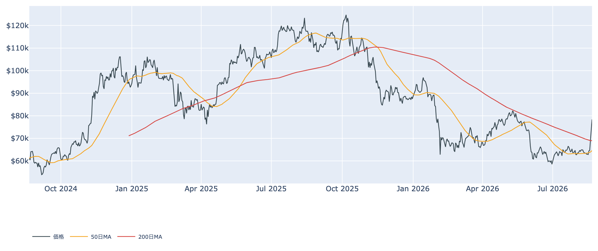
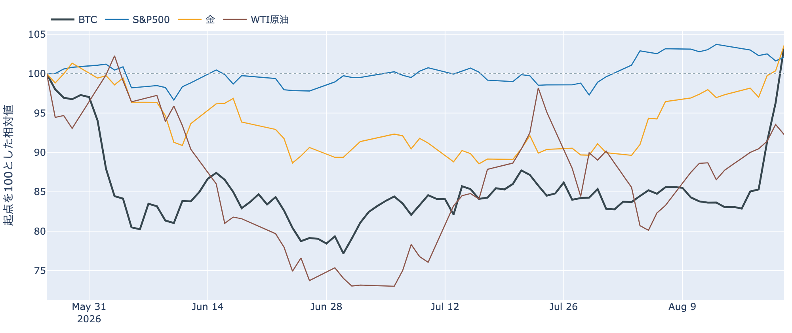
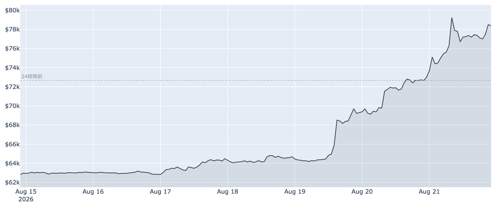
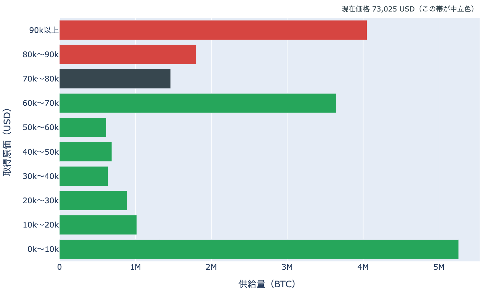
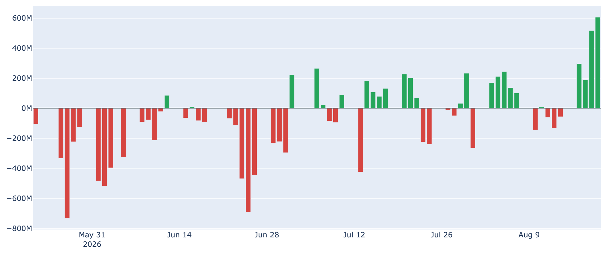
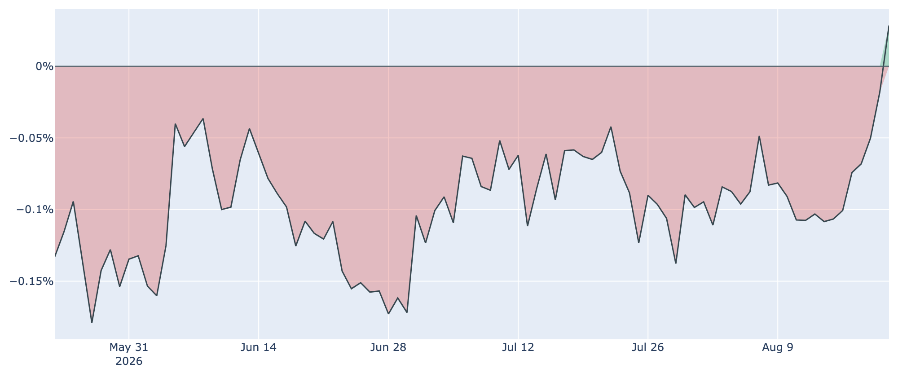
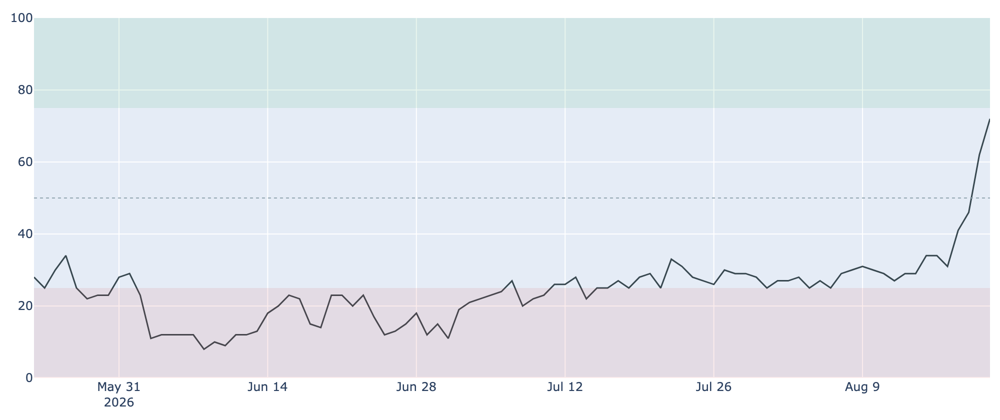
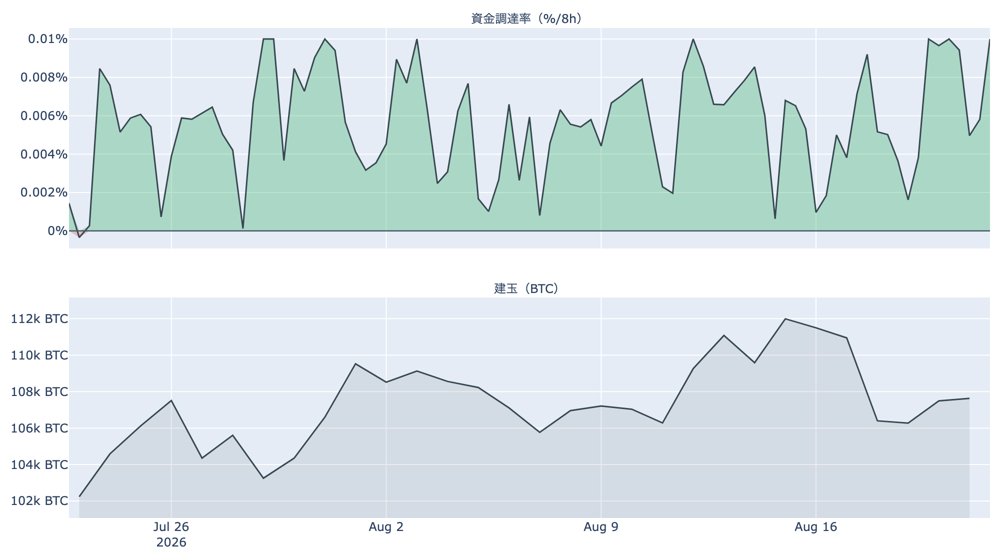

# $80,000目前へ急伸 ― 米国勢の買いが戻り、短期勢は含み損から含み益へ

**2026年8月22日**

先週まで$62,000台で沈んでいたビットコインが、この1週間で約24%急伸し、8月22日7時5分時点で約$78,400まで戻しました（24時間で約+8%、一時$79,500）。ETF資金フロー・Coinbase Premium・市場心理が同時に好転する一方、長期勢は売り側に回っており、急騰後の攻防を整理します。

（数値は8月22日7時5分（JST）時点までに取得したデータに基づきます。価格とCoinbase Premiumはその時点の実勢、Fear & Greedは8月21日、オンチェーン指標とETF資金フローは8月20日時点です。）

## 1. 現在の市場の全体像：株と離れ、金と並んで買われた1週間

* **水準が一変**: 8月16日の終値約$62,800から、22日朝には約$78,400へ。実勢価格は50日移動平均（約$64,600）と200日移動平均（約$69,000）をまとめて上抜けました。ただし50日線自体はまだ200日線の下にあり、ラインの並びが好転するのはこれからです。
* **報じられている背景**: 米財務省が国債の買い戻し拡大方針を示したこと、トランプ大統領が暗号資産業界の経営者と会談し、市場構造法案（CLARITY法案）の可決を議会に促したことが、買い材料として報じられています。
* **リスク資産全体の動きではない**: 5営業日（8月14日→21日）で金は+約6.4%と最高値圏、ドル指数は-約0.8%の一方、S&P500は-約1.4%でした。株が軟調ななかでBTCと金が買われた形で、BTCとの30日相関も金+0.64に対し株+0.16と、金寄りの動きです。

## 2. データの解説：注目すべき5つのポイント

### ① 1週間で約24%高、直近の上げは加速している

* 直近7日のレンジは$62,631〜$79,500。8月19日以降、確定終値ベースでも$69,300 → $73,000（8月20日）と日を追って上げ幅が広がり、22日朝も高値圏を維持しています。
* MVRV Z-Score（＝市場全体の含み益）は8月20日時点で約0.69。1週間前（約0.36）から切り上がりましたが、過去4年の平均（約1.3）より下で、この指標で見る限り過熱圏にはまだ距離があります。

### ② 短期勢が「含み損」から「含み益」へ転換した

* 短期保有者（保有155日未満）の平均取得原価は8月20日時点で約$67,700。数か月ぶりに市場価格がこれを明確に上抜け、直近参入者は平均して含み益に転じました。6月以降の相場を重くしていた「戻ればすぐ損切りが出る」構図が変わる転換点です。
* 短期勢SOPR（＝短期勢の損益）は8月20日時点で約1.02と1を超え、利益を確定する売りが出始めています。全体のSOPR（＝動いたコインの損益）も約1.01で、利確をこなしながら上げている形です。

* URPD（＝取得原価の分布）で見ると、今回の急騰で価格は$60,000台に厚く積み上がった取得原価の帯の上に抜けました。この帯は下値の支えに変わる一方、上値には2025年に$85,000超で取得された供給が控えます。なおこれは取得原価の分布であって、誰が持っているかまでは分かりません。

### ③ 長期勢は「蓄積」から「分配」へ回っている

* 長期保有層のネットポジション変化（＝長期勢の保有量の増減、過去30日）は8月20日時点で約-18.8万BTC。30日前（+約15.3万BTC）のプラスから、8月上旬にマイナスへ転じ、売り越し幅が広がっています。春の「静かな備蓄」局面は終わり、戻り局面で手放す動きが優勢です。
* 長期勢SOPR（＝長期勢の損益）は8月20日時点で約0.84と1を下回り、動かされた古参のコインには損失覚悟の売りも交じっています。上値の売り圧力の主役が、短期勢の損切りから長期勢の分配へ移りつつある点は注意が必要です。

### ④ 米国需要が一斉に戻った：ETFは4日連続の流入、プレミアムはプラス転換

* ETF資金フローは8月20日に+約6億ドルと、上場来でも上位1割に入る規模の流入でした。8月17日から4営業日連続の流入で、直近7日合計は+約14億ドルです。
* Coinbase Premium（＝米国とそれ以外の価格差）は1週間前の約-0.11%から急速に切り上がり、8月21日にプラス圏（+約0.03%）へ転換しました。長く続いた「米国勢の需要が弱い」状態からの明確な変化です。

### ⑤ 市場心理は一気に「強欲」へ、ただし先物のレバレッジはまだ膨らんでいない

* Fear & Greed（＝市場心理の指数）は8月21日時点で72（強欲）。1週間前の29（恐怖）から+43ポイントという急転換で、心理面ではすでに楽観が先行しています。
* 一方、先物の建玉（＝先物の未決済残高）は約10.6万BTCと直近7日でむしろ約2%減っており、価格が2割上がる間にレバレッジの規模は増えていません。今回の上げは先物の買い上がりより現物主導の色彩が強いと言えます。資金調達率（＝先物の買い持ちが払う金利）は+0.01%と30日ぶりの高さですが、この銘柄の上限（±0.3%/8時間）には遠い水準です。

## 3. 相場転換を見極めるための「3つの分岐点」

1. **$79,500〜$80,000の壁を超えて定着できるか**: 今朝つけた直近高値がまず目先の関門です。その上には2025年に$85,000超で買った層の戻り売り圏が控えます（上のURPDを参照）。ここを買いこなせるかで、今回の上げが反発かトレンド転換かが分かれます。
2. **押し目で約$67,700（短期勢の平均取得原価）を守れるか**: 上抜けた原価の帯は、維持できれば下値の支えに変わります。逆にここを割り戻すと、短期勢が再び含み損に戻り、急騰前の重い構図に逆戻りします。
3. **9月の規制イベントと金・金利の動き**: 米上院のCLARITY法案は8月中の採決が見送られ、9月中旬に最初の手続き投票が見込まれています（可決されるかは予想しません）。またこの1週間は金が最高値圏へ買われる一方、米10年債利回りは8月21日時点で4.74%と高止まりしています。ドルや金利の流れが変われば、リスク資産全体の追い風・向かい風として効いてきます。

## 総括

ETFへの大口流入、Coinbase Premiumのプラス転換、短期勢の含み益転換と、需給の好転が一斉に揃った1週間でした。一方で、長期勢は8月に入って売り越しに転じ、市場心理は1週間で恐怖から強欲へ振れきっています。バリュエーション面の過熱はまだ見えないものの、移動平均の並びはデッドクロス圏のままで、「急回復はしたが、$80,000から上は売り手との攻防」という位置にあります。目先は直近高値の突破と、押し目での約$67,700の攻防が試金石です。

---

*本稿は情報提供を目的としたものであり、投資助言ではありません。将来の価格動向を保証・示唆するものではなく、投資判断は各自の責任において行ってください。*
