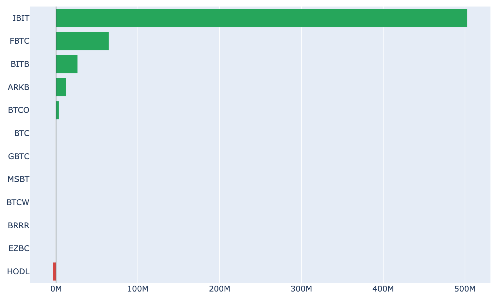

# 週間24%高で7万8,400ドル ― 上値の薄い帯を駆け上がり、ETFは年初来最強の週へ

**2026年8月22日**

3日続けて上げた相場は、失速するどころか加速しました。8月22日7時5分時点の実勢価格は約7万8,400ドルで、24時間で+7.8%、1週間では+24.5%です。一時7万9,500ドルまで上げ、5月下旬以来の水準に届きました。前日のレポートで「上げの担い手が外側の材料から現物の需給へ移りつつある」と書いた部分は、この24時間でさらにはっきりしています——ETFへの流入は4営業日連続で今年最大の週になり、米国の価格差もプラス側へ振れました。

（数値は8月22日7時5分時点で取得した各種データに基づきます。価格・取引所プレミアムは同時刻の実勢値、市場心理は8月21日の確定値、オンチェーン指標は8月19日時点、ETF資金フローは8月20日時点、株・金などの終値は8月21日時点です。）

## 1. 全体像：株ではなく金と並んで上げている

8月21日の他の資産の動きはこうでした（すべて8月21日の終値）。

* **金 4,661.60ドル（+3.2%、5営業日で+6.4%）** ― 6月以来の高値圏まで一段高。この日いちばん動いた資産です。
* **S&P500 7,674.37（+0.4%）／VIX（＝株式市場の恐怖指数）15.13（-5.5%）** ― 株はわずかに反発し、警戒感は後退。ただし5営業日では-1.4%とまだマイナスです。
* **米10年債利回り 4.74%（+0.9%）／ドル指数 98.84（-0.1%）／WTI原油 86.64ドル（-1.4%）** ― 長期金利は3日続けて戻し、ドルはほぼ横ばい。
* 全体の地合いは**まちまち**（5営業日で見ればリスクオフ寄り）。その並びのなかで、ビットコインは24時間で+7.8%と突出しています。

ビットコインと株の30日相関は+0.16、金との相関は+0.64。**株とは別々に、金とは同じ方向に動く**という構図は3日続いています。株と一緒のリスク資産としてよりも、金と同じ側で扱われている状態です。背景として市場が意識しているのは、8月19日に発表された米財務省の国債買い入れ拡大と、9月の利上げ観測の後退（利上げ確率は市場の織り込みで3割程度まで低下）があります。ただしこれは値動きの並びであって、原因を特定できるものではありません。

## 2. 注目すべきポイント

### ① 2本の移動平均を、価格が両方とも上抜けた

* 8月22日7時5分時点の約7万8,400ドルは、200日移動平均（約6万9,000ドル）も50日移動平均（約6万4,600ドル）も上回っています。**1週間前の安値は6万2,600ドル台**だったので、7日間で約1万6,000ドル動いたことになります。
* ただし50日線はまだ200日線の下にあり、中期のトレンド判定としてはデッドクロス圏のままです。**価格が線を抜けた段階と、線どうしが入れ替わる段階は別**で、後者にはまだ数週間かかります。
* 直近の値動きは一本調子ではありません。8月21日に7万9,500ドルまで駆け上がったあと7万7,000ドル近辺まで押し戻され、再び7万8,000ドル台へ戻しています。

### ② ETFの流入が4日続き、今年最大の週になった

* ETF資金フローは8月20日時点で+約6.1億ドルと、**5月1日以来およそ3か月半ぶりの大きさ**です。流入は4営業日連続で、合計は約16億ドル（+3.0億、+1.9億、+5.2億、+6.1億ドル）。**今年に入って最も強い1週間**になりました。
* 内訳はIBITが+約5.0億ドルと、その日の流入の約8割を1本で占めています。FBTC・BITB・ARKBにも小口の流入があり、流出はHODLのみ。
* 8月中旬まで小幅な流出が続いていた流れが完全に反転した形です。前日のレポートで「単発で終わるか定着するか」と書いた点は、**4日続いた時点で単発ではなくなりました。**

### ③ 米国の価格差が、300日で最も高い側へ

* Coinbase Premium（＝米国とそれ以外の価格差）は、8月22日7時5分時点の値でプラス0.03%。**過去300日のなかで上位6%に入る水準**です（この日次値はまだ確定していません）。1週間前はマイナス0.11%で、そこから一気にプラス側へ抜けました。
* とはいえプラス圏はまだ1日分で、絶対値も0.03%と小さい。**「米国勢が売り手ではなくなった」と言える段階で、「米国勢が主導している」と言うにはもう数日必要**です。

### ④ 短期勢は含み益、長期勢は放出を続ける

* 8月19日時点で、短期勢の平均取得原価は約6万7,200ドル。8月22日7時5分時点の価格はこれを**約17%上回って**おり、直近で買った層はまとまった含み益を抱えています。8月19日の短期勢SOPR（＝短期勢の損益）は1.011と過去4年で上位1割の利食い水準で、含み益になった層はすでに利益確定に動き始めています。
* 一方、長期勢の保有量の増減（過去30日）は8月19日時点で-約15.4万BTCと放出が続いています（30日前は+約14万BTC）。長期勢SOPR（＝長期勢の損益）も0.81と1を下回ったまま。**古参は上昇に乗って売る側**で、この構図はここ数日変わっていません。
* MVRV Z-Score（＝市場全体の含み益）は0.56。1週間前の0.36から上向いたものの、過去4年ではまだ下位3割です。**1週間で24%上げても、バリュエーションは割高の側へは来ていません。** マイナー収入の平年比（Puell Multiple）も0.71と下位2割のままです。

### ⑤ 熱があるのは心理で、先物ではない

* Fear & Greed（＝市場心理の指数）は8月21日で72と「強欲」。1週間前は29（恐怖）だったので**7日で+43ポイント**、過去の分布では上位15%に入ります。振れる速さは警戒に値しますが、「極度の強欲」（76以上）にはまだ届いていません。
* 資金調達率（＝先物の買い持ちが払う金利）は8時間あたり0.0100%で、30日で最も高い水準まで上がりました。ただし年率換算では約11%で、この銘柄の上限（8時間あたり±0.3%）には遠い水準です。
* 建玉（＝先物の未決済残高）は約10.6万BTC（金額では約79億ドル）で、**7日変化は-1.8%**。価格が1週間で24%上がったのに、BTC建ての建玉はむしろ減っています。**この上昇はレバレッジの積み増しで作られていない**——買われているのは現物側で、その分だけ急落の燃料も溜まっていません。

## 3. 相場転換を見極める分岐点

1. **8万ドルの上から、供給の層が急に厚くなる。** 取得原価の分布（8月19日時点のスナップショット）を見ると、価格がいま抜けてきた7万〜8万ドルの帯にある供給は全体の約6%と薄い一方、**8万〜9万ドルには約9%、9万〜10万ドルには約2割**が控えています。**薄い帯を速く駆け上がった分、次の帯では抵抗が変わる**可能性があります。なお、これは取得原価の分布であって保有者の数でも取引所の在庫でもなく、原価も日次終値による近似です。「誰が買ったか」までは読み取れません。
   
2. **9月15〜16日に日程が二つ重なる。** 上院はCLARITY法案（暗号資産の市場ルールを定める法案）の採決を9月15日に予定しており、翌16日にはFOMCがあります。**規制の枠組みと金利の方向が、48時間のうちに続けて出る**構図です。法案が通るかどうかをここで予想はしませんが、この2日を挟んで値動きが荒くなりやすい点は意識しておく価値があります。
3. **外側の追い風が剥がれても、水準を保てるか。** 上げの起点となった国債買い入れ拡大（実施は9月9日から）のあと、10年債利回りは3日続けて戻しています。**金利の追い風が弱まっても7万ドル台後半にとどまるなら、上げの主役は完全に現物の需給へ移ったと言えます。** 逆にETFの流入が止まり、米国の価格差がマイナスへ戻るようなら、心理だけが強欲圏に取り残された形になります。

## 総括

8月19日に始まった上昇は、1週間で24%という今年最大の値幅になりました。8月22日7時5分時点で約7万8,400ドル。ETFへの流入は4営業日続いて今年最強の週となり、米国の価格差もプラス側へ振れています。先物の建玉はむしろ減っており、この上げがレバレッジではなく現物の買いで作られている点は、これまでの急騰局面との違いです。一方で市場心理は7日で恐怖から強欲へ振れ、長期勢は放出を続けています。バリュエーションにはまだ余裕がありますが、価格は8万ドルの上に控える厚い供給層の手前に来ました。外側の追い風が弱まる局面で現物の買いが続くかどうかが、次の数日の焦点になると考えられます。

---

*本稿は情報提供を目的としたものであり、投資助言ではありません。将来の価格動向を保証・示唆するものではなく、投資判断は各自の責任において行ってください。*
