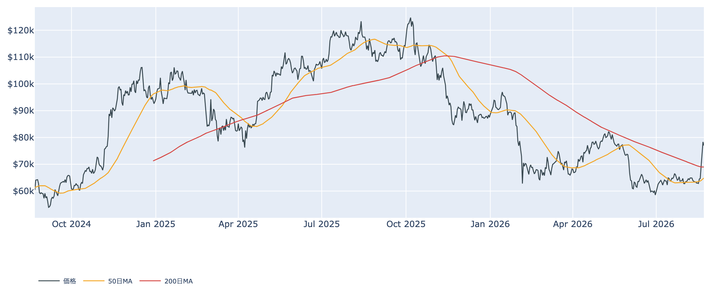
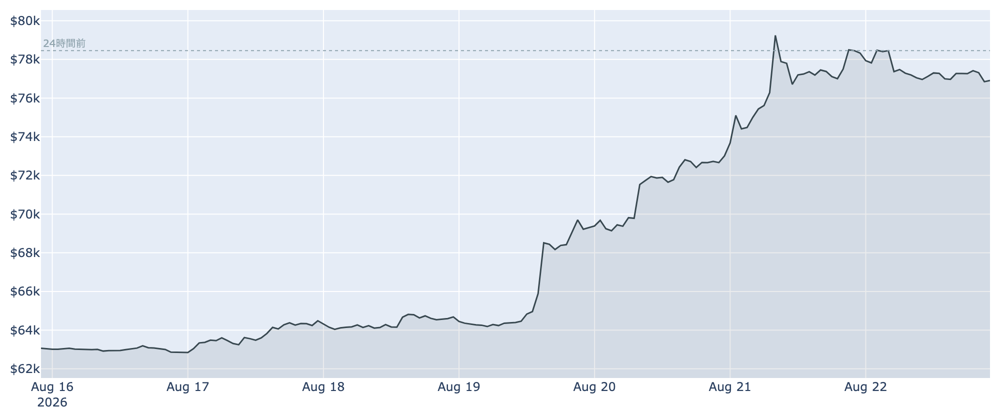
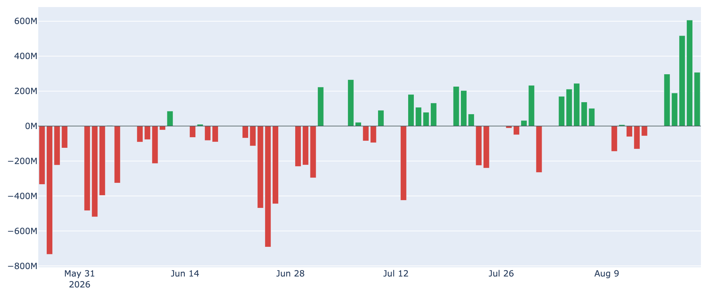
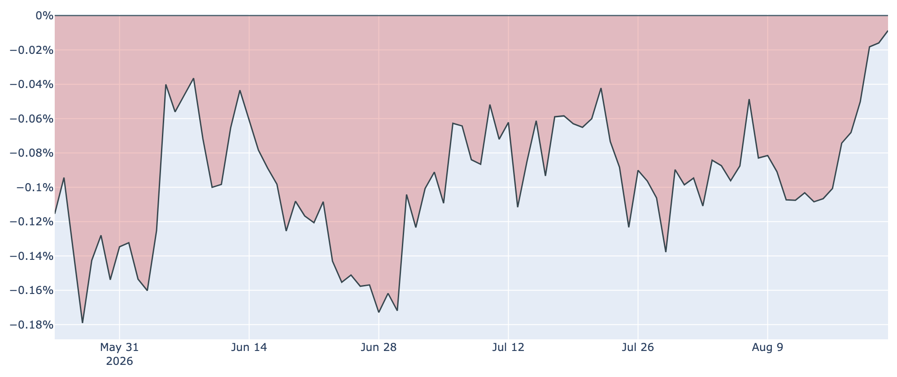
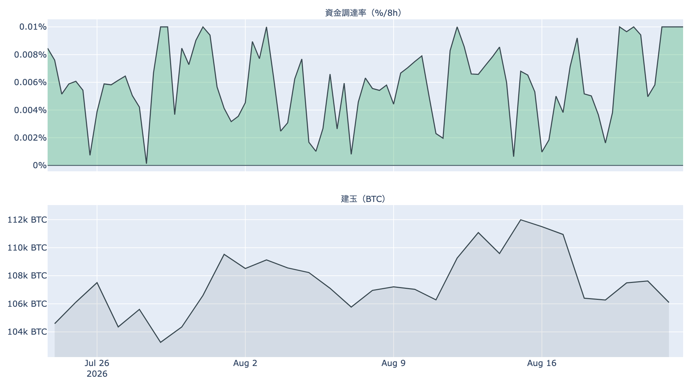
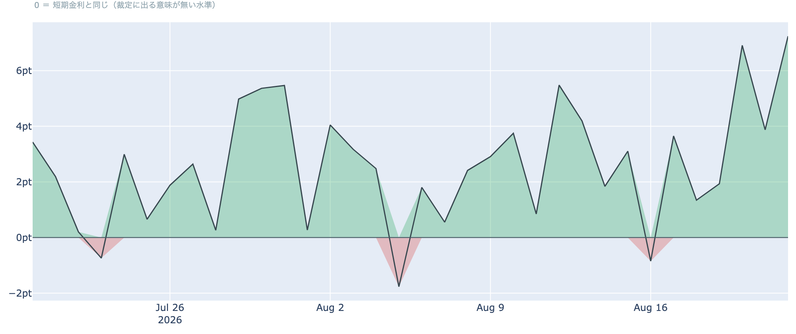
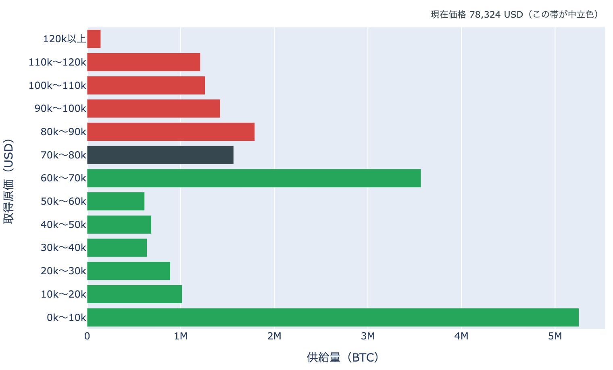

# 上げ足が止まった週末 ― 7万7,000ドル、利益確定の厚さは過去4年でも上位

**2026年8月23日**

1週間で2割超の急騰を演じたビットコインは、$79,500で二度はね返され、8月23日7時5分時点で約$77,000と小幅に押し戻されています。買いが止まったわけではなく、ETFには流入が続く一方で、オンチェーンには短期勢・長期勢の双方から利益確定が出てきました。上げの担い手と、それを受け止めている売り手を整理します。

（数値は8月23日7時5分（JST）時点までに取得した各種データに基づきます。価格とCoinbase Premiumはその時点の実勢、Fear & Greedは8月22日、オンチェーン指標とETF資金フローは8月21日時点です。）

## 1. 現在の市場の全体像：勢いは緩んだが、水準は保っている

* **水準**: 8月23日7時5分時点の実勢価格は約$76,965。50日移動平均（約$64,900）も200日移動平均（約$69,000）も大きく上回っています。ただし50日線自体はまだ200日線の下にあり、移動平均の並び（デッドクロス圏）が好転するまでには時間がかかります。
* **報じられている背景**: 米財務省が長期国債の買い戻しを倍増させる方針を示したこと（実施は9月9日から）、SECが暗号資産向けの規制案を公表したことが、今回の上げの起点として報じられています。米10年債利回りは8月21日時点で4.74%と、買い戻し発表前の水準へ戻しています。
* **リスク資産の並び**: 8月21日は金が+2.4%、S&P500が+0.4%。5営業日で見ると金+5.6%・原油+5.7%に対しS&P500は-1.4%でした。BTCとの30日相関は金+0.61に対し株+0.16で、この夏のBTCは株式よりも金と並んで動いています。因果は測れませんが、株が重いなかで買われた点は先週から変わっていません。

## 2. データの解説：注目すべき5つのポイント

### ① $79,500で二度止まり、直近24時間は小幅安

* 直近7日のレンジは$62,631〜$79,500で、7日前比は+約22%。ただし直近24時間は-1.9%（レンジ$76,472〜$78,828）で、$80,000の手前で足踏みしています。直近の確定日足終値は8月21日（UTC）の約$78,326です。
* Fear & Greed（＝市場心理の指数）は8月22日時点で71（強欲）。1週間前の34（恐怖）から一気に振れており、心理面では楽観がすでに先行している状態です。

### ② 短期勢の利益確定が、過去4年でも上位の厚さになった

* 短期勢SOPR（＝短期勢の損益）は8月21日時点で約1.019。1週間前（約0.997）から1を明確に上抜け、**過去4年の変動幅（約0.95〜1.08）のなかでも上位に入る水準**です。数か月ぶりに含み益に転じた層が、実際に利益を確定させ始めています。
* 短期保有者（保有155日未満）の平均取得原価は8月21日時点で約$68,300。実勢価格はこれを1割強上回っており、含み益のクッションは残っています。上値が重いのは「損切り」ではなく「やれやれではない、素直な利確」が出ているためだと読めます。

### ③ 長期勢は分配を加速、損切りから利確へ回った

* 長期保有層のネットポジション変化（＝長期勢の保有量の増減、過去30日）は8月21日時点で約-21.2万BTC。1週間前（約-13.8万BTC）、30日前（+約16.3万BTC）と比べて売り越し幅が広がり続けています。
* 長期勢SOPR（＝長期勢の損益）は約1.006。8月に入ってからは1を下回る日が続き、動かされた古参コインには損失覚悟の売りが混じっていましたが、価格上昇でこれが利益確定に変わりました。**売り手の質が変わった**わけで、価格が上がるほど出てきやすい種類の売りです。

### ④ ETFの流入は5営業日続く一方、米国プレミアムはゼロ止まり

* ETF資金フローは8月21日に+約3.1億ドルで、8月17日から5営業日連続の流入。直近7日合計は+約17.3億ドルです。最新日の内訳ではIBIT単独で+約2.4億ドルと、全体の8割弱を占めました。

* Coinbase Premium（＝米国とそれ以外の価格差）は8月22日時点で約-0.009%。1週間前の約-0.11%から着実に切り上がり、ゼロの一歩手前まで来ました。ただしマイナス圏は109日連続で途切れておらず、「米国勢の買いが海外を上回る」状態がまだ定着していない点は押さえておくべきです。

### ⑤ 先物は建玉が減りながらの上昇、短期金利への上乗せは34日で最大

* 資金調達率（＝先物の買い持ちが払う金利）は8時間あたり+0.0100%（年率換算 約+11.0%）。プラスは92回連続（約30日）で、直近30日のレンジの上限に張り付いています。ただしこの銘柄の上限（±0.3%/8時間）にはまだ遠く、「過熱」と呼ぶ水準ではありません。
* 建玉（＝先物の未決済残高）は約10.6万BTC（約83億ドル）で、直近7日ではむしろ-5.3%。**価格が2割上がる間にレバレッジの規模はむしろ縮んでおり、今回の上げは現物主導の色が濃い**と言えます。

* 資金調達率の年率（+10.95%）から短期金利（13週Tビル 3.71%）を引いた**上乗せ分は+7.24ポイントで、直近34日で最大**です（34日平均は+2.6ポイント）。現物を買って先物を売る形の裁定が、置いておくだけの金利に対して最も割に合う場面にあります。ただしこれは確実に取れる利回りではなく、現物の保管・取引所リスク・証拠金の追加が前提になります。
* 清算は静かでした。Hyperliquidで観測できた分では直近24時間で約30万ドル（下限値）・22件にとどまり、うち約56%がショートの清算です。8月19日からの急騰を押し上げた踏み上げの燃料は、ひとまず一巡したように見えます。

## 3. 相場転換を見極めるための「3つの分岐点」

1. **$79,500〜$80,000を抜け、その上の厚い帯を買いこなせるか**: 8月21日時点の取得原価の分布を見ると、いま価格がいる$70,000〜$80,000の帯の供給は約155万BTCと相対的に薄い一方、**その上の$80,000〜$90,000には約180万BTC（全供給のおよそ1割）が積み上がっています**。ここは2025年の下落局面で買われた層で、戻り売りが出やすい価格帯です。逆に下の$60,000〜$70,000には約355万BTC（およそ2割）と最も厚い塊があり、押した場合の支えの候補になります。なおこれは取得原価の分布であって、誰が何枚持っているかまでは分かりません。
2. **米国の買いが日程をまたいで続くか**: ETFの流入とプレミアムのゼロ接近が続けば、上げの担い手が「短期の踏み上げ」から「現物の実需」へ入れ替わったと言えます。外側の日程では、8月27〜29日のジャクソンホール会議（FRB議長の講演は28日）と、財務省の買い戻し拡大の実施開始（9月9日〜11月4日）が控えます。金利の流れが変われば、今回の上げの起点も変わります。
3. **レバレッジが後追いで膨らむか**: いまは建玉が減りながら上げている形ですが、資金調達率の上乗せが高いまま**建玉が増え始めたら、性格が変わります**。買い持ちが積み上がった状態での下げは速くなりやすく、上げの持続性を見るうえでは価格よりこちらの並び（率と建玉）を先に確認する価値があります。

## 総括

1週間で2割超上げたあと、相場は$80,000の手前でいったん息を整えています。ETFへの流入は5営業日続き、米国プレミアムもゼロ手前まで戻るなど需給の改善は進む一方、短期勢の利益確定は過去4年でも上位の厚さになり、長期勢は分配を加速させています。先物の建玉が減りながらの上昇という点では健全ですが、心理はすでに「強欲」に振れました。上値には$80,000超の厚い取得原価帯が控えており、ここを買いこなせるかどうかが、今回の急騰が新しいトレンドの入口だったのか、下げ相場のなかの強い戻りだったのかを分けることになります。

---

*本稿は情報提供を目的としたものであり、投資助言ではありません。将来の価格動向を保証・示唆するものではなく、投資判断は各自の責任において行ってください。*
