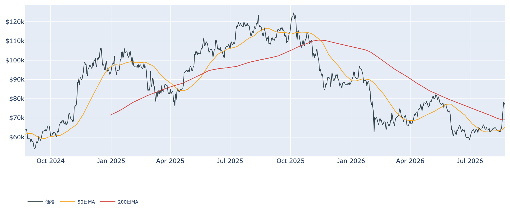
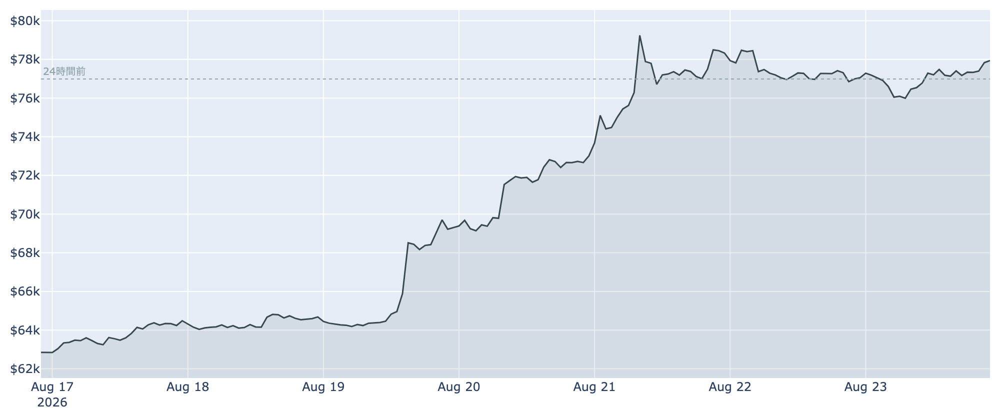
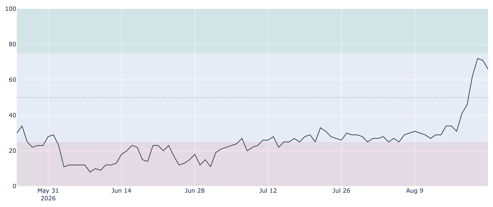
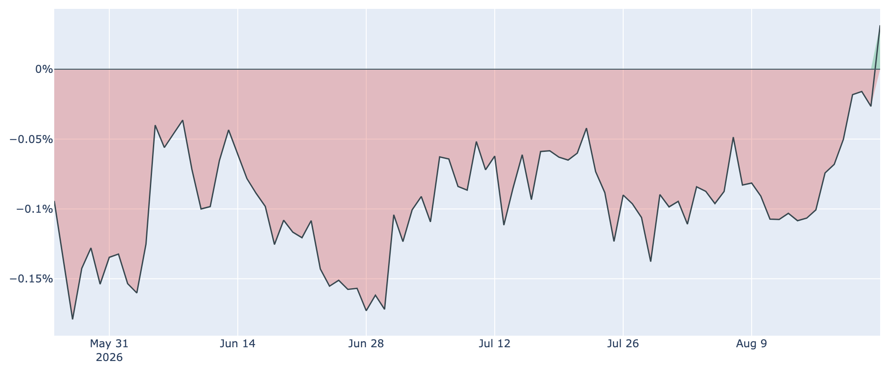
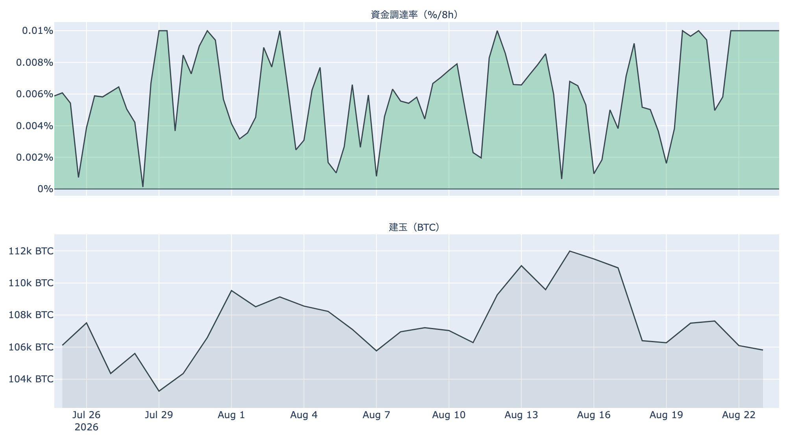
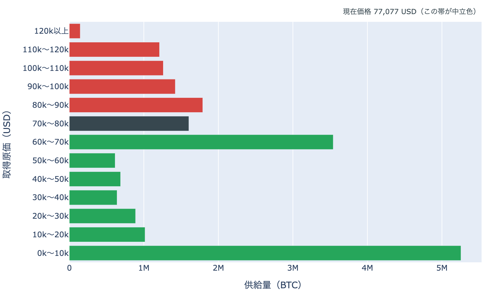

# 長期側で動いたコインは平均5割の益 ― $77,700、$80,000手前で三日目の足踏み

**2026年8月24日**

1週間で2割超上げた相場は、$80,000の手前で三日目の小休止に入りました。8月24日7時5分時点の実勢価格は約$77,700で、24時間では+約1%（レンジ$75,500〜$78,100）。価格が動かない一方、オンチェーンの中身は大きく変わっています。長期側で動いたコインの損益が1週間で損失側から平均1.5倍へ跳ね上がり、米国勢の買い越しは日次の確定値でも表に出てきました。

（数値は8月24日7時5分（日本時間）時点までに取得した各種データに基づきます。価格とCoinbase Premiumはその時点の実勢、Fear & Greedは8月23日、オンチェーン指標は8月22日、ETF資金フローは8月21日、株・金などの終値は8月21日時点です。なお、オンチェーンの保有・年齢の指標には、ETF・取引所が預かっている分も含まれています。）

## 1. 全体像：金と原油が上げるなかでの高値もみ合い

* **水準**: 8月24日7時5分時点で約$77,700。直近の確定日足終値は8月22日（UTC）の約$77,054です。50日移動平均（約$65,200）も200日移動平均（約$69,000）も大きく上回っていますが、50日線自体はまだ200日線の下にあり、移動平均の並び（デッドクロス圏）が好転するには時間がかかります。歴史的な位置としては、過去2年のレンジのなかでは下から4割程度の水準です。
* **外の環境**（すべて8月21日の終値、米国は週末で休場のため金曜から更新なし）: 金が4,680ドルと1日で+3.6%・5営業日で+6.9%と大きく上げ、WTI原油は87.06ドルで5営業日+5.7%。ホルムズ海峡の通航をめぐる緊張が続き、エネルギーにリスク上乗せ分が乗ったままです。S&P500は7,674と1日+0.4%ながら5営業日では-1.4%、VIX（＝株式市場の恐怖指数）は15.1と落ち着いています。
* **どこと一緒に動いているか**: BTCとの30日相関は株（S&P500）+0.16に対し金+0.65。この夏のビットコインは株式よりも金と並んで動いています。ただしこれは値動きの並びであって、原因の説明ではありません。
* **効き方の下地**: 1年以上動いていない供給は8月22日時点で62.3%。3か月前から+1.8ポイント戻しています。動かない供給が厚いほど、同じ規模の買い（あるいは売り）でも価格が動きやすくなる、という土俵の話です。

## 2. データの解説：注目すべき5つのポイント

### ① $79,500に二度はね返された水準で、三日横ばい

* 直近7日のレンジは$62,679〜$79,500で、7日前比は+約24%、30日前比は+約21%。一方、8月21日（UTC）に約$78,326で日足を終えたあとは$77,000前後での往復が続き、値幅の広さが目に見えて縮んでいます。
* Fear & Greed（＝市場心理の指数）は8月23日時点で66（強欲）。前日の71からは少し落ち着きましたが、1週間前の34（恐怖）からは+32ポイントで、心理面の楽観は価格より先に走ったままです。

### ② 長期側で動いたコインが30日で23万BTC、その損益は平均1.5倍へ

* 長期保有層のネットポジション変化（＝長期勢の保有量の増減、過去30日）は8月22日時点で約-23.5万BTC。1週間前（約-12.9万BTC）から倍近くに広がり、30日前（+約19.4万BTC）からは符号が反転しています。**預かり分の混入を差し引いても、この規模と方向は変わりません。**
* 長期勢SOPR（＝長期勢の損益）は約1.47。1週間前は約0.96で、動いた古いコインには損失覚悟の売りが混じっていましたが、この1週間で**取得時の平均およそ1.5倍（＝5割弱の益）**の値段で動く状態に変わりました。
* 保有量が減り、動いた分が利益に乗っている——独立した2つの指標が同じ向きを指しているので、**長期側から市場への分配が進んでいる**と読める並びです。ただし過去4年で見れば長期勢SOPRは真ん中あたりの水準で、歴史的な過熱ではありません。

### ③ 短期勢の利益確定はいったん一服

* 短期勢SOPR（＝短期勢の損益）は8月22日時点で約1.005。前日の約1.019から下がり、先週後半に集中した利確の勢いは緩みました。全体のSOPR（＝動いたコインの損益）も約1.009と、1をわずかに上回る程度です。
* 短期保有者（保有155日未満）の平均取得原価は8月22日時点で約$68,400。実勢価格はこれを1割強上回っており、含み益のクッションは残っています。**この水準を割り込むと、いまの「素直な利確」が「やれやれ売り」に変わる**ため、押し目の目安として最も分かりやすい線です。

### ④ 米国勢の買い越しが、確定値でも表に出た

* Coinbase Premium（＝米国とそれ以外の価格差）は8月23日の確定値で+0.03%。1週間前の約-0.10%から切り上がり、**2025年10月末以降の300日のなかでも上位5%に入る強さ**です。5月上旬から4か月近く続いた「米国勢の買いが海外に劣後する」状態は、数字のうえでも解消しました。
* ただしプラス圏はまだ1日。数日とどまって初めて「定着した」と言える段階です。

* ETF資金フローは8月21日に+約3.1億ドルで、5営業日連続の流入。直近7日合計は+約17.3億ドルで、週間としては2025年10月以来の大きさと報じられています。上場来の累計は+約538億ドルに達しました。8月22日・23日は米国が休場のため、この数字は8月21日で止まっています。

### ⑤ 建玉は減りながらの高値維持、清算は静かなまま

* 資金調達率（＝先物の買い持ちが払う金利）は8時間あたり+0.0100%（年率換算 約+11.0%）。プラスは95回連続（約32日）で続いています。もっともこの銘柄の上限（±0.3%/8時間）にはまだ遠く、「過熱」と呼ぶ水準ではありません。
* 年率（+11.0%）から短期金利（13週Tビル 3.71%）を引いた**上乗せ分は+7.2ポイント**で、直近34日の平均（+2.6ポイント）を大きく超えています。現物を買って先物を売る形が、置いておくだけの金利に対して割に合う場面が続いている、という意味です（確実に取れる利回りではなく、現物の保管・取引所リスク・証拠金の追加が前提になります）。
* 建玉（＝先物の未決済残高）は約10.5万BTC（約82億ドル）で、直近7日では-5.1%。**価格が2割上がるあいだにレバレッジの規模はむしろ縮んでおり、この上げが現物主導だった構図は変わっていません。**
* 清算も静かでした。Hyperliquidで観測できた分では直近24時間で約70万ドル（下限値）・97件にとどまり、ショートとロングがほぼ半々です。踏み上げの燃料はすでに一巡した形です。

（補足：ハッシュレートは945.9EH/sと30日で+13%、Puell Multiple（＝マイナー収入の平年比）も0.95まで戻り、7月の採算悪化局面からは明確に持ち直しています。次回の難易度調整は-1.4%の見込みです。）

## 3. 相場転換を見極めるための「3つの分岐点」

1. **$80,000の上に積まれた帯を買いこなせるか**: 取得原価の分布を見ると、いま価格がいる$70,000〜$80,000の供給は約160万BTCと相対的に薄い一方、**その上の$80,000〜$90,000には約180万BTC**が積み上がっています。$90,000〜$100,000にも約140万BTCが控えます。逆に下の$60,000〜$70,000は約350万BTCと最も厚く、押した場合の支えの候補です。$79,500で二度止まっているのは、この分布の形と整合的です。なおこれは取得原価の分布であって、誰が何枚持っているかまでは分かりません。
2. **米国の買いが日程をまたいで続くか**: プレミアムのプラスはまだ1日、ETFの数字も金曜で止まっています。外側の日程では、8月27〜29日のジャクソンホール会議が最大の焦点で、**ウォーシュFRB議長が議長として初のスピーチを8月28日（現地10時）に行います**。市場は9月の利上げを3分の1程度織り込んでおり、方向が振れれば今回の上げの起点だった金利の流れも変わります。財務省による長期国債の買い戻し拡大は9月9日からの実施予定です。
3. **レバレッジが後追いで膨らむか**: いまは建玉が減りながら上げている健全な形ですが、資金調達率の上乗せが高いまま**建玉が増え始めたら性格が変わります**。買い持ちが積み上がった状態での下げは速くなりやすいため、価格よりも「率と建玉の並び」を先に見る価値があります。なお規制の日程としては、暗号資産の市場構造法案（CLARITY Act）の上院での審議入り採決が9月15日に設定されています。

## 総括

$80,000の手前で相場は三日、息を整えています。米国勢の買い越しは日次の確定値でも表れ、ETFには週間で17億ドル超が入り、レバレッジは膨らんでいない——需給の中身は先週より確実に良くなっています。一方で、長期側から出てくるコインは30日で23万BTCまで増え、その損益は5割弱の益に乗りました。価格が上がるほど出てきやすい種類の売りで、これを買い越しが吸収し続けられるかが目先の勝負です。バリュエーション（MVRV Z-Score＝市場全体の含み益は約0.8）には過熱の兆しがなく、上値の余地は残っています。ただし価格のすぐ上には$80,000超の厚い取得原価の帯が控えており、ここを通過できるかどうかが、今回の急騰が新しいトレンドの入口だったのか、下げ相場のなかの強い戻りだったのかを分けることになります。

---

*本稿は情報提供を目的としたものであり、投資助言ではありません。将来の価格動向を保証・示唆するものではなく、投資判断は各自の責任において行ってください。*
