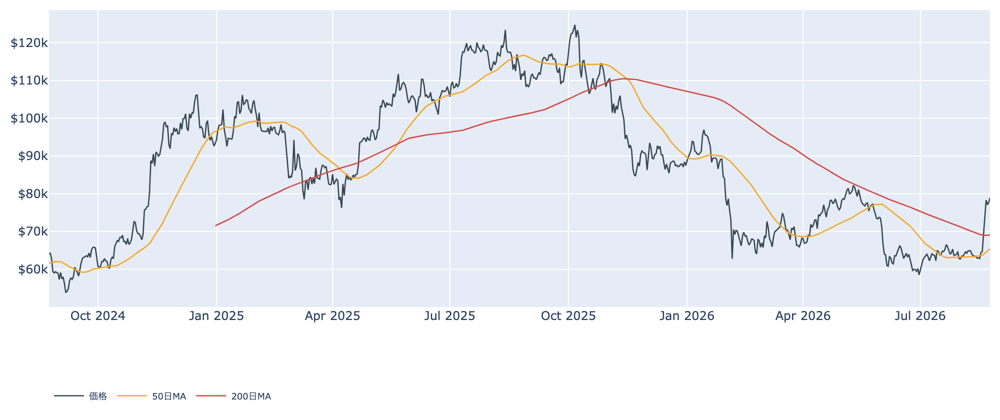
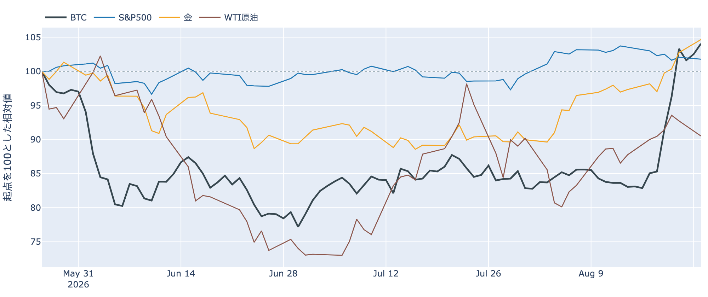
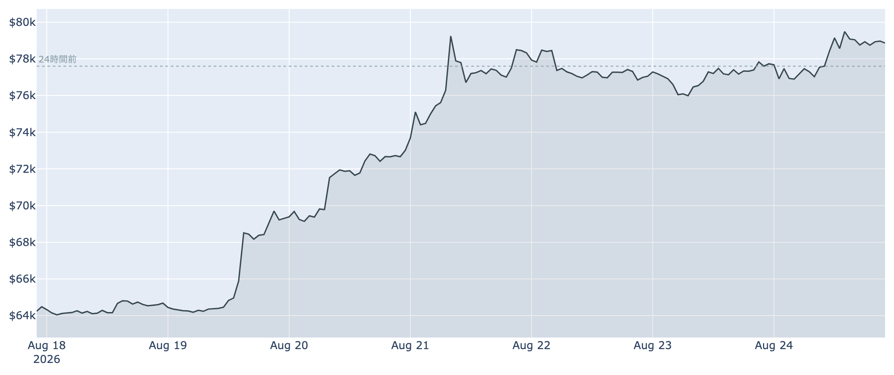
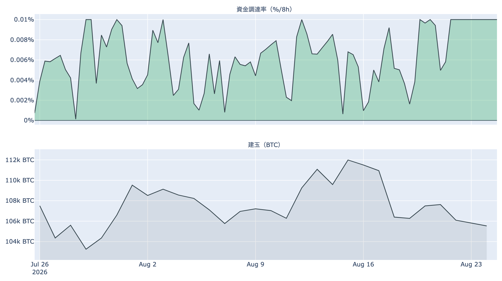
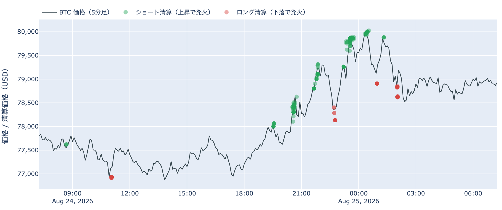
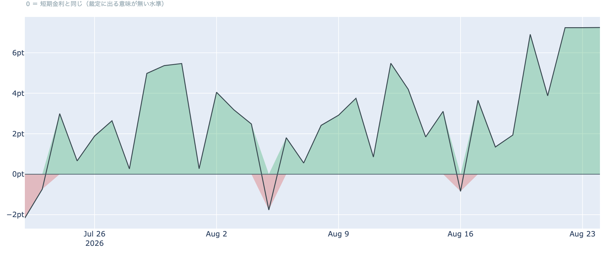
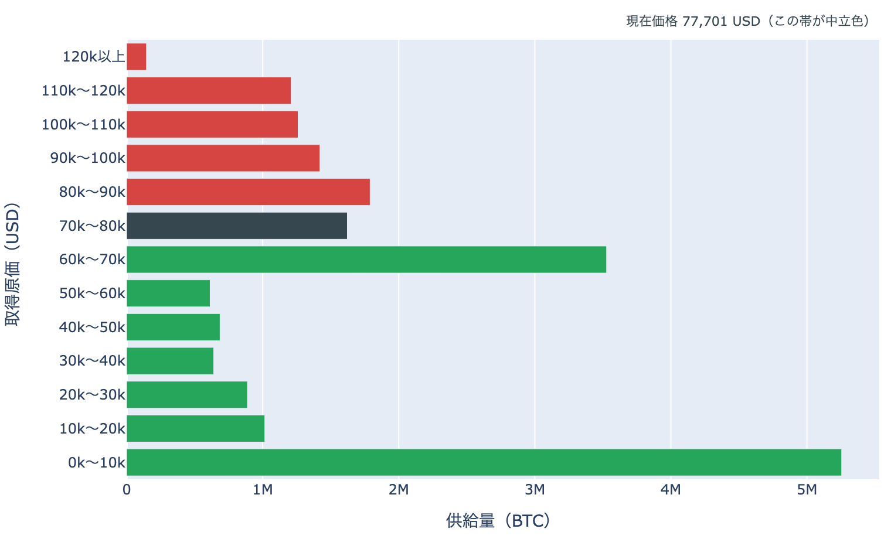

# 三度目で$80,000を叩いた ― 踏み上げを伴った突破と、その先に積まれた179万BTC

**2026年8月25日**

$79,500で二度はね返され、三日間の足踏みが続いていた相場が、夜間にとうとう$80,000へ届きました。8月25日7時5分時点の実勢価格は約$78,902で、24時間では+1.7%（レンジ$76,652〜$80,000）。1週間で+22%、1か月でも+23%です。ただし上げの中身を見ると、新しいレバレッジが積み上がったのではなく、売り建ての焼失と現物側の買いが担っています。上に何が積まれているかまで含めて整理します。

（数値は8月25日7時5分（日本時間）時点までに取得した各種データに基づきます。価格と取引所プレミアムはその時点の実勢、市場心理は8月24日の確定値、オンチェーン指標は8月23日、ETF資金フローは8月21日、株・金などの終値は8月24日時点です。なお、オンチェーンの保有・年齢の指標には、ETF・取引所が預かっている分も含まれています。）

## 1. 全体像：株が重く、金が最高値圏を走るなかでの上抜け

* **水準**: 8月25日7時5分時点で約$78,902。直近の確定日足終値は8月23日（UTC）の約$77,729です。50日移動平均（約$65,500）も200日移動平均（約$69,100）も大きく上回っていますが、50日線自体はまだ200日線の下にあり、移動平均の並び（デッドクロス圏）が好転するにはまだ時間がかかります。過去2年のレンジのなかでの位置は下から4割ほどで、水準そのものが高いわけではありません。
* **外の環境**（すべて8月24日の終値）: 金が4,710ドルで1日+1.9%・5営業日+6.6%と最高値圏を走る一方、S&P500は7,653で-0.3%、VIX（＝株式市場の恐怖指数）は15.85と+4.8%。ドル指数98.99はほぼ横ばいでした。銘柄の並びとしてはリスクオフ寄りで、株高を伴った全面高ではありません。
* **地政学**: 米国が8月24日に対イランの大型制裁パッケージを打ち出し、WTI原油は84.98ドルと1日-2.4%。先週までホルムズ海峡をめぐる緊張で乗っていた上乗せ分が、いったん剥がれた形です。エネルギー由来のインフレ懸念が後退するかどうかは、この先の金利観に効いてきます。
* **どこと一緒に動いているか**: BTCとの30日相関は株（S&P500）+0.11に対し金+0.56。この夏のビットコインは株式より金と並んで動いています。ただしこれは値動きの並びであって、原因の説明ではありません。

## 2. データの解説：注目すべき5つのポイント

### ① 三日間止まっていた$80,000に、夜間で到達

* **突破の位置**: 直近24時間のレンジは$76,652〜$80,000。8月22日・23日と$79,500で二度はね返された水準を、今回は$80,000ちょうどまで押し上げました。ただし取得時刻には$78,900台へ戻しており、上抜けを固めたとまでは言えません。
* **市場心理**: Fear & Greed（＝市場心理の指数）は8月24日に73と「強欲」圏。1週間前の31（恐怖）から+42ポイントで、過去8年の分布では上から1割強の位置にあります。恐怖から強欲への移行は1週間で完了しました。
* **短期勢の損益**: 短期保有者のRealized Price（＝平均取得原価）は8月23日時点で約$68,500。実勢価格はこれを15%ほど上回っており、直近に買った層は平均して含み益の状態です。8月中旬まで含み損だった層が、この1週間で反転しました。

### ② 上げの中身は「売り建ての焼失」で、レバレッジは積み上がっていない

* **建玉は減っている**: 建玉（＝先物の未決済残高）は107,353 BTC（約82億ドル）で、7日間で-4.9%。**価格が2割上げるあいだに未決済のポジションはむしろ減っています。**新規の買い建てが積み上がって上げたのではなく、既存の売り建てが閉じられて上げた形です。
* **焼けたのはショート**: Hyperliquidの約定履歴から観測できた直近24時間の強制清算は、金額ベースで84.6%がショート（売り建て）側でした。焼けた位置は79,000ドル台に6割、78,000ドル台に3割。**$79,500の壁を上抜けたところに売り建てが溜まっていた**という分布です。
* **時間の集中**: 8月24日23時台（日本時間）の1時間だけで全体の51%が集中しました。被清算アドレスは265件で、最大の1件が全体の24%。特定の1者が飛んだのではなく、同じ価格帯にいた多数が同時に踏まれた形です。なお清算と値動きは同時刻に起きるため、どちらが先かはこのデータでは決まりません。この上げは清算を伴った、というところまでです。

* **買い持ちのコスト**: 資金調達率（＝先物の買い持ちが払う金利）は直近8時間で+0.0068%（年率換算 約+7.5%）。98回連続のプラス（約33日）ですが、この銘柄の上限（±0.3%／8時間）には遠く、過熱と呼べる水準ではありません。
* **上乗せは1か月で最大**: 直近の水準を年率に直した約+11%から、同じ期間で置ける短期金利（13週Tビル、約3.7%）を引いた上乗せは+7.25ポイント。直近34日の平均+2.8ポイントに対して最大値です。現物を持って先物を売る側の取り分が最も厚くなっており、その裁定が入るほど資金調達率は下へ押し戻されます。これは「確実に取れる利回り」ではなく、置いておくだけの金利に対する上乗せ、という意味です。

### ③ ETFへの流入は7営業日で17億ドル超

* **規模**: 米国スポットETFの純流入は8月21日に+約3.1億ドル。直近7営業日の合計は+約17.3億ドルで、8月19日以降の3営業日はいずれも+3億ドル超で並んでいます。8月上旬までの一進一退から、はっきり流入側へ振れました。
* **偏り**: 8月21日の内訳はIBITが+約2.4億ドルと8割弱を占め、FBTC +0.3億ドル、その他は小口。流入の担い手が広がっているというより、最大手1本に集中しています。
* **効き方の下地**: 1年以上動いていない供給は8月23日時点で62.4%、3か月前から+1.9ポイント戻しています。動かない供給が厚いほど、同じ規模の買い（あるいは売り）でも価格が動きやすくなる、という土俵の話です。
* **米国の現物需要**: 取引所プレミアム（＝米国とそれ以外の価格差）は8月24日で-0.04%と、111日連続のマイナス。1週間前の-0.07%、30日前の-0.12%からは縮んでいますが、プラスへの浮上には至っていません。**上げの主役はETFの創出であって、現物市場での米国勢の上乗せ買いではない**という並びが続いています。

### ④ この1週間で、供給の4分の1の上へ抜けた

8月23日時点の取得原価の分布に、いまの価格を重ねます（分布は数日遅れ、価格は実勢です）。

* **通過した量**: 1週間前の価格（約$64,500）は$60,000〜$70,000の帯にいました。そこから上へ1帯移動し、**通過した帯を含めて514万BTC・全供給の約26%の上へ抜けた**ことになります。価格より上に残る供給は、1週間前の37.1%から**29.0%**へ縮みました。
* **いまの位置**: 価格は$70,000〜$80,000の帯（162万BTC・全供給の8.1%）の下端から89%の地点。上端の$80,000までは+1.4%、下端の$70,000までは-11.3%です。**次の関門はすぐそこで、押し戻された場合の余地は10%以上ある**という非対称な位置にいます。
* **その先に積まれている量**: $80,000〜$90,000に179万BTC（8.9%）、$90,000〜$100,000に142万BTC（7.1%）、$100,000〜$110,000に126万BTC（6.3%）、$110,000〜$120,000に121万BTC（6.0%）。**上値は1枚の壁ではなく、10万ドル台まで厚さの揃った層が4段続きます。**この1週間で抜けてきた$60,000〜$70,000の353万BTC（17.6%）のような大きな塊は、上には無い代わりに、薄い帯も無いという形です。
* この分布が示すのは「いくらで取得された供給がどこに残っているか」であって、誰が持っているかではありません。取引所やETFの預かり分も、入金日の価格を原価として同じ分布に入っています。

### ⑤ 長期側は分配。動いたコインは平均5割の益で出ている

* **量**: 長期保有層のネットポジション変化（＝長期側で数えられる供給の増減、過去30日）は8月23日時点で約-23.8万BTC。1週間前の約-15.1万BTCから減少幅が広がり、30日前は+18万BTCのプラス圏でした。**1か月で符号が反転しています。預かり分の混入を差し引いても、この規模と方向は変わりません。**
* **中身**: 同時にLTH-SOPR（＝長期勢の損益）は1.148。長期側で動いたコインは平均して約1.5割の利益を乗せて動いており、1週間前の0.71（損失側）から反転しました。**量の減少と利確の合流**なので、この日の並びは分配と呼べる形です。
* **市場全体**: SOPR（＝動いたコインの損益）は1.006、短期勢SOPRも1.005とわずかにプラス。全体としては小幅な利確が続く水準で、投げ売りの気配はありません。
* **バリュエーション**: MVRV Z-Score（＝市場全体の含み益）は0.84。1週間前の0.34から上がりましたが、過去4年の分布では下から4割程度で、天井圏の目安（6〜7）には遠い位置にあります。

（補足：ハッシュレートは846.6 EH/sで30日間で-13%と、採掘側の縮小が続いています。次回の難易度調整は約-1%の見込みです。）

## 3. 相場転換を見極めるための「3つの分岐点」

1. **$80,000に定着できるか**: 到達はしたものの、上には$80,000〜$90,000の179万BTCを筆頭に、10万ドル台まで厚さの揃った層が控えています。一方、上げを作った売り建ての踏み上げは一度焼ければ繰り返せません。**建玉が減ったまま価格が保たれるなら現物の買いが引き継いだ証拠**、建玉が急増しながら上げるなら再びレバレッジ主導、という読み分けができます。押し戻された場合、直近の帯の下端$70,000までは距離があります。
2. **金融政策の材料が3日続けて出る**: 8月26日に7月のPCE（個人消費支出物価指数）、8月27〜29日にジャクソンホール会議があり、28日にはウォーシュ議長が就任後初の基調講演に立ちます。9月15〜16日のFOMCについて、市場は据え置きを6割強織り込む一方、年内の利上げ観測も残る微妙な状態です。今回の上げの起点が財務省の国債買い戻し拡大＝金利低下だったことを踏まえると、**この3日で金利観が反対側へ振れた場合、上げの前提が薄くなる**点は意識しておく必要があります。
3. **9月15日、上院の最初の手続き投票**: 市場構造法案（CLARITY法案）は、上院が採決なしで8月の休会に入った時点で年内成立は難しいと見られていましたが、今月の政権側の後押しで再び材料になりました。9月15日の最初の手続き投票が最初の関門です。成立の可否を予想する材料はありませんが、**日程が動いたこと自体が価格に効いている**局面なので、この日付は押さえておく価値があります。

## 総括

$79,500で二度止まった水準を、三度目で$80,000まで押し上げました。ただし上げの中身は、建玉が7日で5%減るなかでの売り建ての焼失であり、新しいレバレッジが積み上がったわけではありません。現物側ではETFへの流入が7営業日で17億ドル超と明確に戻っている一方、米国の現物プレミアムは111日連続のマイナス圏にとどまり、長期側では分配が進んでいます。この1週間で供給の4分の1の上へ抜けた結果、価格より上に残る供給は29%まで減りましたが、その29%は10万ドル台まで薄い層のない連なりです。**買い手の質は先週より改善したものの、上値の各段でそれを試される段階**、というのが8月25日時点の姿です。

---

*本稿は情報提供を目的としたものであり、投資助言ではありません。将来の価格動向を保証・示唆するものではなく、投資判断は各自の責任において行ってください。*
