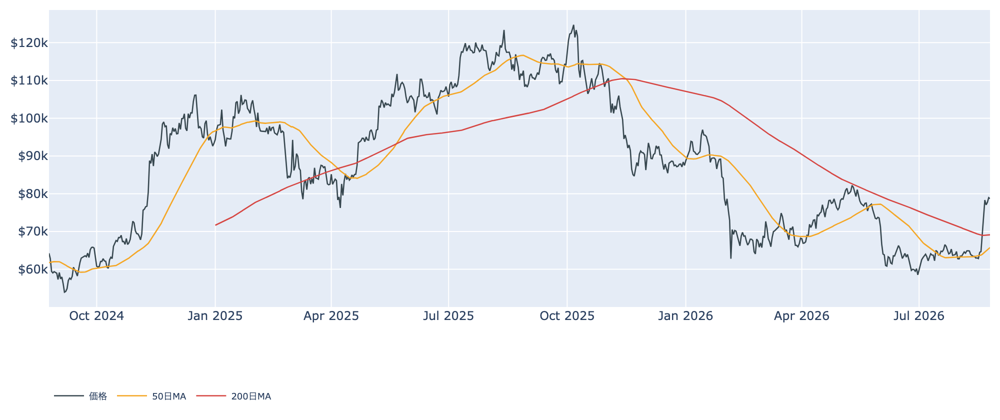
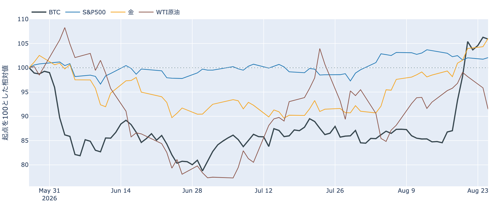
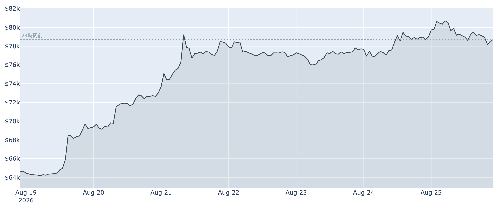
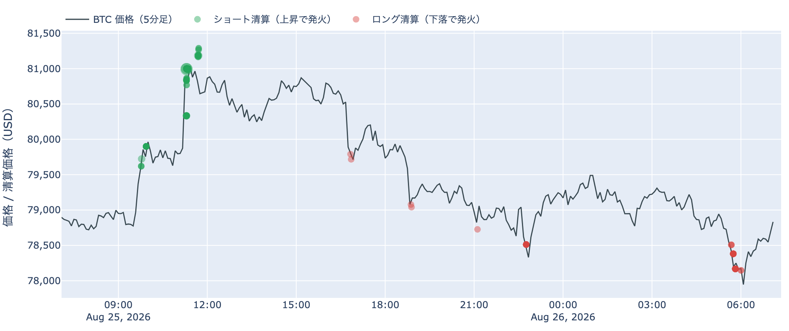
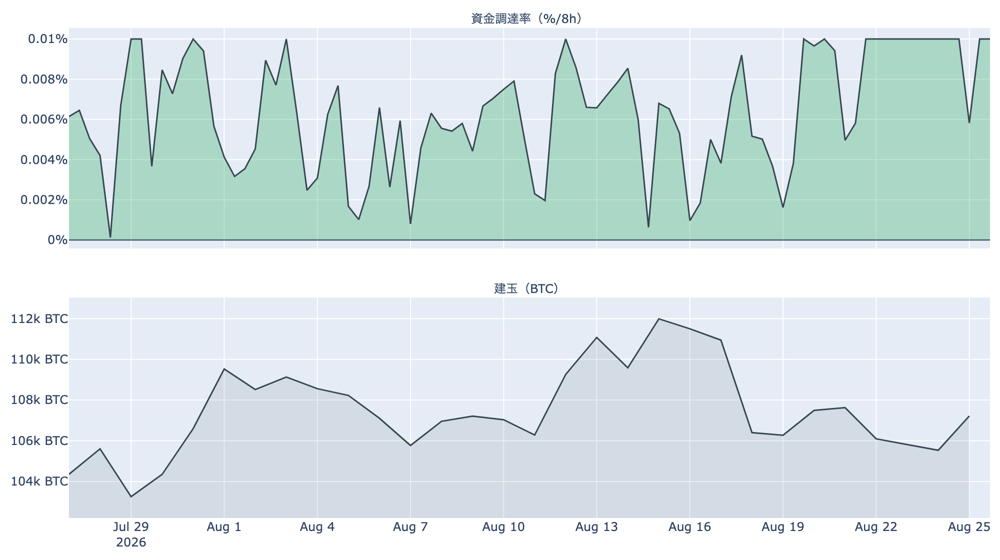
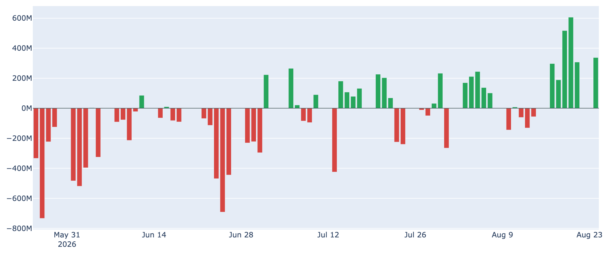
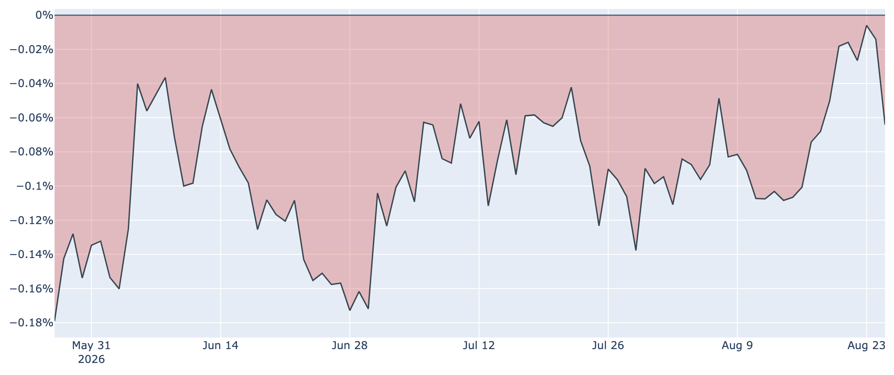
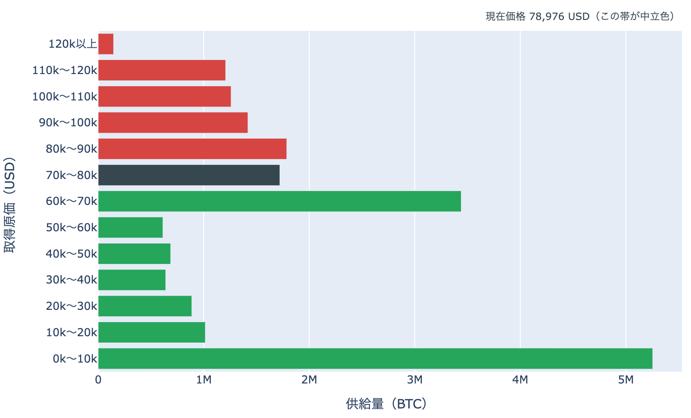

# $81,265から行って来い ― 踏み上げは$80,000より上で焼け、24時間の値は動かず

**2026年8月26日**

アジア時間に$81,265まで届いた相場が、そのまま欧米時間で押し戻され、24時間前とほぼ同じ水準に戻りました。8月26日7時5分時点の実勢価格は約$78,706で、24時間では-0.04%（レンジ$77,832〜$81,265）。1週間では+21.7%、1か月では+20.5%です。上へ抜けた瞬間に売り建てがまとめて焼けた一方、その値段は残りませんでした。何が動いて何が動かなかったのかを整理します。

（数値は8月26日7時5分（日本時間）時点までに取得した各種データに基づきます。価格と取引所プレミアムはその時点の実勢、市場心理は8月25日の確定値、オンチェーン指標は8月24日、ETF資金フローは8月24日、株・金などの終値は8月25日時点です。なお、オンチェーンの保有・年齢の指標には、ETF・取引所が預かっている分も含まれています。）

## 1. 全体像：金が最高値圏を走り、原油は急落したなかでの高値更新

* **水準**: 8月26日7時5分時点で約$78,706。直近の確定日足終値は8月24日（UTC）の約$78,982です。50日移動平均（約$65,800）も200日移動平均（約$69,100）も大きく上回っていますが、50日線自体はまだ200日線の下にあり、移動平均の並び（デッドクロス圏）は好転していません。過去2年のレンジのなかでの位置は下から4割ほどで、水準そのものが高いわけではありません。
* **外部環境**（すべて8月25日の終値）: 金が4,715.90ドルで1日+1.6%・5営業日+8.0%と最高値圏を更新。S&P500は7,677.28で+0.3%、VIX（＝株式市場の恐怖指数）は15.45で-2.5%、ドル指数98.91はほぼ横ばい、米10年債利回りは4.64%へ低下しました。銘柄の並びとしてはどちらとも言えない「まちまち」で、株高を伴った全面高でも、リスクオフでもありません。
* **エネルギー**: WTI原油は81.11ドルで1日-4.6%と大きく下げました。イランと米国のあいだで外交上の進展が探られているとの観測が伝わり、ホルムズ海峡をめぐる供給懸念の上乗せがさらに剥がれた形です。もっとも米側は制裁の強化も並行して打ち出しており、方向が定まったわけではありません。
* **どこと一緒に動いているか**: BTCとの30日相関は株（S&P500）+0.09に対し金+0.53。株との連動はほぼ消え、この夏のビットコインは金と並んで動いています。ただしこれは値動きの並びであって、原因の説明ではありません。

## 2. データの解説：注目すべき5つのポイント

### ① 高値は更新したが、24時間の値は動いていない

* **行って来い**: 直近24時間のレンジは$77,832〜$81,265で、値幅は4%強。前日に届いた$80,000を上へ抜けて$81,265まで進みましたが、取得時刻には$78,700台と、24時間前とほぼ同じ位置に戻っています。**高値は更新し、水準は残らなかった**24時間でした。
* **1週間の伸び**: それでも7日前比は+21.7%、7日レンジは$64,112〜$81,265。1週間で3割近い値幅を通ってきた相場が、$80,000の上で初めて足を止めた形です。
* **市場心理**: Fear & Greed（＝市場心理の指数）は8月25日に74と「強欲」圏で、8月21日以降は5日続けて60台後半〜70台にとどまっています。1週間前は41（恐怖）、30日前は26（恐怖）でした。過去8年の分布では上から1割の位置です。恐怖から強欲への移行は1週間で終わり、いまは強欲側で高止まりしています。

### ② 焼けた売り建ては$80,000より上に集中していた

* **向き**: Hyperliquidの約定履歴から観測できた直近24時間の強制清算は、金額ベースで88.9%がショート（売り建て）側でした。上昇で踏まれた側です。
* **位置**: 焼けた価格帯は80,000ドル台に45%、81,000ドル台に39%。**8割強が$80,000より上で発生しています。**前日は79,000ドル台が中心だったので、焼ける場所が一段上へ移りました。
* **時間**: 8月25日11時台（日本時間）の1時間だけで全体の84%が集中。アジア時間の高値更新にぶつかっています。被清算アドレスは233件で、最大の1件が全体の40%を占めました。多数が同時に踏まれたなかに、大きめの1件が混じっている構図です。なお清算と値動きは同時刻に起きるため、どちらが先かはこのデータでは決まりません。この高値更新は清算を伴った、というところまでです。

* **建玉は下げ止まった**: 建玉（＝先物の未決済残高）は106,746 BTC（約85億ドル）で、7日間で+0.8%。前日まで続いていた減少が止まりました。上げの局面で減り続けていた未決済のポジションが、$80,000台では減らなくなっています。
* **買い持ちのコスト**: 資金調達率（＝先物の買い持ちが払う金利）は直近8時間で+0.0088%（年率換算 約+9.6%）。100回連続のプラス（約33日）ですが、この銘柄の上限（±0.3%／8時間）には遠く、過熱と呼べる水準ではありません。
* **上乗せは縮んだ**: 直近の水準を年率に直した約+9.4%から、同じ期間で置ける短期金利（13週Tビル、3.70%）を引いた上乗せは+5.7ポイント。直近34日の平均+3.2ポイントよりは厚いものの、前日の最大値+7.25ポイントからは縮みました。現物を持って先物を売る側の取り分が細り始めた、という意味です。これは「確実に取れる利回り」ではなく、置いておくだけの金利に対する上乗せ、という意味の数字です。

### ③ ETFへの流入は7営業日で22億ドル、米国の現物需要は伸びず

* **規模**: 米国スポットETFの純流入は8月24日に+約3.4億ドル。直近7営業日の合計は+約22.0億ドルで、8月17日以降の6営業日はすべて流入です。8月上旬の一進一退から、はっきり流入側へ振れた状態が続いています。
* **偏り**: 8月24日の内訳はIBITが+約2.1億ドルと全体の6割強、FBTC +約1.0億ドル、残りは小口。担い手が広がっているというより、上位2本に集中しています。
* **効き方の下地**: 1年以上動いていない供給は8月24日時点で62.4%、3か月前から+1.9ポイント戻しています。動かない供給が厚いほど、同じ規模の買い（あるいは売り）でも価格が動きやすくなる、という土俵の話です。

* **米国の現物需要は逆に後退**: 取引所プレミアム（＝米国とそれ以外の価格差）は8月25日で-0.064%と、112日連続のマイナス。8月23日の-0.006%までいったん縮んでいたものが、**高値を更新したこの日にかけて再び広がりました。**ETFの創出という経路では資金が入る一方、現物市場で米国勢が上乗せして買う姿にはなっていません。

### ④ 帯の上端に頭を入れたが、日足では帯の中に戻った

8月24日時点の取得原価の分布に、いまの価格を重ねます（分布は数日遅れ、価格は実勢です）。

* **いまの位置**: 価格は$70,000〜$80,000の帯（172万BTC・全供給の8.6%）の下端から87%の地点。上端の$80,000までは+1.6%、下端の$70,000までは-11.1%です。24時間のうちに一度この上端を超えましたが、日足の終値ベースでは帯の中に戻っており、**1日前と比べて帯またぎは起きていません**（＝上下配分も動いていません）。
* **1週間で通過した量**: 1週間前の価格（約$64,700）は$60,000〜$70,000の帯にいました。そこから上へ1帯移動し、通過した帯を含めて**516万BTC・全供給の約26%の上へ抜けた**ことになります。価格より上に残る供給は37.6%から**29.0%**へ縮みました。
* **その先の分布の形**: $80,000〜$90,000に179万BTC（8.9%）、$90,000〜$100,000に142万BTC（7.1%）、$100,000〜$110,000に126万BTC（6.3%）、$110,000〜$120,000に121万BTC（6.0%）。**12万ドル手前まで、厚さの揃った層が4段続きます。**下側は、すぐ下の$60,000〜$70,000に344万BTC（17.1%）と厚く、そこを外すと$40,000〜$60,000は合計で全供給の6%台まで薄くなります。**ただしこれは分布の形であって、その量の売りが待っているという意味ではありません。**
* この分布は、それぞれのコインが**最後に動いたときの価格**で束ねたものです。誰が持っているかは分からず、自分のウォレット間の移動や取引所への入出金でも価格は付け替わるため、そのまま「その値段で買った人の量」とは読めません。

### ⑤ 動いたコインの損益：短期側は4年で最も厚い利確、長期側は損失側へ落ちた

* **短期側**: 短期勢SOPR（＝短期勢の損益）は8月24日時点で1.0205。**過去4年の分布では上から2〜3%に入る高さ**で、直近に取得したコインが平均2%の利益を乗せて動いています。短期保有者のRealized Price（＝平均取得原価）は約$68,988で、実勢価格はこれを14%上回る位置。含み益になった層が実際に動かし始めている並びです。
* **長期側の量**: 長期保有層のネットポジション変化（＝長期側で数えられる供給の増減、過去30日）は約-24.3万BTC。1週間前の約-17.4万BTCから減少幅が広がり、30日前は+18.3万BTCのプラス圏でした。**預かり分の混入を差し引いても、この規模と方向は変わりません。**
* **長期側の中身は反転**: 一方でLTH-SOPR（＝長期勢の損益）は0.991と、1を割り込みました。8月23日時点の1.15から急落しており、**長期側で動いたコインは平均してわずかな損失を抱えた状態で動いています。**量が減り続けている点は変わりませんが、「利益を確定しながら手放している」という前日までの並びは崩れました。この日の材料では、量の減少という事実までにとどめます。
* **市場全体**: SOPR（＝動いたコインの損益）は1.0201で、こちらも過去4年で上位に入る水準。MVRV Z-Score（＝市場全体の含み益）は0.88で、1週間前の0.40から上がりましたが、天井圏の目安（6〜7）には遠い位置です。

（補足：ハッシュレートは880.3 EH/sで30日間で+1.3%と持ち直しています。次回の難易度調整は約-2.6%の見込みです。）

## 3. 相場転換を見極めるための「3つの分岐点」

1. **$81,300を日足で上抜けられるか**: 上値を試した位置がはっきりしました。取得原価の分布で見ると、$80,000より上には$80,000〜$90,000の179万BTCを筆頭に、12万ドル手前まで厚さの揃った層が4段続きます。一方、押し戻された場合、いまいる帯の下端$70,000までは-11%と距離があります。**建玉が増えないまま値を保てるなら現物の買いが引き継いだ形**、建玉が急増しながら上げるなら再びレバレッジ主導、という読み分けは今日も有効です。前日まで焼けていた売り建ては$80,000より上へ移っており、同じ燃料は繰り返し使えません。
2. **金融政策の材料が今日から4日続く**: 8月26日に7月のPCE（個人消費支出物価指数）、8月27〜29日にジャクソンホール会議があり、28日にはウォーシュ議長が就任後初の基調講演に立ちます。9月16日のFOMCについて、市場が織り込む利上げ確率はおよそ3分の1、12月までなら7割弱です。**今回の上げの起点が財務省の国債買い戻し拡大＝金利低下だったことを踏まえると、この4日で金利観が反対側へ振れれば、上げの前提が薄くなります。**
3. **剥がれた原油の上乗せが戻るか**: WTIは8月25日に-4.6%と急落し、5営業日でも-4.5%。中東の供給懸念による上乗せが剥がれる方向で動いています。この方向が続けばエネルギー由来のインフレ懸念は後退し、上の2番目で見る金利観にも効いてきます。逆に制裁の強化や海峡をめぐる緊張が再燃すれば、同じ経路が反対に働きます。**BTCが金と並んで動いている局面**なので、この経路は今の相場では無視できません。

## 総括

$81,265という高値は取れましたが、値段は残りませんでした。焼けた売り建ては$80,000より上へ移り、その多くが8月25日午前の1時間に集中しています。現物側ではETFへの流入が7営業日で22億ドルと明確に続いている一方、米国の現物プレミアムはこの日にかけて再び広がり、112日連続のマイナス圏にとどまりました。オンチェーンでは短期側の利確が過去4年でも上位の厚さに達し、長期側は量が減り続けるなか、動いたコインの損益は1を割り込んでいます。**上へ抜ける燃料を一段消化し、次は上値の各段を現物の買いだけで越えられるかを問われる段階**、というのが8月26日時点の姿です。

---

*本稿は情報提供を目的としたものであり、投資助言ではありません。将来の価格動向を保証・示唆するものではなく、投資判断は各自の責任において行ってください。*
