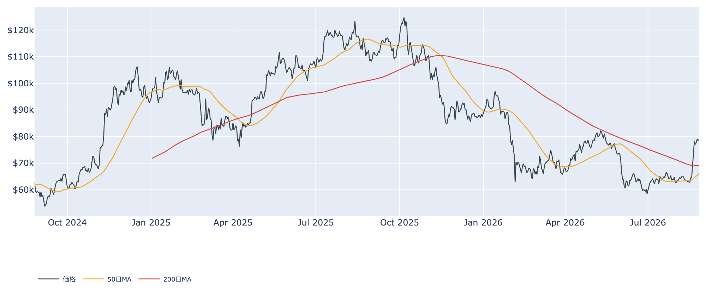
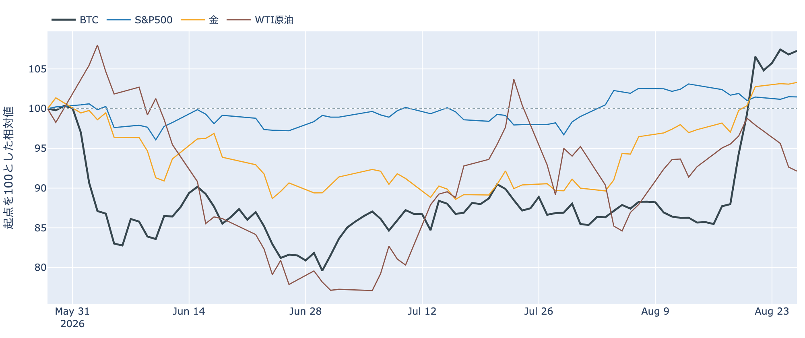
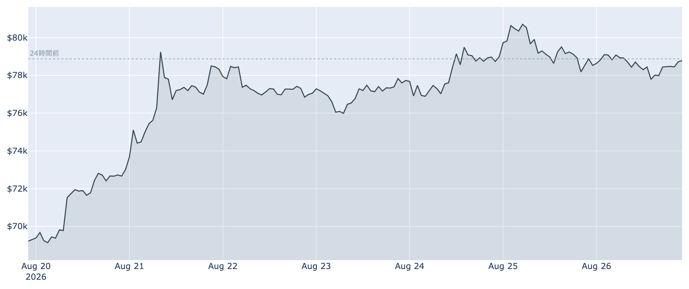
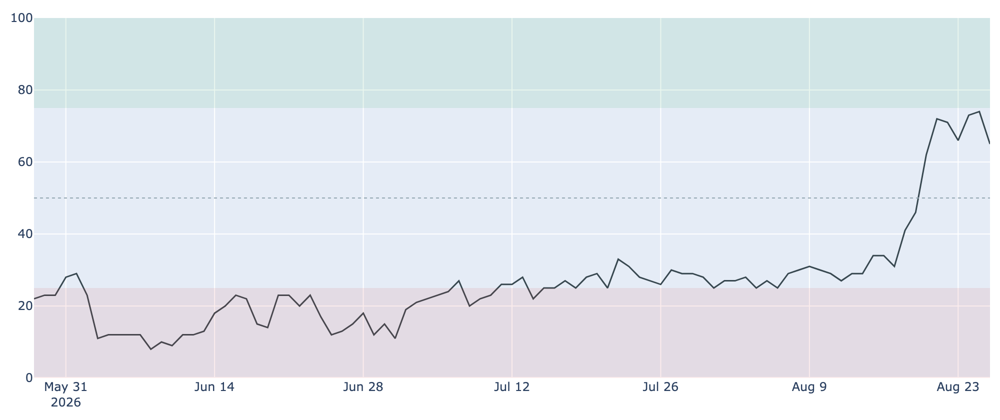
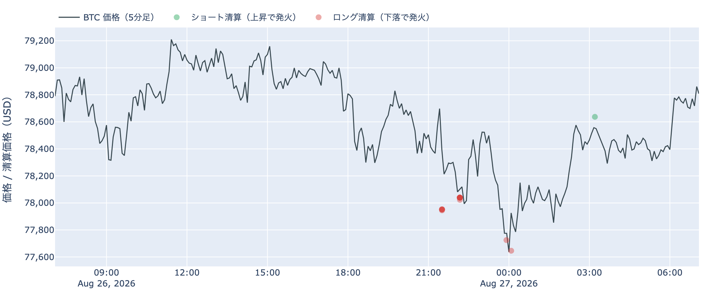
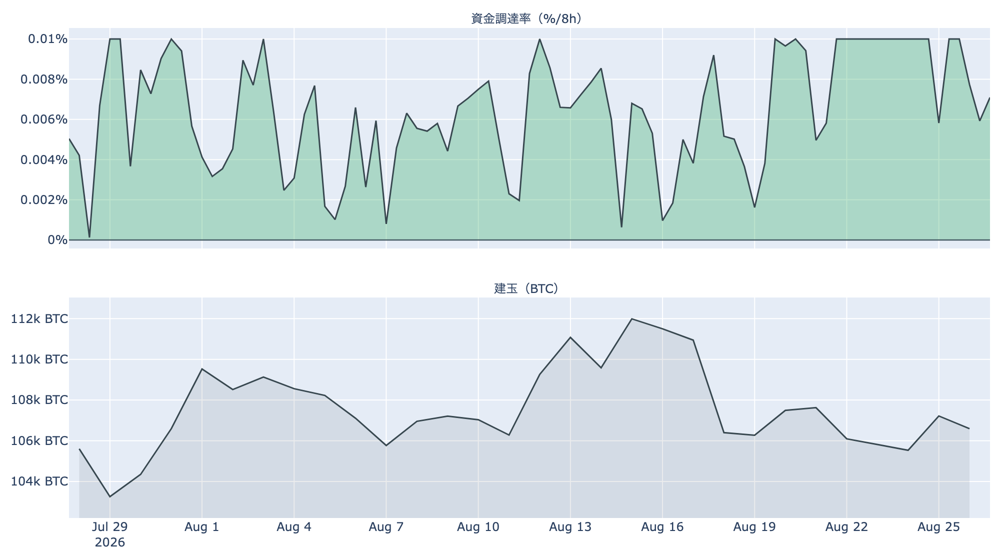
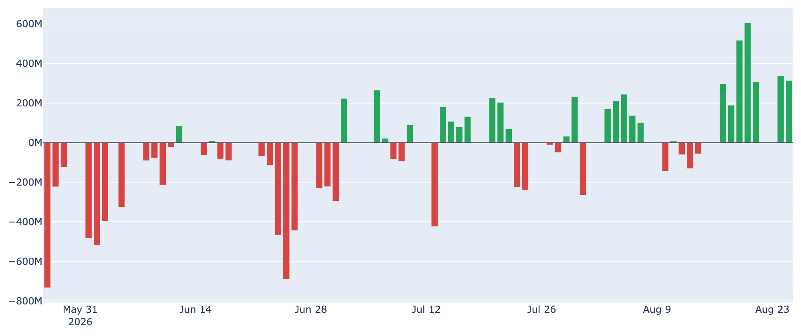
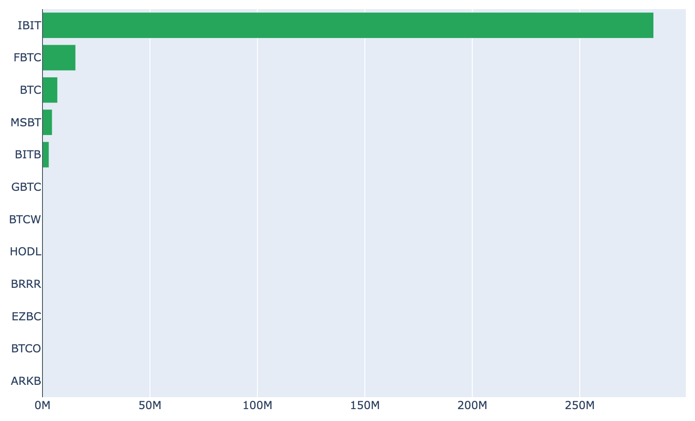
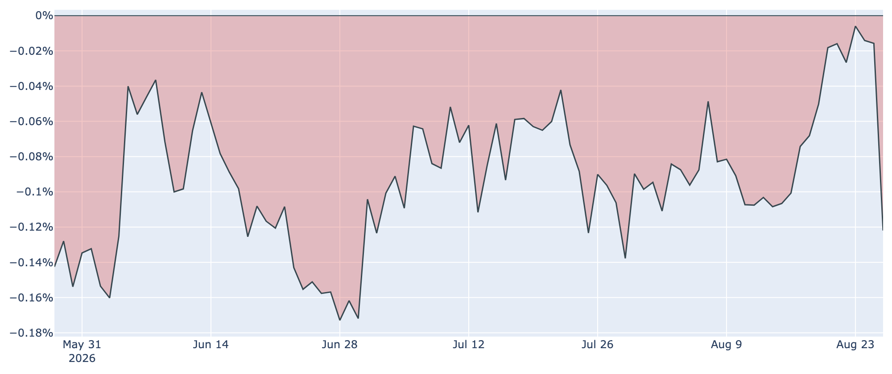
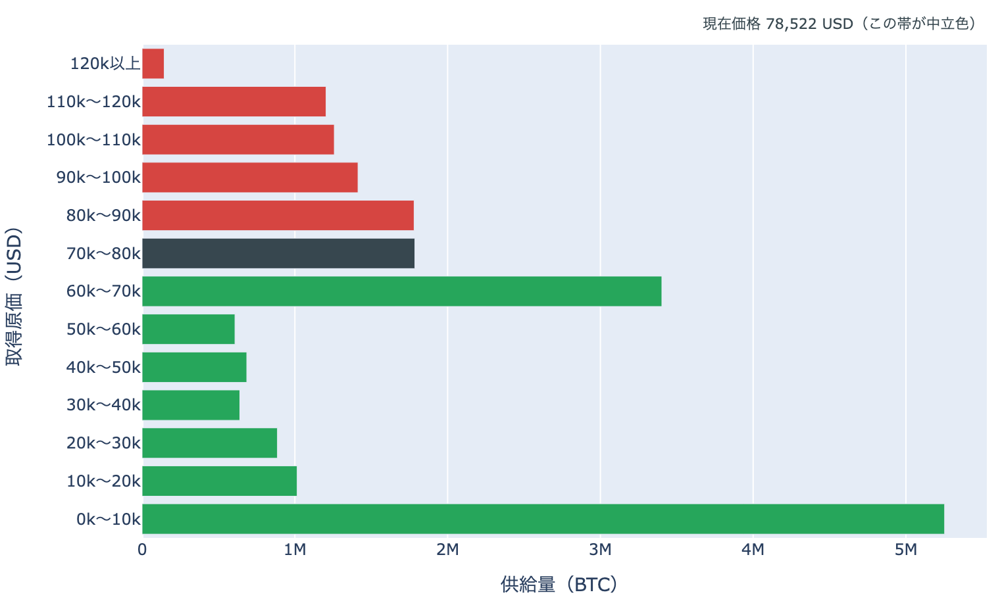

# 値幅は2%へ収縮 ― 焼けたのは今度はロング側、米国の現物需要は113日マイナス

**2026年8月27日**

$80,000の手前で5日目の足踏みです。8月27日7時5分時点の実勢価格は約$78,862で、24時間では-0.02%（レンジ$77,601〜$79,239）。値幅は2%あまりと、前日の4%強から半減しました。1週間では+13.8%、1か月では+23.8%。急騰の直後にありがちな乱高下が収まり、上でも下でも動かない時間帯に入っています。そのなかで、焼けたポジションの向きと米国勢の買い方だけが、はっきり反対を向きました。

（数値は8月27日7時5分（日本時間）時点までに取得した各種データに基づきます。価格と取引所プレミアムはその時点の実勢、市場心理は8月26日の確定値、オンチェーン指標は8月25日、ETF資金フローは8月25日、株・金などの終値は8月26日時点です。なお、オンチェーンの保有・年齢の指標には、ETF・取引所が預かっている分も含まれています。）

## 1. 全体像：外部環境はリスクオフ寄り、そのなかでBTCだけが動かない

* **水準**: 8月27日7時5分時点で約$78,862。直近の確定日足終値は8月25日（UTC）の約$78,527です。50日移動平均（約$66,100）も200日移動平均（約$69,200）も大きく上回る一方、50日線自体はまだ200日線の下にあり、移動平均の並び（デッドクロス圏）は好転していません。過去2年のレンジのなかでの位置は下から43%ほどで、水準そのものが高いわけではありません。
* **外部環境**（すべて8月26日の終値）: 金が4,647.80ドルで1日+0.2%・5営業日+3.5%、S&P500は7,675.70でほぼ横ばい、VIX（＝株式市場の恐怖指数）は15.21で-1.6%、ドル指数99.14は+0.2%、米10年債利回りは4.66%へ上昇しました。銘柄の並びとしては1営業日でも5営業日でも**リスクオフ寄り**です。そのなかでBTCは24時間ほぼ横ばいで、下にも付き合っていません。
* **エネルギー**: WTI原油は81.91ドルで1日-0.6%、5営業日では-4.6%と下げ基調です。イランとオマーンがホルムズ海峡に「暫定的な共同海上回廊」を設ける案を協議していると伝わり、供給懸念の上乗せが剥がれる方向で3日続落しました。技術的な協議は継続中で、方向が定まったわけではありません。
* **どこと一緒に動いているか**: BTCとの30日相関は株（S&P500）+0.10に対し金+0.55。株との連動はほぼ消えたままで、この夏のBTCは金と並んで動いています。ただしこれは値動きの並びであって、原因の説明ではありません。
* **制度**: 米SECが8月18日に公表した暗号資産の新しい登録免除の枠組み案は、意見の受付が8月31日で締め切られます。

## 2. データの解説：注目すべき5つのポイント

### ① 値幅が半分に縮み、心理は強欲圏から一段下がった

* **足踏みの5日目**: 日足終値は8月22日から$77,054→$77,729→$78,982→$78,527と、5日続けて$77,000〜$79,000のなかにあります。24時間の値幅は2.1%で、$81,265を付けた8月25日前後の4%超から半減しました。**上へも下へも決着がつかないまま、振れ幅だけが縮んでいます。**
* **1週間の位置**: 7日レンジは$68,853〜$81,265。1週間で18%の値幅を通ってきた相場が、その上端から3%ほど下で止まっている形です。
* **市場心理**: Fear & Greed（＝市場心理の指数）は8月26日に65と「強欲」圏ですが、前日の74から9ポイント下がりました。1週間前（8月19日）は46、30日前は30です。過去8年の分布では上から24%の位置で、**急騰時の熱がひとまず一段冷めた**ところです。

### ② 焼けた側がロングへ反転し、上乗せは縮んだ

* **向きの反転**: Hyperliquidの約定履歴から観測できた直近24時間の強制清算は、金額ベースで約86%が**ロング（買い建て）側**でした。前日は約89%がショート側だったので、**わずか1日で焼ける向きが入れ替わっています。**上で踏み上げられた側から、押し目で振り落とされた側へ、という並びです。
* **位置と時間**: 焼けた価格帯は77,000ドル台に83%、78,000ドル台に17%。8月26日21時台（日本時間）の1時間だけで全体の60%が集中しました。被清算アドレスは16件で、前日の233件から大きく減っています。**規模の話ではなく、焼ける場所が$80,000より上から$77,000台へ下りた**という位置の話です。なお清算と値動きは同時刻に起きるため、どちらが先かはこのデータでは決まりません。押し目は清算を伴った、というところまでです。

* **建玉は動かず**: 建玉（＝先物の未決済残高）は106,169 BTC（約84億ドル、8月26日UTC）で、7日間で+0.3%。増えても減ってもいません。値幅の収縮と同じで、**新しい資金も投げも入っていない**状態です。
* **買い持ちのコスト**: 資金調達率（＝先物の買い持ちが払う金利）は直近8時間で+0.0076%（年率換算 約+8.3%）。100回連続のプラス（約33日）ですが、この銘柄の上限（±0.3%／8時間）には遠く、過熱と呼べる水準ではありません。30日レンジ（0.0001〜0.0100%）のなかでは上寄りです。
* **上乗せは平年並みへ**: 直近の水準を年率に直した約+7.6%から、同じ期間で置ける短期金利（13週Tビル、3.69%）を引いた上乗せは**+3.9ポイント**。前日の+5.7ポイントから縮み、直近34日の平均+3.2ポイントに近い水準まで戻りました。現物を持って先物を売る側の取り分は、急騰局面の厚さを失っています。これは「確実に取れる利回り」ではなく、置いておくだけの金利に対する上乗せ、という意味の数字です。

### ③ 米国の需要は、ETFと現物で逆を向いている

* **流入は続く**: 米国スポットETFの純流入は8月25日に+約3.1億ドル。直近7営業日の合計は+約25.7億ドルで、8月17日以降の7営業日はすべて流入です。日次では過去の分布の上から2割の位置にあります。
* **担い手はほぼ1本**: 8月25日の内訳はIBITが+約2.8億ドルで**全体の9割**。FBTC +約0.2億ドル、以下は小口で、ゼロの銘柄も並びます。前日はIBITが6割強だったので、**流入の集中がさらに進みました。**規模は続いていても、参加している器はむしろ狭まっています。

* **現物では米国勢が引いている**: 取引所プレミアム（＝米国とそれ以外の価格差）は8月26日で**-0.122%**と、113日連続のマイナス。8月23日にいったん-0.006%まで縮んでいたものが、この3日で一気に広がり、**過去300日の分布では下から14%**という深さに沈みました。ETFの創出という経路では資金が入る一方、現物市場で米国勢が上乗せして買う姿は、この上昇のあいだ一度も戻っていません。
* **効き方の下地**: 1年以上動いていない供給は8月25日時点で62.4%、3か月前から+1.8ポイント戻しています。動かない供給が厚いほど、同じ規模の買い（あるいは売り）でも価格が動きやすくなる、という土俵の話です。

### ④ 長期側で動いたコインは1か月で25万BTC、損益は1割れのまま

* **量**: 長期保有層のネットポジション変化（＝長期側で数えられる供給の増減、過去30日）は8月25日時点で**約-25.0万BTC**。1週間前の約-18.1万BTCから減少幅がさらに広がり、30日前は+18.2万BTCとプラス圏でした。過去4年の分布では下から16%に入る大きさで、**預かり分の混入を差し引いても、この規模と方向は変わりません。**
* **中身**: 一方でLTH-SOPR（＝長期勢の損益）は0.989と1を割ったままです。1週間前の0.786からは大きく戻しましたが、**長期側で動いたコインは平均してわずかな損失を抱えた状態で動いています。**量が減り続けている点と、動いた分が利益になっていない点は、向きが揃っていません。この日の材料では、量の減少という事実までにとどめます。
* **短期側は利確が薄まった**: 短期勢SOPR（＝短期勢の損益）は1.008。前日の1.021から下がりましたが、過去4年では上から16%の位置です。短期保有者のRealized Price（＝平均取得原価）は約$69,200で、実勢価格はこれを14%上回っています。**含み益は厚いまま、実際に動かす量が減った**のが直近の変化です。
* **市場全体**: SOPR（＝動いたコインの損益）は1.007、MVRV Z-Score（＝市場全体の含み益）は0.86で、1週間前の0.41から倍以上に上がりました。それでも天井圏の目安（6〜7）には遠い位置です。

### ⑤ 帯の上端まで1.4%、下端までは11.2%という非対称

8月25日時点の取得原価の分布に、いまの価格を重ねます（分布は数日遅れ、価格は実勢です）。

* **いまの位置**: 価格は$70,000〜$80,000の帯（179万BTC・全供給の8.9%）の下端から89%の地点。上端の$80,000までは**+1.4%**、下端の$70,000までは**-11.2%**です。1日前と比べて帯またぎは起きておらず、上下配分も動いていません。上は目の前、下は遠いという非対称な位置に5日間とどまっています。
* **1週間で通過した量**: 1週間前の価格（約$69,300）は$60,000〜$70,000の帯にいました。そこから上へ1帯移動し、通過した帯を含めて**519万BTC・全供給の約26%の上へ抜けた**ことになります。価格より上に残る供給は37.8%から**28.9%**へ縮み、下の帯は62.2%です。
* **その先の分布の形**: $80,000〜$90,000に178万BTC（8.9%）、$90,000〜$100,000に141万BTC（7.0%）、$100,000〜$110,000に126万BTC（6.3%）、$110,000〜$120,000に120万BTC（6.0%）。**12万ドル手前まで、厚さの揃った層が4段続きます。**下側は、すぐ下の$60,000〜$70,000に340万BTC（16.9%）と厚く、そこを外すと$40,000〜$60,000は合計で全供給の6%台まで薄くなります。**ただしこれは分布の形であって、その量の売りが待っているという意味ではありません。**
* この分布は、それぞれのコインが**最後に動いたときの価格**で束ねたものです。誰が持っているかは分からず、自分のウォレット間の移動や取引所への入出金でも価格は付け替わるため、そのまま「その値段で買った人の量」とは読めません。

（補足：ハッシュレートは890.4 EH/sで30日間では-3.2%。次回の難易度調整は+0.1%とほぼ横ばいの見込みです。メンプールは約42ブロック分の滞留で、最速の推奨手数料は2 sat/vBと閑散なままです。）

## 3. 相場転換を見極めるための「3つの分岐点」

1. **$80,000を日足の終値で越えられるか**: 上端まで1.4%という距離に5日間張り付いています。取得原価の分布で見ると、$80,000より上には$80,000〜$90,000の178万BTCを筆頭に、12万ドル手前まで厚さの揃った層が4段続きます。一方で下端の$70,000までは-11.2%と距離があり、押しても当面の支えを試すまでには落差があります。**建玉が増えないまま上へ抜けるなら現物の買いが引き継いだ形**、建玉が急増しながら上げるなら再びレバレッジ主導、という読み分けは有効なままです。この2日は建玉も上乗せも動いておらず、どちらの答えも出ていません。
2. **ジャクソンホールでの金利観**: 8月27〜29日にジャクソンホール会議があり、**28日にウォーシュ議長が就任後初の基調講演**に立ちます。8月26日に公表された7月のPCE（個人消費支出物価指数）は前年比3.7%と予想を0.1ポイント上回り、コアは3.3%で予想どおりでした。9月16日のFOMCについて市場が織り込む利上げ確率はおよそ3分の1です。**今回の上げの起点が財務省の国債買い戻し拡大＝金利低下だったことを踏まえると、この講演で金利観が反対側へ振れれば、上げの前提が薄くなります。**米10年債利回りは8月26日に4.66%へ上昇しており、既に逆方向へ少し動いています。
3. **ホルムズ海峡の協議が続くか**: 原油はイランとオマーンの海上回廊をめぐる協議を材料に3日続落し、WTIは8月26日終値で81.91ドル、5営業日で-4.6%となりました。この方向が続けばエネルギー由来のインフレ懸念は後退し、上の2番目で見る金利観にも効いてきます。逆に協議が決裂したり緊張が再燃したりすれば、同じ経路が反対に働きます。**外部環境がリスクオフ寄りに傾くなかでBTCだけが動かずにいる**のが今の並びなので、この経路が振れたときにどちらへ付くかが試されます。

## 総括

急騰は止まり、値幅は2%まで縮みました。建玉も上乗せも動かず、先物側からは新しい燃料が入っていません。そのなかで向きだけが二つ入れ替わっています。ひとつは清算で、$80,000より上で焼けていた売り建てから、$77,000台で振り落とされる買い建てへ。もうひとつは米国勢の買い方で、ETFへの流入は7営業日続いている一方、その9割がIBIT1本に寄り、現物のプレミアムは113日連続のマイナスのまま3日で一段深く沈みました。オンチェーンでは長期側から動く量が1か月で25万BTCまで広がり、動いた分の損益は1を割ったままです。**上端まで1.4%・下端まで11.2%という非対称な位置で、次の材料を待っている段階**、というのが8月27日時点の姿です。

---

*本稿は情報提供を目的としたものであり、投資助言ではありません。将来の価格動向を保証・示唆するものではなく、投資判断は各自の責任において行ってください。*
